# WEB-BASED CAREER GUIDANCE AND SCHOLARSHIP INFORMATION PORTAL: A CASE OF KENYAN FORM FOUR LEAVERS


  
  


---
<!-- PAGE: Cover Page — no page number -->

# WEB-BASED CAREER GUIDANCE AND SCHOLARSHIP INFORMATION PORTAL: A CASE OF KENYAN FORM FOUR LEAVERS

**A Research Project Submitted in Partial Fulfilment of the Requirements for the Award of the Degree of Bachelor of Science in Information Technology**

**Faculty of Computing and Information Technology**

**Student:** IGNATIUS ETHENS
**Registration Number:** CIT-221-048/2022
**Supervisor:** DR. ISHMAEL NICK

**April 2026**

---
<!-- PAGE: Blank Page — no page number -->

&nbsp;

---
<!-- PAGE: Declaration & Approval — page i -->

## DECLARATION AND APPROVAL

<!-- page i -->

### Declaration by Student

I, **IGNATIUS ETHENS**, Registration Number **CIT-221-048/2022**, hereby declare that this research project is my original work and has not been presented for examination in any other university or institution of higher learning. All sources of information used in this project have been duly acknowledged through citations and references in accordance with the APA referencing style.

This research project has been submitted in partial fulfilment of the requirements for the award of the Degree of Bachelor of Science in Information Technology at the Faculty of Computing and Information Technology.

**Signature:** ___________________________

**Name:** IGNATIUS ETHENS

**Registration Number:** CIT-221-048/2022

**Date:** ___________________________

---

### Approval by University Supervisor

This research project has been submitted for examination with my approval as the University Supervisor.

**Signature:** ___________________________

**Name:** DR. ISHMAEL NICK

**Designation:** University Supervisor, Faculty of Computing and Information Technology

**Date:** ___________________________

---

### Approval by Head of Department

This research project has been submitted for examination with my approval as the Head of Department.

**Signature:** ___________________________

**Name:** ___________________________

**Designation:** Head of Department, Faculty of Computing and Information Technology

**Date:** ___________________________


---
<!-- PAGE: Dedication — page ii -->

## DEDICATION

<!-- page ii -->

This research project is dedicated, first and foremost, to the Almighty God, whose grace, wisdom, and sustaining strength have been the foundation upon which every line of this work was written. Without His providence, none of this would have been possible.

To my beloved family — my parents, whose sacrifices have been immeasurable and whose belief in the power of education has been the single greatest motivating force in my academic journey. You worked tirelessly so that I could sit in a classroom, and I carry that knowledge with me in every endeavour I undertake. This degree is as much yours as it is mine.

To my siblings and close friends, who offered encouragement during the long nights of research, coding, and writing — your patience, humour, and unwavering support kept me grounded when the weight of this project felt overwhelming.

To the thousands of Kenyan Form Four leavers who, year after year, complete their Kenya Certificate of Secondary Education examinations and find themselves standing at a crossroads — uncertain of their next step, overwhelmed by the complexity of university placement, TVET pathways, and scholarship applications, and underserved by the systems that should be guiding them. This portal was built for you. It is my sincere hope that this work, however modest, contributes in some small but meaningful way to bridging the information gap that has for too long disadvantaged young Kenyans at the most critical juncture of their educational lives.

To the communities of Nairobi and the peri-urban regions of Kenya, whose young people deserve access to the same quality of career guidance and scholarship information that their counterparts in well-resourced schools receive — may this work be a step toward that equity.

Finally, to every student who dares to use technology not merely as a tool for consumption, but as an instrument of social change — this is for you.


---
<!-- PAGE: Acknowledgements — page iii -->

## ACKNOWLEDGEMENTS

<!-- page iii -->

The completion of this research project would not have been possible without the guidance, support, and encouragement of numerous individuals and institutions, to whom I owe a profound debt of gratitude.

First and foremost, I wish to express my deepest and most sincere appreciation to my supervisor, **DR. ISHMAEL NICK**, of the Faculty of Computing and Information Technology. His intellectual rigour, constructive criticism, and patient mentorship throughout the research process were invaluable. Dr. Nick's insistence on technical accuracy, academic integrity, and methodological soundness shaped this project into what it is today. His door was always open, and his guidance always timely. I am truly grateful.

I extend my heartfelt thanks to the entire **Faculty of Computing and Information Technology** — the lecturers, administrative staff, and laboratory technicians — whose collective efforts create an environment in which students can thrive academically and professionally. The modules, workshops, and research talks provided through the faculty gave me the theoretical and practical foundation upon which this project was built.

To my fellow students in the Bachelor of Science in Information Technology programme, particularly those in the Class of 2022 cohort — thank you for the collaborative spirit, the shared frustrations, and the collective celebrations. The peer learning environment you fostered was as instructive as any formal lecture.

I am grateful to the career counselors, school administrators, and Form Four students who participated in the data collection phase of this research. Your candid responses, insights, and willingness to engage with the questionnaires and interviews provided the empirical grounding that gives this work its relevance and credibility.

To my family, whose financial and emotional support sustained me through four years of university education — no words are adequate. You believed in me before I believed in myself, and that faith made all the difference.

Finally, I acknowledge the open-source community whose tools, libraries, and documentation made the technical implementation of this portal possible. The spirit of freely shared knowledge that underpins open-source software is itself a form of the information equity this project seeks to advance.

To all of you — thank you.


---
<!-- PAGE: Abstract — page iv -->

## ABSTRACT

<!-- page iv -->

> *This research project presents the design, development, and evaluation of a Web-Based Career Guidance and Scholarship Information Portal targeting Kenyan Form Four leavers — students who have completed the Kenya Certificate of Secondary Education (KCSE) examination and face significant information asymmetry in navigating post-secondary educational pathways, career options, and scholarship opportunities. The central problem addressed is the absence of a freely accessible, contextually relevant, and digitally integrated platform that simultaneously serves as a diagnostic tool for career profiling and an enabler for scholarship discovery within the Kenyan educational landscape, particularly in the context of the ongoing transition to the Competency-Based Curriculum (CBC). The primary objective of this research was to design and implement a functional web-based portal that provides algorithmic career recommendations aligned with KCSE academic performance and personal aptitude, and that consolidates scholarship and bursary information in a searchable repository. The research adopted a mixed-methods design for requirement specification and data collection, combining stratified random sampling of Form Four students with purposive sampling of career counselors through Key Informant Interviews and structured digital questionnaires. System development followed the Agile Scrum Software Development Life Cycle, executed across iterative sprints. The technical implementation employs a Pure Python http.server backend, a Vanilla HTML5/CSS3/JavaScript frontend, SQLite for local development, and PostgreSQL via Neon for production, with deployment on the Vercel cloud platform. Key results include a fully functional portal featuring a four-step career profiling module driven by a weighted scoring algorithm (incorporating KCSE grades, skills ratings, and industry preferences), a scholarship repository with keyword search, an administrative dashboard for content management, and an email OTP verification system. The portal demonstrably addresses the identified information gap and provides a scalable, low-cost solution for improving career guidance access among Kenyan secondary school leavers.*


---
<!-- PAGE: Table of Contents — page v -->

## TABLE OF CONTENTS

<!-- page v -->

| Section | Title | Page |
|---|---|---|
| | Declaration and Approval | [p. i] |
| | Dedication | [p. ii] |
| | Acknowledgements | [p. iii] |
| | Abstract | [p. iv] |
| | Table of Contents | [p. v] |
| | List of Figures | [p. vii] |
| | List of Tables | [p. viii] |
| | Definition of Key Terms | [p. ix] |
| **CHAPTER ONE** | **INTRODUCTION** | |
| 1.1 | Chapter Introduction | [p. 1] |
| 1.2 | Motivation and Background | [p. 2] |
| 1.3 | Background of the Study | [p. 4] |
| 1.4 | Problem Statement | [p. 7] |
| 1.5 | Aim of the Research | [p. 8] |
| 1.6 | Objectives of the Research | [p. 9] |
| 1.7 | Justification of Research | [p. 10] |
| 1.8 | Scope of Research | [p. 12] |
| 1.9 | Research Organisation | [p. 13] |
| 1.10 | Chapter Summary | [p. 14] |
| **CHAPTER TWO** | **LITERATURE REVIEW** | |
| 2.1 | Chapter Introduction | [p. 15] |
| 2.2 | Theoretical Framework | [p. 16] |
| 2.3 | History of the Research Topic | [p. 19] |
| 2.4 | The Scholarship and Tertiary Financing Landscape | [p. 22] |
| 2.5 | Review of Related Prototypes and Systems | [p. 24] |
| 2.6 | Emerging Trends and Patterns | [p. 27] |
| 2.7 | Research Gap | [p. 29] |
| 2.8 | Chapter Summary | [p. 31] |
| **CHAPTER THREE** | **RESEARCH METHODOLOGY** | |
| 3.1 | Chapter Introduction | [p. 32] |
| 3.2 | Methodology for Literature Review | [p. 33] |
| 3.3 | Methodology for Requirement Specification, Data Collection and Analysis | [p. 35] |
| 3.4 | Methodology for System Analysis — Current System | [p. 38] |
| 3.5 | Methodology for System Design — Proposed System | [p. 40] |
| 3.6 | Methodology for System Implementation | [p. 44] |
| 3.7 | Methodology for System Testing | [p. 46] |
| 3.8 | Methodology for System Deployment | [p. 48] |
| 3.9 | Chapter Summary | [p. 49] |
| **CHAPTER FOUR** | **SYSTEM ANALYSIS — CURRENT SYSTEM** | |
| 4.1 | Chapter Introduction | [p. 50] |
| 4.2 | Description of the Current System | [p. 51] |
| 4.3 | Feasibility Study and Conclusion | [p. 53] |
| 4.4 | Data I/O Analysis | [p. 55] |
| 4.5 | Process Logic Design of the Current System | [p. 56] |
| 4.6 | Chapter Summary | [p. 59] |
| **CHAPTER FIVE** | **SYSTEM DESIGN — PROPOSED SYSTEM** | |
| 5.1 | Introduction | [p. 60] |
| 5.2 | Description of the Proposed System | [p. 61] |
| 5.3 | Requirement Analysis | [p. 63] |
| 5.4 | Conceptual Architecture | [p. 65] |
| 5.5 | Process Logic Design of the Proposed System | [p. 67] |
| 5.6 | Database Design | [p. 76] |
| 5.7 | I/O Design of the Proposed System | [p. 80] |
| 5.8 | Chapter Summary | [p. 83] |
| **CHAPTER SIX** | **SYSTEM IMPLEMENTATION AND TESTING** | |
| 6.1 | Chapter Introduction | [p. 84] |
| 6.2 | System Screenshots | [p. 85] |
| 6.3 | Testing Plan | [p. 88] |
| 6.4 | Evaluation Plan | [p. 92] |
| 6.5 | Chapter Summary | [p. 95] |
| **CHAPTER SEVEN** | **CONCLUSIONS, FINDINGS AND RECOMMENDATIONS** | |
| 7.1 | Introduction | [p. 96] |
| 7.2 | Conclusion | [p. 97] |
| 7.3 | Challenges Encountered | [p. 99] |
| 7.4 | Future Recommendations | [p. 100] |
| 7.5 | Chapter Conclusion | [p. 102] |
| | References | [p. 103] |
| | Appendix A: Student Questionnaire | [p. 108] |
| | Appendix B: Key Informant Interview Guide | [p. 111] |
| | Appendix C: Budget and Time Schedule | [p. 113] |


---
<!-- PAGE: List of Figures — page vii -->

## LIST OF FIGURES

<!-- page vii -->

| Figure | Caption | Page |
|---|---|---|
| Figure 4.1 | Context Diagram of the Current Manual Career Guidance System | [p. X] |
| Figure 4.2 | Level-0 Data Flow Diagram of the Current Manual Career Guidance System | [p. X] |
| Figure 4.3 | Flowchart of the Current Manual Career Guidance Process | [p. X] |
| Figure 5.1 | Three-Tier System Architecture Diagram of the Proposed Portal | [p. X] |
| Figure 5.2 | Use Case Diagram of the Proposed Career Guidance and Scholarship Portal | [p. X] |
| Figure 5.3 | Activity Diagram for the Multi-Step Career Profiling Workflow | [p. X] |
| Figure 5.4 | Sequence Diagram: User Registration with OTP Email Verification | [p. X] |
| Figure 5.5 | Sequence Diagram: Multi-Step Career Profiling and Algorithm Execution | [p. X] |
| Figure 5.6 | Sequence Diagram: Scholarship Search and Retrieval | [p. X] |
| Figure 5.7 | Sequence Diagram: Admin Scholarship Management | [p. X] |
| Figure 5.8 | Class Diagram of the Portal's Python Handler and Module-Level Functions | [p. X] |
| Figure 5.9 | Context Diagram of the Proposed Career Guidance and Scholarship Portal | [p. X] |
| Figure 5.10 | Level-0 Data Flow Diagram of the Proposed Portal | [p. X] |
| Figure 5.11 | Entity-Relationship Diagram of the Portal Database | [p. X] |
| Figure 6.1 | Screenshot: Home/Landing Page of the Career Guidance Portal | [p. X] |
| Figure 6.2 | Screenshot: Career Profiling Step 1 — Academic Grades Entry | [p. X] |
| Figure 6.3 | Screenshot: Career Recommendations Page | [p. X] |
| Figure 6.4 | Screenshot: Scholarship Repository and Search Page | [p. X] |

---
<!-- PAGE: List of Tables — page viii -->

## LIST OF TABLES

<!-- page viii -->

| Table | Caption | Page |
|---|---|---|
| Table 2.1 | Comparative Analysis of Related Career Guidance and Scholarship Systems | [p. X] |
| Table 5.1 | Data Dictionary: users Table | [p. X] |
| Table 5.2 | Data Dictionary: sessions Table | [p. X] |
| Table 5.3 | Data Dictionary: verification_tokens Table | [p. X] |
| Table 5.4 | Data Dictionary: scholarships Table | [p. X] |
| Table 6.1 | System Testing Plan — Test Cases and Results | [p. X] |


---
<!-- PAGE: Definition of Key Terms — page ix -->

## DEFINITION OF KEY TERMS

<!-- page ix -->

**CBC (Competency-Based Curriculum)**
The Competency-Based Curriculum is Kenya's current national educational framework, structured along a 2-6-3-3-3 progression — two years of pre-primary, six years of lower primary, three years of upper primary, three years of junior secondary, and three years of senior secondary education. Introduced progressively from 2017 onwards by the Kenya Institute of Curriculum Development (KICD) under the auspices of the Ministry of Education, the CBC replaces the former 8-4-4 system and emphasises the holistic development of learners through competencies, values, and practical skills rather than rote memorisation and terminal examinations. The CBC organises senior secondary education into pathways — Arts and Sports Science, Social Sciences, and Science, Technology, Engineering, and Mathematics (STEM) — which have direct implications for the career guidance and university placement processes that this portal seeks to support (Kenya Ministry of Education, 2019).

**KUCCPS (Kenya Universities and Colleges Central Placement Service)**
The Kenya Universities and Colleges Central Placement Service is the statutory body established under the Universities Act (Cap. 210B) of Kenya, mandated to coordinate the placement of students into public universities, national polytechnics, and technical and vocational education and training (TVET) institutions. KUCCPS operates an online placement portal through which Form Four leavers submit their programme preferences, and the service uses a cluster-based subject weighting system to match applicants to programmes based on their KCSE performance. The KUCCPS placement process is a critical gateway for post-secondary education in Kenya, and understanding its cluster requirements and cut-off points is a central feature of the career guidance portal developed in this research (KUCCPS, 2023).

**Form Four Leavers**
Form Four leavers are students who have completed the fourth and final year of secondary education in Kenya and have sat for the Kenya Certificate of Secondary Education (KCSE) examination, which is administered annually by the Kenya National Examinations Council (KNEC). Upon receiving their KCSE results, these students — typically aged between 17 and 21 years — must navigate a complex landscape of university placement, TVET enrolment, scholarship applications, and career decision-making, often with limited access to professional guidance. The term "Form Four leaver" is used throughout this research to denote this specific cohort, who constitute the primary target users of the proposed portal (KNEC, 2022).

**Career Guidance**
Career guidance refers to the range of services, activities, and interventions designed to assist individuals in making informed decisions about their educational and occupational pathways, taking into account their interests, aptitudes, academic performance, and the demands of the labour market. In the context of this research, career guidance encompasses both the diagnostic dimension — helping students understand their strengths and suitable career fields — and the informational dimension — providing accurate, up-to-date data on available programmes, institutions, and entry requirements. Effective career guidance is recognised by the International Labour Organization (ILO) and UNESCO as a critical component of human capital development and a tool for reducing youth unemployment (UNESCO, 2018).

**Scholarship Portal**
A scholarship portal, in the context of this research, refers to a digital platform that aggregates, organises, and presents information about scholarship, bursary, and financial aid opportunities available to students pursuing post-secondary education. The scholarship module of the proposed portal serves as a centralised repository where students can search for funding opportunities by keyword, view eligibility criteria, application deadlines, and external links, thereby reducing the information asymmetry that currently characterises the scholarship landscape in Kenya. The portal's scholarship repository is managed by administrators through a dedicated dashboard and is stored in a relational database table (`scholarships`) with fields for name, provider, description, eligibility criteria, deadline, and application link.

**NEET (Not in Education, Employment, or Training)**
NEET is an internationally recognised acronym used to describe young people who are not engaged in any form of education, employment, or vocational training. In the Kenyan context, a significant proportion of Form Four leavers risk falling into the NEET category due to a combination of factors including inadequate career guidance, financial barriers to tertiary education, and limited awareness of available TVET and scholarship opportunities. The Kenya National Bureau of Statistics (KNBS) has consistently reported elevated NEET rates among youth aged 15–24, underscoring the urgency of interventions such as the portal developed in this research (KNBS, 2021). Reducing NEET rates is a key policy objective under Kenya's Vision 2030 and the Big Four Agenda.

**TVET (Technical and Vocational Education and Training)**
Technical and Vocational Education and Training refers to the sector of post-secondary education that provides practical, skills-based training in technical, vocational, and artisanal fields, as distinct from the academic degree programmes offered by universities. In Kenya, TVET institutions include national polytechnics, technical training institutes (TTIs), vocational training centres (VTCs), and industry-specific training colleges, all of which fall under the regulatory oversight of the Technical and Vocational Education and Training Authority (TVETA). The TVET sector is a critical pathway for Form Four leavers who may not qualify for or choose not to pursue university education, and the proposed portal explicitly includes TVET pathways in its career recommendation algorithm, recognising that vocational training is a legitimate and valuable educational outcome (TVETA, 2022).

**HELB/HEFoND (Higher Education Loans Board / Higher Education Fund)**
The Higher Education Loans Board (HELB) was Kenya's primary state mechanism for providing loans, bursaries, and scholarships to students in public and private universities and TVET institutions. Following the enactment of the Higher Education (Amendment) Act of 2023, HELB was reconstituted into the Higher Education Fund (HEFoND), which operates on a needs-based funding model using the Means Testing Instrument (MTI) to categorise students into funding bands. HEFoND provides a combination of scholarships (non-repayable grants) and loans to eligible students, with the proportion of each determined by the student's socio-economic band as assessed by the MTI. Understanding the HEFoND application process and eligibility criteria is a key component of the scholarship information provided through the portal (HEFoND, 2023).

**Educational Pathways**
Educational pathways refer to the structured sequences of academic and vocational programmes through which a learner progresses from one level of education to the next, ultimately leading to a qualification, credential, or career outcome. In the Kenyan context, educational pathways for Form Four leavers include university degree programmes (accessed through KUCCPS), diploma and certificate programmes at national polytechnics and technical institutes, artisan and craft courses at vocational training centres, and professional certification programmes in fields such as accountancy, nursing, and information technology. The proposed portal maps KCSE academic performance and personal aptitude to appropriate educational pathways, providing students with a clear, data-driven picture of the options available to them based on their individual profiles (Kenya Ministry of Education, 2019).

**RIASEC**
RIASEC is an acronym for the six personality typologies — Realistic, Investigative, Artistic, Social, Enterprising, and Conventional — that form the basis of Holland's Theory of Vocational Personalities and Work Environments, first articulated by John L. Holland in 1959 and refined in subsequent publications (Holland, 1997). The RIASEC model posits that individuals can be characterised by one or more of these six types, and that career satisfaction and success are maximised when there is congruence between an individual's personality type and the demands of their work environment. In this research, the RIASEC framework informs the design of the career profiling algorithm, with the portal's skills and preferences questionnaire (Steps 2 and 3 of the profiling module) designed to elicit RIASEC-relevant traits that are then weighted against career profiles in the recommendation engine.

**TAM (Technology Acceptance Model)**
The Technology Acceptance Model is a theoretical framework in information systems research, originally proposed by Fred D. Davis in 1989, that explains and predicts user acceptance and adoption of new information technology systems. TAM posits that two primary constructs — Perceived Usefulness (PU), the degree to which a user believes a system will enhance their performance, and Perceived Ease of Use (PEOU), the degree to which a user believes the system will be free of effort — jointly determine a user's behavioural intention to use a technology and, ultimately, their actual system use (Davis, 1989). In this research, TAM provides the theoretical basis for the portal's usability evaluation strategy, with the System Usability Scale (SUS) instrument used in the evaluation plan operationalising the PEOU construct, and user satisfaction with career recommendations operationalising the PU construct.

**SCCT (Social Cognitive Career Theory)**
Social Cognitive Career Theory is a theoretical framework developed by Robert W. Lent, Steven D. Brown, and Gail Hackett (1994), grounded in Albert Bandura's broader Social Cognitive Theory, that explains how individuals develop career interests, make career choices, and achieve career-related performance outcomes. SCCT emphasises three core social cognitive variables — self-efficacy beliefs (a person's confidence in their ability to perform specific career-related tasks), outcome expectations (beliefs about the consequences of performing those tasks), and personal goals — as the primary drivers of career development. In the Kenyan context, SCCT is particularly relevant because socio-economic barriers, gender norms, and geographic inequalities significantly shape the self-efficacy and outcome expectations of Form Four leavers, making it essential that a career guidance portal not only provide information but also affirm the feasibility of diverse career pathways (Lent et al., 1994).

**MTI (Means Testing Instrument)**
The Means Testing Instrument is the socio-economic assessment tool used by HEFoND (formerly HELB) to determine the financial need of students applying for government scholarships and loans in Kenya. The MTI evaluates a range of household and individual indicators — including parental income, household size, land ownership, type of housing, and access to utilities — to assign each applicant to one of several funding bands, with Band 1 representing the most financially vulnerable students who qualify for the highest proportion of scholarship funding and the lowest proportion of repayable loans. The MTI is administered through an online self-declaration form, and its outputs directly determine the financial support package a student receives. The portal developed in this research provides guidance on the MTI application process as part of its scholarship information module, helping students understand how their socio-economic circumstances translate into funding eligibility (HEFoND, 2023).


---
<!-- CHAPTER ONE -->

## CHAPTER ONE: INTRODUCTION

---

### 1.1 Chapter Introduction

Chapter One of this research project serves as the intellectual and contextual foundation upon which the entire study rests. It is within this chapter that the reader is introduced to the central problem motivating the research, the academic and societal landscape from which that problem emerges, and the structured framework through which the researcher proposes to address it. The chapter moves deliberately from the broad to the specific — beginning with a personal and societal account of the motivation behind this work, progressing through a detailed background of the Kenyan educational system and its evolving policy landscape, and culminating in a precise articulation of the research aim, objectives, justification, and scope. Together, these sections establish not only what this research seeks to accomplish, but why it matters, for whom it matters, and how it is bounded.

The chapter is organised into ten sub-sections, each of which contributes a distinct layer of understanding to the overall research narrative. Section 1.1, the present section, provides this introductory orientation and maps the structure of the chapter for the reader. Section 1.2, Motivation and Background, offers a first-person account of the personal experiences and societal observations that gave rise to this research, grounding the academic inquiry in lived reality and establishing the researcher's positionality. Section 1.3, Background of the Study, situates the research within its broader global and national context, tracing the evolution of Kenya's educational system from the post-independence 7-4-2-3 structure through the 8-4-4 curriculum to the current Competency-Based Curriculum (CBC), and examining the scholarship and financing landscape that shapes post-secondary transitions. Section 1.4, Problem Statement, articulates the specific, bounded problem that this research addresses — the absence of an integrated, freely accessible, and contextually relevant digital platform for career guidance and scholarship information targeting Kenyan Form Four leavers — in continuous academic prose that addresses the five Ws of the problem. Section 1.5, Aim of the Research, distils the entire research endeavour into a single, broad action-verb statement that captures the overarching purpose of the work. Section 1.6, Objectives of the Research, translates that aim into one main objective and three to four specific, measurable, achievable, relevant, and time-bound (SMART) objectives written as functional system specifications. Section 1.7, Justification of Research, makes the case for why this research is necessary and valuable, drawing on published academic literature, policy documents, and empirical data to demonstrate the significance of the problem and the appropriateness of the proposed solution. Section 1.8, Scope of Research, defines the boundaries of the study — the target organisation, the features implemented by the proposed system, and the explicit limitations that circumscribe what the research does and does not claim to achieve. Section 1.9, Research Organisation, provides a chapter-by-chapter overview of the entire research project, giving the reader a roadmap of the seven chapters that constitute the full document. Finally, Section 1.10, Chapter Summary, synthesises the key points established throughout Chapter One and bridges the discussion to Chapter Two, the Literature Review.

Taken together, these ten sections constitute a comprehensive introduction that is both academically rigorous and practically grounded. The chapter does not merely describe the research; it argues for it — demonstrating that the problem is real, that the gap in existing solutions is genuine, and that the proposed portal represents a meaningful, technically feasible, and socially valuable contribution to the field of educational technology in Kenya. The reader who completes Chapter One will have a clear understanding of the research problem, the researcher's motivation, the educational and policy context, the specific objectives of the system to be built, and the structure of the document that follows. This foundation is essential for appreciating the depth of the literature review in Chapter Two, the methodological rigour of Chapter Three, and the technical precision of Chapters Four through Six.

---

### 1.2 Motivation and Background

The genesis of this research lies not in an abstract academic exercise, but in a pattern of human struggle that I witnessed repeatedly during my secondary school years and that has continued to define the experiences of thousands of young Kenyans in the years since. I grew up observing peers — intelligent, hardworking, and ambitious young people — who completed their Kenya Certificate of Secondary Education (KCSE) examinations and then found themselves paralysed at the threshold of their futures. They had studied diligently for four years, sat through the gruelling national examinations, and waited anxiously for their results. And yet, when those results arrived, many of them had no clear idea what to do next. They did not know which university programmes their grades qualified them for. They did not know how to navigate the Kenya Universities and Colleges Central Placement Service (KUCCPS) portal. They did not know which scholarships existed, which bursaries they might be eligible for, or how to apply for the Higher Education Loans Board (HELB) funding that could make the difference between attending university and staying home. The information existed, somewhere — in government websites, in school notice boards, in the offices of career counselors who were themselves overwhelmed by the sheer volume of students seeking guidance. But it was fragmented, inaccessible, and often arrived too late to be actionable.

I remember, with particular clarity, a classmate of mine — a student who had performed exceptionally well in the sciences and who harboured a genuine passion for engineering. When his KCSE results were released, he had no idea that his grades qualified him for a Bachelor of Science in Electrical and Electronics Engineering at one of Kenya's top public universities. His family, like many in our community, had no tradition of university education. His parents were small-scale traders who had never navigated the KUCCPS placement system. The school's career counselor, a dedicated teacher who wore many hats, was simultaneously managing the guidance needs of over four hundred Form Four leavers. My classmate, through no fault of his own, missed the KUCCPS application window. He spent the following year in uncertainty, eventually enrolling in a diploma programme that, while valuable, was not aligned with his academic potential or his career aspirations. His story is not exceptional. It is, in fact, representative of a systemic failure that affects hundreds of thousands of Kenyan students every year.

This personal observation is what first planted the seed of this research in my mind. As I progressed through my undergraduate studies in Information Technology, I became increasingly aware of the technical tools available to address exactly this kind of information asymmetry. I studied database design, web development, algorithmic thinking, and human-computer interaction. I learned about career guidance theories — Holland's RIASEC model, Social Cognitive Career Theory, the Technology Acceptance Model — and I began to see how these frameworks could be operationalised in a digital platform that would serve the very students I had grown up alongside (Holland, 1997; Lent et al., 1994; Davis, 1989). The convergence of my personal motivation and my technical education made this research project feel not merely academically appropriate, but personally necessary.

The societal dimension of this motivation is equally compelling. Kenya produces hundreds of thousands of Form Four leavers every year. According to the Kenya National Examinations Council (KNEC), over 900,000 candidates sat for the KCSE examination in 2022 alone (KNEC, 2022). Each of these students faces the same post-examination transition challenge: navigating a complex, multi-layered landscape of university placement, TVET enrolment, scholarship applications, and career decision-making, often with minimal professional support. The Kenya Institute of Curriculum Development (KICD) and the Ministry of Education have acknowledged that the counselor-to-student ratio in Kenyan secondary schools is critically low, with many schools having no dedicated career counselor at all, relying instead on subject teachers who have received minimal guidance training (Kenya Ministry of Education, 2019). In peri-urban and rural schools, this problem is compounded by geographic isolation, limited internet access, and the absence of the informal networks — alumni connections, professional contacts, family members with university experience — that students in well-resourced urban schools can draw upon.

The information asymmetry that results from this structural deficit is not a minor inconvenience. It is a driver of educational inequality. Students who lack access to timely, accurate career guidance are more likely to make suboptimal post-secondary choices, more likely to miss scholarship application deadlines, and more likely to fall into the NEET (Not in Education, Employment, or Training) category — a designation that carries long-term consequences for individual economic mobility and national human capital development (UNESCO, 2018). The Kenya National Bureau of Statistics (KNBS) has consistently reported elevated NEET rates among youth aged 15–24, underscoring the urgency of interventions that can bridge the information gap at the critical post-KCSE transition point (KNBS, 2021).

Technology, I believe, is the right solution to this problem — not because it can replace the human empathy and contextual wisdom of a skilled career counselor, but because it can democratise access to the information and diagnostic tools that currently exist only in fragmented, inaccessible forms. A well-designed web-based portal can aggregate scholarship information, map KCSE grades to career pathways, and provide personalised recommendations to any student with a smartphone and a data connection, regardless of whether their school has a dedicated counselor or whether their parents have university experience. It can be available at midnight when a student is anxiously reviewing their results, or on a Sunday when no school office is open. It can serve a student in Kibera with the same quality of information as a student in Westlands. This is the promise of educational technology, and it is the promise that this research seeks to deliver upon (Trucano, 2010).

My motivation, therefore, is both personal and structural. It is rooted in the specific faces of the students I grew up with and in the broader patterns of inequality that their experiences reflect. It is animated by a conviction that information technology, applied thoughtfully and grounded in the realities of the Kenyan educational context, can be a genuine instrument of social equity. And it is disciplined by the academic rigour of a research methodology that seeks not merely to build a system, but to understand the problem it addresses, to evaluate the solutions that already exist, and to contribute something new and meaningful to the field. This research is, in the most direct sense, the product of that convergence — of personal experience, academic training, and a commitment to using technology in the service of educational justice.


---

### 1.3 Background of the Study

#### 1.3.1 Global Context: Education-to-Employment Transitions and Youth Unemployment

The challenge of transitioning young people from secondary education into productive employment or further education is not unique to Kenya. It is a global phenomenon that has attracted sustained attention from international organisations, governments, and researchers across the world. The International Labour Organization (ILO) has documented that youth unemployment rates are consistently two to three times higher than adult unemployment rates in most regions of the world, with the global youth unemployment rate standing at approximately 15.6 percent in 2022 — representing some 73 million young people who are actively seeking work but unable to find it (ILO, 2022). Beyond those who are unemployed, a further 20.5 percent of young people globally are classified as NEET — not in education, employment, or training — a category that captures the full extent of youth disengagement from productive economic activity (ILO, 2022). These figures are not merely economic statistics; they represent a profound waste of human potential and a source of social instability that affects communities, families, and national economies alike.

UNESCO has identified inadequate career guidance as one of the structural factors that contributes to poor education-to-employment transitions, particularly in low- and middle-income countries where the formal career counseling infrastructure is underdeveloped (UNESCO, 2018). The organisation's 2018 report on career guidance and counseling in developing countries found that the majority of students in Sub-Saharan Africa complete secondary education without ever receiving a structured career guidance session, and that the information available to them about post-secondary pathways is typically fragmented, outdated, and inaccessible to those without strong social networks or financial resources (UNESCO, 2018). The World Bank has similarly highlighted the role of information asymmetry in perpetuating educational inequality, noting that students from lower socio-economic backgrounds are disproportionately disadvantaged by their lack of access to accurate information about university admission requirements, scholarship opportunities, and labour market demand (World Bank, 2020). These global findings provide the international context within which Kenya's specific challenges must be understood.

#### 1.3.2 Kenya's Educational System: From 7-4-2-3 to 8-4-4

Kenya's post-independence educational system has undergone several significant structural transformations, each reflecting the political, economic, and social priorities of its era. At independence in 1963, Kenya inherited a colonial educational structure that was designed primarily to produce a small cadre of administrative clerks and semi-skilled workers for the colonial economy, rather than to develop the full intellectual and vocational potential of the African population (Sifuna, 1990). The post-independence government, under President Jomo Kenyatta, moved quickly to Africanise and expand the educational system, adopting a 7-4-2-3 structure — seven years of primary education, four years of lower secondary, two years of upper secondary, and three years of university — that was broadly modelled on the British system and oriented toward academic achievement and professional certification (Sifuna, 1990). This system, while it expanded access to education significantly, retained many of the elitist and examination-centric characteristics of its colonial predecessor, with the Certificate of Primary Education (CPE) and the East African Certificate of Education (EACE) serving as high-stakes gatekeeping examinations that determined which students could progress to the next level.

The 7-4-2-3 system was replaced in 1985 by the 8-4-4 structure — eight years of primary education, four years of secondary education, and four years of university — under President Daniel arap Moi's government, as part of a broader effort to make education more practically oriented and to align it with the needs of Kenya's developing economy (Eshiwani, 1993). The 8-4-4 system introduced a broader range of subjects at the secondary level, including practical and technical subjects such as Home Science, Agriculture, and Business Studies, and it culminated in the Kenya Certificate of Secondary Education (KCSE) examination, which replaced the earlier Cambridge-based examinations and was administered by the newly established Kenya National Examinations Council (KNEC). The KCSE examination became the primary determinant of post-secondary educational pathways, with students' grades in specific subject clusters determining their eligibility for university programmes through the KUCCPS placement system (KUCCPS, 2023).

Despite its initial promise, the 8-4-4 system attracted sustained criticism over the four decades of its operation. Scholars and education policy analysts consistently identified several structural weaknesses: an overloaded curriculum that required students to study up to twelve subjects simultaneously, placing enormous cognitive and financial burdens on both students and families; an examination-centric assessment philosophy that rewarded rote memorisation over critical thinking, creativity, and practical problem-solving; a poor alignment between the subjects taught and the actual demands of the labour market, producing graduates who were academically credentialed but vocationally unprepared; and a persistent failure to provide adequate career guidance, leaving students to navigate the complex post-secondary landscape with minimal institutional support (Eshiwani, 1993; Sifuna, 1990). These criticisms were not merely academic; they were reflected in the persistently high youth unemployment rates and the growing mismatch between graduate skills and employer needs that characterised Kenya's labour market throughout the 8-4-4 era (KNBS, 2021).

#### 1.3.3 The CBC Paradigm Shift: Structure, Pathways, and Implications for Career Guidance

The most significant transformation of Kenya's educational system in recent decades is the ongoing transition to the Competency-Based Curriculum (CBC), which was introduced progressively from 2017 onwards under the auspices of the Kenya Institute of Curriculum Development (KICD) and the Ministry of Education (Kenya Ministry of Education, 2019). The CBC replaces the 8-4-4 structure with a 2-6-3-3-3 progression — two years of pre-primary education, six years of lower primary, three years of upper primary, three years of junior secondary, and three years of senior secondary education — and represents a fundamental philosophical shift in the approach to teaching, learning, and assessment. Rather than prioritising the accumulation of factual knowledge for examination purposes, the CBC emphasises the holistic development of learners through the cultivation of core competencies — communication, critical thinking, creativity, collaboration, citizenship, digital literacy, and learning to learn — alongside values and practical life skills (Kenya Ministry of Education, 2019).

Of particular relevance to this research is the structure of senior secondary education under the CBC, which organises the final three years of secondary schooling into three distinct pathways: the Science, Technology, Engineering, and Mathematics (STEM) pathway; the Social Sciences pathway; and the Arts and Sports Science pathway. This pathway structure represents a significant departure from the undifferentiated curriculum of the 8-4-4 system and has profound implications for career guidance. Under the CBC, students are expected to make meaningful pathway choices at the end of junior secondary school — choices that will shape their subject combinations, their university programme eligibility, and ultimately their career trajectories. Making these choices well requires access to accurate, contextually relevant information about the relationship between pathway selection, academic performance, and post-secondary opportunities — precisely the kind of information that the portal developed in this research is designed to provide (Kenya Ministry of Education, 2019). The CBC transition thus creates both a heightened need for career guidance and a new framework within which that guidance must be delivered.

#### 1.3.4 The Scholarship and Financing Landscape: HELB, HEFoND, MTI, NG-CDF, and Beyond

Access to post-secondary education in Kenya is not merely a matter of academic qualification; it is also a matter of financial capacity. The cost of university education — including tuition fees, accommodation, meals, and learning materials — places it beyond the reach of a significant proportion of Kenyan families, particularly those in the lower income quintiles. The Kenyan government has historically addressed this challenge through the Higher Education Loans Board (HELB), established under the Higher Education Loans Board Act of 1995, which provided loans, bursaries, and scholarships to students in public and private universities and TVET institutions (HELB, 2020). HELB's model, while valuable, was widely criticised for its inadequate funding levels, its slow disbursement processes, and its failure to reach the most financially vulnerable students, many of whom were deterred from applying by the complexity of the application process or by a lack of awareness of the scheme's existence (HELB, 2020).

Following the enactment of the Higher Education (Amendment) Act of 2023, HELB was reconstituted into the Higher Education Fund (HEFoND), which operates on a needs-based funding model using the Means Testing Instrument (MTI) to categorise students into funding bands (HEFoND, 2023). The MTI evaluates a range of household and individual socio-economic indicators — including parental income, household size, land ownership, type of housing, and access to utilities — to assign each applicant to one of several bands, with Band 1 representing the most financially vulnerable students who qualify for the highest proportion of non-repayable scholarship funding. This shift from a uniform loan model to a differentiated, needs-based scholarship and loan model represents a significant policy improvement, but it also introduces new complexity into the financial aid landscape that students must navigate (HEFoND, 2023).

Beyond HEFoND, the scholarship landscape in Kenya includes a range of other funding mechanisms. The National Government Constituency Development Fund (NG-CDF) provides bursaries to students from financially disadvantaged backgrounds through constituency-level offices, with each of Kenya's 290 constituencies allocating a portion of its annual NG-CDF budget to educational bursaries (NG-CDF Board, 2022). The Equity Wings to Fly programme, operated by Equity Bank in partnership with the Mastercard Foundation, provides comprehensive scholarships — covering tuition, accommodation, meals, and mentorship — to high-achieving students from disadvantaged backgrounds, with a particular focus on students from marginalised communities (Equity Group Foundation, 2021). The KCB Foundation similarly operates scholarship programmes targeting academically talented students from low-income families (KCB Foundation, 2022). These programmes, taken together, represent a substantial pool of financial support that is available to Kenyan students — but that pool is largely invisible to the students who need it most, because the information about these programmes is scattered across multiple websites, government offices, and institutional communications, and is rarely consolidated in a single, accessible platform.

#### 1.3.5 Information Asymmetry: The Gap Between Opportunity and Awareness

The concept of information asymmetry — the condition in which different parties to a decision have access to different quantities and qualities of relevant information — is central to understanding the problem that this research addresses. In the context of post-secondary educational transitions in Kenya, information asymmetry manifests in a stark and consequential form: the information needed to make optimal post-secondary choices exists, but it is not equally accessible to all students. Students in well-resourced urban schools, with dedicated career counselors, active alumni networks, and parents who have navigated the university system themselves, have access to a rich ecosystem of guidance and information. Students in peri-urban and rural schools, with overworked teachers doubling as counselors, limited internet connectivity, and no family tradition of university education, are navigating the same complex landscape with a fraction of the informational resources (World Bank, 2020).

This asymmetry is not merely an inconvenience; it is a mechanism of educational inequality. Research by the World Bank has demonstrated that information interventions — providing students with accurate, timely information about university admission requirements, scholarship opportunities, and labour market returns to education — can significantly improve post-secondary enrolment rates and programme choice quality, particularly among students from lower socio-economic backgrounds (World Bank, 2020). The implication is clear: the information gap is not inevitable, and addressing it through accessible digital platforms can have measurable positive effects on educational equity and economic mobility. It is within this context — of global youth unemployment challenges, Kenya's evolving educational system, a complex scholarship landscape, and a persistent information asymmetry that disadvantages the most vulnerable students — that the present research is situated and from which it derives its urgency and its purpose (UNESCO, 2018; ILO, 2022).


---

### 1.4 Problem Statement

The central problem addressed by this research is the absence of a freely accessible, contextually relevant, and digitally integrated platform that simultaneously provides career guidance and scholarship information to Kenyan Form Four leavers at the critical post-KCSE transition point. This problem is not abstract or hypothetical; it is a lived reality for hundreds of thousands of young Kenyans who complete their secondary education each year and find themselves navigating one of the most consequential decisions of their lives — what to do next — without adequate informational support.

The who of this problem is the cohort of Form Four leavers in Nairobi and its peri-urban environs — students who have completed the Kenya Certificate of Secondary Education (KCSE) examination and are in the process of determining their post-secondary pathways. This cohort is diverse in terms of academic performance, socio-economic background, and geographic location, but it is united by a common challenge: the need to make informed decisions about university programmes, TVET enrolment, and scholarship applications within a compressed timeframe and with limited access to professional guidance. The Kenya National Examinations Council (KNEC) reported that over 900,000 candidates sat for the KCSE examination in 2022, and the majority of these students — particularly those in peri-urban and rural schools — lack access to the career counseling resources that would enable them to make fully informed post-secondary choices (KNEC, 2022).

The what of this problem is the lack of an integrated, digital platform that combines two critical functions: a diagnostic career guidance tool that maps a student's academic performance, skills, and personal preferences to appropriate career pathways and educational programmes, and an enabler that consolidates scholarship and bursary information in a searchable, accessible repository. Existing solutions address one or the other of these functions in isolation — the KUCCPS portal provides placement information but no career profiling; scholarship information is scattered across multiple institutional websites with no aggregation or search functionality — but no freely accessible platform integrates both functions in a manner that is contextually relevant to the Kenyan educational system and the CBC framework (KUCCPS, 2023). This integration gap is the specific technical and informational deficit that this research seeks to address.

The where of this problem is the secondary school environment in Nairobi and its peri-urban surroundings — schools that are characterised by inadequate counseling resources, high student-to-counselor ratios, and limited access to the digital tools and professional networks that would otherwise compensate for the absence of dedicated career guidance staff. The Kenya Ministry of Education has acknowledged that the counselor-to-student ratio in Kenyan secondary schools falls far below the internationally recommended standard of one counselor per 250 students, with many schools relying on subject teachers who have received minimal guidance training to serve the career counseling needs of their entire student body (Kenya Ministry of Education, 2019). In this environment, a digital platform that can deliver personalised career guidance and scholarship information at scale represents not a luxury but a necessity.

The when of this problem is the post-KCSE transition period — the weeks and months immediately following the release of KCSE results, during which students must make time-sensitive decisions about KUCCPS programme applications, scholarship applications, and TVET enrolment. This period is characterised by high anxiety, information overload, and a compressed decision-making timeline that leaves little room for the kind of extended, iterative career exploration that effective guidance requires. The consequences of poor decisions made during this period — choosing a programme that does not align with one's aptitudes, missing a scholarship deadline, or failing to explore TVET pathways that might be more appropriate than a university degree — can have lasting effects on a student's educational and economic trajectory (UNESCO, 2018).

The why of this problem is, ultimately, a matter of equity. Information asymmetry in the post-secondary transition process does not affect all students equally; it disproportionately disadvantages students from lower socio-economic backgrounds, students in under-resourced schools, and students whose families have no prior experience with the university system. When these students make suboptimal post-secondary choices — or fail to make any choice at all, falling into the NEET category — the consequences extend beyond the individual to the community and the national economy. Research by the World Bank has demonstrated that information interventions targeting disadvantaged students can significantly improve post-secondary enrolment and programme choice quality, suggesting that the information gap is not merely a symptom of inequality but an active mechanism that perpetuates it (World Bank, 2020). Addressing this gap through a freely accessible, contextually grounded digital platform is therefore not only a technical challenge but a social imperative — one that this research takes up with both academic rigour and personal commitment.


---

### 1.5 Aim of the Research

The aim of this research is to design, develop, and evaluate a web-based career guidance and scholarship information portal that provides Kenyan Form Four leavers with algorithmically generated, KCSE-aligned career pathway recommendations and a consolidated, searchable repository of scholarship and bursary opportunities, thereby reducing the information asymmetry that currently disadvantages students — particularly those in Nairobi and peri-urban secondary schools — at the critical post-KCSE transition point, and contributing to the broader goal of educational equity and informed post-secondary decision-making in the context of Kenya's ongoing transition to the Competency-Based Curriculum.

---

### 1.6 Objectives of the Research

**Main Objective**

To design, develop, and evaluate a web-based career guidance and scholarship information portal for Kenyan Form Four leavers, as a case study of selected secondary schools in Nairobi and peri-urban environs.

**Specific Objectives**

1. To analyse the current manual career guidance and scholarship information dissemination processes in selected secondary schools in Nairobi and peri-urban environs, identifying the data inputs, process flows, and informational outputs of the existing system and documenting its structural weaknesses and limitations.

2. To design and implement a four-step career profiling module that collects a student's KCSE subject grades, self-rated skills and aptitudes, and personal preferences, and applies a weighted scoring algorithm — incorporating subject grade scores mapped via a standardised grade-to-numeric conversion table, trait scores, and industry interest scores — to generate a ranked list of career pathway recommendations with percentage match scores.

3. To design and implement a scholarship and bursary information repository with keyword search functionality, enabling students to discover and access information about available funding opportunities — including HEFoND, NG-CDF bursaries, Equity Wings to Fly, and KCB Foundation scholarships — through a centralised, administrator-managed database interface.

4. To evaluate the functional correctness and usability of the implemented portal through a structured testing plan covering user registration, email OTP verification, multi-step career profiling, algorithmic recommendation generation, scholarship search, and administrative content management, and to assess user acceptance using the System Usability Scale (SUS) instrument with a pilot group of Form Four students and career counselors.


---

### 1.7 Justification of Research

The justification for this research rests on four interconnected pillars: policy alignment with Kenya's current educational reform agenda, the imperative of educational equity, the economic case for reducing NEET rates and improving human capital allocation, and the demonstrated potential of educational technology in Sub-Saharan Africa. Each of these pillars is grounded in published academic literature and policy documentation, rather than in assumption or conjecture, and together they make a compelling case for the necessity and timeliness of the proposed portal.

**Policy Alignment with the Competency-Based Curriculum**

Kenya's transition to the Competency-Based Curriculum represents the most significant educational reform in the country's post-independence history, and it creates a specific, urgent need for the kind of career guidance infrastructure that this research proposes to build. The CBC's senior secondary pathway structure — STEM, Social Sciences, and Arts and Sports Science — requires students to make meaningful pathway choices at the end of junior secondary school, choices that have direct implications for their university programme eligibility and career trajectories (Kenya Ministry of Education, 2019). The Ministry of Education's CBC policy documents explicitly acknowledge the need for enhanced career guidance services to support students in making these pathway choices, noting that the success of the CBC reform depends in part on students having access to accurate, contextually relevant information about the relationship between pathway selection and post-secondary opportunities (Kenya Ministry of Education, 2019). The portal developed in this research directly addresses this policy need by providing a digital platform that maps CBC pathway choices and KCSE academic performance to career recommendations, thereby operationalising the Ministry's guidance objectives in a scalable, accessible format.

**Educational Equity and the Right to Information**

UNESCO's 2018 report on career guidance in developing countries identifies information asymmetry as one of the primary mechanisms through which educational inequality is perpetuated, arguing that students from disadvantaged backgrounds are systematically denied the informational resources that would enable them to make optimal post-secondary choices (UNESCO, 2018). The report calls for the development of accessible, low-cost career guidance tools that can reach students in under-resourced schools and communities, and it identifies digital platforms as a particularly promising vehicle for delivering such tools at scale. The World Bank's research on information interventions in education similarly demonstrates that providing students with accurate, timely information about post-secondary opportunities can significantly improve enrolment rates and programme choice quality, with the largest effects observed among students from lower socio-economic backgrounds — precisely the students who are most disadvantaged by the current information asymmetry in Kenya's post-secondary transition landscape (World Bank, 2020). The portal developed in this research is designed to be freely accessible, mobile-first, and functional on low-bandwidth connections, ensuring that it can reach the students who need it most, regardless of their geographic location or socio-economic status.

**Economic Optimisation: Reducing NEET Rates and Improving Human Capital Allocation**

The economic case for improved career guidance is well-established in the academic literature. The ILO has documented the substantial economic costs of youth unemployment and NEET status, including lost productivity, reduced lifetime earnings, increased social welfare expenditure, and the long-term erosion of human capital that results from extended periods of disengagement from education and employment (ILO, 2022). In Kenya, the KNBS has reported that approximately 35 percent of youth aged 15–24 are classified as NEET, a figure that represents not only a significant human cost but also a substantial drag on the country's economic development and its progress toward the Vision 2030 goals (KNBS, 2021). Research by the World Bank has shown that career guidance interventions — particularly those that provide students with accurate information about labour market demand and the returns to different educational pathways — can reduce NEET rates by improving the quality of post-secondary choices and increasing the likelihood that students will pursue pathways that lead to productive employment (World Bank, 2020). By providing Form Four leavers with data-driven career recommendations that are aligned with their academic performance and personal aptitudes, the portal developed in this research contributes directly to the goal of reducing NEET rates and improving the efficiency of human capital allocation in Kenya's economy.

**Technological Advancement: EdTech in Sub-Saharan Africa**

The rapid growth of educational technology (EdTech) in Sub-Saharan Africa over the past decade provides both the technical infrastructure and the empirical evidence base for the approach taken in this research. Mobile internet penetration in Kenya has grown dramatically, with the Communications Authority of Kenya reporting a mobile internet penetration rate of over 50 percent in 2022, and smartphone ownership continuing to increase across all income quintiles (Communications Authority of Kenya, 2022). This expanding digital infrastructure creates the conditions for web-based educational interventions to reach a genuinely broad audience, including students in peri-urban and rural areas who were previously excluded from digital services by the cost and unavailability of internet connectivity. Research on EdTech adoption in Sub-Saharan Africa has consistently found that mobile-first, low-bandwidth web applications are the most effective vehicle for delivering educational services to students in low-resource environments, and that the Technology Acceptance Model (TAM) — which predicts adoption based on perceived usefulness and perceived ease of use — provides a reliable framework for designing systems that students will actually use (Davis, 1989; Trucano, 2010). The portal developed in this research is built on exactly these principles: it is a mobile-first, lightweight web application that prioritises functional utility over visual complexity, and it is designed to be accessible on the 3G connections that are the reality for many Kenyan students outside of major urban centres.

Taken together, these four pillars — policy alignment, educational equity, economic optimisation, and technological advancement — constitute a robust, evidence-based justification for this research. The problem is real, the need is urgent, the technical approach is sound, and the potential impact is significant. This research does not merely add to the academic literature; it produces a functional artefact — a working portal — that can be deployed, evaluated, and scaled to serve the students who need it most.

---

### 1.8 Scope of Research

This research is bounded by a set of clearly defined parameters that specify the target organisation, the features implemented by the proposed system, and the explicit limitations that circumscribe what the research does and does not claim to achieve.

**Target Organisation**

The target organisation for this research comprises selected secondary schools in Nairobi and its peri-urban environs, with a focus on schools that serve students from a range of socio-economic backgrounds and that are representative of the diversity of the Kenyan secondary school landscape. The research does not claim to be nationally representative, but it is designed to be generalisable to the broader population of Kenyan secondary schools, particularly those in urban and peri-urban settings where internet connectivity is sufficient to support web-based interventions.

**Features Implemented**

The proposed portal implements the following features: a four-step career profiling module that collects KCSE subject grades (Step 1), self-rated skills and aptitudes (Step 2), personal preferences and industry interests (Step 3), and a final review and submission interface (Step 4); a weighted scoring recommendation engine that generates a ranked list of career pathway recommendations with percentage match scores; a scholarship and bursary information repository with keyword search functionality; an administrative dashboard for content management, including the ability to add, edit, and delete scholarship entries; a user registration and authentication system with email OTP verification via Gmail SMTP; and a session management system that maintains user state across the multi-step profiling workflow.

**Explicit Limitations**

This research operates within the following explicit limitations. First, the portal does not integrate with the live KUCCPS API; career and programme recommendations are based on the researcher's curated career database and the KCSE grade-to-cluster mapping documented in publicly available KUCCPS materials, rather than on real-time placement data. Second, the portal's career profiling module is not a clinical psychometric instrument and does not claim to replace the professional judgment of a qualified career counselor; it is a decision-support tool that provides data-driven recommendations as a starting point for further exploration and professional consultation. Third, the portal is dependent on internet connectivity and is not designed to function offline; students without access to a reliable internet connection will not be able to use the portal. Fourth, the recommendation algorithm is calibrated to the KCSE-based grading system and the 8-4-4 curriculum structure; as the CBC transition progresses and the KCSE is eventually replaced by new assessment frameworks, the algorithm will require recalibration to remain accurate and relevant.

---

### 1.9 Research Organisation

This research project is organised into seven chapters, each of which addresses a distinct phase of the research process and contributes a specific layer of understanding to the overall study.

Chapter One, the present chapter, provides the introduction to the research, establishing the personal and societal motivation for the study, situating it within the global and Kenyan educational context, articulating the problem statement, aim, and objectives, justifying the research on the basis of published evidence, defining its scope and limitations, and providing a roadmap of the chapters that follow.

Chapter Two presents the Literature Review, which surveys the existing academic and policy literature relevant to the research topic. The chapter examines the theoretical frameworks that underpin the portal's design — Holland's RIASEC model, Social Cognitive Career Theory, and the Technology Acceptance Model — traces the historical evolution of career guidance in Kenya from the post-independence era to the CBC transition, reviews the scholarship and tertiary financing landscape, critically evaluates related career guidance and scholarship systems (Naviance, the KUCCPS portal, and Craydel), identifies emerging trends in educational technology, and articulates the specific research gaps that this study addresses.

Chapter Three documents the Research Methodology, providing a comprehensive account of every methodological decision made in the course of the research. The chapter covers the methodology for the literature review, the mixed-methods approach to requirement specification and data collection (including stratified random sampling of students and purposive sampling of career counselors), the methodology for system analysis of the current system, the methodology for system design of the proposed system, the Agile Scrum implementation methodology, the testing methodology, and the deployment methodology.

Chapter Four presents the System Analysis of the Current System, providing a detailed diagnostic of the manual, fragmented career guidance processes that the proposed portal is designed to replace. The chapter describes the current system's processes, strengths, and weaknesses; conducts a feasibility study; analyses the data inputs and outputs of the current system; and presents process logic diagrams — including a Context Diagram, a Level-0 Data Flow Diagram, and a Flowchart — that document the current system's structure and operation.

Chapter Five presents the System Design of the Proposed System, providing the full technical specification of the portal. The chapter covers the system's conceptual architecture, requirement analysis, process logic design (including Use Case, Activity, Sequence, and Class diagrams), database design (including the Entity-Relationship Diagram, normalisation discussion, and data dictionary), and input/output design for the key screens of the portal.

Chapter Six documents the System Implementation and Testing, presenting the actual implemented system through screenshots, a structured testing plan, and an evaluation plan based on the System Usability Scale. The chapter demonstrates that the portal has been built, tested, and evaluated against the objectives established in Chapter One.

Chapter Seven presents the Conclusions, Findings, and Recommendations of the research, synthesising the key findings of the study, evaluating the extent to which the research aim and objectives were achieved, documenting the challenges encountered during the research and development process, and proposing specific directions for future research and development that could extend and improve upon the work presented in this project.

---

### 1.10 Chapter Summary

Chapter One has established the foundational context for this research by tracing the problem of inadequate career guidance and scholarship information access for Kenyan Form Four leavers from its personal and societal roots through to its academic and policy dimensions. The chapter has demonstrated that the problem is real, urgent, and consequential — affecting hundreds of thousands of students annually, perpetuating educational inequality, and contributing to elevated NEET rates that carry significant economic and social costs. It has articulated a clear aim and a set of SMART objectives that define the scope and ambition of the proposed portal, and it has justified the research on the basis of published evidence from UNESCO, the ILO, the World Bank, and the Kenya Ministry of Education. The scope of the research has been carefully defined to ensure that the claims made are achievable and that the limitations of the system are transparent. With this foundation in place, Chapter Two will proceed to survey the existing academic and policy literature in depth, examining the theoretical frameworks, historical context, related systems, and research gaps that together define the intellectual landscape within which this research makes its contribution.


---
<!-- CHAPTER TWO -->

## CHAPTER TWO: LITERATURE REVIEW

---

### 2.1 Chapter Introduction

Chapter Two of this research project constitutes the Literature Review — the systematic, critical, and synthesising survey of the existing academic, policy, and practitioner literature that is relevant to the central problem and objectives of this study. Where Chapter One established the problem, articulated the aim and objectives, and justified the research on the basis of its significance, Chapter Two situates the research within the broader intellectual landscape of career guidance theory, educational technology, Kenyan educational history, and scholarship financing. It is through this engagement with existing knowledge that the research establishes its theoretical grounding, demonstrates awareness of what has already been done, and identifies the specific gaps that this study is positioned to address.

The chapter is organised into eight sub-sections, each of which contributes a distinct dimension to the overall literature review. Section 2.1, the present section, provides this introductory orientation and maps the structure of the chapter for the reader. Section 2.2, Theoretical Framework, examines the three theoretical models that collectively underpin the design and evaluation of the proposed portal: Holland's RIASEC Model of Vocational Personalities and Work Environments (Holland, 1997), which provides the conceptual basis for the career profiling algorithm; Social Cognitive Career Theory (Lent, Brown & Hackett, 1994), which explains how self-efficacy, outcome expectations, and personal goals shape career development and informs the portal's approach to addressing socio-economic barriers; and the Technology Acceptance Model (Davis, 1989), which predicts user adoption of information technology systems and informs the portal's user interface design and usability evaluation strategy. Section 2.3, History of the Research Topic, traces the chronological evolution of career guidance practice and educational policy in Kenya from the post-independence 7-4-2-3 system through the 8-4-4 curriculum to the current Competency-Based Curriculum transition, situating the present research within a long arc of educational reform and the persistent challenge of post-secondary transition support. Section 2.4, The Scholarship and Tertiary Financing Landscape, surveys the current landscape of scholarship, bursary, and financial aid opportunities available to Kenyan Form Four leavers, covering the Higher Education Fund (HEFoND), the Means Testing Instrument (MTI), the National Government Constituency Development Fund (NG-CDF), Equity Wings to Fly, and the KCB Foundation, among others. Section 2.5, Review of Related Prototypes and Systems, critically evaluates three existing career guidance and scholarship systems — Naviance (a global commercial platform), the KUCCPS Portal (a local government system), and Craydel (a local commercial platform) — identifying their core features, strengths, and limitations in relation to the needs of Kenyan Form Four leavers. Section 2.6, Emerging Trends and Patterns, surveys the current frontiers of educational technology research and practice, including the application of artificial intelligence and machine learning in EdTech, the trend toward integrated one-stop-shop platforms, the growth of progressive web applications and mobile-first design in Sub-Saharan Africa, and the emerging discourse on data privacy and algorithmic accountability in educational systems. Section 2.7, Research Gap, synthesises the findings of the preceding sections to articulate the specific, bounded gaps in the existing literature and practice that this research is positioned to address — the Contextual Gap, the Integration Gap, and the Accessibility Gap. Finally, Section 2.8, Chapter Summary, synthesises the key insights of the chapter and bridges the discussion to Chapter Three, the Research Methodology.

Taken together, these eight sections constitute a comprehensive and critically engaged literature review that demonstrates the researcher's command of the relevant intellectual terrain and establishes the theoretical and empirical foundations upon which the proposed portal is built.

---

### 2.2 Theoretical Framework

The design, implementation, and evaluation of the Web-Based Career Guidance and Scholarship Information Portal is grounded in three complementary theoretical frameworks, each of which addresses a distinct dimension of the research problem. Holland's RIASEC Model of Vocational Personalities and Work Environments (Holland, 1997) provides the conceptual architecture for the career profiling algorithm, offering a validated typological system for mapping individual characteristics to career pathways. Social Cognitive Career Theory (Lent, Brown & Hackett, 1994) explains the psychological and socio-environmental mechanisms through which individuals develop career interests and make career choices, and it informs the portal's approach to addressing the structural barriers that constrain the career aspirations of Kenyan Form Four leavers. The Technology Acceptance Model (Davis, 1989) provides the theoretical basis for predicting and evaluating user adoption of the portal, and it informs the design of the user interface and the selection of the System Usability Scale as the primary evaluation instrument. Together, these three frameworks form an integrated theoretical foundation that spans the individual, social, and technological dimensions of the research problem.

#### 2.2.1 Holland's RIASEC Model (Holland, 1997)

Holland's Theory of Vocational Personalities and Work Environments, first articulated by John L. Holland in 1959 and comprehensively refined in his seminal 1997 monograph, represents one of the most empirically validated and widely applied frameworks in the history of career guidance research (Holland, 1997). The theory rests on two foundational propositions: first, that individuals can be characterised by their resemblance to one or more of six personality typologies — Realistic, Investigative, Artistic, Social, Enterprising, and Conventional, collectively known by the acronym RIASEC; and second, that work environments can similarly be characterised by the same six typologies, based on the dominant personality types of the people who inhabit them. Career satisfaction, stability, and achievement are maximised, Holland argues, when there is congruence between an individual's personality type and the demands and culture of their work environment — a principle that has been empirically supported across diverse cultural and occupational contexts (Holland, 1997; Spokane, Meir & Catalano, 2000).

The six RIASEC typologies each represent a distinct constellation of interests, abilities, values, and preferred activities. The Realistic type is characterised by a preference for concrete, hands-on tasks involving tools, machines, and physical objects; individuals of this type tend to be practical, mechanically inclined, and oriented toward tangible outcomes (Holland, 1997). The Investigative type is characterised by a preference for analytical, intellectual, and scientific activities; individuals of this type are typically curious, methodical, and motivated by the desire to understand and solve complex problems through observation and reasoning (Holland, 1997). The Artistic type is characterised by a preference for creative, expressive, and aesthetic activities; individuals of this type tend to be imaginative, independent, and drawn to self-expression through art, music, writing, or performance (Holland, 1997). The Social type is characterised by a preference for interpersonal activities involving helping, teaching, counseling, or serving others; individuals of this type are typically empathetic, cooperative, and motivated by the desire to contribute to the well-being of others (Holland, 1997). The Enterprising type is characterised by a preference for leadership, persuasion, and goal-directed activities involving the management of people and resources; individuals of this type tend to be assertive, ambitious, and motivated by influence and achievement (Holland, 1997). The Conventional type is characterised by a preference for structured, orderly, and detail-oriented activities involving data, records, and established procedures; individuals of this type tend to be organised, precise, and comfortable with clearly defined rules and expectations (Holland, 1997).

The congruence principle — the central predictive claim of Holland's theory — holds that the degree of fit between an individual's RIASEC profile and the RIASEC profile of their work environment is a reliable predictor of job satisfaction, occupational stability, and career achievement (Holland, 1997). Empirical research has consistently supported this claim across a wide range of occupational and cultural contexts, with meta-analyses by Spokane et al. (2000) and Assouline and Meir (1987) confirming that congruence is positively associated with job satisfaction and negatively associated with turnover intention. The practical implication of the congruence principle for career guidance is straightforward: by identifying a student's dominant RIASEC type or types, a career guidance system can generate recommendations for work environments and career pathways that are likely to be congruent with the student's personality, thereby increasing the probability of long-term career satisfaction and success.

In the context of Kenya's Competency-Based Curriculum, the RIASEC framework maps naturally onto the three senior secondary pathways that students are required to choose between at the end of junior secondary school (Kenya Ministry of Education, 2019). The STEM pathway — encompassing subjects such as Mathematics, Physics, Chemistry, Biology, Computer Science, and Agriculture — is most closely aligned with the Realistic and Investigative typologies, as it demands analytical reasoning, problem-solving, and engagement with technical and scientific content. Careers within the STEM pathway include engineering (civil, mechanical, electrical, software), medicine and health sciences, computer science and information technology, environmental science, and agricultural science — all of which are characterised by high Realistic and Investigative demands (Holland, 1997; Kenya Ministry of Education, 2019). The Social Sciences pathway — encompassing subjects such as History, Geography, Business Studies, Economics, and Social Studies — is most closely aligned with the Social, Enterprising, and Conventional typologies, as it demands interpersonal engagement, analytical thinking about human systems, and the management of information and resources. Careers within the Social Sciences pathway include law, education, social work, public administration, economics, journalism, and business management — fields that reward Social and Enterprising orientations (Holland, 1997). The Arts and Sports Science pathway — encompassing subjects such as Fine Art, Music, Drama, Physical Education, and Languages — is most closely aligned with the Artistic and Social typologies, as it demands creative expression, aesthetic sensibility, and interpersonal communication. Careers within this pathway include the performing arts, visual arts, sports science, physical therapy, media and communications, and language teaching — fields that are characterised by high Artistic demands (Holland, 1997; Kenya Ministry of Education, 2019).

In the Kenyan labour market context, specific career examples further illustrate the RIASEC-pathway mapping. A student with a dominant Realistic-Investigative profile pursuing the STEM pathway might be well-suited to careers such as civil engineering, clinical medicine, or software development — fields that are in high demand in Kenya's growing construction, healthcare, and technology sectors (Kenya National Bureau of Statistics, 2021). A student with a dominant Social-Enterprising profile pursuing the Social Sciences pathway might be well-suited to careers such as secondary school teaching, community development work, or business administration — fields that are central to Kenya's public sector and growing private sector (Kenya Ministry of Education, 2019). A student with a dominant Artistic-Social profile pursuing the Arts and Sports Science pathway might be well-suited to careers such as graphic design, sports coaching, or media production — fields that are expanding in Kenya's creative economy and digital media landscape (Communications Authority of Kenya, 2022). The portal's career profiling algorithm operationalises this RIASEC-pathway mapping by collecting students' self-rated skills and aptitudes in Step 2 of the profiling module — including ratings for analytical thinking, problem-solving, creativity, leadership, and verbal communication — and weighting these trait scores against the RIASEC profiles of careers in the recommendation database, thereby generating recommendations that reflect the congruence principle in a computationally tractable form (Holland, 1997).

#### 2.2.2 Social Cognitive Career Theory — SCCT (Lent, Brown & Hackett, 1994)

Social Cognitive Career Theory, developed by Robert W. Lent, Steven D. Brown, and Gail Hackett in their landmark 1994 paper and subsequently elaborated in a series of empirical and theoretical publications, provides a comprehensive account of the psychological mechanisms through which individuals develop career interests, make career choices, and achieve career-related performance outcomes (Lent et al., 1994). Grounded in Albert Bandura's broader Social Cognitive Theory, SCCT identifies three core social cognitive variables as the primary drivers of career development: self-efficacy beliefs, outcome expectations, and personal goals (Bandura, 1986; Lent et al., 1994).

Self-efficacy, as defined by Bandura (1986), refers to an individual's belief in their capacity to execute the behaviours required to produce specific outcomes — in the career context, this translates to a student's confidence in their ability to succeed in a particular career field or educational pathway. Outcome expectations refer to beliefs about the consequences of performing career-related behaviours — for example, a student's belief that pursuing a degree in engineering will lead to stable, well-paying employment. Personal goals refer to the intentions and aspirations that guide career-related behaviour — the specific educational and occupational outcomes that a student is motivated to pursue. SCCT posits that these three variables interact dynamically: high self-efficacy in a domain tends to generate positive outcome expectations, which in turn foster the development of career interests in that domain, which then motivate the setting of career-related goals and the persistence of career-related behaviour (Lent et al., 1994). Conversely, low self-efficacy — whether arising from negative past experiences, lack of role models, or social messages that certain careers are "not for people like me" — can suppress career interests and aspirations even in domains where an individual has genuine aptitude and potential (Lent et al., 1994; Bandura, 1986).

The application of SCCT to the Kenyan socio-economic context reveals a set of structural barriers that systematically undermine the self-efficacy and outcome expectations of Form Four leavers, particularly those from disadvantaged backgrounds. Gender norms represent one of the most pervasive of these barriers: research on career aspirations among Kenyan secondary school students has consistently found that female students report lower self-efficacy in STEM fields than their male counterparts, a pattern that is attributable to a combination of socialisation processes, teacher expectations, and the underrepresentation of women in STEM careers as role models (UNESCO, 2018; Kenya Ministry of Education, 2019). Geographic inequality constitutes a second major barrier: students in rural and peri-urban areas have significantly less access to career guidance services, career information resources, and professional networks than students in urban centres, resulting in lower outcome expectations and a narrower range of career aspirations (KNBS, 2021). Financial barriers represent a third structural constraint: the cost of university education, even with HEFoND support, is prohibitive for many Form Four leavers from low-income households, and the lack of accessible, accurate information about scholarship and bursary opportunities means that many students do not pursue post-secondary education not because they lack the aptitude or desire, but because they believe — often incorrectly — that they cannot afford it (HEFoND, 2023; Lent et al., 1994).

SCCT's framework suggests that effective career guidance interventions must address not only the informational dimension of career decision-making — providing students with accurate data about career options and educational pathways — but also the motivational and self-efficacy dimension, by affirming the feasibility of diverse career pathways and challenging the limiting beliefs that constrain students' aspirations (Lent et al., 1994). The portal developed in this research addresses the SCCT barriers in several ways. The career profiling module, by generating personalised, data-driven recommendations based on a student's actual academic performance and self-rated skills, provides a form of performance-based self-efficacy feedback — demonstrating to students that their existing capabilities are relevant to specific career pathways, thereby strengthening their confidence in those domains (Bandura, 1986). The scholarship repository, by consolidating information about available funding opportunities in a searchable, accessible format, directly addresses the financial barrier by improving students' outcome expectations — making it more plausible, in the student's own assessment, that post-secondary education is financially achievable (HEFoND, 2023; Lent et al., 1994). The portal's inclusive design, which presents career recommendations across all three CBC pathways and across a range of educational levels — from university degree programmes to TVET diplomas and artisan certificates — challenges the implicit hierarchy that positions university education as the only legitimate post-secondary outcome, thereby broadening the range of career aspirations that students consider feasible (Kenya Ministry of Education, 2019; Lent et al., 1994). In this way, the portal functions not merely as an information delivery system but as a self-efficacy intervention, operationalising the insights of SCCT in a digital, scalable format that can reach students who have never had access to a professional career counselor.

#### 2.2.3 Technology Acceptance Model — TAM (Davis, 1989)

The Technology Acceptance Model, originally proposed by Fred D. Davis in his 1989 doctoral dissertation and subsequently published in the journal MIS Quarterly, is one of the most widely cited and empirically validated frameworks in the field of information systems research (Davis, 1989). TAM was developed to explain and predict user acceptance and adoption of new information technology systems, addressing the practical challenge faced by system designers and organisations seeking to understand why some technology systems are adopted enthusiastically while others are rejected or underused despite their technical sophistication. The model posits that two primary constructs — Perceived Usefulness (PU) and Perceived Ease of Use (PEOU) — jointly determine a user's attitude toward a technology system, which in turn determines their behavioural intention to use the system, and ultimately their actual system use (Davis, 1989).

Perceived Usefulness is defined by Davis (1989) as the degree to which a person believes that using a particular system will enhance their job performance or, in the educational context, their ability to achieve their goals. In the context of the career guidance portal, PU corresponds to the degree to which a student believes that using the portal will help them make better career decisions, discover relevant scholarship opportunities, and navigate the post-secondary transition more effectively. Perceived Ease of Use is defined as the degree to which a person believes that using a particular system will be free of cognitive effort — that the system is intuitive, navigable, and does not impose an undue learning burden on the user (Davis, 1989). In the context of the portal, PEOU corresponds to the degree to which a student finds the registration process, the multi-step profiling workflow, and the scholarship search interface straightforward and accessible. TAM predicts that both PU and PEOU are significant predictors of adoption intention, with PU typically exerting a stronger direct effect on intention than PEOU, though PEOU also influences PU — a system that is easy to use is also more likely to be perceived as useful (Davis, 1989; Venkatesh & Davis, 2000).

The application of TAM to the mobile-first, low-bandwidth context of Kenyan peri-urban students introduces a set of design constraints that are not typically foregrounded in TAM research conducted in high-resource environments. Research on technology adoption in Sub-Saharan Africa has consistently found that PEOU is a particularly critical determinant of adoption in contexts where users have limited prior experience with digital systems, where internet connectivity is unreliable, and where the cost of data is a significant consideration (Trucano, 2010; UNESCO, 2018). In these contexts, a system that is slow to load, requires multiple page navigations to complete a task, or presents a visually complex interface that is difficult to parse on a small smartphone screen will be perceived as low in PEOU, which will in turn suppress adoption regardless of the system's functional utility (Davis, 1989; Trucano, 2010). The Communications Authority of Kenya (2022) has reported that the majority of internet users in Kenya access the internet via mobile devices, and that a significant proportion of these users are on 3G connections with limited data budgets. This context demands a mobile-first design philosophy that prioritises fast page load times, minimal data consumption, and a clean, uncluttered interface that is navigable on small screens without requiring pinch-to-zoom or horizontal scrolling.

TAM directly informs the portal's user interface design and evaluation strategy in several concrete ways. The decision to build the portal using Vanilla HTML5, CSS3, and JavaScript — without any front-end framework such as React, Vue, or Angular — is a deliberate design choice motivated by TAM's PEOU construct: a framework-free frontend produces smaller JavaScript bundles, faster initial page loads, and a more predictable rendering experience on low-end devices, all of which contribute to a higher perceived ease of use (Davis, 1989). The multi-step profiling workflow — which breaks the career profiling process into four discrete, manageable steps rather than presenting a single long form — is similarly motivated by PEOU considerations, as research on form design has consistently found that users perceive shorter, focused forms as less cognitively demanding than long, comprehensive ones (Davis, 1989; Venkatesh & Davis, 2000). The portal's scholarship search interface, which provides a simple keyword search box rather than a complex faceted filter system, reflects the same PEOU-driven design philosophy. The System Usability Scale (SUS), selected as the primary evaluation instrument for the portal's usability evaluation plan, operationalises the PEOU construct through its ten standardised questionnaire items, which assess users' perceptions of the system's ease of use, consistency, and learnability (Brooke, 1996). The SUS score, which ranges from 0 to 100, provides a standardised, benchmarkable measure of PEOU that can be compared against established norms for web-based systems, enabling the researcher to assess whether the portal meets the usability threshold required for adoption in the target user population (Brooke, 1996; Davis, 1989).

#### 2.2.4 Synthesis: An Integrated Theoretical Foundation

The three theoretical frameworks reviewed in this section — Holland's RIASEC Model, Social Cognitive Career Theory, and the Technology Acceptance Model — are not merely parallel or independent contributions to the design of the portal; they are deeply complementary, and their integration produces a theoretical foundation that is more robust and more practically generative than any single framework could provide on its own. Holland's RIASEC Model provides the content architecture of the career guidance intervention, specifying the typological system through which individual characteristics are mapped to career pathways and ensuring that the portal's recommendations are grounded in a validated, empirically supported theory of person-environment fit (Holland, 1997). SCCT provides the motivational and contextual architecture of the intervention, explaining why career guidance is not merely an informational exercise but a self-efficacy intervention, and ensuring that the portal's design attends to the structural barriers — gender norms, geographic inequality, financial constraints — that shape the career aspirations of Kenyan Form Four leavers (Lent et al., 1994; Bandura, 1986). TAM provides the adoption architecture of the intervention, specifying the conditions under which students will actually use the portal and ensuring that the design prioritises perceived usefulness and perceived ease of use in the specific technological and socio-economic context of Kenyan peri-urban students (Davis, 1989). Together, these three frameworks ensure that the portal is theoretically grounded at every level of its design: the algorithm that generates career recommendations reflects RIASEC congruence principles; the scholarship repository and inclusive pathway coverage reflect SCCT's emphasis on addressing outcome expectations and self-efficacy barriers; and the mobile-first, lightweight interface reflects TAM's prediction that PEOU is a critical determinant of adoption in low-resource digital environments. This integrated theoretical foundation is what distinguishes the proposed portal from ad hoc or purely technical approaches to career guidance system design, and it is what gives the research its claim to academic rigour and practical relevance (Holland, 1997; Lent et al., 1994; Davis, 1989).

---

### 2.3 History of the Research Topic

#### 2.3.1 Post-Independence Era (1963–1984): Colonial Legacy, the 7-4-2-3 System, and the Emergence of School Counseling

The history of career guidance in Kenya cannot be understood in isolation from the history of the educational system within which it has always been embedded, and that history, in turn, cannot be understood without reckoning with the colonial legacy that shaped the structure, purpose, and culture of Kenyan schooling at independence in 1963. The British colonial administration had designed the educational system in Kenya not to develop the full intellectual and vocational potential of the African population, but to produce a carefully calibrated supply of literate clerks, agricultural extension workers, and semi-skilled artisans who could serve the administrative and economic needs of the colonial state (Sifuna, 1990). The curriculum was narrow, the access was restricted, and the examination system — modelled on the British General Certificate of Education — was explicitly designed to filter out the majority of students at each successive level, ensuring that only a small elite progressed to secondary and post-secondary education. Career guidance, in this colonial context, was not a formal institutional function; it was, at best, an informal process of examination-based sorting, in which a student's performance on the Certificate of Primary Education (CPE) or the East African Certificate of Education (EACE) determined their educational trajectory with little room for individual aspiration, aptitude assessment, or professional counseling (Sifuna, 1990; Eshiwani, 1993).

At independence, the new Kenyan government inherited this colonial educational structure and moved quickly to expand access and Africanise the curriculum, but the fundamental architecture of the system — its examination-centric philosophy, its hierarchical structure, and its implicit assumption that academic credentials were the primary determinant of life outcomes — remained largely intact (Sifuna, 1990). The 7-4-2-3 system that Kenya adopted in the immediate post-independence period — seven years of primary education, four years of lower secondary, two years of upper secondary, and three years of university — was broadly modelled on the British structure and retained the high-stakes gatekeeping function of the CPE and EACE examinations. These examinations served as the primary mechanism for allocating students to educational pathways, and the concept of career guidance as a distinct professional function — involving the systematic assessment of individual interests, aptitudes, and values, and the provision of personalised advice about educational and occupational options — was largely absent from the institutional landscape of Kenyan secondary schools during this period (Eshiwani, 1993). Where guidance existed at all, it was typically provided informally by subject teachers or headteachers who had received no formal training in counseling, and it was oriented primarily toward examination preparation and discipline management rather than toward the holistic career development of students (Kenya Ministry of Education, 2019).

The first formal recognition of career guidance as a school function in Kenya came in the late 1970s and early 1980s, when the Ministry of Education began to acknowledge the need for structured guidance and counseling services in secondary schools, partly in response to growing concerns about student indiscipline, drug abuse, and the social challenges associated with rapid urbanisation (Kenya Ministry of Education, 2019). The 1976 National Committee on Educational Objectives and Policies — commonly known as the Gachathi Report — recommended the introduction of guidance and counseling programmes in secondary schools, and the subsequent 1981 Presidential Working Party on Education and Manpower Training for the Next Decade and Beyond — the Mackay Report — reinforced this recommendation, calling for the training of teacher-counselors who could provide basic guidance services to students (Eshiwani, 1993). These policy recommendations represented an important conceptual shift: the recognition that career guidance was not merely a luxury for well-resourced schools but a necessary component of a comprehensive secondary education system. However, the implementation of these recommendations was slow, uneven, and chronically underfunded, and the guidance function in most Kenyan secondary schools remained a marginal, informal activity throughout the 7-4-2-3 era (Sifuna, 1990).

#### 2.3.2 The 8-4-4 Era (1985–2016): KCSE, the Joint Admissions Board, and the Formalisation of Career Guidance

The introduction of the 8-4-4 system in 1985 under President Daniel arap Moi's government represented a significant structural transformation of Kenya's educational landscape, with important implications for career guidance practice (Eshiwani, 1993). The new system replaced the 7-4-2-3 structure with eight years of primary education, four years of secondary education, and four years of university, and it introduced the Kenya Certificate of Secondary Education (KCSE) examination as the primary determinant of post-secondary educational pathways. The KCSE, administered by the Kenya National Examinations Council (KNEC), assessed students across a broad range of subjects — including compulsory subjects such as English, Kiswahili, and Mathematics, and a range of optional subjects in the sciences, humanities, and technical fields — and generated a composite grade that was used by the Joint Admissions Board (JAB), the predecessor to the current KUCCPS, to allocate students to university programmes (KUCCPS, 2023). The JAB operated a cluster-based subject weighting system, in which different university programmes required specific subject combinations and minimum grade thresholds, creating a complex matrix of eligibility requirements that students needed to understand in order to make informed subject choices and post-secondary applications (KUCCPS, 2023).

The complexity of the JAB/KUCCPS placement system created a new and urgent demand for career guidance services in Kenyan secondary schools. Students needed to understand not only their own academic strengths and interests, but also the specific subject cluster requirements for different university programmes, the cut-off points that varied from year to year based on the performance of the national cohort, and the range of TVET and diploma options available to students who did not qualify for university placement (KUCCPS, 2023). The Ministry of Education responded to this demand by formalising the guidance and counseling function in secondary schools, introducing a requirement that all secondary schools appoint a teacher-counselor responsible for providing guidance services to students (Kenya Ministry of Education, 2019). The Kenya Institute of Education (KIE) — the predecessor to the current Kenya Institute of Curriculum Development (KICD) — developed training materials and short courses for teacher-counselors, and the Ministry of Education issued guidelines on the scope and content of school guidance programmes (Kenya Ministry of Education, 2019). These developments represented a genuine advance in the institutionalisation of career guidance in Kenya, but they were constrained by several structural limitations that persisted throughout the 8-4-4 era.

The most significant of these limitations was the chronic shortage of trained, dedicated career counselors in Kenyan secondary schools. The teacher-counselor model, while pragmatic, placed the guidance function in the hands of subject teachers who were already carrying full teaching loads and who had received, at most, a short in-service training course in counseling techniques (Kenya Ministry of Education, 2019). The result was that career guidance in most schools was reduced to a minimal, reactive function — providing information about KUCCPS application procedures during the post-KCSE period, rather than engaging in the kind of sustained, developmental career education that research has consistently shown to be most effective (UNESCO, 2018). The growth of private career counseling services in Nairobi and other urban centres during the 1990s and 2000s — including commercial career guidance centres, private tutoring companies that offered post-KCSE counseling packages, and the informal networks of university alumni and professionals who provided guidance to students in their communities — reflected the failure of the public school system to meet the demand for career guidance, and the emergence of a market-based alternative that was accessible only to students whose families could afford to pay for it (World Bank, 2020). This commercialisation of career guidance deepened the information asymmetry between students from different socio-economic backgrounds, reinforcing the educational inequalities that the public guidance system was supposed to address.

The 8-4-4 era also witnessed the emergence of the first digital tools for career guidance in Kenya, albeit in a rudimentary form. The KUCCPS portal — initially a basic web interface for submitting programme preferences online — was introduced in the early 2000s as part of a broader effort to modernise the university placement process, and it represented the first significant application of information technology to career guidance in the Kenyan context (KUCCPS, 2023). However, the portal's functionality was limited to placement administration — it did not provide career profiling, aptitude assessment, or scholarship information — and its accessibility was constrained by the limited internet penetration of the period. The broader landscape of career guidance technology in Kenya during the 8-4-4 era remained dominated by paper-based tools: printed career booklets, subject cluster guides, and KCSE grade conversion tables that were distributed to schools by the Ministry of Education and the JAB, and that formed the primary informational resource for teacher-counselors and students alike (Kenya Ministry of Education, 2019).

#### 2.3.3 The CBC Transition (2017–Present): Pathway Structure, KICD Reform, and Digital Transformation

The introduction of the Competency-Based Curriculum from 2017 onwards represents the most fundamental transformation of Kenya's educational system since the introduction of the 8-4-4 structure in 1985, and it has profound implications for the practice and technology of career guidance (Kenya Ministry of Education, 2019). The CBC's 2-6-3-3-3 progression — two years of pre-primary, six years of lower primary, three years of upper primary, three years of junior secondary, and three years of senior secondary — replaces the linear, examination-centric structure of the 8-4-4 system with a more differentiated, competency-oriented framework that emphasises the holistic development of learners through practical skills, values, and core competencies alongside academic knowledge (Kenya Ministry of Education, 2019). The KICD, which led the curriculum reform process, conducted extensive stakeholder consultations, curriculum reviews, and pilot programmes before rolling out the CBC progressively across the country, and it has continued to develop supporting materials, teacher training programmes, and assessment frameworks as the reform progresses (Kenya Ministry of Education, 2019).

The most significant structural innovation of the CBC for career guidance purposes is the introduction of the three senior secondary pathways — STEM, Social Sciences, and Arts and Sports Science — which require students to make meaningful pathway choices at the end of junior secondary school (Kenya Ministry of Education, 2019). This pathway structure creates a new and earlier demand for career guidance: students must now make consequential educational choices at approximately age fifteen, rather than waiting until the post-KCSE period to consider their post-secondary options. The quality of these pathway choices — and the degree to which they reflect genuine self-knowledge, accurate information about career options, and realistic assessment of academic strengths — will have long-term consequences for students' educational trajectories and career outcomes. Research on pathway choice in comparable educational systems has consistently found that students who make pathway choices with access to high-quality career guidance are more likely to choose pathways that are congruent with their interests and aptitudes, more likely to persist in their chosen pathway, and more likely to achieve positive post-secondary outcomes (UNESCO, 2018; Holland, 1997). The CBC transition thus creates both a heightened need for career guidance and a new institutional context within which that guidance must be delivered — a context that the portal developed in this research is designed to serve.

The CBC transition has also accelerated the digital transformation of the KUCCPS placement system and the broader career guidance infrastructure in Kenya. KUCCPS has progressively enhanced its online portal, introducing features such as programme search, cluster requirement lookup, and online application submission, and it has expanded its digital outreach through social media and mobile platforms (KUCCPS, 2023). The Ministry of Education has similarly invested in digital tools for curriculum delivery and teacher support, and the KICD has developed online resources for CBC implementation that are accessible to schools and parents through its website. The growth of EdTech companies operating in the Kenyan market — including platforms such as Craydel, which provides career guidance and university application support, and a range of online tutoring and learning management platforms — reflects the broader digital transformation of the Kenyan educational landscape and the growing recognition that technology can play a significant role in addressing the information asymmetry that has long characterised the post-secondary transition process (World Bank, 2020; Communications Authority of Kenya, 2022).

#### 2.3.4 Global Evolution of Career Guidance Technology: From Paper Inventories to AI-Driven Systems

The evolution of career guidance technology globally provides an important comparative context for understanding the development of digital career guidance tools in Kenya. The earliest formalised career guidance instruments were paper-based interest inventories, developed in the early twentieth century as part of the broader movement toward scientific personnel management and vocational psychology. The Strong Vocational Interest Blank, first published by Edward K. Strong Jr. in 1927, was one of the earliest and most influential of these instruments, providing a standardised measure of occupational interests that could be used to match individuals to careers (Holland, 1997). Holland's Self-Directed Search, first published in 1971 as a self-administered version of the RIASEC assessment, represented a significant democratisation of career guidance technology, making a validated interest inventory available to individuals without requiring the involvement of a trained counselor (Holland, 1997). These paper-based instruments remained the dominant technology of career guidance practice through the 1970s and into the 1980s, and they continue to be used in many contexts today, particularly in low-resource settings where digital infrastructure is limited.

The 1980s and 1990s witnessed the emergence of Computer-Assisted Career Guidance Systems (CACGS), which represented the first significant application of information technology to career guidance practice (Sampson, Reardon, Peterson & Lenz, 2004). Systems such as DISCOVER, developed by the American College Testing programme, and SIGI (System of Interactive Guidance and Information), developed at Educational Testing Service, provided computerised versions of interest inventories, occupational information databases, and decision-making support tools that could be accessed through dedicated terminals in school counseling centres and career resource rooms (Sampson et al., 2004). These early CACGS were significant advances over paper-based tools in terms of their ability to process and present large amounts of occupational information, but they were constrained by the hardware requirements of the era — they required dedicated computer terminals, were not networked, and were accessible only to students who could physically visit a school or career centre that had invested in the necessary equipment (Sampson et al., 2004). The cost and infrastructure requirements of CACGS meant that they were largely confined to well-resourced schools and career centres in high-income countries, and they had minimal penetration in Sub-Saharan Africa during this period.

The emergence of the World Wide Web in the mid-1990s and the rapid growth of internet connectivity in the late 1990s and 2000s transformed the landscape of career guidance technology, enabling the development of web-based career guidance platforms that could be accessed from any internet-connected device without the need for dedicated hardware or software installation (Sampson et al., 2004). Platforms such as Naviance, launched in the early 2000s, combined interest inventories, college search tools, application management, and career exploration resources in a single web-based platform that could be accessed by students, counselors, and parents from any location (Naviance, 2022). The web-based model dramatically expanded the potential reach of career guidance technology, making it accessible to a much broader population of students than the earlier CACGS had been able to serve. In the Kenyan context, the KUCCPS portal — which moved from a paper-based to a web-based application process in the early 2000s — represented the first significant application of web-based technology to career guidance in Kenya, though its functionality remained limited to placement administration rather than comprehensive career guidance (KUCCPS, 2023).

The most recent phase in the evolution of career guidance technology is the application of artificial intelligence and machine learning to career recommendation and matching systems. AI-driven career guidance platforms use machine learning algorithms trained on large datasets of career outcomes, labour market data, and individual characteristics to generate personalised career recommendations that go beyond the typological matching of RIASEC-based systems (UNESCO, 2018; World Bank, 2020). These systems can incorporate real-time labour market data, identify emerging career fields, and adapt their recommendations based on user feedback and behavioural data, providing a level of personalisation and dynamism that static interest inventories cannot match. While fully AI-driven career guidance systems remain largely confined to high-income country contexts due to the data infrastructure and computational resources they require, the rapid growth of mobile internet penetration and cloud computing in Sub-Saharan Africa is creating the conditions for the gradual adoption of AI-enhanced career guidance tools in the Kenyan context (Communications Authority of Kenya, 2022; World Bank, 2020). The portal developed in this research represents a transitional step in this evolution — a web-based, algorithm-driven system that applies the validated principles of RIASEC-based career matching in a digital format accessible to Kenyan students, and that is designed to be extensible toward more sophisticated AI-driven approaches as the data infrastructure and technical capacity of the Kenyan educational system continue to develop.

---

### 2.4 The Scholarship and Tertiary Financing Landscape

#### 2.4.1 HEFoND: The Needs-Based Funding Model and the 2023 Legislative Transformation

The most significant recent development in Kenya's tertiary financing landscape is the reconstitution of the Higher Education Loans Board (HELB) into the Higher Education Fund (HEFoND) following the enactment of the Higher Education (Amendment) Act of 2023 (HEFoND, 2023). This legislative transformation represents a fundamental shift in the philosophy of government support for tertiary education in Kenya — from a uniform loan model, in which all eligible students received broadly similar loan packages regardless of their financial circumstances, to a differentiated, needs-based funding model in which the proportion of scholarship (non-repayable grant) versus loan in a student's financial support package is determined by their socio-economic band as assessed by the Means Testing Instrument (MTI). Under the HEFoND model, students in the most financially vulnerable band — Band 1 — receive the highest proportion of their support as a non-repayable scholarship, with a correspondingly smaller loan component, while students in higher bands receive a progressively larger proportion of their support as a repayable loan (HEFoND, 2023). This band-differentiated approach is designed to ensure that the most financially disadvantaged students are not deterred from pursuing tertiary education by the prospect of accumulating significant debt, and it represents a meaningful improvement over the previous HELB model in terms of its equity implications. However, the complexity of the new system — with its multiple bands, its online self-declaration process, and its integration with the KUCCPS placement workflow — also creates new informational challenges for students who must navigate it without professional guidance (HEFoND, 2023; World Bank, 2020).

#### 2.4.2 The Means Testing Instrument (MTI): Household Assessment, Band Structure, and Online Self-Declaration

The Means Testing Instrument is the socio-economic assessment tool that sits at the heart of the HEFoND funding model, and understanding how it works is essential for any student seeking to access government financial support for tertiary education in Kenya (HEFoND, 2023). The MTI evaluates a comprehensive range of household and individual socio-economic indicators to assign each applicant to one of four funding bands. The indicators assessed include parental or guardian income (from formal employment, self-employment, and agricultural activities), household size and composition, land ownership and acreage, type of housing (permanent, semi-permanent, or temporary), access to utilities such as electricity and piped water, ownership of household assets such as motor vehicles and livestock, and the educational level of the household head (HEFoND, 2023). These indicators are collected through an online self-declaration form that students complete as part of the HEFoND application process, and the MTI algorithm processes the declared information to assign the student to one of four bands: Band 1 (most financially vulnerable, highest scholarship proportion), Band 2, Band 3, and Band 4 (least financially vulnerable, highest loan proportion). The online self-declaration model, while administratively efficient, places a significant informational burden on students and their families, who must understand the MTI criteria, gather the required documentation, and accurately complete the online form — tasks that are straightforward for students with educated parents and reliable internet access, but that can be daunting for students from low-literacy households or areas with poor connectivity (HEFoND, 2023; UNESCO, 2018). The portal developed in this research addresses this challenge by providing clear, accessible guidance on the MTI application process as part of its scholarship information module.

#### 2.4.3 HELB Historical Context: The 1995 Act, the Loan Model, and Its Limitations

The Higher Education Loans Board was established under the Higher Education Loans Board Act of 1995 as Kenya's primary state mechanism for providing financial support to students in public and private universities and TVET institutions (HELB, 2020). For nearly three decades, HELB operated a loan-centric model in which eligible students received a combination of loans and bursaries — with the loan component constituting the majority of the support package for most students — that were disbursed directly to their university accounts to cover tuition fees, and as cash payments to cover living expenses (HELB, 2020). The HELB model was a significant achievement in the context of Kenya's developing financial infrastructure, providing a structured, government-backed mechanism for financing tertiary education that enabled many students from low-income backgrounds to access university education who would otherwise have been unable to afford it. However, the model attracted sustained criticism from students, academics, and policy analysts throughout its operational history. The most frequently cited criticisms included the inadequacy of the loan amounts relative to the actual cost of university education — with HELB disbursements consistently failing to keep pace with rising tuition fees and living costs — the slowness of the disbursement process, which often left students without funds at the beginning of the academic year, and the low awareness of the scheme among students in rural and peri-urban areas, many of whom did not apply for HELB support because they were unaware of its existence or did not understand the application process (HELB, 2020; World Bank, 2020). These limitations underscored the need for a more equitable, better-funded, and more accessible tertiary financing system — a need that the HEFoND reform of 2023 was designed to address.

#### 2.4.4 NG-CDF Bursaries: Constituency-Level Funding, Application Processes, and Structural Limitations

The National Government Constituency Development Fund (NG-CDF) represents one of the most widely accessed sources of educational bursary funding in Kenya, providing financial support to students from financially disadvantaged backgrounds through constituency-level offices across all 290 of Kenya's parliamentary constituencies (NG-CDF Board, 2022). Each constituency is allocated a portion of its annual NG-CDF budget for educational bursaries, with the specific amount varying from constituency to constituency based on the total NG-CDF allocation and the priorities of the local NG-CDF committee. Students apply for NG-CDF bursaries through their local constituency office, typically by submitting an application form accompanied by documentation of financial need, academic performance, and enrolment in an eligible educational institution (NG-CDF Board, 2022). The NG-CDF bursary programme has been an important source of financial support for many Kenyan students, particularly at the secondary school level, and it has contributed to improving access to education in constituencies with high levels of poverty and educational disadvantage. However, the programme is subject to several structural limitations that constrain its effectiveness as a tertiary financing mechanism. The allocation of bursaries is subject to the discretion of local NG-CDF committees, which introduces the risk of political patronage and inconsistent application of eligibility criteria (NG-CDF Board, 2022). The amounts awarded are often modest and inconsistent, varying significantly from one constituency to another and from one year to the next, making it difficult for students to plan their finances around NG-CDF support. The application process is not standardised across constituencies, and information about application deadlines and procedures is not always widely publicised, meaning that many eligible students miss out on bursary support simply because they were unaware of the opportunity or did not know how to apply (NG-CDF Board, 2022; World Bank, 2020).

#### 2.4.5 Equity Wings to Fly: A Comprehensive Scholarship Model for Marginalised Communities

The Equity Wings to Fly programme, operated by Equity Bank in partnership with the Mastercard Foundation, represents one of the most comprehensive and impactful scholarship programmes available to Kenyan secondary school students from disadvantaged backgrounds (Equity Group Foundation, 2021). Unlike the loan-based HELB model or the modest bursary grants of the NG-CDF programme, Wings to Fly provides a fully comprehensive scholarship package that covers tuition fees, accommodation, meals, learning materials, and mentorship support for the duration of the recipient's secondary school education. The programme targets high-achieving students from marginalised communities — including students from low-income households, students with disabilities, orphans and vulnerable children, and students from historically underserved regions — and it selects recipients through a competitive process that assesses both academic performance and financial need (Equity Group Foundation, 2021). The mentorship component of the Wings to Fly programme is particularly significant from a career guidance perspective: recipients are connected with Equity Bank staff and alumni mentors who provide guidance on post-secondary pathways, career options, and scholarship opportunities, thereby addressing the self-efficacy and outcome expectation barriers identified by Social Cognitive Career Theory (Lent et al., 1994; Equity Group Foundation, 2021). The programme has supported tens of thousands of students since its inception, and it has been widely recognised as a model of private-sector engagement in educational equity in Sub-Saharan Africa (Equity Group Foundation, 2021).

#### 2.4.6 KCB Foundation Scholarships: Eligibility, Scope, and Reach

The KCB Foundation, the corporate social responsibility arm of KCB Group, operates a range of scholarship and bursary programmes targeting academically talented students from low-income families in Kenya and the broader East African region (KCB Foundation, 2022). The KCB Foundation's scholarship programmes provide financial support for secondary and tertiary education, with eligibility criteria that typically include demonstrated academic excellence, financial need, and community involvement. The Foundation's scholarship awards cover tuition fees and, in some cases, living expenses, and they are accompanied by mentorship and career development support that helps recipients navigate the post-secondary transition process (KCB Foundation, 2022). The KCB Foundation's programmes are less comprehensive in scope than the Equity Wings to Fly model, but they represent an important additional source of scholarship funding in the Kenyan landscape, particularly for students who do not qualify for the Wings to Fly programme or who are seeking support for tertiary rather than secondary education. Like many private scholarship programmes in Kenya, however, the KCB Foundation's offerings are not widely known among the students who would benefit most from them, and the information about eligibility criteria, application procedures, and deadlines is not consistently accessible through a single, centralised platform (KCB Foundation, 2022; World Bank, 2020).

#### 2.4.7 Information Asymmetry in the Scholarship Landscape: Fragmentation, Missed Opportunities, and the Portal's Aggregation Role

The scholarship and tertiary financing landscape described in the preceding sub-sections is, in aggregate, a substantial pool of financial support that is theoretically available to Kenyan Form Four leavers from disadvantaged backgrounds. HEFoND provides government-backed scholarship and loan support to all eligible students in public universities and TVET institutions; NG-CDF bursaries are available through every one of Kenya's 290 constituencies; Equity Wings to Fly and KCB Foundation scholarships provide comprehensive support to high-achieving students from marginalised communities; and a range of other private, corporate, and international scholarship programmes offer additional funding opportunities to students who meet their specific eligibility criteria. Yet despite the breadth of this funding landscape, a significant proportion of eligible students fail to access the support that is available to them — not because they do not qualify, but because they do not know the opportunities exist, do not understand the application processes, or miss the application deadlines due to a lack of timely information (World Bank, 2020; UNESCO, 2018).

This failure of information is a classic manifestation of information asymmetry: the information about scholarship opportunities exists, but it is not equally accessible to all students. It is scattered across multiple institutional websites, government portals, bank branches, and school notice boards, with no single platform that aggregates, organises, and presents it in a format that is accessible to a student with a smartphone and a data connection (World Bank, 2020). Students in well-resourced schools, with dedicated career counselors and active alumni networks, are more likely to be informed about scholarship opportunities through institutional channels; students in under-resourced schools, without these informational intermediaries, are more likely to miss out. Research on information interventions in educational contexts has consistently demonstrated that providing students with accurate, timely, and accessible information about scholarship opportunities can significantly increase application rates and award uptake, particularly among students from lower socio-economic backgrounds (World Bank, 2020; UNESCO, 2018). The scholarship repository module of the portal developed in this research is designed to address this information asymmetry directly, by aggregating scholarship and bursary information from multiple sources — including HEFoND, NG-CDF, Equity Wings to Fly, KCB Foundation, and other programmes — in a single, searchable, administrator-managed database that is freely accessible to any student with an internet connection. By consolidating this fragmented landscape into a single point of access, the portal seeks to level the informational playing field and ensure that the financial support that is theoretically available to all eligible students is, in practice, accessible to all eligible students — regardless of the resources of their school, the education level of their parents, or the geographic location of their community.

The scholarship and tertiary financing landscape reviewed in this section underscores both the complexity of the financial aid environment that Kenyan Form Four leavers must navigate and the critical role that information aggregation and accessibility can play in improving outcomes for the most disadvantaged students. The following section, Section 2.5, builds on this foundation by reviewing the existing career guidance and scholarship systems — both global and local — that have attempted to address the information asymmetry problem through digital platforms, identifying their core features, strengths, and limitations in relation to the specific needs of Kenyan Form Four leavers, and thereby establishing the comparative context within which the portal developed in this research makes its contribution.

---

### 2.5 Review of Related Prototypes and Systems

A critical component of any rigorous literature review in the field of information systems research is the systematic examination of existing systems, platforms, and prototypes that have attempted to address the same problem domain as the proposed solution. This review of related systems serves several interconnected purposes. First, it establishes what already exists in the landscape of career guidance and scholarship information technology, ensuring that the proposed portal is not duplicating work that has already been done effectively. Second, it identifies the strengths of existing systems — the features, design choices, and technical approaches that have proven effective in practice — which can inform the design of the proposed portal and ensure that it builds on established best practices rather than reinventing the wheel. Third, and perhaps most importantly, it identifies the limitations of existing systems — the gaps, constraints, and contextual mismatches that prevent them from adequately serving the specific needs of Kenyan Form Four leavers — thereby establishing the precise nature of the problem that the proposed portal is designed to solve. Without this comparative analysis, the claim that a new system is needed would rest on assertion rather than evidence; with it, the research gap becomes demonstrable and the contribution of the proposed portal becomes clearly delineated (Creswell, 2014; Saunders, Lewis & Thornhill, 2019).

The three systems reviewed in this section were selected to represent the full spectrum of the existing landscape: a globally dominant commercial platform (Naviance), the official government placement portal for Kenya (KUCCPS Portal), and a locally operating commercial platform with an Africa-focused mandate (Craydel). Together, these three systems encompass the range of approaches that have been applied to the career guidance and scholarship information problem in both global and Kenyan contexts, and their comparative analysis reveals a consistent and significant gap that the proposed portal is uniquely positioned to fill. Each system is reviewed in terms of its core features, its principal strengths, and its key limitations relative to the needs of the target user population — Kenyan Form Four leavers navigating the post-secondary transition in the context of the CBC curriculum reform and the HEFoND financing landscape.

#### 2.5.1 Naviance

Naviance is a comprehensive, web-based college and career readiness platform developed and marketed by Hobsons, a US-based education technology company, and subsequently acquired by PowerSchool Group. First launched in the early 2000s, Naviance has grown to become one of the most widely adopted career guidance and college planning platforms in the United States, serving millions of students across thousands of high schools and middle schools (Naviance, 2022). The platform's widespread adoption in the US secondary education system makes it the most prominent global benchmark against which any new career guidance platform must be assessed, and its feature set represents the current state of the art in commercially developed, institutionally deployed career guidance technology.

The core features of Naviance are extensive and well-integrated. The platform provides a suite of psychometric interest inventories grounded in Holland's RIASEC framework, including the StrengthsExplorer and the Career Cluster Finder, which allow students to identify their dominant interest typologies and explore career clusters that align with their profiles (Naviance, 2022). These inventories are validated psychometric instruments with established reliability and validity data, and they are administered and scored automatically within the platform, generating personalised career exploration reports that students can review and discuss with their counselors. Naviance also provides a comprehensive college search and comparison tool, enabling students to search for universities by a wide range of criteria — including location, size, selectivity, programme offerings, and cost — and to compare institutions side by side. The platform's application tracking module integrates directly with the Common Application, the centralised US university application system, allowing students to manage their application materials, track submission deadlines, and monitor the status of their applications from within the Naviance interface (Naviance, 2022). A counselor dashboard provides school counselors with aggregate data on student career interests, college application activity, and post-secondary outcomes, enabling data-driven counseling practice and institutional reporting. The platform also includes a career exploration module that provides detailed occupational information — including job descriptions, required qualifications, salary data, and employment outlook — drawn from the US Bureau of Labor Statistics Occupational Outlook Handbook.

The strengths of Naviance are considerable. Its psychometric tools are grounded in validated theoretical frameworks, most notably Holland's RIASEC model, and they have been refined through decades of use and empirical research (Holland, 1997; Naviance, 2022). The platform's integration with the Common Application represents a significant reduction in the administrative burden of the college application process for US students, and its counselor dashboard provides institutional-level data analytics that support evidence-based guidance practice. Naviance's widespread adoption in US high schools means that it benefits from network effects — the platform's college-specific data, including acceptance rates and GPA distributions for students from specific schools, becomes more accurate and more useful as more schools and students use it (Naviance, 2022). The platform's user interface is polished and well-designed, reflecting years of iterative development and user feedback, and it is accessible on both desktop and mobile devices.

However, Naviance's limitations in the Kenyan context are fundamental and disqualifying. The platform is entirely US-centric in its design, data, and institutional integrations: its college search database covers US universities, its application tracking integrates with the Common Application rather than KUCCPS, and its career information is drawn from US labour market data that has limited relevance to the Kenyan employment landscape (Naviance, 2022). There is no integration with KUCCPS cluster requirements, no coverage of TVET pathways, and no scholarship or bursary information relevant to the Kenyan context, including HEFoND, NG-CDF, or local private scholarship programmes. Naviance operates on a subscription model that requires institutional purchase — individual students cannot access the platform independently, and schools must pay a per-student annual fee that is prohibitive for the majority of Kenyan secondary schools, particularly those in rural and peri-urban areas (Naviance, 2022). The platform is not optimised for low-bandwidth environments or mobile-first access patterns, and its reliance on JavaScript-heavy interfaces means that it performs poorly on 3G connections and low-end smartphones — the primary access modality for the majority of Kenyan students. In summary, while Naviance represents the global benchmark for career guidance platform design, it is not a viable solution for Kenyan Form Four leavers, and its limitations in the Kenyan context are not incidental but structural (Naviance, 2022; Communications Authority of Kenya, 2022).

#### 2.5.2 KUCCPS Portal

The Kenya Universities and Colleges Central Placement Service portal is the official government platform through which Kenyan Form Four leavers submit their post-secondary programme preferences and receive their placement results (KUCCPS, 2023). Operated by the KUCCPS statutory body under the Universities Act (Cap. 210B), the portal is the authoritative gateway for university and TVET placement in Kenya, and it is the single most important digital touchpoint in the post-secondary transition process for the vast majority of Kenyan Form Four leavers. Its role in the educational landscape is therefore central and irreplaceable, and any career guidance portal operating in the Kenyan context must be understood in relation to it.

The core features of the KUCCPS portal are focused on placement administration. The portal provides a programme search function that allows students to browse available degree, diploma, and certificate programmes at public universities and TVET institutions, filtered by institution, cluster, and programme type (KUCCPS, 2023). Students can look up the cluster subject requirements and historical cut-off points for specific programmes, enabling them to assess their eligibility based on their KCSE results. The portal provides an online application submission interface through which students submit their ranked programme preferences during the designated application window, and it publishes placement results — indicating which programme each student has been allocated to — through the same interface. The portal is freely accessible to all students with an internet connection, and it is the authoritative source of placement data for the Kenyan post-secondary system.

The strengths of the KUCCPS portal are significant within its defined scope. As the official government platform, it provides authoritative, up-to-date placement data that no other source can match — the cut-off points, cluster requirements, and placement results published on the portal are the definitive reference for students, counselors, and institutions (KUCCPS, 2023). The portal is freely accessible, requiring no subscription or payment, and it covers all public universities and TVET institutions in Kenya, providing comprehensive coverage of the formal post-secondary sector. Its integration with the KCSE results database means that students can access personalised placement information based on their actual grades, rather than relying on generic guidance.

The limitations of the KUCCPS portal, however, are equally significant. The portal is designed exclusively for placement administration — it provides no career profiling or aptitude assessment functionality, no guidance on how to choose between programmes or pathways, and no information about scholarship or bursary opportunities (KUCCPS, 2023). A student who visits the KUCCPS portal knowing only their KCSE grades but uncertain about which career field to pursue will find no assistance in making that decision; the portal assumes that the student has already made a career choice and is seeking only to confirm their eligibility and submit their application. There are no personalised recommendations, no interest inventories, and no tools for exploring the relationship between academic performance, personal aptitude, and career outcomes. The portal's mobile experience is limited — while it is accessible on mobile devices, it is not designed with a mobile-first philosophy, and its interface can be difficult to navigate on small screens with slow connections (KUCCPS, 2023; Communications Authority of Kenya, 2022). In summary, the KUCCPS portal is an essential but narrowly scoped tool that addresses the placement administration dimension of the post-secondary transition while leaving the career guidance and scholarship information dimensions entirely unaddressed.

#### 2.5.3 Craydel

Craydel is a Kenya-based EdTech platform that provides career exploration, university search, application support, and scholarship information services to students in Kenya and the broader African region (Craydel, 2022). Founded with the explicit mission of making quality higher education accessible to African students, Craydel represents the most contextually relevant commercial platform in the Kenyan career guidance landscape, and its Africa-focused mandate distinguishes it from global platforms such as Naviance that were designed for entirely different educational contexts.

The core features of Craydel include a university search and comparison tool that covers both local Kenyan universities and a range of international institutions, with particular emphasis on universities in the United Kingdom, Canada, Australia, and the United States that actively recruit African students (Craydel, 2022). The platform provides career exploration content, including career profiles and pathway descriptions, and it offers application support services — including document review, personal statement guidance, and application submission assistance — for students applying to international universities. Craydel maintains a scholarship listings section that aggregates information about scholarship opportunities available to African students, including both local Kenyan scholarships and international funding programmes. The platform also offers a counselor matching service, connecting students with professional career counselors who can provide personalised guidance on university selection and application strategy (Craydel, 2022). The user interface is modern and visually appealing, reflecting a design philosophy that prioritises aesthetic quality and brand positioning.

The strengths of Craydel are meaningful in the context of the Kenyan market. Its Africa-focused mandate means that its university search database and scholarship listings are more contextually relevant to Kenyan students than those of global platforms such as Naviance, and its coverage of both local and international universities provides a broader range of options than the KUCCPS portal (Craydel, 2022). The inclusion of scholarship information — even if partial and not comprehensively covering the local Kenyan scholarship landscape — represents an important feature that neither Naviance nor the KUCCPS portal provides. The platform's modern interface and mobile accessibility reflect an awareness of the digital context in which Kenyan students operate.

However, Craydel's limitations in relation to the specific needs of Kenyan Form Four leavers navigating the KUCCPS-based local placement process are substantial. The platform's primary focus is on students seeking admission to international universities — its application support services, counselor matching, and university search database are oriented toward the international admissions process rather than the KUCCPS cluster-based local placement system (Craydel, 2022). Students who are seeking guidance on KUCCPS programme selection, cluster requirements, or TVET pathways will find limited relevant content on the platform. Craydel does not provide a KCSE-based algorithmic career profiling tool — there is no mechanism through which a student can input their KCSE grades and receive personalised career recommendations based on their academic performance and aptitude profile. The platform operates on a freemium model, with full access to counselor matching and premium application support services requiring payment, which limits its accessibility for students from low-income backgrounds (Craydel, 2022). The scholarship listings, while present, are not comprehensively curated for the local Kenyan context — HEFoND, NG-CDF, and constituency-level bursary programmes are not systematically covered. The platform's TVET pathway coverage is limited, reflecting its orientation toward university-level education. Finally, while Craydel's interface is more modern than the KUCCPS portal, it is not specifically optimised for low-bandwidth, 3G access patterns, and its reliance on a JavaScript-heavy frontend means that it may perform poorly for students in areas with limited connectivity (Craydel, 2022; Communications Authority of Kenya, 2022).

#### Comparative Analysis: Table 2.1

The three systems reviewed above — Naviance, the KUCCPS Portal, and Craydel — collectively represent the current state of the art in career guidance and scholarship information technology as it applies to the Kenyan context. Table 2.1 below presents a structured comparative analysis of these three systems against the proposed portal, evaluated across ten dimensions that are directly relevant to the needs of Kenyan Form Four leavers. The table reveals, in a systematic and visually accessible format, the precise nature of the gap that the proposed portal is designed to fill.

**Table 2.1: Comparative Analysis of Related Career Guidance and Scholarship Systems**

| Feature | Naviance | KUCCPS Portal | Craydel | Proposed Portal |
|---|---|---|---|---|
| Career Profiling / Interest Assessment | ✓ (Holland-based) | ✗ | Partial | ✓ (RIASEC-weighted algorithm) |
| KCSE Grade-Based Recommendations | ✗ | ✗ | ✗ | ✓ |
| CBC Pathway Alignment | ✗ | Partial | ✗ | ✓ |
| Scholarship / Bursary Repository | ✗ | ✗ | Partial | ✓ (searchable, admin-managed) |
| Keyword Search for Scholarships | ✗ | ✗ | Partial | ✓ |
| Free / Open Access | ✗ (subscription) | ✓ | ✗ (freemium) | ✓ |
| Mobile-First / Low-Bandwidth Design | ✗ | Partial | Partial | ✓ (Vanilla JS, 3G-optimised) |
| Local Kenyan Context (KUCCPS/HEFoND) | ✗ | ✓ | Partial | ✓ |
| Admin Dashboard for Content Management | ✓ | ✗ | ✗ | ✓ |
| Email OTP Authentication | ✗ | ✗ | ✗ | ✓ |

The comparative analysis presented in Table 2.1 reveals a consistent and significant pattern across all three existing systems: each system addresses some dimensions of the career guidance and scholarship information problem effectively, but none addresses all of them, and none addresses the specific combination of features that Kenyan Form Four leavers require. Naviance provides the most sophisticated career profiling and interest assessment functionality, grounded in validated RIASEC theory, but it is entirely inaccessible to Kenyan students due to its US-centric design, institutional subscription model, and lack of local contextual relevance (Naviance, 2022). The KUCCPS portal provides authoritative, free, and locally relevant placement data, but it offers no career profiling, no scholarship information, and no personalised guidance — it is a placement administration tool, not a career guidance platform (KUCCPS, 2023). Craydel provides the most contextually relevant commercial offering for the Kenyan market, with its Africa-focused mandate and inclusion of some scholarship information, but its primary orientation toward international university admissions, its freemium access model, and its lack of KCSE-based algorithmic profiling mean that it does not adequately serve the majority of Kenyan Form Four leavers who are navigating the KUCCPS-based local placement process (Craydel, 2022).

The proposed portal, by contrast, is designed to address all ten dimensions of the comparative analysis simultaneously. It provides RIASEC-weighted algorithmic career profiling that incorporates KCSE grades, skills ratings, and industry preferences; it aligns recommendations with CBC pathways and KUCCPS cluster requirements; it maintains a searchable, administrator-managed scholarship and bursary repository that covers the local Kenyan financing landscape; it is freely accessible without subscription or payment; it is built with a mobile-first, low-bandwidth design philosophy using Vanilla JavaScript and a Pure Python backend that minimises data consumption and page load times; and it provides an administrative dashboard for content management that ensures the scholarship repository remains current and accurate. The email OTP authentication system, while not a feature that distinguishes the portal from its competitors in terms of career guidance functionality, represents a security and user management capability that none of the reviewed systems provides in the same form, and it ensures that the portal's user data is protected in accordance with best practices for web application security (Davis, 1989; Saunders et al., 2019).

The synthesis of this comparative analysis is clear: the existing landscape of career guidance and scholarship information technology, as represented by Naviance, the KUCCPS Portal, and Craydel, does not provide a solution that is simultaneously locally contextualised, freely accessible, algorithmically personalised, and comprehensively integrated across the career profiling, pathway guidance, and scholarship information dimensions. The proposed portal is designed to fill precisely this gap — to provide Kenyan Form Four leavers with a single, freely accessible, mobile-optimised platform that combines the career profiling sophistication of systems like Naviance with the local contextual relevance of the KUCCPS portal and the scholarship aggregation ambition of platforms like Craydel, in a technically lightweight, open-access format that is accessible to any student with a smartphone and a data connection (Holland, 1997; Lent et al., 1994; Davis, 1989; KUCCPS, 2023; Communications Authority of Kenya, 2022).

The review of related systems conducted in this section establishes the empirical and comparative foundation for the research gap analysis that follows in Section 2.7. Before that analysis, however, Section 2.6 examines the emerging trends and patterns in educational technology and career guidance that are shaping the future of the field — including the growing application of artificial intelligence and machine learning to career recommendation systems, the shift toward progressive web applications and mobile-first design in Sub-Saharan Africa, and the increasing emphasis on data privacy and user consent in educational technology platforms — providing the forward-looking context within which the proposed portal's design choices can be understood as not merely responsive to the current landscape but anticipatory of the direction in which the field is moving.

---

### 2.6 Emerging Trends and Patterns

The landscape of educational technology and career guidance is not static. It is shaped by a confluence of technological innovation, policy evolution, and shifting patterns of digital access that together define the frontier of what is possible and what is necessary in the design of platforms like the one developed in this research. Understanding the emerging trends and patterns in the field is essential for two reasons: first, it situates the proposed portal within the broader trajectory of EdTech development, demonstrating that its design choices are not idiosyncratic but aligned with the direction in which the field is moving; and second, it identifies the specific technological and regulatory developments that have the most direct implications for the portal's architecture, feature set, and deployment context. This section examines four such trends in depth: the growing application of artificial intelligence and machine learning to career recommendation systems; the shift toward integrated, one-stop-shop educational platforms; the expansion of progressive web applications and mobile-first design in Sub-Saharan Africa; and the increasing emphasis on data privacy and algorithmic accountability in educational technology. Together, these four trends constitute the technological and regulatory horizon against which the proposed portal must be understood and evaluated.

#### 2.6.1 Artificial Intelligence and Machine Learning in EdTech

The application of artificial intelligence and machine learning to educational technology has accelerated dramatically over the past decade, driven by advances in computational power, the availability of large educational datasets, and the growing recognition that personalised, adaptive learning and guidance systems can significantly improve educational outcomes (UNESCO, 2018). In the domain of career guidance and recommendation systems, AI and ML techniques have been applied across a spectrum of approaches, from relatively simple rule-based systems to sophisticated deep learning models, with the common goal of providing students with personalised career recommendations that are more accurate, more contextually relevant, and more responsive to individual differences than the generic guidance that traditional counseling models can provide.

Collaborative filtering, one of the most widely used recommendation system paradigms, generates career recommendations by identifying patterns of similarity between users — recommending careers that students with similar academic profiles, interests, and backgrounds have pursued successfully (UNESCO, 2018). Content-based filtering, by contrast, generates recommendations by matching the attributes of a student's profile — their grades, skills, and preferences — against the attribute profiles of different career pathways, identifying the careers whose requirements most closely align with the student's demonstrated strengths. Hybrid models, which combine collaborative and content-based filtering with additional signals such as labour market data and employer demand forecasts, represent the current state of the art in career recommendation system design, and they are increasingly being deployed in commercial EdTech platforms in high-income countries (World Bank, 2020). The career profiling algorithm developed for the portal in this research draws on the content-based filtering paradigm — matching student profiles against career pathway profiles using a weighted scoring algorithm — rather than the more data-intensive collaborative filtering approach, a design choice that reflects both the technical constraints of the deployment environment and the limited availability of historical student outcome data in the Kenyan context.

Natural language processing has also emerged as a significant application area within AI-driven career guidance, with the development of conversational chatbots and virtual counselors that can engage students in structured career exploration dialogues, answer questions about programme requirements and scholarship eligibility, and provide personalised guidance at scale (UNESCO, 2018). These NLP-driven counseling tools have the potential to extend the reach of career guidance services to students who lack access to human counselors — a particularly significant capability in the Kenyan context, where the ratio of career counselors to students is extremely low and the geographic distribution of qualified counselors is highly unequal. Predictive analytics represents a third application area, with ML models being used to identify students at risk of dropout or academic underperformance and to trigger early intervention by counselors or support services, thereby improving retention and completion rates in secondary and tertiary education (World Bank, 2020).

However, the application of AI and ML to career guidance in low-data, low-infrastructure contexts such as Kenya faces significant limitations that must be acknowledged. Collaborative filtering and deep learning models require large, high-quality datasets of student outcomes to generate accurate recommendations — datasets that are not currently available in the Kenyan educational system at the scale required for these approaches (UNESCO, 2018). The digital infrastructure required to deploy and maintain sophisticated AI systems — reliable high-bandwidth connectivity, cloud computing resources, and technical expertise for model training and maintenance — is not uniformly available in Kenya, particularly in rural and peri-urban areas where the students most in need of career guidance are concentrated (Communications Authority of Kenya, 2022). The risk of algorithmic bias is also significant in the Kenyan context: ML models trained on historical data that reflects existing patterns of educational inequality may perpetuate or amplify those inequalities by systematically recommending lower-status career pathways to students from disadvantaged backgrounds. These limitations informed the decision to implement a transparent, rule-based weighted scoring algorithm in the proposed portal rather than a black-box ML model, prioritising interpretability, fairness, and deployability in low-resource environments over the marginal accuracy gains that more sophisticated AI approaches might provide (UNESCO, 2018; World Bank, 2020; Communications Authority of Kenya, 2022).

#### 2.6.2 One-Stop-Shop Integration in Educational Platforms

A second significant trend in the EdTech landscape is the shift toward integrated platforms that combine multiple functions — career guidance, university search, scholarship information, application management, and post-secondary planning — in a single, unified interface (UNESCO, 2018). This trend reflects a growing recognition among EdTech designers and educational policymakers that the fragmentation of these functions across multiple separate platforms creates unnecessary friction and cognitive burden for students, particularly those who are navigating the post-secondary transition for the first time without the support of experienced counselors or well-informed family members. The one-stop-shop model reduces this friction by providing a single point of access for all the information and tools that a student needs to make informed post-secondary decisions, thereby lowering the barriers to engagement and improving the likelihood that students will access and act on the guidance available to them.

The most prominent examples of this integrated platform model in the global EdTech landscape include the Common App in the United States, which integrates university search, application management, and financial aid information in a single platform used by millions of students annually; UCAS in the United Kingdom, which provides a similarly integrated service for UK university applicants; and Unifrog, a UK-based platform that combines career exploration, university search, scholarship information, and application tracking in a single interface designed for use by secondary school students and their counselors (Saunders et al., 2019). These platforms have demonstrated that the one-stop-shop model can significantly improve student engagement with the post-secondary planning process, reduce application errors and missed deadlines, and improve equity of access to information about university and scholarship opportunities (UNESCO, 2018).

The relevance of this trend to the Kenyan context is direct and significant. As the review of related systems in Section 2.5 demonstrated, the existing landscape of career guidance and scholarship information technology in Kenya is characterised by fragmentation: the KUCCPS portal handles placement administration but not career guidance or scholarship information; Craydel provides some career exploration and scholarship content but is oriented toward international admissions; and no existing platform integrates KCSE-based career profiling, KUCCPS pathway guidance, and local scholarship aggregation in a single, freely accessible interface (KUCCPS, 2023; Saunders et al., 2019). The proposed portal is designed to address this fragmentation directly, by providing a single platform that integrates all three of these functions — career profiling, pathway guidance, and scholarship information — in a unified interface that is freely accessible to any Kenyan Form Four leaver with an internet connection. In doing so, it aligns with the global trend toward one-stop-shop integration while adapting that model to the specific needs and constraints of the Kenyan educational context.

#### 2.6.3 Progressive Web Applications and Mobile-First Design in Sub-Saharan Africa

The third emerging trend of direct relevance to this research is the rapid growth of mobile internet access in Kenya and the broader Sub-Saharan African region, and the corresponding shift toward progressive web applications and mobile-first design as the dominant paradigm for EdTech platform development in low-bandwidth environments. According to the Communications Authority of Kenya, mobile internet subscriptions in Kenya exceeded 22 million by the end of 2022, with mobile devices accounting for the overwhelming majority of internet access in the country, particularly among young people and in peri-urban and rural areas (Communications Authority of Kenya, 2022). This pattern of mobile-dominant internet access has profound implications for the design of educational technology platforms: a platform that is not optimised for mobile access is, in practice, inaccessible to the majority of its intended users.

Progressive Web Applications represent a technically elegant response to this challenge. PWAs are web applications that leverage modern browser APIs to provide capabilities traditionally associated with native mobile applications — including offline functionality, installability on the device home screen, push notifications, and background data synchronisation — without requiring users to download and install a separate application from an app store (Trucano, 2010). The offline capability of PWAs is particularly significant in the Kenyan context, where internet connectivity is often intermittent and data costs are a significant constraint for students from low-income backgrounds: a PWA that caches key content locally can continue to provide useful guidance even when the user's data connection is unavailable or unreliable. The low data consumption of PWAs, relative to native applications or JavaScript-framework-heavy web applications, is equally important: a platform that can deliver its core functionality over a 3G connection with minimal data usage is accessible to a far larger proportion of the target user population than one that requires a high-bandwidth connection to function effectively (Communications Authority of Kenya, 2022).

Mobile-first design principles — designing the user interface for small screens and touch interaction as the primary use case, rather than as an afterthought — are a complementary approach to the PWA paradigm, ensuring that the platform's interface is not merely technically accessible on mobile devices but genuinely usable on them (Davis, 1989). The Technology Acceptance Model's Perceived Ease of Use construct is directly relevant here: a platform that is technically accessible but difficult to navigate on a small screen will not be adopted by users who have the option of not using it, regardless of its informational value (Davis, 1989). The proposed portal's frontend is built with Vanilla HTML5, CSS3, and JavaScript — a deliberate choice to avoid the performance overhead of JavaScript frameworks such as React, Vue, or Angular, which add significant bundle size and rendering complexity that can degrade performance on low-end devices and slow connections. This approach aligns with the emerging consensus in the Sub-Saharan African EdTech community that lightweight, framework-free frontend architectures are more appropriate for the region's connectivity and device landscape than the framework-heavy approaches that dominate EdTech development in high-income countries (Trucano, 2010; Communications Authority of Kenya, 2022; Davis, 1989).

#### 2.6.4 Data Privacy and Algorithmic Accountability in Educational Technology

The fourth emerging trend of significance to this research is the growing emphasis on data privacy, user consent, and algorithmic accountability in educational technology platforms, driven by the global influence of the European Union's General Data Protection Regulation and the enactment of national data protection legislation in an increasing number of countries, including Kenya. The Kenya Data Protection Act of 2019 establishes a comprehensive legal framework for the collection, processing, storage, and sharing of personal data in Kenya, imposing obligations on data controllers and processors — including operators of educational technology platforms — to obtain informed consent from data subjects, to process personal data only for specified and legitimate purposes, to implement appropriate technical and organisational security measures, and to respect the rights of data subjects to access, correct, and delete their personal data (Kenya Data Protection Act, 2019). For an educational platform that collects personal data from students — including names, email addresses, KCSE grades, and career preferences — compliance with the Kenya Data Protection Act is not merely a legal obligation but a fundamental ethical requirement, and it has direct implications for the platform's technical architecture and data management practices.

The proposed portal's technical implementation incorporates several privacy-by-design features that reflect the requirements of the Kenya Data Protection Act and the broader principles of responsible data stewardship in educational technology. SHA-256 password hashing ensures that user passwords are never stored in plaintext, protecting users' credentials even in the event of a database breach (Kenya Data Protection Act, 2019). Session management using cryptographically generated session tokens, stored in a dedicated sessions table with expiry timestamps, ensures that user sessions are properly bounded and that session hijacking attacks are mitigated. The email OTP verification system ensures that only users with access to the registered email address can activate an account, reducing the risk of fraudulent account creation and protecting the integrity of the user database. These technical measures collectively implement a privacy-by-design approach that treats data protection as an architectural principle rather than an afterthought, consistent with the requirements of the Kenya Data Protection Act and the best practices of responsible EdTech development (Kenya Data Protection Act, 2019; UNESCO, 2018).

Algorithmic accountability — the obligation to ensure that automated decision-making systems are transparent, fair, and explainable — is a complementary dimension of responsible EdTech practice that is increasingly recognised as essential in the design of career recommendation systems. A career recommendation algorithm that produces biased or opaque outputs — systematically recommending lower-status career pathways to students from disadvantaged backgrounds, or generating recommendations that students cannot understand or interrogate — risks perpetuating rather than reducing educational inequality (UNESCO, 2018). The proposed portal's weighted scoring algorithm is designed with transparency and explainability as explicit design goals: the algorithm's inputs, weights, and outputs are clearly defined and documented, and the recommendations it generates are accompanied by explanations that allow students to understand why specific career pathways have been recommended for them. This commitment to algorithmic transparency is consistent with the emerging norms of responsible AI in education and with the broader principles of data ethics that are increasingly shaping the regulatory and professional landscape of EdTech development globally (Kenya Data Protection Act, 2019; UNESCO, 2018).

---

### 2.7 Research Gap

The preceding sections of this literature review have systematically examined the theoretical frameworks that inform the design of career guidance systems, the historical evolution of Kenya's educational system and its implications for post-secondary transitions, the scholarship and tertiary financing landscape that shapes the financial decisions of Kenyan Form Four leavers, the existing systems and platforms that have attempted to address the career guidance and scholarship information problem, and the emerging trends and patterns that are shaping the future of the field. This comprehensive review of the literature reveals a consistent and significant gap in the existing body of knowledge and practice — a gap that is not merely incidental but structural, reflecting the specific combination of contextual, integrative, and accessibility dimensions that characterise the needs of Kenyan Form Four leavers and that no existing platform or system has yet addressed in a unified, freely accessible, and technically appropriate manner. This section articulates that gap with precision, identifying three distinct but interrelated dimensions — the Contextual Gap, the Integration Gap, and the Accessibility Gap — and explaining how the proposed portal is designed to address all three simultaneously.

#### 2.7.1 The Contextual Gap

The first and most fundamental dimension of the research gap is the contextual gap: the absence of any freely accessible platform that provides career guidance specifically calibrated to the Kenyan educational context, including the KCSE grading system, the KUCCPS cluster subject requirements, and the CBC pathway structure. Holland's RIASEC framework, which provides the theoretical foundation for the most sophisticated career guidance platforms currently available, was developed in the United States and validated primarily on North American populations (Holland, 1997). While the RIASEC typologies are broadly applicable across cultural contexts, the specific operationalisation of career guidance — the mapping of academic performance to career pathways, the identification of relevant programme options, and the provision of actionable next steps — must be grounded in the specific institutional structures and qualification frameworks of the educational system in which the student is operating. A career recommendation that is accurate and actionable for a student in the United States, where the SAT score and GPA are the primary academic performance metrics, is not directly applicable to a Kenyan student whose academic performance is measured by KCSE grades across eight subjects and whose post-secondary options are structured around KUCCPS cluster requirements and cut-off points (Kenya Ministry of Education, 2019).

No existing freely accessible platform provides career guidance that is specifically calibrated to the KCSE grading system, the KUCCPS cluster requirements, and the CBC pathway structure. Naviance is entirely US-centric and has no coverage of the Kenyan educational system (Naviance, 2022). The KUCCPS portal provides authoritative placement data but no career profiling or guidance functionality (KUCCPS, 2023). Craydel provides some contextually relevant content for the Kenyan market but is primarily oriented toward international university admissions and does not provide KCSE-based algorithmic career profiling (Craydel, 2022). The result is that Kenyan Form Four leavers who seek algorithmically personalised career guidance grounded in their specific academic performance and the specific requirements of the Kenyan post-secondary system have no freely accessible platform to turn to — a gap that is particularly acute in the context of the ongoing transition to the CBC, which is introducing new pathway structures and qualification frameworks that existing guidance resources have not yet incorporated (Kenya Ministry of Education, 2019; Holland, 1997; KUCCPS, 2023).

#### 2.7.2 The Integration Gap

The second dimension of the research gap is the integration gap: the absence of any platform that integrates KCSE-based career profiling and scholarship or bursary aggregation in a single, freely accessible interface. The scholarship and tertiary financing landscape reviewed in Section 2.4 is complex, fragmented, and difficult to navigate — HEFoND provides government-backed scholarship and loan support, NG-CDF bursaries are available through 290 constituency offices, Equity Wings to Fly and KCB Foundation scholarships provide comprehensive support to eligible students, and a range of other private and international scholarship programmes offer additional funding opportunities (World Bank, 2020; HEFoND, 2023). Yet despite the breadth of this funding landscape, no existing platform integrates comprehensive scholarship and bursary aggregation with KCSE-based career profiling in a single, unified interface.

The KUCCPS portal handles placement administration but provides no scholarship information whatsoever (KUCCPS, 2023). Craydel includes some scholarship listings but does not integrate them with a KCSE-based career profiling tool, and its scholarship coverage of the local Kenyan financing landscape — particularly HEFoND, NG-CDF, and constituency-level bursary programmes — is incomplete (Craydel, 2022). The HEFoND portal provides information about government scholarship and loan programmes but does not integrate career guidance or university search functionality (HEFoND, 2023). The result is that a student who needs both career guidance and scholarship information must navigate multiple separate platforms, each with its own interface, registration requirements, and information architecture — a fragmentation that imposes a significant cognitive and logistical burden on students who are already navigating one of the most consequential and stressful transitions of their educational lives. Research on information access and decision-making in educational contexts has consistently demonstrated that reducing the number of steps required to access relevant information significantly increases the likelihood that students will engage with and act on that information, particularly among students from lower socio-economic backgrounds who have less experience navigating complex institutional systems (World Bank, 2020; UNESCO, 2018). The integration gap identified here is therefore not merely a matter of convenience but a matter of equity: the fragmentation of career guidance and scholarship information across multiple platforms disproportionately disadvantages the students who are most in need of both.

#### 2.7.3 The Accessibility Gap

The third dimension of the research gap is the accessibility gap: the absence of a platform that combines the relevant features of career profiling and scholarship aggregation with free, open access and optimisation for mobile-first, low-bandwidth use. As the review of related systems in Section 2.5 demonstrated, the platforms that come closest to addressing the contextual and integration gaps — Naviance and Craydel — are either subscription-based or freemium, requiring payment for full access to their features (Naviance, 2022; Craydel, 2022). This access model is fundamentally incompatible with the needs of the target user population: Kenyan Form Four leavers from low-income backgrounds, who are precisely the students most in need of career guidance and scholarship information, are also the students least able to pay for access to a subscription platform. The accessibility gap is therefore not merely a technical issue but a structural one, reflecting the mismatch between the commercial imperatives of EdTech platform operators and the equity imperatives of educational guidance provision.

The technical dimension of the accessibility gap is equally significant. Students in peri-urban areas of Kenya — the communities that are most underserved by existing career guidance resources — typically access the internet through low-end smartphones on 3G connections, with limited data budgets that constrain the amount of data they can consume per session (Communications Authority of Kenya, 2022). A platform that is technically accessible but requires a high-bandwidth connection to function effectively, or that consumes large amounts of data due to a JavaScript-framework-heavy frontend architecture, is not genuinely accessible to these students in any meaningful sense. The Trucano (2010) framework for evaluating educational technology in developing country contexts explicitly identifies technical accessibility — the ability of a platform to function effectively on the devices and connections available to the target user population — as a prerequisite for educational impact, and the Davis (1989) Technology Acceptance Model identifies Perceived Ease of Use as a primary determinant of technology adoption. A platform that is technically inaccessible or difficult to use on a low-end smartphone will not be adopted by the students it is designed to serve, regardless of the quality of its content or the sophistication of its algorithms (Trucano, 2010; Davis, 1989; Communications Authority of Kenya, 2022).

The three gaps identified in this section — the Contextual Gap, the Integration Gap, and the Accessibility Gap — are not independent but interrelated, and they collectively define the precise nature of the problem that the proposed portal is designed to solve. A platform that addresses the contextual gap but not the integration gap leaves students without the scholarship information they need to act on their career guidance. A platform that addresses the integration gap but not the accessibility gap excludes the students who are most in need of its services. A platform that addresses the accessibility gap but not the contextual gap provides accessible but irrelevant guidance that does not help students navigate the specific requirements of the Kenyan post-secondary system. The proposed portal is designed to address all three gaps simultaneously: it provides KCSE-based algorithmic career profiling that is specifically calibrated to the Kenyan educational context; it integrates that profiling with a searchable, administrator-managed scholarship and bursary repository that covers the local Kenyan financing landscape; and it delivers both of these functions through a freely accessible, mobile-first, low-bandwidth-optimised platform built with Vanilla JavaScript and a Pure Python backend that is deployable on a cloud platform at minimal cost. In doing so, it represents a contribution to the literature and practice of educational technology in Kenya that is not merely incremental but genuinely novel — filling a gap that has been identified by the evidence but not yet addressed by any existing system.

---

### 2.8 Chapter Summary

Chapter Two has provided a comprehensive and systematic review of the literature relevant to the design, development, and evaluation of a web-based career guidance and scholarship information portal for Kenyan Form Four leavers. The chapter has moved deliberately through six interconnected areas of inquiry, each of which contributes a distinct layer of understanding to the research problem and the proposed solution, and together they constitute the theoretical, historical, comparative, and analytical foundation upon which the research methodology and system design presented in subsequent chapters are built.

The theoretical framework examined in Section 2.2 established the three conceptual pillars that underpin the portal's design. Holland's RIASEC model provides the career typology framework that informs the portal's career profiling algorithm, mapping students' academic performance, skills, and preferences to career clusters that align with their dominant personality typologies and the pathway structures of the CBC curriculum (Holland, 1997). Social Cognitive Career Theory, developed by Lent, Brown, and Hackett (1994), provides the motivational and contextual framework that explains why career guidance is particularly important for Kenyan Form Four leavers from disadvantaged backgrounds, whose self-efficacy beliefs and outcome expectations are shaped by socio-economic barriers, geographic inequalities, and limited access to informational resources. The Technology Acceptance Model, proposed by Davis (1989), provides the usability evaluation framework that informs the portal's design philosophy and the System Usability Scale instrument used in the evaluation plan, grounding the portal's commitment to mobile-first, low-bandwidth design in a validated theoretical account of the relationship between Perceived Ease of Use, Perceived Usefulness, and technology adoption.

The historical context examined in Section 2.3 traced the evolution of Kenya's educational system from the post-independence 7-4-2-3 structure through the 8-4-4 curriculum to the current CBC framework, demonstrating that the career guidance deficit that motivates this research is not a recent phenomenon but a persistent structural feature of the Kenyan educational system that has been exacerbated rather than resolved by successive curriculum reforms (Kenya Ministry of Education, 2019). The scholarship and financing landscape reviewed in Section 2.4 revealed the complexity and fragmentation of the financial aid environment that Kenyan Form Four leavers must navigate, and it demonstrated that information asymmetry — the unequal distribution of knowledge about available scholarship opportunities — is a primary driver of the underutilisation of available funding, particularly among students from disadvantaged backgrounds (World Bank, 2020; HEFoND, 2023).

The review of related systems in Section 2.5 provided the comparative context within which the proposed portal's contribution can be precisely delineated, demonstrating through a systematic analysis of Naviance, the KUCCPS Portal, and Craydel that no existing platform addresses the specific combination of contextual relevance, integrative functionality, and technical accessibility that Kenyan Form Four leavers require (Naviance, 2022; KUCCPS, 2023; Craydel, 2022). The emerging trends examined in Section 2.6 situated the portal's design choices within the broader trajectory of EdTech development, demonstrating that its commitment to mobile-first design, privacy-by-design security features, and transparent algorithmic recommendation is aligned with the direction in which the field is moving globally (UNESCO, 2018; Communications Authority of Kenya, 2022; Kenya Data Protection Act, 2019). The research gap analysis in Section 2.7 synthesised the findings of the preceding sections into a precise articulation of the three-dimensional gap — Contextual, Integration, and Accessibility — that the proposed portal is designed to fill, establishing the empirical and comparative basis for the claim that the portal represents a genuine and necessary contribution to the field.

Taken together, the insights of Chapter Two provide the intellectual foundation for the research methodology presented in Chapter Three. The theoretical frameworks reviewed in this chapter inform the methodological choices made in the requirement specification, system design, and evaluation phases of the research; the historical and comparative context established here shapes the scope and focus of the data collection instruments; and the research gap identified in Section 2.7 defines the specific problem that the system design and implementation described in Chapters Four through Six are designed to solve. Chapter Three, Research Methodology, proceeds from this foundation to describe in detail the methods employed at each stage of the research process — from the literature review methodology and the mixed-methods approach to requirement specification, through the system analysis and design methodologies, to the implementation, testing, and deployment strategies that brought the proposed portal from concept to functional reality.

---
### 2.6 Emerging Trends and Patterns

The landscape of educational technology and career guidance is evolving rapidly, driven by advances in artificial intelligence, changes in user behaviour and device adoption patterns, and evolving regulatory frameworks around data privacy and algorithmic accountability. Understanding these emerging trends is essential for positioning the proposed portal not merely as a response to current gaps in the market, but as a forward-looking intervention that anticipates and aligns with the direction in which the field is moving. The four trends examined in this section — the application of artificial intelligence and machine learning to career recommendation systems, the shift toward integrated one-stop-shop educational platforms, the growth of progressive web applications and mobile-first design in Sub-Saharan Africa, and the increasing emphasis on data privacy and algorithmic accountability — collectively define the technological and regulatory context within which the proposed portal must operate, and they inform key design decisions about the portal's architecture, functionality, and user experience (UNESCO, 2018; World Bank, 2020).

#### 2.6.1 Artificial Intelligence and Machine Learning in EdTech

The application of artificial intelligence and machine learning to educational technology represents one of the most significant technological trends shaping the future of career guidance and student support systems globally. AI-driven career recommendation systems use machine learning algorithms trained on large datasets of student characteristics, academic performance, career outcomes, and labour market data to generate personalised career recommendations that go beyond the static typological matching of traditional interest inventories (UNESCO, 2018). These systems typically employ one of three algorithmic approaches: collaborative filtering, which recommends careers based on the choices and outcomes of similar students; content-based filtering, which matches student characteristics to career requirements; and hybrid models that combine both approaches to leverage the strengths of each while mitigating their individual limitations (World Bank, 2020). Advanced AI systems can incorporate real-time labour market data, identify emerging career fields, adapt their recommendations based on user feedback and behavioural data, and provide natural language explanations for their recommendations that help students understand the reasoning behind the system's suggestions.

Natural language processing (NLP) technologies are increasingly being applied to career counseling through chatbot interfaces that can engage students in conversational career exploration, answer questions about educational pathways and career requirements, and provide personalised guidance at scale without requiring human counselor intervention (UNESCO, 2018). These AI-powered chatbots can operate 24/7, handle multiple languages, and provide consistent, evidence-based responses to common career guidance questions, thereby extending the reach of career counseling services to students who would otherwise have no access to professional guidance. Predictive analytics applications use machine learning to identify students at risk of dropping out, failing to transition successfully to post-secondary education, or experiencing poor career outcomes, enabling early intervention and targeted support (World Bank, 2020).

However, the application of AI and machine learning to career guidance in the Kenyan context faces several significant limitations that constrain its immediate applicability. AI systems require large, high-quality datasets for training, and the availability of such datasets in the Kenyan educational context is limited — there is no comprehensive longitudinal database linking student characteristics, academic performance, post-secondary choices, and career outcomes that would enable the training of sophisticated machine learning models (Communications Authority of Kenya, 2022). The computational infrastructure required to deploy and maintain AI systems at scale is expensive and requires reliable internet connectivity and cloud computing resources that may not be consistently available in the Kenyan context. The interpretability and explainability of AI recommendations — particularly important in high-stakes decisions such as career choice — remains a challenge even in well-resourced contexts, and this challenge is amplified in contexts where users may have limited digital literacy and limited ability to critically evaluate algorithmic recommendations (UNESCO, 2018). For these reasons, while AI and machine learning represent the long-term future of career guidance technology, the proposed portal adopts a more conservative, rule-based algorithmic approach that is transparent, interpretable, and feasible to implement and maintain within the current Kenyan technological infrastructure.

#### 2.6.2 One-Stop-Shop Integration in Educational Platforms

A significant trend in educational technology globally is the movement toward integrated, one-stop-shop platforms that combine multiple functions — career exploration, university search, application management, scholarship information, and student support services — in a single, unified interface (UNESCO, 2018). This trend reflects both user demand for simplified, streamlined experiences and the recognition that the educational transition process involves multiple interconnected decisions that are best supported through integrated rather than fragmented tools. Examples of successful one-stop-shop platforms in the global context include the Common Application in the United States, which integrates university search, application submission, and document management for over 900 universities; the Universities and Colleges Admissions Service (UCAS) in the United Kingdom, which provides a similar integrated platform for UK university applications; and Unifrog, a commercial platform that combines career exploration, university search, and application support for international students (Saunders et al., 2019).

The appeal of integrated platforms lies in their ability to reduce cognitive load and administrative burden for students navigating complex educational transitions. Rather than requiring students to learn and navigate multiple separate systems — each with its own user interface, account management, and data entry requirements — integrated platforms provide a single point of access through which students can complete all aspects of their post-secondary planning (UNESCO, 2018). This integration is particularly valuable in contexts where students have limited digital literacy, limited time, or limited access to professional guidance, as it reduces the likelihood that students will abandon the process due to complexity or confusion.

In the Kenyan context, the fragmentation of existing tools creates a particularly strong case for integrated platform design. Students currently must navigate the KUCCPS portal for placement information, multiple institutional websites for scholarship opportunities, separate platforms for career exploration, and various government portals for financial aid applications, with no single platform that provides integrated access to all of these functions (KUCCPS, 2023; HEFoND, 2023). This fragmentation is not merely an inconvenience; it is a barrier to access that disproportionately affects students from disadvantaged backgrounds who lack the social capital and institutional support to navigate multiple complex systems successfully. The proposed portal's integration of career profiling, pathway guidance, and scholarship information in a single interface directly addresses this fragmentation and aligns with the global trend toward one-stop-shop educational platforms (UNESCO, 2018; Saunders et al., 2019).

#### 2.6.3 Progressive Web Applications and Mobile-First Design in Sub-Saharan Africa

The rapid growth of mobile internet penetration in Sub-Saharan Africa, and in Kenya specifically, has created both opportunities and constraints for educational technology design that are fundamentally different from those in high-income countries with mature broadband infrastructure. The Communications Authority of Kenya reported that mobile internet penetration reached 54.8 percent in 2022, with the majority of internet users accessing the web exclusively through mobile devices, often on 3G connections with limited data budgets (Communications Authority of Kenya, 2022). This mobile-first reality demands a fundamentally different approach to web application design than the desktop-centric paradigm that has historically dominated educational technology development.

Progressive Web Applications (PWAs) represent a particularly promising technological approach for the Sub-Saharan African context, as they combine the accessibility and cross-platform compatibility of web applications with some of the performance and user experience advantages of native mobile applications (Trucano, 2010). PWAs can be installed on mobile devices like native apps, can function partially offline through service worker caching, and can send push notifications to users, while still being accessible through standard web browsers without requiring app store downloads or device-specific development. For educational applications in low-bandwidth environments, PWAs offer significant advantages in terms of data consumption, loading speed, and user experience consistency across different devices and connection qualities.

The mobile-first design principles that are essential for success in the Sub-Saharan African context include prioritising fast initial page loads, minimising data consumption through optimised images and lightweight JavaScript, designing interfaces that are navigable on small screens without requiring pinch-to-zoom or horizontal scrolling, and ensuring that core functionality remains accessible even on slow 3G connections (Communications Authority of Kenya, 2022; Trucano, 2010). The choice between JavaScript frameworks and vanilla JavaScript becomes particularly important in this context: while frameworks such as React, Vue, or Angular can accelerate development and provide sophisticated user interface capabilities, they also introduce significant JavaScript bundle sizes and runtime overhead that can severely impact performance on low-end devices with limited processing power and memory (Davis, 1989). The proposed portal's decision to use Vanilla HTML5, CSS3, and JavaScript reflects a deliberate prioritisation of performance and accessibility over development convenience, ensuring that the portal remains usable for students with basic smartphones and limited data budgets.

#### 2.6.4 Data Privacy and Algorithmic Accountability in Educational Technology

The regulatory landscape surrounding data privacy and algorithmic accountability in educational technology has evolved rapidly in recent years, driven by high-profile data breaches, growing awareness of algorithmic bias, and the implementation of comprehensive data protection frameworks such as the European Union's General Data Protection Regulation (GDPR). These developments have significant implications for the design and operation of educational platforms, particularly those that collect personal data from minors and use algorithmic systems to make recommendations that can influence life outcomes (UNESCO, 2018).

In the Kenyan context, the Kenya Data Protection Act of 2019 establishes a comprehensive framework for the protection of personal data that is broadly aligned with GDPR principles, including requirements for explicit consent, data minimisation, purpose limitation, and the right to data portability and deletion (Kenya Data Protection Act, 2019). Educational technology platforms operating in Kenya must comply with these requirements, which have practical implications for user registration processes, data collection practices, and algorithmic transparency. The Act's provisions regarding automated decision-making are particularly relevant to career guidance platforms that use algorithmic systems to generate recommendations: users have the right to understand how algorithmic decisions are made and to request human review of automated decisions that significantly affect them.

Algorithmic accountability in career guidance systems encompasses several interconnected concerns: transparency (users should understand how recommendations are generated), explainability (users should be able to access clear explanations for specific recommendations), bias mitigation (algorithms should not systematically disadvantage particular groups), and accuracy (recommendations should be based on valid, reliable data and sound methodological principles) (UNESCO, 2018). The proposed portal addresses these concerns through several design choices: the RIASEC-weighted scoring algorithm is transparent and explainable, with clear documentation of how KCSE grades, skills ratings, and industry preferences are weighted to generate career recommendations; the algorithm is designed to avoid bias by treating all students equally regardless of gender, socio-economic background, or geographic location; and the recommendation engine is based on validated theoretical frameworks (Holland's RIASEC model) rather than opaque machine learning approaches.

The portal's technical implementation incorporates privacy-by-design principles through several security and data protection features. SHA-256 password hashing ensures that user passwords are stored securely and cannot be recovered even in the event of a data breach; session management through secure, time-limited tokens minimises the risk of unauthorised access to user accounts; and email OTP verification provides an additional layer of security while ensuring that users maintain control over their account access (Kenya Data Protection Act, 2019). The portal's data collection is limited to the minimum necessary for providing career guidance and scholarship information services, and users retain control over their data through clear privacy policies and account management interfaces.

---

### 2.7 Research Gap

The comprehensive literature review conducted in the preceding sections of this chapter — encompassing theoretical frameworks, historical context, scholarship landscape, related systems analysis, and emerging trends — reveals a consistent and significant pattern: while individual components of the career guidance and scholarship information problem have been addressed by various systems, platforms, and interventions, no existing solution adequately addresses the specific combination of needs that characterise the post-secondary transition challenge for Kenyan Form Four leavers. This section articulates three distinct but interconnected gaps in the existing literature and practice — the Contextual Gap, the Integration Gap, and the Accessibility Gap — that collectively define the research space that this study is positioned to fill. Each gap is grounded in the empirical evidence presented in the preceding sections, and together they establish the necessity and significance of the proposed portal as a novel contribution to the field of educational technology in the Kenyan context.

#### 2.7.1 The Contextual Gap

The first and most fundamental gap in the existing landscape is the absence of any freely accessible career guidance platform that is specifically calibrated to the institutional, curricular, and assessment frameworks that define the Kenyan educational system. This contextual gap manifests in several interconnected dimensions that collectively render existing global and regional platforms inadequate for the needs of Kenyan Form Four leavers.

The most significant dimension of the contextual gap is the absence of any platform that provides algorithmic career recommendations based on KCSE academic performance data. The KCSE grading system — with its subject-specific letter grades (A, A-, B+, B, B-, C+, C, C-, D+, D, D-, E) and its cluster-based university placement requirements — is unique to Kenya and is not addressed by any existing career guidance platform (KUCCPS, 2023). Global platforms such as Naviance are designed around entirely different grading systems (GPA, SAT scores, Advanced Placement results) and university admission processes (holistic admissions, standardised testing, extracurricular activities) that have no direct correspondence to the Kenyan context (Naviance, 2022). Local platforms such as the KUCCPS portal provide access to KCSE-based placement data but offer no career profiling or recommendation functionality that would help students understand which career pathways are most suitable given their specific academic performance profile (KUCCPS, 2023).

The CBC pathway structure represents a second dimension of the contextual gap. The three senior secondary pathways — STEM, Social Sciences, and Arts and Sports Science — create a specific framework for career guidance that is not addressed by any existing platform (Kenya Ministry of Education, 2019). Students making pathway choices at the end of junior secondary school need guidance that explicitly maps pathway selection to career outcomes and post-secondary opportunities, but no existing platform provides this CBC-specific functionality. Global platforms are designed around different curricular structures, and local platforms have not yet adapted to the CBC framework, leaving students and counselors without adequate digital tools to support pathway decision-making.

The integration with KUCCPS cluster requirements represents a third dimension of the contextual gap. The KUCCPS cluster system — which groups university programmes by subject requirements and uses cluster-specific cut-off points for placement — is a unique feature of the Kenyan post-secondary landscape that is not addressed by any career guidance platform other than the KUCCPS portal itself (KUCCPS, 2023). Students need career guidance that not only identifies suitable career fields based on their interests and aptitudes, but also provides specific information about the KCSE subject combinations and grade requirements needed to access relevant university programmes. This integration of career profiling with placement requirements is not provided by any existing platform, creating a significant gap between career exploration and practical pathway planning (Holland, 1997; KUCCPS, 2023).

#### 2.7.2 The Integration Gap

The second major gap in the existing landscape is the absence of any platform that integrates career profiling functionality with comprehensive scholarship and bursary information in a single, freely accessible interface. This integration gap reflects the fragmented nature of the current information ecosystem, in which career guidance and financial aid information are provided through separate, unconnected channels that students must navigate independently.

The career profiling dimension of the integration gap is evident in the fact that no existing platform combines KCSE-based algorithmic career recommendations with scholarship information (World Bank, 2020). Students who use the KUCCPS portal to understand their programme eligibility receive no information about available scholarships or bursaries; students who access scholarship information through institutional websites or government portals receive no career profiling support to help them understand which programmes and pathways are most suitable for their academic profile and personal interests. This separation of career guidance and financial aid information is particularly problematic for students from low-income backgrounds, for whom scholarship availability may be a determining factor in post-secondary decision-making (UNESCO, 2018).

The scholarship aggregation dimension of the integration gap reflects the highly fragmented nature of scholarship information in the Kenyan context. HEFoND provides information about government scholarship and loan programmes, but only through its own portal and only for students who are already aware of the programme's existence (HEFoND, 2023). NG-CDF bursaries are administered through 290 separate constituency offices, each with its own application procedures and deadlines, with no centralised information source (NG-CDF Board, 2022). Private scholarship programmes such as Equity Wings to Fly and KCB Foundation scholarships are promoted through their respective institutional channels, but there is no aggregated database that allows students to search across multiple programmes simultaneously (Equity Group Foundation, 2021; KCB Foundation, 2022). The result is that students must independently discover, research, and apply to multiple scholarship programmes through separate processes, creating significant barriers to access that disproportionately affect students with limited social capital and institutional support.

The administrative dimension of the integration gap reflects the absence of any platform that provides content management tools for maintaining current, accurate scholarship information. Scholarship programmes have varying application deadlines, eligibility criteria, and contact information that change over time, but there is no centralised platform with administrative functionality to ensure that this information remains up-to-date and accessible to students (World Bank, 2020). The proposed portal's administrative dashboard addresses this gap by providing a content management interface through which authorised users can add, edit, and delete scholarship entries, ensuring that the scholarship repository remains current and accurate over time.

#### 2.7.3 The Accessibility Gap

The third major gap in the existing landscape is the absence of any platform that combines sophisticated career guidance functionality with genuine accessibility for students in low-resource environments. This accessibility gap has both economic and technological dimensions that collectively exclude the majority of Kenyan Form Four leavers from existing career guidance platforms.

The economic dimension of the accessibility gap is evident in the subscription and freemium models that characterise the most sophisticated existing platforms. Naviance requires institutional subscriptions that are prohibitively expensive for the majority of Kenyan secondary schools, particularly those in rural and peri-urban areas (Naviance, 2022). Craydel operates on a freemium model in which basic features are freely accessible but premium features — including personalised counselor matching and comprehensive application support — require payment (Craydel, 2022). These economic barriers mean that the students who would benefit most from career guidance support — those from low-income backgrounds with limited access to professional counseling — are systematically excluded from the platforms that could provide it.

The technological dimension of the accessibility gap reflects the failure of existing platforms to optimise for the mobile-first, low-bandwidth environment that characterises internet access for the majority of Kenyan students. The Communications Authority of Kenya has reported that 54.8 percent of Kenyan internet users access the web exclusively through mobile devices, often on 3G connections with limited data budgets (Communications Authority of Kenya, 2022). Platforms that are designed for desktop access or that rely on JavaScript-heavy interfaces perform poorly in this environment, creating barriers to access that are not immediately visible to developers and users in high-resource contexts but that are determinative for students with basic smartphones and limited connectivity (Trucano, 2010).

The user experience dimension of the accessibility gap reflects the complexity and cognitive load imposed by existing platforms that were designed for users with high digital literacy and extensive institutional support. Platforms such as Naviance assume that users have access to trained counselors who can interpret and contextualise the platform's outputs, and they provide sophisticated but complex interfaces that can be overwhelming for students navigating the post-secondary transition independently (Davis, 1989). The proposed portal addresses this gap through a mobile-first, lightweight design philosophy that prioritises simplicity, clarity, and performance over visual sophistication, ensuring that the platform remains accessible to students with limited digital literacy and limited institutional support.

The synthesis of these three gaps — Contextual, Integration, and Accessibility — reveals the precise nature of the contribution that the proposed portal makes to the existing landscape. By providing KCSE-based algorithmic career profiling that is aligned with CBC pathways and KUCCPS cluster requirements, integrated with comprehensive scholarship and bursary information, and delivered through a freely accessible, mobile-optimised interface, the portal addresses all three gaps simultaneously in a way that no existing platform does. This integrated approach is not merely a technical achievement but a response to the lived reality of Kenyan Form Four leavers, who need career guidance that is contextually relevant, comprehensively integrated, and genuinely accessible within the constraints of their technological and economic environment (Holland, 1997; Lent et al., 1994; Davis, 1989; UNESCO, 2018; World Bank, 2020).

---

### 2.8 Chapter Summary

Chapter Two has established the comprehensive intellectual and empirical foundation upon which the proposed Web-Based Career Guidance and Scholarship Information Portal is built. Through a systematic review of theoretical frameworks, historical context, scholarship landscape, related systems, emerging trends, and research gaps, the chapter has demonstrated that the portal represents not an arbitrary technical exercise but a theoretically grounded, empirically justified, and practically necessary intervention in the Kenyan educational technology landscape.

The theoretical framework established in Section 2.2 provides the conceptual architecture for every dimension of the portal's design. Holland's RIASEC Model supplies the validated typological system through which student characteristics are mapped to career pathways, ensuring that the portal's recommendations are grounded in decades of empirical research on person-environment fit rather than in ad hoc matching algorithms (Holland, 1997). Social Cognitive Career Theory explains why the portal must function not merely as an information delivery system but as a self-efficacy intervention, addressing the structural barriers — gender norms, geographic inequality, financial constraints — that systematically undermine the career aspirations of Kenyan Form Four leavers (Lent et al., 1994). The Technology Acceptance Model provides the adoption framework that informs every user interface decision, ensuring that the portal prioritises perceived usefulness and perceived ease of use in the specific context of mobile-first, low-bandwidth access patterns that characterise the Kenyan digital environment (Davis, 1989).

The historical analysis presented in Section 2.3 situates the portal within the long arc of educational reform in Kenya, from the colonial legacy through the 7-4-2-3 and 8-4-4 systems to the current CBC transition. This historical perspective reveals that the career guidance deficit is not a recent problem but a persistent structural feature of the Kenyan educational system that has persisted across multiple curriculum reforms and policy initiatives (Sifuna, 1990; Eshiwani, 1993; Kenya Ministry of Education, 2019). The CBC transition creates both a heightened need for career guidance — as students must now make pathway choices at age fifteen rather than waiting until the post-KCSE period — and a new institutional framework within which that guidance must be delivered. The portal's alignment with CBC pathways and KUCCPS cluster requirements positions it as a direct response to the guidance needs created by the current curriculum reform.

The scholarship landscape analysis in Section 2.4 reveals the complexity and fragmentation of the financial aid environment that Kenyan Form Four leavers must navigate, from the HEFoND needs-based funding model and MTI assessment process to NG-CDF constituency bursaries, Equity Wings to Fly, and KCB Foundation scholarships (HEFoND, 2023; NG-CDF Board, 2022; Equity Group Foundation, 2021; KCB Foundation, 2022). The information asymmetry that characterises this landscape — where substantial financial support is theoretically available but practically inaccessible due to fragmented information channels — underscores the necessity of the portal's scholarship aggregation and search functionality.

The related systems analysis in Section 2.5 establishes through systematic comparison that no existing platform adequately addresses the specific combination of needs that characterise the Kenyan Form Four leaver population. Naviance provides sophisticated career profiling but is entirely US-centric and subscription-based; the KUCCPS portal provides authoritative placement data but no career guidance; Craydel provides some contextual relevance but focuses primarily on international university admissions rather than local KUCCPS-based placement (Naviance, 2022; KUCCPS, 2023; Craydel, 2022). The comparative analysis reveals a consistent pattern: each existing system addresses some dimensions of the problem effectively, but none addresses all dimensions, and none addresses the specific integration of KCSE-based career profiling with comprehensive scholarship information in a freely accessible, mobile-optimised format.

The emerging trends analysis in Section 2.6 positions the portal not merely as a response to current gaps but as an anticipatory intervention that aligns with the direction in which educational technology is evolving. The trend toward AI and machine learning in career guidance, while not immediately applicable in the Kenyan context due to data and infrastructure limitations, provides a roadmap for future enhancement of the portal's recommendation algorithms (UNESCO, 2018; World Bank, 2020). The shift toward one-stop-shop integration validates the portal's approach of combining career profiling and scholarship information in a single interface. The growth of mobile-first design and progressive web applications in Sub-Saharan Africa confirms the appropriateness of the portal's technical architecture (Communications Authority of Kenya, 2022; Trucano, 2010). The increasing emphasis on data privacy and algorithmic accountability informs the portal's security design and transparent recommendation algorithms (Kenya Data Protection Act, 2019).

The research gap analysis in Section 2.7 synthesises the findings of the preceding sections to articulate three specific, empirically grounded gaps — Contextual, Integration, and Accessibility — that collectively define the research space that this study fills. The Contextual Gap reflects the absence of any career guidance platform calibrated to KCSE grading, CBC pathways, and KUCCPS cluster requirements. The Integration Gap reflects the fragmentation of career guidance and scholarship information across multiple unconnected platforms. The Accessibility Gap reflects the economic and technological barriers that exclude low-resource students from existing sophisticated platforms. The proposed portal addresses all three gaps simultaneously through its combination of KCSE-based algorithmic profiling, integrated scholarship repository, and mobile-first, freely accessible design.

With this comprehensive literature review foundation in place, Chapter Three will proceed to document the Research Methodology — the systematic, rigorous approach through which the theoretical insights and empirical gaps identified in Chapter Two are translated into a concrete research design, data collection strategy, system development methodology, and evaluation framework that ensures the portal is not merely technically functional but academically rigorous and practically effective in addressing the needs of its target user population.

---


---

## Chapter Three: Research Methodology

### 3.1 Chapter Introduction

Chapter Three presents the comprehensive research methodology that guided the design, development, and evaluation of the Web-Based Career Guidance and Scholarship Information Portal for Kenyan Form Four leavers. Research methodology constitutes the systematic, theoretically grounded framework through which a researcher translates abstract research questions into concrete investigative procedures, data collection instruments, analytical techniques, and system development activities (Creswell & Creswell, 2018). The rigour and transparency of the methodology are central to the academic credibility of the study, as they allow independent scholars to evaluate the validity of the findings, replicate the procedures, and build upon the results in subsequent research (Bryman, 2016).

This chapter is organised into nine sections that collectively document every methodological dimension of the study. Section 3.2 describes the methodology employed for the literature review, including the mixed-methods research design rationale, the six generic steps of a systematic literature review, the specific academic databases consulted, and the search terms used to identify relevant scholarly sources. Section 3.3 presents the methodology for requirement specification, covering the mixed-methods data collection design, the target population and sampling strategies, the Key Informant Interview protocol, the digital questionnaire design, and the document analysis approach used to extract system requirements from authoritative policy and institutional sources. Section 3.4 documents the methodology for system analysis of the current guidance system, including the conceptual tools — Context Diagram, Data Flow Diagram, and Flowchart — used to model the existing manual processes and identify their structural limitations. Section 3.5 presents the methodology for system design of the proposed portal, encompassing Data Flow Diagrams, Flowcharts, Sequence Diagrams, Collaboration Diagrams, Use Case Diagrams, the pseudocode for the career matching algorithm, Input/Output design, User Interface design principles, and Database design including Entity-Relationship modelling and normalisation to Third Normal Form. Section 3.6 describes the methodology for system implementation, detailing the Agile Scrum development framework, the Sprint structure, and the specific technology stack — Pure Python `http.server`, `sqlite3`, `hashlib`, `uuid`, `smtplib`, and `json` for the backend; Vanilla HTML5, CSS3, and JavaScript (ES6+) for the frontend; SQLite for local development and PostgreSQL via the Neon cloud platform for production; and the `pg8000` library for PostgreSQL connectivity. Section 3.7 presents the methodology for system testing, covering the testing plan, the distinction between functional and non-functional requirements testing, and the specific testing levels — Unit Testing, Integration Testing, System Testing, and User Acceptance Testing using the System Usability Scale. Section 3.8 describes the methodology for system deployment, including the deployment pipeline, the local development environment, and the cloud deployment to Vercel. Section 3.9 provides a chapter summary that synthesises the methodological framework and bridges to Chapter Four.

The methodological choices documented in this chapter reflect a deliberate alignment between the nature of the research problem — a socio-technical challenge requiring both empirical understanding of user needs and rigorous engineering of a software solution — and the investigative and developmental approaches best suited to address it. The mixed-methods research design, the Agile Scrum development framework, and the multi-level testing strategy collectively ensure that the portal is not merely technically functional but empirically grounded, contextually appropriate, and academically defensible (Creswell & Creswell, 2018; Schwaber & Sutherland, 2020).

---

### 3.2 Methodology for Literature Review

#### 3.2.1 Mixed-Methods Research Design Rationale

The literature review component of this study was conducted within a mixed-methods research paradigm, which integrates qualitative and quantitative approaches to achieve a more comprehensive understanding of the research problem than either approach could provide in isolation (Creswell & Creswell, 2018). The rationale for adopting a mixed-methods design for the literature review phase rests on the multidimensional nature of the research problem: career guidance for Kenyan Form Four leavers is simultaneously a social phenomenon — shaped by cultural norms, institutional structures, and individual aspirations — and a technical challenge — requiring the design of algorithms, databases, and user interfaces that respond to measurable inputs and produce verifiable outputs (Bryman, 2016). A purely qualitative approach to the literature review would have yielded rich contextual understanding of the social dimensions but would have been insufficient for grounding the technical design decisions in empirical evidence. Conversely, a purely quantitative approach would have captured measurable trends in educational outcomes and technology adoption but would have missed the interpretive depth required to understand why those trends manifest in the specific Kenyan context (Creswell & Creswell, 2018).

The mixed-methods design adopted in this study follows the convergent parallel model, in which qualitative and quantitative literature streams are reviewed simultaneously and their findings are integrated at the synthesis stage (Creswell & Creswell, 2018). The qualitative stream encompassed theoretical frameworks — Holland's RIASEC Model (Holland, 1997), Social Cognitive Career Theory (Lent et al., 1994), and the Technology Acceptance Model (Davis, 1989) — as well as policy documents, institutional reports, and ethnographic studies of Kenyan educational contexts. The quantitative stream encompassed empirical studies reporting statistical data on career guidance outcomes, technology adoption rates, scholarship uptake, and educational attainment in Sub-Saharan Africa (UNESCO, 2018; World Bank, 2020; Communications Authority of Kenya, 2022). The integration of these two streams at the synthesis stage produced the comprehensive theoretical and empirical foundation documented in Chapter Two.

#### 3.2.2 The Six Generic Steps of a Literature Review

The literature review was conducted following the six generic steps of a systematic literature review as described by Fink (2019) and adapted for the specific requirements of this study. These steps provided a structured, replicable procedure that ensured the comprehensiveness, rigour, and transparency of the review process (Fink, 2019).

The first step was the formulation of research questions. Prior to searching any database, the researcher formulated a set of focused research questions that defined the scope and boundaries of the literature review. These questions addressed four thematic areas: (1) the theoretical foundations of career guidance and technology adoption; (2) the historical and contemporary context of career guidance in Kenya; (3) the landscape of scholarship and financial aid for Kenyan post-secondary students; and (4) the design and evaluation of educational technology systems in Sub-Saharan Africa. The formulation of explicit research questions at the outset of the review process is a critical methodological step that prevents scope creep and ensures that the review remains focused on literature directly relevant to the research problem (Fink, 2019; Bryman, 2016).

The second step was the systematic searching of academic databases. The researcher conducted structured searches across five primary databases: Google Scholar, JSTOR, ResearchGate, the Kenya National Library Service digital repository, and the Kenya Universities and Colleges Central Placement Service official publications portal. Google Scholar was selected for its broad coverage of peer-reviewed journals, conference proceedings, and grey literature across all disciplines relevant to the study (Harzing & Alakangas, 2016). JSTOR was selected for its deep archive of established journals in education, social science, and information technology. ResearchGate was selected for its coverage of recent preprints and working papers, particularly from African researchers whose work may not yet be indexed in traditional databases. The Kenya National Library Service digital repository was selected for its unique collection of Kenyan government reports, policy documents, and locally produced academic theses. The KUCCPS official publications portal was selected as the authoritative source for data on university and college placement in Kenya (KUCCPS, 2023).

The third step was the screening of search results. All search results were screened in two stages: a title and abstract screen, followed by a full-text screen for sources that passed the initial filter. Inclusion criteria required that sources be published in English, be directly relevant to at least one of the four thematic areas identified in Step 1, and be published after 1990 (with the exception of foundational theoretical works such as Holland, 1959, and Davis, 1989, which were included regardless of publication date due to their foundational status in the field). Exclusion criteria eliminated sources that were not peer-reviewed or officially published, sources that addressed career guidance in contexts with no relevance to Sub-Saharan Africa or developing-country educational systems, and sources that described technologies incompatible with the low-bandwidth, mobile-first access patterns characteristic of the Kenyan digital environment (Fink, 2019).

The fourth step was quality assessment. Sources that passed the full-text screen were subjected to a quality assessment using a standardised checklist adapted from the Critical Appraisal Skills Programme (CASP, 2018). The checklist evaluated each source on criteria including clarity of research question, appropriateness of methodology, rigour of data collection and analysis, validity of conclusions, and relevance to the research problem. Sources that failed to meet the minimum quality threshold were excluded from the review, even if they were topically relevant (CASP, 2018; Bryman, 2016).

The fifth step was data extraction. For each source that passed the quality assessment, the researcher extracted the following data elements: author(s), year of publication, title, publication venue, research question or objective, methodology, key findings, and relevance to the study's thematic areas. This structured extraction process ensured that the information from each source was captured in a consistent, comparable format that facilitated the subsequent synthesis step (Fink, 2019).

The sixth and final step was synthesis and analysis. The extracted data were synthesised thematically, with sources grouped according to the four thematic areas identified in Step 1. Within each thematic area, the researcher identified patterns of convergence and divergence across sources, noted areas of consensus and controversy, and identified gaps in the existing literature that the proposed study was positioned to address. The synthesis process followed the narrative synthesis approach recommended by Popay et al. (2006), which is appropriate for reviews that integrate qualitative and quantitative evidence from heterogeneous sources.

#### 3.2.3 Databases and Search Terms

The systematic database searches were conducted using a combination of controlled vocabulary terms and free-text keywords. The primary search terms used across all databases were: "career guidance Kenya", "CBC pathway Kenya", "scholarship information portal", "EdTech Sub-Saharan Africa", "RIASEC career counseling", and "TAM educational technology". Secondary search terms used to refine and expand the searches included: "Form Four leavers Kenya", "KUCCPS placement", "HEFoND scholarship", "HELB bursary Kenya", "career decision-making adolescents", "web-based career guidance system", "mobile-first educational technology", "person-environment fit career", "self-efficacy career development", "technology acceptance model education", "competency-based curriculum Kenya", and "information asymmetry education". Boolean operators (AND, OR, NOT) were used to combine search terms and refine results. Truncation and wildcard characters were used where supported by the database interface to capture variant forms of key terms (Fink, 2019; Harzing & Alakangas, 2016).

---

### 3.3 Methodology for Requirement Specification, Data Collection and Analysis

#### 3.3.1 Requirement Specification

Requirement specification is the systematic process of identifying, documenting, and validating the functional and non-functional requirements that a software system must satisfy in order to meet the needs of its intended users and stakeholders (Sommerville, 2016). In the context of this study, requirement specification served as the critical bridge between the empirical understanding of user needs — derived from the data collection activities described in subsequent sub-sections — and the technical design decisions documented in Sections 3.4 and 3.5. The requirement specification process followed the IEEE Standard 830 framework for Software Requirements Specifications, which prescribes that requirements be complete, consistent, unambiguous, verifiable, and traceable to specific user needs (IEEE, 1998; Sommerville, 2016).

The requirement specification process for this study was iterative rather than linear, reflecting the Agile Scrum development philosophy adopted for the implementation phase (Schwaber & Sutherland, 2020). Initial requirements were elicited through the data collection activities described below, documented in a preliminary requirements specification, and then refined through successive iterations as the system design and prototyping activities revealed additional requirements or exposed inconsistencies in the initial specification. This iterative approach is particularly appropriate for socio-technical systems such as the proposed portal, where user needs are complex, partially tacit, and subject to revision as users interact with early prototypes (Sommerville, 2016; Creswell & Creswell, 2018).

#### 3.3.2 Mixed-Methods Design Rationale for Data Collection

The data collection phase of the requirement specification process employed a mixed-methods design that combined qualitative and quantitative instruments to capture the full complexity of user needs and contextual constraints (Creswell & Creswell, 2018). The qualitative component — comprising semi-structured Key Informant Interviews with career counselors — provided rich, contextually grounded insights into the professional practices, institutional constraints, and pedagogical perspectives that shape career guidance delivery in Kenyan secondary schools. The quantitative component — comprising highly structured digital questionnaires administered to Form Four students — provided statistically generalisable data on student awareness of career pathways, scholarship opportunities, and digital technology, as well as measurable indicators of the information asymmetry problem identified in the literature review (Bryman, 2016; Creswell & Creswell, 2018).

The integration of qualitative and quantitative data followed the explanatory sequential design, in which the quantitative data were collected and analysed first to identify patterns and trends, and the qualitative data were then collected to explain and contextualise those patterns (Creswell & Creswell, 2018). This sequencing was chosen because the quantitative questionnaire data provided a broad, statistically representative picture of student needs and technology access patterns, while the qualitative interview data provided the interpretive depth needed to understand the institutional and professional context within which those needs arise and within which the proposed portal would be deployed (Bryman, 2016).

#### 3.3.3 Target Population

The target population for this study comprised three distinct stakeholder groups, each of which contributes a different and essential perspective on the research problem. The primary target population consisted of Form Four students in Nairobi County and its environs, aged between 16 and 21 years, who were in the process of completing or had recently completed the Kenya Certificate of Secondary Education (KCSE) examination. This population was selected because Form Four leavers are the primary intended users of the proposed portal and are the population most directly affected by the career guidance deficit identified in the literature review (Kenya Ministry of Education, 2019; KUCCPS, 2023). The age range of 16 to 21 years reflects the typical age distribution of Form Four students in Kenya, accounting for variation due to grade repetition, late school entry, and other factors that affect the age-grade correspondence in the Kenyan educational system (UNESCO, 2018).

The secondary target population consisted of career counselors employed in secondary schools in Nairobi County and its environs. Career counselors were selected as a secondary population because they are the primary professional intermediaries through whom career guidance is currently delivered in Kenyan secondary schools, and their professional knowledge, institutional constraints, and pedagogical practices are critical determinants of the current system's strengths and limitations (Kenya Ministry of Education, 2019). Their perspectives on the proposed portal's potential to complement or transform existing guidance practices were essential for ensuring that the system design was contextually appropriate and institutionally viable.

The tertiary target population consisted of Information Technology administrators responsible for managing digital infrastructure in secondary schools and educational institutions in Nairobi County. IT administrators were included because their technical knowledge of the digital infrastructure available in Kenyan secondary schools — including internet connectivity, device availability, and software management practices — was essential for informing the technical design decisions regarding the portal's performance requirements, offline functionality, and deployment architecture (Communications Authority of Kenya, 2022).

#### 3.3.4 Stratified Random Sampling for Students

The sampling strategy for the student population employed stratified random sampling, a probability sampling technique that divides the population into mutually exclusive and exhaustive strata and then draws a random sample from each stratum (Bryman, 2016). Stratified random sampling was selected over simple random sampling because the student population in Nairobi County is not homogeneous with respect to the variables most relevant to the research problem — specifically, access to career guidance resources, digital technology access, and socio-economic background — and these variables are systematically correlated with school type (Bryman, 2016; Creswell & Creswell, 2018).

The stratification variable was school type, with four strata defined according to the Kenya Ministry of Education's school classification system: National Schools, Extra-County Schools, Sub-County Schools, and Private Schools (Kenya Ministry of Education, 2019). National Schools represent the highest tier of the public school system, with the best-resourced facilities, the most experienced teachers, and student populations drawn from across the country through competitive national selection. Extra-County Schools represent the second tier, drawing students from multiple counties within a region. Sub-County Schools represent the third tier, drawing students from within a single sub-county and typically serving lower-income communities with fewer resources. Private Schools represent a heterogeneous category that includes both elite fee-paying institutions and low-cost private schools serving communities underserved by the public system (Kenya Ministry of Education, 2019).

The rationale for stratifying by school type is that career guidance resources, digital technology access, and student awareness of post-secondary pathways vary systematically across these four strata. National School students are more likely to have access to dedicated career counselors, career guidance libraries, and digital devices, while Sub-County School students are more likely to experience the full severity of the career guidance deficit identified in the literature review (Kenya Ministry of Education, 2019; UNESCO, 2018). By stratifying the sample by school type, the researcher ensured that the data collection captured the full range of student experiences across the socio-economic spectrum, rather than over-representing the experiences of students in well-resourced schools.

Within each stratum, schools were selected using simple random sampling from the complete list of registered secondary schools in Nairobi County and its environs maintained by the Kenya Ministry of Education. Within each selected school, Form Four students were selected using systematic random sampling — selecting every nth student from the school's Form Four register, where n was calculated to achieve the target sample size for that stratum. The target sample size was calculated using the Yamane (1967) formula for determining sample size from a known population, with a confidence level of 95% and a margin of error of 5%, yielding a total target sample of approximately 384 students distributed proportionally across the four strata (Yamane, 1967; Bryman, 2016).

#### 3.3.5 Purposive Sampling for Career Counselors

The sampling strategy for the career counselor population employed purposive sampling, a non-probability sampling technique in which participants are selected on the basis of specific characteristics that make them particularly informative for the research question (Bryman, 2016). Purposive sampling was selected for the counselor population because the research objective was not to achieve statistical generalisability across all career counselors in Kenya but to obtain rich, expert-level insights from individuals with direct, current experience of career guidance practice in Kenyan secondary schools (Creswell & Creswell, 2018).

The selection criteria for counselor participants required that each participant: (1) be currently employed as a career counselor or teacher-counselor in a secondary school in Nairobi County or its environs; (2) have a minimum of two years of experience in career guidance practice; and (3) be willing to participate in a 45-minute semi-structured interview. A target sample of 15 to 20 counselors was established, reflecting the principle of theoretical saturation — the point at which additional interviews cease to yield new conceptual insights — as described by Glaser and Strauss (1967) and operationalised in the context of qualitative educational research by Bryman (2016). Participants were recruited through the Kenya Secondary School Heads Association (KESSHA) network and through direct contact with school principals in the target schools identified through the stratified random sampling process.

#### 3.3.6 Semi-Structured Key Informant Interviews

Key Informant Interviews (KIIs) were conducted with the purposively sampled career counselors using a semi-structured interview protocol. Semi-structured interviews were selected as the qualitative data collection instrument because they combine the flexibility of open-ended conversation — allowing participants to raise issues and perspectives that the researcher had not anticipated — with the consistency of a structured protocol that ensures all key topics are covered across all interviews (Bryman, 2016; Creswell & Creswell, 2018). Each interview was scheduled for 45 minutes, a duration that was sufficient to explore the key thematic areas in depth while remaining manageable within the professional schedules of school-based counselors (Bryman, 2016).

The interview protocol was organised around five thematic areas: (1) the counselor's current career guidance practices and the tools and resources they use; (2) the challenges and limitations of the current guidance system from the counselor's professional perspective; (3) the counselor's assessment of student awareness of career pathways, KUCCPS placement processes, and scholarship opportunities; (4) the counselor's views on the potential role of digital technology in enhancing career guidance delivery; and (5) the counselor's specific requirements and concerns regarding a web-based career guidance portal. The protocol included both open-ended questions — designed to elicit rich narrative responses — and probing questions — designed to clarify, deepen, and extend the participant's initial responses (Bryman, 2016).

All interviews were conducted in English, the medium of instruction in Kenyan secondary schools, and were audio-recorded with the participant's informed consent. Recordings were transcribed verbatim and subjected to thematic analysis using the six-phase framework described by Braun and Clarke (2006): familiarisation with the data, generation of initial codes, searching for themes, reviewing themes, defining and naming themes, and producing the report. The thematic analysis was conducted inductively — allowing themes to emerge from the data — and deductively — checking the emergent themes against the theoretical framework established in Chapter Two (Braun & Clarke, 2006; Bryman, 2016).

#### 3.3.7 Highly Structured Digital Questionnaires

The quantitative data collection instrument was a highly structured digital questionnaire administered to the stratified random sample of Form Four students via Google Forms. Google Forms was selected as the delivery platform because it is freely accessible, mobile-compatible, supports conditional logic for adaptive question routing, and generates data in a format directly importable into statistical analysis software (Google, 2023). The use of conditional logic — whereby subsequent questions are displayed or hidden based on the respondent's answers to earlier questions — ensured that each respondent was presented only with questions relevant to their specific situation, reducing respondent burden and improving data quality (Bryman, 2016).

The questionnaire was structured in five sections: (1) demographic information, including age, gender, school type, and county of residence; (2) career awareness, including knowledge of KUCCPS cluster subjects, CBC pathway options, and career-to-subject alignment; (3) scholarship awareness, including knowledge of HEFoND, HELB, NG-CDF bursaries, and private scholarship programmes; (4) digital technology access, including device ownership, internet connectivity, and frequency of internet use; and (5) portal usability preferences, including preferred interface features, information presentation formats, and accessibility requirements. The questionnaire was piloted with a small group of 20 Form Four students not included in the main sample to assess clarity, comprehension, and completion time, and was revised based on the pilot feedback before administration to the main sample (Bryman, 2016; Creswell & Creswell, 2018).

Quantitative data from the questionnaire were analysed using descriptive statistics — frequencies, percentages, means, and standard deviations — to characterise the distribution of student awareness, technology access, and usability preferences across the sample. Cross-tabulation analysis was used to examine the relationship between school type and key outcome variables, testing the hypothesis that career guidance awareness and technology access vary systematically across the four school type strata (Bryman, 2016). The statistical analysis was conducted using Python's `statistics` standard library module, consistent with the study's commitment to open-source, dependency-minimal tools.

#### 3.3.8 Exhaustive Document Analysis

In addition to the primary data collection activities described above, the requirement specification process incorporated exhaustive document analysis of three categories of authoritative secondary sources: KUCCPS cluster subject matrices and minimum grade requirements for all approved university and college programmes; HELB and HEFoND Means Testing Instrument (MTI) logic and eligibility criteria documentation; and Kenya Institute of Curriculum Development (KICD) CBC curriculum documents specifying the three senior secondary pathways — Arts and Sports Science, Social Sciences, and Science, Technology, Engineering, and Mathematics (STEM) — and their associated subject combinations (KUCCPS, 2023; HEFoND, 2023; KICD, 2022).

The document analysis followed the systematic approach described by Bowen (2009), which involves skimming documents for relevance, reading them in depth for content, and interpreting them in the context of the research question. The KUCCPS cluster matrices were analysed to extract the specific subject-to-career pathway mappings that form the empirical basis of the portal's recommendation algorithm. The HEFoND MTI documentation was analysed to extract the eligibility criteria and assessment logic that determine scholarship and bursary eligibility, which informed the design of the portal's scholarship filtering and matching functionality. The KICD CBC curriculum documents were analysed to extract the pathway structure and subject combinations that define the educational choices available to Form Four leavers under the new curriculum, ensuring that the portal's career profiling instrument is aligned with the current curriculum framework (KUCCPS, 2023; HEFoND, 2023; KICD, 2022; Bowen, 2009).


---

### 3.4 Methodology for System Analysis — Current System

#### 3.4.1 Definition of System Analysis

System analysis is the systematic investigation of an existing system — whether manual, automated, or hybrid — with the objective of understanding its structure, processes, data flows, and limitations, and of identifying the requirements that a proposed replacement or enhancement system must satisfy (Kendall & Kendall, 2019). System analysis precedes system design in the software development lifecycle and provides the empirical and conceptual foundation upon which the design of the proposed system is built. Without a rigorous analysis of the current system, the designer risks replicating existing inefficiencies in the new system, overlooking critical functional requirements, or designing a system that is technically sophisticated but contextually inappropriate (Sommerville, 2016; Kendall & Kendall, 2019).

In the context of this study, system analysis was applied to the current analog career guidance system operating in Kenyan secondary schools — a system characterised by face-to-face counselor-student interactions, printed career guidance booklets, manual KUCCPS cluster subject lookups, and informal scholarship referrals through personal networks and notice boards. The analysis of this system employed three complementary modelling tools: the Context Diagram, the Data Flow Diagram (DFD), and the Flowchart. Each tool captures a different dimension of the system's structure and behaviour, and together they provide a comprehensive, multi-perspective model of the current system that serves as the baseline against which the proposed portal's improvements are measured (Kendall & Kendall, 2019; DeMarco, 1979).

#### 3.4.2 Context Diagram Description for the Current System

The Context Diagram for the current analog guidance system represents the system at the highest level of abstraction, showing the system as a single process surrounded by the external entities that interact with it and the data flows that cross the system boundary (DeMarco, 1979; Kendall & Kendall, 2019). The current system — represented as a central process labelled "Manual Career Guidance System" — interacts with four external entities: the Student, the Career Counselor, the Kenya Universities and Colleges Central Placement Service (KUCCPS), and Scholarship Bodies.

The Student entity sends data flows into the system in the form of KCSE grade results, personal interests and aspirations, and requests for career and scholarship information. The system returns data flows to the Student in the form of verbal career advice, printed career pathway recommendations, and scholarship referral information. The Career Counselor entity sends professional knowledge, career guidance expertise, and institutional knowledge into the system, and receives student profile information and guidance session records from the system. The KUCCPS entity sends cluster subject matrices, minimum grade requirements, and programme availability data into the system in the form of printed booklets and official publications. The Scholarship Bodies entity — representing HEFoND, NG-CDF, Equity Group Foundation, KCB Foundation, and other scholarship providers — sends scholarship eligibility criteria, application deadlines, and award information into the system through printed circulars, notice boards, and informal communication channels (KUCCPS, 2023; HEFoND, 2023; NG-CDF Board, 2022).

The Context Diagram reveals the fundamental structural limitation of the current system: all data flows crossing the system boundary are mediated by human intermediaries — primarily the career counselor — who must manually acquire, process, and communicate information from multiple external sources to individual students. This human mediation creates bottlenecks, introduces inconsistencies, and limits the scalability of the guidance service to the number of students that a single counselor can serve within the available time (Kenya Ministry of Education, 2019; UNESCO, 2018).

#### 3.4.3 Data Flow Diagram Description for the Current System

The Level-0 Data Flow Diagram (DFD) for the current system decomposes the single process shown in the Context Diagram into the major sub-processes that constitute the manual guidance system, showing the data flows between those sub-processes and the data stores that hold information within the system boundary (DeMarco, 1979; Kendall & Kendall, 2019). The Level-0 DFD for the current system identifies four major sub-processes: Grade Collection and Recording, Career Pathway Identification, Scholarship Information Retrieval, and Guidance Session Delivery.

The Grade Collection and Recording process receives KCSE grade results from the Student and stores them in the Counselor's Student Records data store — typically a physical file or a simple spreadsheet maintained by the counselor. The Career Pathway Identification process retrieves the student's grade data from the Student Records store and the KUCCPS cluster matrices from the KUCCPS Publications data store — a collection of printed booklets and official documents — and produces a set of eligible career pathways and programme recommendations. The Scholarship Information Retrieval process retrieves scholarship eligibility criteria from the Scholarship Information data store — a collection of printed circulars, notice board postings, and the counselor's personal knowledge — and produces a list of potentially applicable scholarships for the student. The Guidance Session Delivery process integrates the outputs of the Career Pathway Identification and Scholarship Information Retrieval processes and delivers them to the Student through a face-to-face counseling session (Kenya Ministry of Education, 2019; Kendall & Kendall, 2019).

The Level-0 DFD exposes several critical weaknesses in the current system's data management architecture. The Student Records data store is typically maintained in a non-standardised format that varies from counselor to counselor, making it difficult to aggregate data across students or schools for institutional planning purposes. The KUCCPS Publications data store is updated infrequently and may contain outdated information if the counselor has not received the most recent edition of the cluster matrices. The Scholarship Information data store is the most fragmented and unreliable component of the system, as it depends entirely on the counselor's personal initiative to collect and maintain current scholarship information from multiple disparate sources (Kenya Ministry of Education, 2019; HEFoND, 2023).

#### 3.4.4 Flowchart Description for the Current Manual Process

The Flowchart for the current manual guidance process documents the step-by-step sequence of activities through which a student receives career guidance under the existing system, from the initial student inquiry to the delivery of career and scholarship advice (Kendall & Kendall, 2019). The flowchart begins with the Student Inquiry decision node, at which the student approaches the career counselor with a request for guidance. If the counselor is available, the process proceeds to the Grade Collection step, at which the counselor collects the student's KCSE grade results — either from the student's report card or from the school's examination records. If the counselor is not available, the student must return at a later time, introducing a delay that may extend over days or weeks during the peak post-KCSE period when demand for guidance is highest (Kenya Ministry of Education, 2019).

Following grade collection, the process proceeds to the Manual Cluster Lookup step, at which the counselor manually consults the KUCCPS cluster subject matrices to identify the programmes for which the student's grades qualify them. This step is time-consuming and error-prone, as the counselor must cross-reference the student's grades against the minimum requirements for each programme of interest across multiple pages of printed tables (KUCCPS, 2023). The process then proceeds to the Career Pathway Recommendation step, at which the counselor synthesises the cluster lookup results with their professional knowledge of the student's interests and aptitudes to produce a set of career pathway recommendations. This step is highly dependent on the individual counselor's knowledge and experience, and its quality varies significantly across counselors and schools (Kenya Ministry of Education, 2019).

The process then proceeds to the Scholarship Information Check decision node, at which the counselor determines whether any scholarships or bursaries are available for which the student may be eligible. If scholarship information is available, the counselor provides a referral to the relevant scholarship body. If no current scholarship information is available — which is frequently the case, given the fragmented and informal nature of scholarship information dissemination — the student receives no scholarship guidance. The process concludes with the Guidance Session Record step, at which the counselor records the session outcome in the student's file, and the Student Departs step. The flowchart reveals that the current process is linear, sequential, and entirely dependent on the availability and knowledge of a single human intermediary, with no mechanism for self-service access, asynchronous information retrieval, or systematic scholarship matching (Kenya Ministry of Education, 2019; UNESCO, 2018).

---

### 3.5 Methodology for System Design — Proposed System

#### 3.5.1 System Design Definition

System design is the process of defining the architecture, components, modules, interfaces, and data structures of a software system to satisfy the requirements identified during the system analysis phase (Sommerville, 2016). System design translates the "what" of the requirements specification into the "how" of the technical implementation, producing a set of design artefacts — diagrams, pseudocode, data models, and interface specifications — that guide the subsequent implementation activities (Kendall & Kendall, 2019; Sommerville, 2016). The system design methodology employed in this study followed the structured design approach, which emphasises the decomposition of the system into well-defined, loosely coupled modules with clearly specified interfaces, combined with the object-oriented modelling techniques of the Unified Modelling Language (UML) for capturing the dynamic behaviour of the system (Booch et al., 2005; Sommerville, 2016).

The system design for the proposed Web-Based Career Guidance and Scholarship Information Portal was conducted at two levels: the architectural level, which defines the overall structure of the system in terms of its major components and their relationships; and the detailed design level, which specifies the internal structure and behaviour of each component in sufficient detail to guide implementation. The architectural design is documented in Section 3.5.2 through Section 3.5.5, and the detailed design is documented in Section 3.5.6 through Section 3.5.10 (Sommerville, 2016; Booch et al., 2005).

#### 3.5.2 Data Flow Diagrams for the Proposed System

The Data Flow Diagrams (DFDs) for the proposed system model the flow of data through the portal's automated processes, from user inputs to system outputs, at two levels of abstraction: the Context Diagram (Level 0) and the Level-1 DFD (Kendall & Kendall, 2019; DeMarco, 1979). The Context Diagram for the proposed system shows the portal as a single process interacting with six external entities: the Student (Learner), the Career Counselor, the System Administrator, the Gmail SMTP server, the Neon PostgreSQL cloud database, and the Vercel deployment platform. The Student entity sends registration data, KCSE grade inputs, skills ratings, career preferences, and scholarship search queries into the portal, and receives career recommendations, scholarship listings, and account management confirmations in return. The Career Counselor entity sends login credentials and student monitoring requests into the portal, and receives student profile summaries and guidance session data in return. The System Administrator entity sends scholarship management commands, user management actions, and system configuration data into the portal, and receives administrative dashboard data and system status reports in return. The Gmail SMTP server receives OTP email dispatch requests from the portal and returns delivery confirmations. The Neon PostgreSQL cloud database receives data persistence requests from the portal and returns query results. The Vercel platform receives deployment packages from the development pipeline and returns hosting and routing services (Kendall & Kendall, 2019).

The Level-1 DFD decomposes the portal into five major processes: Authentication and Session Management, Multi-Step Career Profiling, Career Recommendation Engine, Scholarship Repository Management, and Administrative Dashboard. The Authentication and Session Management process handles user registration, email OTP verification, login, session creation, and password reset. The Multi-Step Career Profiling process manages the four-step profiling workflow — collecting KCSE grades in Step 1, skills ratings in Step 2, career preferences in Step 3, and a review summary in Step 4 — storing intermediate data in browser cookies and persisting the final profile to the database upon submission. The Career Recommendation Engine process executes the `run_algorithm()` function on the submitted profile data, computing weighted match scores for each career in the database and returning the top eight matches with percentage scores. The Scholarship Repository Management process handles the storage, retrieval, and search of scholarship records, supporting keyword-based search with SQL LIKE queries. The Administrative Dashboard process provides authenticated administrators with the ability to add, edit, and delete scholarship records and view user registration data (Kendall & Kendall, 2019; DeMarco, 1979).

#### 3.5.3 Flowcharts for the Recommendation Engine Logic

The Flowchart for the career recommendation engine logic documents the step-by-step computational process through which the `run_algorithm()` function transforms a student's profile data into a ranked list of career recommendations (Kendall & Kendall, 2019). The flowchart begins with the Profile Data Input node, at which the function receives the `profile_data` dictionary assembled from the student's cookie-stored responses across Steps 1 through 3 of the profiling workflow. The process proceeds to the Grade Mapping step, at which each KCSE grade string in the profile data is mapped to a numeric value using the `GRADE_MAP` dictionary (A=12, A-=11, B+=10, B=9, B-=8, C+=7, C=6, C-=5, D+=4, D=3, D-=2, E=1, blank=0), as implemented in `api/index.py` (Holland, 1997; KUCCPS, 2023).

Following grade mapping, the process proceeds to the Mean Grade Calculation step, at which the mean of the seven mapped grade values is computed. The process then proceeds to the Study Level Determination decision tree, at which the mean grade is compared against four thresholds: a mean grade of 7.0 or above qualifies the student for University or Graduate-level programmes; a mean grade between 5.0 and 6.9 qualifies for Diploma or TVET programmes; a mean grade between 3.0 and 4.9 qualifies for Certificate programmes; and a mean grade below 3.0 qualifies for Artisan-level programmes. The process then enters the Career Scoring Loop, which iterates over each career in the `CAREERS` database. For each career, the loop first checks whether the student's mean grade meets the career's minimum grade requirement; if not, the career is skipped. The loop then computes three component scores: the `subject_score`, calculated as the sum of twice the mapped grade value for each subject in the career's subject list; the `trait_score`, calculated as the sum of the career's trait weights for each trait present in the student's skills profile; and the `industry_score`, calculated as 8 points for each industry interest in the student's preferences that matches the career's industry category. The total score for each career is the sum of these three components. After the loop completes, the careers are sorted in descending order of total score, and the top eight careers are selected. The match percentage for each selected career is computed by normalising its total score against the maximum total score in the top eight, yielding a percentage between 0 and 100. The flowchart concludes with the Output node, at which the function returns the list of eight `(match_pct, career_dict)` tuples to the calling handler (Kendall & Kendall, 2019).

#### 3.5.4 Sequence Diagrams

Four Sequence Diagrams were developed to model the dynamic interactions between system components for the four most critical use case scenarios: User Registration with OTP Verification, Multi-Step Career Profiling, Scholarship Search, and Admin Scholarship Management (Booch et al., 2005; Sommerville, 2016).

The first Sequence Diagram — User Registration with OTP Verification — models the interaction between the Browser, the `PortalRequestHandler`, the Database, and the Gmail SMTP server during the user registration process. The sequence begins with the Browser sending a POST request to the `/register` endpoint with the user's full name, email address, and password. The `PortalRequestHandler` receives the request, hashes the password using SHA-256 via `hashlib.sha256(pw.encode()).hexdigest()`, and sends an INSERT command to the Database to create the new user record. The Database returns the new user's ID. The `PortalRequestHandler` then calls `generate_otp()` to produce a six-digit OTP, computes the expiry timestamp as the current Unix time plus 600 seconds (10 minutes), and sends an INSERT command to the Database to store the OTP in the `verification_tokens` table. The `PortalRequestHandler` then calls `send_otp_email()`, which opens an SMTP_SSL connection to `smtp.gmail.com` on port 465 and sends the OTP to the user's email address. Finally, the `PortalRequestHandler` sends a redirect response to the Browser directing it to the `/verify-otp` page (Booch et al., 2005).

The second Sequence Diagram — Multi-Step Career Profiling — models the interaction between the Browser, the `PortalRequestHandler`, the Cookie Store, the `run_algorithm()` function, and the Database during the four-step profiling workflow. The sequence begins with the Browser sending a GET request to `/profile/step1`. The `PortalRequestHandler` verifies the user's session cookie, retrieves the user record from the Database, and renders `profile_step1.html`. The Browser submits the Step 1 form via POST to `/profile/step1`, and the `PortalRequestHandler` stores the grade data as a cookie in the Cookie Store and redirects to `/profile/step2`. This pattern repeats for Steps 2 and 3. When the Browser submits the Step 4 review form via POST to `/profile/submit`, the `PortalRequestHandler` retrieves all cookie data from the Cookie Store, assembles the complete `profile_data` dictionary, and calls `run_algorithm(profile_data)`. The `run_algorithm()` function returns the top eight career recommendations. The `PortalRequestHandler` sends an UPDATE command to the Database to persist the profile data and results to the user's record, and renders `recommendations.html` with the results (Booch et al., 2005; Sommerville, 2016).

The third Sequence Diagram — Scholarship Search — models the interaction between the Browser, the `PortalRequestHandler`, and the Database during a scholarship search operation. The sequence begins with the Browser sending a GET request to `/scholarships` with an optional query parameter `q` containing the search keyword. The `PortalRequestHandler` extracts the query parameter, constructs a SQL SELECT statement with a LIKE clause (`WHERE name LIKE '%keyword%' OR description LIKE '%keyword%' OR eligibility_criteria LIKE '%keyword%'`), and sends the query to the Database. The Database returns the matching scholarship records. The `PortalRequestHandler` renders `scholarships.html` with the results and sends the response to the Browser (Booch et al., 2005).

The fourth Sequence Diagram — Admin Scholarship Management — models the interaction between the AdminBrowser, the `PortalRequestHandler`, and the Database during the addition of a new scholarship record by an authenticated administrator. The sequence begins with the AdminBrowser sending a POST request to `/admin/add_scholarship` with the scholarship name, provider, description, eligibility criteria, deadline, and link. The `PortalRequestHandler` verifies that the requesting user has the 'admin' role by checking the session cookie and querying the Database for the user's role. If the role check passes, the `PortalRequestHandler` sends an INSERT command to the Database to add the new scholarship record. The Database returns a success confirmation. The `PortalRequestHandler` sends a redirect response to the AdminBrowser directing it to `/admin?msg=added` (Booch et al., 2005; Sommerville, 2016).

#### 3.5.5 Collaboration Diagrams

Collaboration Diagrams — also known as Communication Diagrams in UML 2.x — model the structural relationships between objects and the messages exchanged between them during a specific interaction, emphasising the network of object relationships rather than the temporal sequence of messages (Booch et al., 2005). A Collaboration Diagram was developed for the scholarship matching process to complement the Sequence Diagram and provide a structural perspective on the object interactions involved.

The Collaboration Diagram for the scholarship matching process shows five objects: the `Browser` object, the `PortalRequestHandler` object, the `DatabaseConnection` object, the `ScholarshipRecord` object (representing a collection of scholarship records), and the `SearchResult` object. The `Browser` object sends message 1 (`GET /scholarships?q=keyword`) to the `PortalRequestHandler` object. The `PortalRequestHandler` object sends message 2 (`get_db_connection()`) to the `DatabaseConnection` object to obtain a database connection. The `PortalRequestHandler` object sends message 3 (`execute(SELECT ... LIKE ...)`) to the `DatabaseConnection` object, which queries the `ScholarshipRecord` collection and returns message 4 (`fetchall()` results) to the `PortalRequestHandler`. The `PortalRequestHandler` constructs the `SearchResult` object from the query results and sends message 5 (`render_template('scholarships.html', results)`) to itself, producing the HTTP response that is returned to the `Browser` as message 6 (`200 OK + HTML`). The Collaboration Diagram reveals the tight coupling between the `PortalRequestHandler` and the `DatabaseConnection` objects, which is a characteristic of the single-file architecture of the Pure Python `http.server` implementation (Booch et al., 2005; Sommerville, 2016).

#### 3.5.6 Use Case Diagrams

The Use Case Diagram for the proposed portal models the functional requirements of the system from the perspective of its three primary actors: the Learner (Form Four student), the Counselor, and the Admin (System Administrator) (Booch et al., 2005). The diagram shows each actor connected to the use cases they can initiate or participate in, with include and extend relationships indicating dependencies and optional extensions between use cases.

The Learner actor is connected to the following use cases: Register Account (which includes the Verify Email OTP use case), Login, Complete Career Profile (which includes the four sub-use cases: Enter KCSE Grades, Rate Skills, Set Preferences, and Review Profile), View Career Recommendations, Search Scholarships, View Scholarship Details, and Reset Password (which includes the Verify Reset Token use case). The Counselor actor is connected to the following use cases: Login, View Student Profiles, and Monitor Guidance Sessions. The Admin actor is connected to the following use cases: Login (Admin), View Admin Dashboard, Add Scholarship, Edit Scholarship, Delete Scholarship, and Manage Users. The Login use case is shared across all three actors, with the Admin Login use case extending the base Login use case with an additional role verification step (Booch et al., 2005; Sommerville, 2016).

#### 3.5.7 Pseudocode for the Career Matching Algorithm

The following pseudocode documents the logic of the `run_algorithm()` function as implemented in `api/index.py`, providing a language-independent specification of the algorithm that can be verified against the source code and referenced in subsequent chapters (Knuth, 1997):

```
FUNCTION run_algorithm(profile_data):

    // Step 1: Grade Mapping
    GRADE_MAP = {A:12, A-:11, B+:10, B:9, B-:8, C+:7, C:6,
                 C-:5, D+:4, D:3, D-:2, E:1, "":0}

    FUNCTION map_grade(grade_string):
        RETURN GRADE_MAP.get(grade_string, 0)

    // Step 2: Extract grades from profile_data
    grades = [
        map_grade(profile_data.get("math_grade", "")),
        map_grade(profile_data.get("english_grade", "")),
        map_grade(profile_data.get("kiswahili_grade", "")),
        map_grade(profile_data.get("biology_grade", "")),
        map_grade(profile_data.get("chemistry_grade", "")),
        map_grade(profile_data.get("physics_grade", "")),
        map_grade(profile_data.get("humanities_grade", ""))
    ]

    // Step 3: Compute mean grade
    mean_grade = SUM(grades) / 7

    // Step 4: Determine study level
    IF mean_grade >= 7.0 THEN
        study_level = "University/Graduate"
    ELSE IF mean_grade >= 5.0 THEN
        study_level = "Diploma/TVET"
    ELSE IF mean_grade >= 3.0 THEN
        study_level = "Certificate"
    ELSE
        study_level = "Artisan"
    END IF

    // Step 5: Extract user traits and industry interests
    user_traits = [trait for trait in TRAIT_LIST
                   if profile_data.get("rating_" + trait, 0) >= 3]
    user_industries = profile_data.get("industry_interests", "").split(",")
    education_goal = profile_data.get("education_goal", "")

    // Step 6: Score each career
    scored_careers = []
    FOR EACH career IN CAREERS_DATABASE:

        // Filter by education goal
        IF education_goal != "" AND career.level != education_goal THEN
            CONTINUE
        END IF

        // Filter by minimum grade
        IF mean_grade < career.min_grade THEN
            CONTINUE
        END IF

        // Compute subject score
        subject_score = 0
        FOR EACH subject IN career.subjects:
            subject_score += map_grade(profile_data.get(subject + "_grade", "")) * 2
        END FOR

        // Compute trait score
        trait_score = 0
        FOR EACH trait IN user_traits:
            trait_score += career.traits.get(trait, 0)
        END FOR

        // Compute industry score
        industry_score = 0
        FOR EACH industry IN user_industries:
            IF industry.strip() IN career.industries THEN
                industry_score += 8
            END IF
        END FOR

        total_score = subject_score + trait_score + industry_score
        APPEND (total_score, career) TO scored_careers

    END FOR

    // Step 7: Sort and normalise
    SORT scored_careers BY total_score DESCENDING
    top_careers = scored_careers[0:8]

    IF top_careers IS EMPTY THEN
        RETURN []
    END IF

    max_score = top_careers[0].total_score

    results = []
    FOR EACH (score, career) IN top_careers:
        IF max_score > 0 THEN
            match_pct = ROUND((score / max_score) * 100)
        ELSE
            match_pct = 0
        END IF
        APPEND (match_pct, career) TO results
    END FOR

    RETURN results

END FUNCTION
```

#### 3.5.8 Early System Prototypes — Input/Output Design

The Input/Output (I/O) design for the proposed portal was developed through an iterative prototyping process in which low-fidelity wireframes were created, reviewed against the requirements specification, and refined based on feedback from the purposively sampled career counselors and a pilot group of Form Four students (Sommerville, 2016). The I/O design covers the four primary screens of the portal: the Landing Page, the Multi-Step Career Profiling Form, the Recommendations Page, and the Scholarships Page.

The Landing Page input design presents the user with two primary input pathways: a Login form (email address and password fields with a "Login" submit button) and a Registration link. The output design presents the portal's value proposition — career guidance and scholarship information for Kenyan Form Four leavers — through a hero section with a brief descriptive text and a call-to-action button. The Multi-Step Career Profiling Form input design presents the user with four sequential screens: Step 1 collects KCSE grades for seven subjects through dropdown menus populated with the KCSE grade scale (A through E); Step 2 collects skills ratings for seven competencies through five-point Likert scale radio buttons; Step 3 collects career preferences through a combination of radio buttons (work environment, teamwork preference, motivation type, relocation willingness, budget range, education goal) and checkboxes (industry interests); and Step 4 presents a review summary of all entered data with a "Submit" button. The Recommendations Page output design presents the top eight career matches as a ranked list of cards, each displaying the career name, match percentage, required education level, and a brief description. The Scholarships Page output design presents scholarship records as a searchable list with a keyword search input field at the top and scholarship cards below, each displaying the scholarship name, provider, eligibility criteria, deadline, and a link to the external application page (Sommerville, 2016; Davis, 1989).

#### 3.5.9 User Interface Design Principles

The User Interface (UI) design of the proposed portal was guided by three core principles: mobile-first design, responsive layout, and lightweight implementation. The mobile-first principle — which prescribes that the UI be designed for the smallest screen size first and then progressively enhanced for larger screens — was adopted in response to the empirical evidence that the majority of Kenyan internet users access the web primarily through mobile devices, with smartphone penetration significantly exceeding desktop computer ownership in the target user population (Communications Authority of Kenya, 2022). The responsive layout principle ensures that the portal's interface adapts fluidly to screen sizes ranging from small smartphones (320px width) to large desktop monitors (1920px width) through the use of CSS3 flexible box layout (Flexbox) and CSS Grid, without relying on external CSS frameworks such as Bootstrap or Tailwind that would add unnecessary payload weight (Communications Authority of Kenya, 2022; Davis, 1989).

The lightweight implementation principle reflects the constraint that many users in the target population access the internet through 3G mobile data connections with limited bandwidth and data allowances. The portal's frontend was therefore implemented using Vanilla HTML5, CSS3, and JavaScript (ES6+) without any external JavaScript frameworks such as React, Vue, or Angular, and without any external CSS frameworks. This approach minimises the total page payload — the sum of all HTML, CSS, JavaScript, and image assets required to render a page — ensuring that the portal loads within an acceptable time on a 3G connection (Communications Authority of Kenya, 2022; Trucano, 2010).

#### 3.5.10 Database Design

The database design for the proposed portal was developed following the principles of relational database theory, with normalisation to Third Normal Form (3NF) to eliminate data redundancy and ensure data integrity (Codd, 1970; Date, 2004). The Entity-Relationship Diagram (ERD) for the portal's database models four entities: `users`, `sessions`, `verification_tokens`, and `scholarships`. The `users` entity is the central entity of the data model, representing registered portal users with attributes including `id`, `full_name`, `email`, `password`, `role`, `school`, `phone`, `study_areas`, `is_verified`, `created_at`, `profile_data`, and `last_results`. The `sessions` entity represents active user sessions, with attributes `session_id`, `user_id`, and `created_at`, and a many-to-one relationship with the `users` entity (one user may have multiple active sessions). The `verification_tokens` entity represents OTP tokens and password reset tokens, with attributes `token`, `user_id`, and `expires_at`, and a many-to-one relationship with the `users` entity. The `scholarships` entity represents scholarship records, with attributes `id`, `name`, `provider`, `description`, `eligibility_criteria`, `deadline`, and `link`, and no foreign key relationships with other entities (Codd, 1970; Date, 2004).

The normalisation analysis confirms that the database schema satisfies the requirements of First Normal Form (1NF) — all attributes contain atomic values and there are no repeating groups; Second Normal Form (2NF) — all non-key attributes are fully functionally dependent on the primary key; and Third Normal Form (3NF) — there are no transitive dependencies between non-key attributes. The `profile_data` and `last_results` attributes of the `users` table store JSON blobs, which technically violates strict 1NF atomicity; however, this design decision was made deliberately to avoid the complexity of a separate profile data table, given that the profile data is always accessed and updated as a single unit and is never queried at the attribute level (Codd, 1970; Date, 2004; Sommerville, 2016). The data dictionary for all four tables is presented in detail in Chapter Five, Section 5.6, with field names, data types, constraints, and descriptions derived directly from the `init_db()` function in `api/index.py`.


---

### 3.6 Methodology for System Implementation

#### 3.6.1 Agile Scrum Framework

The system implementation phase of this study was conducted using the Agile Scrum framework, a lightweight, iterative software development methodology that organises development work into short, time-boxed iterations called Sprints, each of which produces a potentially shippable increment of the software product (Schwaber & Sutherland, 2020). The Agile Scrum framework was selected over traditional waterfall development methodologies because the requirements for the proposed portal were partially emergent — that is, they could not be fully specified in advance but were refined iteratively as the system was built and tested — and because the development timeline required a flexible, adaptive approach that could accommodate changing requirements without disrupting the overall project schedule (Schwaber & Sutherland, 2020; Sommerville, 2016).

The Scrum framework defines three primary roles: the Product Owner, who is responsible for defining and prioritising the product backlog; the Scrum Master, who facilitates the Scrum process and removes impediments; and the Development Team, who are responsible for delivering the Sprint increments. In the context of this single-researcher study, all three roles were fulfilled by the researcher, with the supervisor (Dr. Ishmael Nick) serving in an advisory capacity equivalent to a stakeholder representative (Schwaber & Sutherland, 2020). The product backlog was derived from the requirements specification documented in Section 3.3, with backlog items prioritised according to their criticality to the portal's core functionality — authentication and session management, career profiling, recommendation engine, and scholarship repository — and their dependencies on other backlog items.

#### 3.6.2 Sprint Structure

The implementation was organised into five Sprints, each of two weeks' duration, for a total implementation period of ten weeks. Sprint 1 focused on the foundational infrastructure: setting up the project repository, implementing the `init_db()` function to create the four database tables, implementing the `get_db_connection()` function to manage SQLite and PostgreSQL connections, and deploying the basic `http.server` skeleton to Vercel. Sprint 2 focused on the authentication subsystem: implementing user registration with SHA-256 password hashing, OTP generation and email dispatch via Gmail SMTP, email verification, login, session management using UUID session tokens stored in HTTP cookies, and password reset. Sprint 3 focused on the career profiling subsystem: implementing the four-step profiling workflow with cookie-based intermediate data storage, the `run_algorithm()` function with the full GRADE_MAP and CAREERS database, and the recommendations rendering. Sprint 4 focused on the scholarship repository and administrative subsystem: implementing the scholarship search with SQL LIKE queries, the admin dashboard, and the scholarship CRUD operations. Sprint 5 focused on integration, testing, and deployment: conducting unit testing, integration testing, system testing, and User Acceptance Testing, fixing identified defects, and finalising the production deployment on Vercel with PostgreSQL via Neon (Schwaber & Sutherland, 2020).

Each Sprint followed the standard Scrum ceremonies: Sprint Planning at the start of the Sprint, during which the Sprint backlog was defined from the product backlog; Daily Standups (adapted for solo development as daily progress notes) to track progress and identify impediments; Sprint Review at the end of the Sprint, during which the Sprint increment was demonstrated and evaluated against the acceptance criteria; and Sprint Retrospective, during which the development process was reviewed and improvements were identified for the next Sprint (Schwaber & Sutherland, 2020).

#### 3.6.3 Technology Stack

The technology stack for the proposed portal was selected to satisfy three overarching constraints: zero external framework dependencies for the backend, minimal payload weight for the frontend, and compatibility with the Vercel serverless deployment platform. These constraints collectively ensure that the portal is maintainable by a single developer, deployable without complex infrastructure, and accessible to users on low-bandwidth connections (Communications Authority of Kenya, 2022; Sommerville, 2016).

The backend was implemented in Pure Python using the `http.server` standard library module as the HTTP server framework. The `http.server` module provides the `BaseHTTPRequestHandler` class, which the portal's `handler` class extends to implement custom `do_GET()` and `do_POST()` methods that route requests to the appropriate handler logic. This approach eliminates the dependency on external web frameworks such as Flask or Django, reducing the deployment footprint and ensuring that the portal can be deployed as a single Python file on the Vercel serverless platform (Python Software Foundation, 2023). The `sqlite3` standard library module was used for local development database operations, providing a lightweight, file-based relational database that requires no separate database server process. The `hashlib` standard library module was used for SHA-256 password hashing, providing cryptographically secure password storage without external dependencies. The `uuid` standard library module was used for generating UUID session tokens, ensuring that session identifiers are globally unique and unpredictable. The `smtplib` standard library module was used for sending OTP emails via Gmail SMTP on port 465 with SSL encryption. The `json` standard library module was used for serialising and deserialising profile data and algorithm results stored as JSON blobs in the database (Python Software Foundation, 2023).

For production deployment, the `pg8000` library was used to connect to the PostgreSQL database hosted on the Neon cloud platform. `pg8000` is a pure-Python PostgreSQL driver that implements the PostgreSQL wire protocol without any C extensions, making it compatible with the Vercel serverless environment, which does not support compiled C extensions in the standard deployment configuration (pg8000 Project, 2023). The production database connection parameters — including the PostgreSQL host, database name, username, password, and SSL mode — are stored as environment variables in the Vercel project configuration, ensuring that sensitive credentials are not exposed in the source code (Vercel, 2023).

The frontend was implemented using Vanilla HTML5, CSS3, and JavaScript (ES6+) without any external CSS or JavaScript frameworks. HTML5 semantic elements — `<header>`, `<main>`, `<section>`, `<article>`, `<nav>`, `<footer>` — were used to provide a meaningful document structure that supports accessibility and search engine optimisation. CSS3 Flexbox and Grid were used for responsive layout, with media queries defining breakpoints at 480px, 768px, and 1024px to ensure appropriate rendering across mobile, tablet, and desktop screen sizes. JavaScript ES6+ features — including arrow functions, template literals, `fetch()` API, and `async/await` — were used for client-side interactivity, including form validation, dynamic content updates, and asynchronous data fetching (Mozilla Developer Network, 2023).

The deployment infrastructure was provided by Vercel, a cloud platform for serverless functions and static site hosting. The `vercel.json` configuration file in the project root defines the routing rules that direct all HTTP requests to the `api/index.py` handler, enabling the Pure Python `http.server` implementation to function as a serverless function on the Vercel platform. The deployment pipeline was configured to trigger automatically on pushes to the main branch of the project's Git repository, ensuring that the production deployment is always synchronised with the latest version of the source code (Vercel, 2023).

---

### 3.7 Methodology for System Testing

#### 3.7.1 Testing Plan Definition

A testing plan is a formal document that describes the scope, approach, resources, and schedule of the testing activities to be performed on a software system, with the objective of verifying that the system satisfies its specified requirements and identifying any defects that must be corrected before deployment (IEEE, 2008). The testing plan for the proposed portal was developed in accordance with the IEEE Standard 829 for Software and System Test Documentation, which prescribes a structured approach to test planning that ensures comprehensive coverage of all functional and non-functional requirements (IEEE, 2008; Sommerville, 2016).

The testing plan for this study was organised around four testing levels — Unit Testing, Integration Testing, System Testing, and User Acceptance Testing — each of which addresses a different dimension of the system's correctness and quality. The testing activities were conducted iteratively throughout the implementation phase, with each Sprint's increment subjected to unit and integration testing before the Sprint Review, and system and user acceptance testing conducted during Sprint 5 (Schwaber & Sutherland, 2020; IEEE, 2008).

#### 3.7.2 Functional vs. Non-Functional Requirements Testing

The testing plan distinguished between functional requirements testing and non-functional requirements testing, reflecting the fundamental distinction between what the system does and how well it does it (Sommerville, 2016). Functional requirements testing verified that each specified system function — user registration, OTP verification, login, career profiling, recommendation generation, scholarship search, and administrative management — produced the correct output for a given input. Non-functional requirements testing verified that the system met its specified quality attributes — performance, security, usability, and reliability — under realistic operating conditions (Sommerville, 2016; IEEE, 2008).

The functional requirements for the portal were derived from the requirement specification documented in Section 3.3 and included: user registration with email and password; email OTP verification with a 10-minute expiry; login with session cookie management; multi-step career profiling with cookie-based intermediate data storage; career recommendation generation using the `run_algorithm()` function; scholarship search with keyword-based filtering; admin scholarship management (add, edit, delete); and password reset with email token verification. The non-functional requirements included: page load time of less than 5 seconds on a 3G connection (approximately 1 Mbps); mobile-first responsive layout rendering correctly on screens from 320px to 1920px width; SHA-256 password hashing for all stored passwords; session token uniqueness and unpredictability; and system availability of 99.9% on the Vercel platform (Sommerville, 2016; Communications Authority of Kenya, 2022).

#### 3.7.3 Unit Testing

Unit testing was conducted at the level of individual functions and methods within the `api/index.py` module, verifying that each function produced the correct output for a given set of inputs in isolation from the rest of the system (Sommerville, 2016). The primary unit test targets were: `hash_password()` — verified to produce a consistent 64-character hexadecimal SHA-256 hash for a given password string; `generate_otp()` — verified to produce a six-digit numeric string; `run_algorithm()` — verified to produce a list of up to eight `(match_pct, career_dict)` tuples with match percentages between 0 and 100 for a given profile data dictionary; and `get_db_connection()` — verified to return a valid database connection object for both SQLite and PostgreSQL configurations. Unit tests were implemented as Python functions using the `assert` statement and executed manually during development, with test cases covering both typical inputs and boundary conditions (Sommerville, 2016; IEEE, 2008).

#### 3.7.4 Integration Testing

Integration testing was conducted at the level of the interactions between the `handler` class and the database layer, verifying that the HTTP request handling logic correctly persisted data to and retrieved data from the database (Sommerville, 2016). Integration test scenarios included: verifying that a POST request to `/register` with valid data created a new user record in the `users` table and a corresponding OTP record in the `verification_tokens` table; verifying that a POST request to `/verify-otp` with a valid OTP updated the user's `is_verified` flag to 1 and deleted the OTP record; verifying that a POST request to `/login` with valid credentials created a new session record in the `sessions` table and set the session cookie in the response; and verifying that a POST request to `/profile/submit` with valid profile data called `run_algorithm()` and updated the user's `profile_data` and `last_results` fields in the `users` table (Sommerville, 2016; IEEE, 2008).

#### 3.7.5 System and Performance Testing

System testing was conducted on the fully integrated portal deployed to the Vercel production environment, verifying that the system as a whole met its functional and non-functional requirements under realistic operating conditions (Sommerville, 2016). Performance testing measured page load times for the five most frequently accessed pages — Landing Page, Login Page, Career Profiling Step 1, Recommendations Page, and Scholarships Page — using browser developer tools to simulate a 3G connection. Security testing verified that all stored passwords were SHA-256 hashed, that session cookies were set with the `HttpOnly` flag to prevent client-side JavaScript access, and that the admin dashboard was inaccessible to users without the 'admin' role (Sommerville, 2016; IEEE, 2008).

#### 3.7.6 User Acceptance Testing Using the System Usability Scale

User Acceptance Testing (UAT) was conducted with a pilot group of Form Four students and career counselors to evaluate the portal's usability and fitness for purpose from the perspective of its intended users (Nielsen, 1994). The UAT employed the System Usability Scale (SUS), a validated, ten-item Likert scale questionnaire developed by Brooke (1996) that provides a single composite usability score on a scale of 0 to 100. The SUS has been widely used in educational technology research and provides a reliable, standardised measure of perceived usability that facilitates comparison with other systems (Brooke, 1996; Nielsen, 1994). A SUS score above 68 is considered above average, and a score above 80 is considered excellent (Brooke, 1996). The UAT methodology, pilot group composition, SUS questionnaire items, and score interpretation are documented in detail in Chapter Six, Section 6.4.

---

### 3.8 Methodology for System Deployment

#### 3.8.1 Deployment Pipeline

The deployment methodology for the proposed portal followed a structured seven-stage pipeline: coding, building, testing, packaging, releasing, configuring, and monitoring (Bass et al., 2015). The coding stage encompassed all development activities conducted during the five Sprints described in Section 3.6.2, producing the source code committed to the project's Git repository. The building stage involved the preparation of the deployment package — in the case of a Pure Python serverless application on Vercel, this consisted of ensuring that all required Python standard library modules were available in the Vercel runtime environment and that the `vercel.json` configuration file correctly specified the routing rules and runtime version. The testing stage involved the execution of the unit, integration, and system tests described in Section 3.7, with all identified defects corrected before proceeding to the packaging stage (Bass et al., 2015; Vercel, 2023).

The packaging stage involved the creation of the final deployment artefact — the `api/index.py` file and associated static assets — in the format required by the Vercel platform. The releasing stage involved the push of the packaged artefact to the Vercel deployment platform via the Git integration, which triggered an automatic build and deployment process. The configuring stage involved the setting of environment variables in the Vercel project dashboard, including the three production environment variables required by the portal: `Careerdatabase_URL` (the PostgreSQL connection string for the Neon cloud database, read by `get_db_connection()` to establish the production database connection), `careerapp_gmail` (the Gmail address used as the sender for OTP verification emails, read by `send_otp_email()`), and `careerapps_password` (the Gmail App Password for SMTP authentication on port 465, read by `send_otp_email()`). These three environment variables are the sole configuration interface between the deployed serverless function and its external dependencies; no other environment-specific configuration is required (Bass et al., 2015; Vercel, 2023). The monitoring stage involved the ongoing observation of the deployed portal's performance and availability through the Vercel analytics dashboard and error logging (Bass et al., 2015; Vercel, 2023).

#### 3.8.2 Local SQLite Development Environment

During the development phase, the portal was run in a local development environment using SQLite as the database backend. The local environment consisted of a Python 3.x interpreter, the project source code, and a local SQLite database file (`career_portal.db`) created automatically by the `init_db()` function on first run. The local development server was started by executing `python server.py` from the project root directory, which launched the `http.server`-based portal on `localhost:8000`. This local environment enabled rapid development and testing without the latency and cost of cloud database operations, and without the need for an internet connection during development (Python Software Foundation, 2023; Sommerville, 2016).

The `get_db_connection()` function in `api/index.py` implements a dual-mode connection strategy: if the `DATABASE_URL` environment variable is set (indicating a production environment), the function uses `pg8000` to connect to the PostgreSQL database specified by the URL; if the environment variable is not set (indicating a local development environment), the function uses `sqlite3` to connect to the local `career_portal.db` file. This dual-mode strategy ensures that the same codebase can be used in both development and production environments without modification, simplifying the development workflow and reducing the risk of environment-specific bugs (Python Software Foundation, 2023; pg8000 Project, 2023).

#### 3.8.3 Cloud Deployment to Vercel

The production deployment of the portal was hosted on the Vercel cloud platform, which provides serverless function hosting, automatic HTTPS, global content delivery network (CDN) distribution, and Git-based continuous deployment. The Vercel platform was selected because it supports Python serverless functions natively, provides a generous free tier that is sufficient for the portal's expected traffic volume, and integrates seamlessly with the Neon PostgreSQL cloud database through environment variable configuration (Vercel, 2023). The `vercel.json` configuration file in the project root specifies that all HTTP requests to the portal's domain are rewritten to the `api/index.py` handler, enabling the Pure Python `http.server` implementation to function as a serverless function that is invoked on demand for each incoming request (Vercel, 2023).

The Neon PostgreSQL cloud database was selected as the production database backend because it provides a serverless PostgreSQL service with a generous free tier, automatic scaling, and a connection pooling mechanism that is compatible with the stateless, per-request execution model of Vercel serverless functions (Neon, 2023). The `pg8000` library was used for PostgreSQL connectivity because it is a pure-Python implementation that does not require compiled C extensions, making it compatible with the Vercel serverless runtime environment (pg8000 Project, 2023). Environment variable management for the PostgreSQL and Neon credentials was handled through the Vercel project dashboard, ensuring that sensitive credentials were stored securely and were not exposed in the source code or version control history (Vercel, 2023; Bass et al., 2015).

---

### 3.9 Chapter Summary

Chapter Three has presented the comprehensive research methodology that underpins every dimension of this study, from the systematic literature review through the empirical data collection, system analysis, system design, implementation, testing, and deployment phases. The mixed-methods research design — integrating qualitative Key Informant Interviews with career counselors and quantitative digital questionnaires with Form Four students — ensured that the requirement specification was grounded in the lived experiences and professional knowledge of the portal's intended users, rather than in abstract technical assumptions. The stratified random sampling strategy for the student population and the purposive sampling strategy for the counselor population ensured that the data collection captured the full range of user experiences across the socio-economic spectrum of Nairobi County's secondary school system. The system analysis of the current manual guidance process — documented through Context Diagram, Data Flow Diagram, and Flowchart descriptions — provided the empirical baseline against which the proposed portal's improvements are measured. The system design methodology — encompassing DFDs, Flowcharts, Sequence Diagrams, Collaboration Diagrams, Use Case Diagrams, the `run_algorithm()` pseudocode, I/O design, UI design principles, and database design — produced a comprehensive set of design artefacts that guided the subsequent implementation activities. The Agile Scrum implementation framework, the Pure Python technology stack, the multi-level testing strategy, and the Vercel-based deployment pipeline collectively ensured that the portal was developed rigorously, tested thoroughly, and deployed reliably. Chapter Four will proceed to present the detailed system analysis of the current career guidance system, including the Mermaid-rendered Context Diagram, Level-0 DFD, and Flowchart that give visual form to the textual descriptions introduced in this chapter.


---

## Chapter Four: System Analysis of the Current System

### 4.1 Chapter Introduction

Chapter Four presents a comprehensive system analysis of the current career guidance system operating in Kenyan secondary schools, with particular focus on the manual, fragmented processes through which Form Four leavers receive career counselling and scholarship information. This analysis constitutes the empirical baseline against which the proposed web-based portal's improvements will be measured, and it provides the justification for the design decisions documented in Chapter Five. The chapter is organised into five substantive sections following this introduction.

Section 4.2 provides a detailed description of the current system, examining the manual processes, human actors, and information flows that characterise career guidance delivery in Kenyan secondary schools. It identifies both the genuine strengths of the current system — particularly the human empathy, contextual knowledge, and personal relationships that experienced counselors bring to their work — and its structural weaknesses, including the critically low counselor-to-student ratio, the absence of data-driven decision-support tools, and the geographic inequality between urban and rural schools.

Section 4.3 presents the feasibility study for the proposed portal, evaluating its technical, economic, and operational feasibility. The technical feasibility assessment examines the maturity and accessibility of the Pure Python `http.server`, SQLite/PostgreSQL, and HTML5/CSS3/JavaScript technologies that underpin the portal. The economic feasibility assessment demonstrates that the open-source technology stack, combined with free-tier cloud hosting on Vercel and Neon PostgreSQL, reduces the total infrastructure cost to near zero. The operational feasibility assessment evaluates the portal's suitability for deployment in the low-bandwidth, mobile-first environment of Kenyan secondary schools.

Section 4.4 presents the data input/output analysis of the current system, documenting the data captured, the entity relationships, the outputs produced, and the data quality issues that characterise the manual guidance process. Section 4.5 presents the process logic design of the current system through three Mermaid-rendered diagrams: a Context Diagram, a Level-0 Data Flow Diagram, and a Flowchart of the manual guidance process. Section 4.6 provides the chapter summary and bridge to Chapter Five.


---

### 4.2 Description of the Current System

#### 4.2.1 Overview of the Manual Career Guidance Process

Career guidance in Kenyan secondary schools is currently delivered through a predominantly manual, face-to-face process that relies almost entirely on the knowledge, availability, and initiative of individual school-based career counselors (Odhiambo, 2011). The process is not standardised across schools, and its quality varies significantly depending on the counselor's training, the school's resource base, and the geographic location of the institution. In the majority of public secondary schools, career guidance is not a dedicated, full-time function; rather, it is assigned as an additional responsibility to a teacher who may have received limited formal training in career counselling (Mutie & Ndambuki, 2009). The Kenya Institute of Curriculum Development (KICD) provides a guidance and counselling curriculum framework, but its implementation at the school level is inconsistent and largely dependent on the individual teacher's commitment and capacity (Kenya Ministry of Education, 2019).

The typical career guidance interaction in a Kenyan secondary school begins when a Form Four student, approaching the end of their secondary education, seeks an appointment with the school's career counselor or guidance teacher. The student brings their most recent academic results — typically their KCSE mock examination grades or their final KCSE results — and presents them to the counselor for interpretation (Odhiambo, 2011). The counselor then manually consults the Kenya Universities and Colleges Central Placement Service (KUCCPS) cluster subject matrices, which are published annually in printed booklet form, to identify the university programmes and TVET courses for which the student's grade combination qualifies them. This manual lookup process is time-consuming, error-prone, and dependent on the counselor having access to the most current edition of the KUCCPS cluster document (KUCCPS, 2023).

#### 4.2.2 Channels of Career Guidance Delivery

The current system delivers career guidance through four primary channels. The first and most substantive channel is the face-to-face counselor session, in which the student meets individually or in a small group with the career counselor to discuss their academic results, interests, and career aspirations (Mutie & Ndambuki, 2009). These sessions are the primary mechanism through which personalised career advice is delivered, but their frequency and depth are severely constrained by the counselor's workload and the school's timetable. In many schools, individual career counselling sessions are available only during specific periods in the academic calendar — typically in the weeks immediately following the release of KCSE results — creating a bottleneck in which hundreds of students compete for a limited number of counselor appointments (Odhiambo, 2011).

The second channel is printed career guidance booklets and pamphlets, which are distributed to students by the school or by external organisations such as the Kenya National Examinations Council (KNEC) and KUCCPS. These booklets provide general information about university programmes, TVET courses, and career pathways, but they are static documents that cannot be personalised to the individual student's grade profile or interests (KUCCPS, 2023). The third channel is the school notice board, on which counselors post information about scholarship opportunities, university open days, and career events. This channel is passive and relies on students actively seeking out and reading the posted information, which many students — particularly those from disadvantaged backgrounds who may be preoccupied with other concerns — fail to do consistently (Mutie & Ndambuki, 2009). The fourth channel is informal peer networks, through which students share career information with each other, often inaccurately and without the benefit of professional guidance (Odhiambo, 2011).

#### 4.2.3 Strengths of the Current System

Despite its structural limitations, the current manual career guidance system possesses several genuine strengths that the proposed portal must acknowledge and, where possible, complement rather than replace. The most significant strength is the human empathy and relational intelligence that experienced career counselors bring to their interactions with students (Mutie & Ndambuki, 2009). Career decision-making is a deeply personal process that involves not only academic qualifications but also family circumstances, financial constraints, personal values, and psychological readiness for change. An experienced counselor can perceive and respond to these dimensions of a student's situation in ways that an automated system cannot fully replicate (Lent, Brown, & Hackett, 1994). The counselor's ability to provide emotional support, to challenge unrealistic expectations gently, and to affirm a student's sense of agency in their career choices is a dimension of guidance that the proposed portal explicitly does not seek to replace.

The second strength is the counselor's contextual knowledge of the local labour market, the specific universities and colleges in the region, and the particular circumstances of the school's student population (Odhiambo, 2011). A counselor who has worked in a particular school for several years develops an understanding of the employment opportunities available in the local area, the universities that have historically accepted students from the school, and the scholarship programmes that have benefited previous cohorts of students. This contextual knowledge is a valuable resource that is not easily captured in a database or algorithm (Mutie & Ndambuki, 2009). The third strength is the personal relationship between the counselor and the student, which can motivate students to engage more seriously with the career guidance process and to follow through on the counselor's recommendations (Lent et al., 1994). The fourth strength is the counselor's professional expertise in identifying students who may be experiencing psychological distress, family pressure, or other non-academic barriers to career development, and in referring them to appropriate support services (Kenya Ministry of Education, 2019).

#### 4.2.4 Weaknesses of the Current System

The current system's weaknesses are structural and systemic, and they cannot be addressed through incremental improvements to the existing manual process. The most critical weakness is the severely inadequate counselor-to-student ratio in Kenyan secondary schools. The Kenya Ministry of Education recommends a counselor-to-student ratio of 1:40, but the national average in public secondary schools is estimated at 1:500 or higher, with some rural schools having no dedicated counselor at all (Kenya Ministry of Education, 2019; Odhiambo, 2011). This ratio makes it structurally impossible for counselors to provide meaningful individual career guidance to all students who need it, regardless of the counselor's skill or commitment. The consequence is that the majority of Form Four leavers make their post-secondary education and career decisions with little or no professional guidance, relying instead on family advice, peer networks, and printed materials of variable quality (Mutie & Ndambuki, 2009).

The second major weakness is the absence of data-driven decision-support tools. The current system relies entirely on the counselor's memory and manual reference to printed KUCCPS cluster matrices, which are updated annually and may not reflect the most current programme requirements (KUCCPS, 2023). There is no mechanism for the counselor to systematically cross-reference a student's full grade profile against the complete database of available programmes, to identify the optimal match between the student's qualifications and available opportunities, or to track the outcomes of previous guidance sessions to improve future recommendations. The third weakness is geographic inequality: urban schools in Nairobi and other major cities typically have better-resourced counseling departments, more frequent access to university representatives and career fairs, and better connectivity to scholarship information networks than rural schools (Odhiambo, 2011; Kenya Ministry of Education, 2019). This geographic inequality means that students from rural and disadvantaged backgrounds — who arguably need career guidance most — are the least likely to receive it.

The fourth weakness is the information silo problem in scholarship guidance. Scholarship information is distributed through multiple, disconnected channels — government circulars, NGO newsletters, university websites, and informal networks — and there is no centralised repository through which a student or counselor can access a comprehensive, up-to-date list of available scholarships and their eligibility criteria (Mutie & Ndambuki, 2009). The consequence is that many eligible students fail to apply for scholarships they qualify for, simply because they are unaware of their existence. The fifth weakness is the inconsistency of guidance quality across counselors: because the process is not standardised and relies on individual knowledge and judgment, the quality of career advice varies significantly from one counselor to another, and from one school to another (Odhiambo, 2011). The sixth weakness is the absence of self-service access: students can only receive career guidance during school hours, when the counselor is available, and cannot access career information independently outside of school hours or after leaving school (Kenya Ministry of Education, 2019).


---

### 4.3 Feasibility Study and Conclusion

#### 4.3.1 Introduction to Feasibility Analysis

A feasibility study is a structured assessment of whether a proposed system can be successfully developed and deployed within the constraints of the available technology, budget, and operational environment (Sommerville, 2016). The feasibility study for the proposed web-based career guidance and scholarship information portal examines three dimensions: technical feasibility, which assesses whether the required technology exists and is accessible; economic feasibility, which assesses whether the system can be built and operated within the available budget; and operational feasibility, which assesses whether the system will be accepted and effectively used by its intended users in their actual operating environment (Pressman & Maxim, 2015). Each dimension is examined in turn in the following sub-sections, drawing on the specific technology choices and deployment context of the proposed portal.

#### 4.3.2 Technical Feasibility

The proposed portal is built entirely on proven, mature, open-source technologies that are widely used in production web applications worldwide. The backend is implemented using Python's built-in `http.server` module, which is part of the Python Standard Library and has been available since Python 2.0 (Python Software Foundation, 2023). Python itself is one of the most widely used programming languages in the world, with a large and active developer community, extensive documentation, and a long track record of use in web application development (Tiobe Index, 2023). The use of the standard library `http.server` module, rather than a third-party web framework, eliminates all external Python dependencies for the core application logic, reducing the risk of dependency conflicts, security vulnerabilities in third-party packages, and compatibility issues with the deployment environment (Python Software Foundation, 2023).

The database layer uses SQLite for local development and PostgreSQL for production deployment. SQLite is a self-contained, serverless, zero-configuration database engine that is built into the Python Standard Library via the `sqlite3` module, making it immediately available in any Python environment without installation (Python Software Foundation, 2023). PostgreSQL is one of the most widely deployed open-source relational database management systems in the world, with a proven track record of reliability, performance, and standards compliance in production environments (PostgreSQL Global Development Group, 2023). The `pg8000` library, used for PostgreSQL connectivity, is a pure-Python implementation of the PostgreSQL wire protocol that does not require compiled C extensions, making it compatible with the Vercel serverless runtime environment (pg8000 Project, 2023). Both SQLite and PostgreSQL support the full SQL feature set required by the portal's four-table schema, and both are well-documented and widely supported (Python Software Foundation, 2023; PostgreSQL Global Development Group, 2023).

The frontend is implemented using HTML5, CSS3, and vanilla JavaScript, which are the foundational technologies of the World Wide Web and are supported by all modern web browsers without any additional plugins or installations (W3C, 2023). HTML5 provides the semantic markup structure for all portal pages; CSS3 provides the visual styling, including the responsive, mobile-first layout that adapts to different screen sizes; and JavaScript provides the client-side interactivity, including form validation and dynamic content updates (W3C, 2023). The use of vanilla JavaScript, rather than a JavaScript framework such as React or Angular, eliminates all frontend build dependencies and ensures that the portal's pages load quickly even on low-bandwidth connections, as there are no large JavaScript bundles to download (Pressman & Maxim, 2015). The Vercel serverless hosting platform natively supports Python serverless functions and provides automatic HTTPS, global CDN distribution, and Git-based continuous deployment, all of which are proven, production-grade capabilities (Vercel, 2023). In summary, every component of the proposed portal's technology stack is technically proven, accessible, and open-source, and no proprietary software is required at any layer of the architecture.

#### 4.3.3 Economic Feasibility

The economic feasibility of the proposed portal is exceptionally strong, primarily because the entire technology stack is open-source and available at zero licensing cost. Python, SQLite, PostgreSQL, `pg8000`, HTML5, CSS3, and JavaScript are all free and open-source technologies that can be used, modified, and distributed without payment of any licensing fees (Python Software Foundation, 2023; PostgreSQL Global Development Group, 2023; W3C, 2023). This eliminates the largest cost category in traditional software development projects — proprietary software licensing — and ensures that the portal can be maintained and extended indefinitely without incurring recurring licensing costs (Pressman & Maxim, 2015).

The hosting infrastructure costs are also effectively zero for the portal's expected usage scale. The Vercel platform provides a generous free tier that includes unlimited deployments, automatic HTTPS, global CDN distribution, and serverless function execution up to 100 GB-hours per month, which is more than sufficient for a portal serving the student population of Nairobi County's secondary schools (Vercel, 2023). The Neon PostgreSQL cloud database provides a free tier that includes 0.5 GB of storage, 1 compute unit, and unlimited database connections, which is sufficient for the portal's four-table schema and expected data volume (Neon, 2023). The Gmail SMTP service, used for OTP email delivery, provides a free tier that allows up to 500 emails per day through the Gmail API, which is sufficient for the portal's expected registration and password reset traffic (Google, 2023). The domain name registration, if required, represents the only potential recurring cost, and free subdomains are available through the Vercel platform (Vercel, 2023).

The development cost of the portal is limited to the researcher's time, as no external contractors, proprietary tools, or paid services are required. The use of the Python Standard Library for the backend eliminates the need for package management beyond the `pg8000` library, and the use of vanilla HTML5/CSS3/JavaScript eliminates the need for a frontend build pipeline, a package manager such as npm, or a bundler such as webpack (Python Software Foundation, 2023). The total infrastructure cost of the proposed portal, in steady-state operation, approaches zero, making it economically feasible for deployment and maintenance by a single researcher or a small team without external funding (Pressman & Maxim, 2015; Vercel, 2023; Neon, 2023).

#### 4.3.4 Operational Feasibility

Operational feasibility assesses whether the proposed system will be accepted and effectively used by its intended users in their actual operating environment (Sommerville, 2016). The primary operational challenge for the proposed portal is the digital divide in Kenyan secondary schools: many students, particularly in rural areas, have limited access to personal computers and rely primarily on smartphones for internet access, and internet connectivity is often limited to 2G or 3G mobile data networks (Kenya National Bureau of Statistics, 2022). The portal's mobile-first design directly addresses this challenge by ensuring that all pages are fully functional and visually coherent on small smartphone screens, and by minimising the volume of data transferred per page load through the use of lightweight HTML/CSS/JS without large framework bundles (W3C, 2023; Pressman & Maxim, 2015).

The portal is a web-based application that requires no installation on the user's device: students and counselors access it through any standard web browser, which is available on all modern smartphones and computers (Vercel, 2023). This eliminates the operational barrier of software installation, which can be a significant obstacle in environments where users have limited technical skills or where device storage is constrained. The portal's user interface is designed to be intuitive and self-explanatory, with clear navigation, descriptive labels, and step-by-step guidance through the career profiling process, reducing the need for user training (Nielsen, 1994). The admin dashboard, through which counselors and administrators manage scholarship information and view student data, is designed to be operable without technical training, using familiar web form conventions and clear action buttons (Nielsen, 1994).

The portal's four-step career profiling process is designed to be completable in a single session of approximately 10–15 minutes, reducing the cognitive load on students and minimising the risk of session abandonment due to fatigue or time constraints (Nielsen, 1994). The OTP-based email verification process, while adding a step to the registration flow, provides a meaningful security benefit by ensuring that only students with valid email addresses can access the portal, and the 10-minute OTP expiry window is sufficient for students to complete the verification process even on slow connections (Python Software Foundation, 2023). The scholarship search functionality, which allows students to search the scholarship database by keyword, is designed to be accessible to students with limited digital literacy, requiring only the ability to type a search term and read the results (Mutie & Ndambuki, 2009).

#### 4.3.5 Feasibility Conclusion

The feasibility analysis presented in this section demonstrates conclusively that the proposed web-based career guidance and scholarship information portal is technically, economically, and operationally feasible. Technically, the portal is built on proven, mature, open-source technologies — Pure Python `http.server`, SQLite/PostgreSQL, and HTML5/CSS3/JavaScript — that are widely used in production environments and require no proprietary software (Python Software Foundation, 2023; PostgreSQL Global Development Group, 2023). Economically, the open-source technology stack, combined with free-tier cloud hosting on Vercel and Neon PostgreSQL, reduces the total infrastructure cost to near zero, making the portal financially sustainable without external funding (Vercel, 2023; Neon, 2023). Operationally, the portal's mobile-first, web-based design, its intuitive user interface, and its compatibility with low-bandwidth 3G environments ensure that it can be effectively used by its intended users — Form Four students and career counselors — in the actual operating conditions of Kenyan secondary schools (Kenya National Bureau of Statistics, 2022; Nielsen, 1994). The proposed portal is therefore recommended for development and deployment as described in the subsequent chapters of this document (Sommerville, 2016; Pressman & Maxim, 2015).


---

### 4.4 Data Input/Output Analysis

#### 4.4.1 Data Captured by the Current System

The current manual career guidance system captures data through a small number of informal, non-standardised channels, none of which involve digital storage or systematic aggregation. The primary data input is the student's KCSE grade results, which are recorded on the official KNEC results slip issued to each student upon the release of the national examination results (KUCCPS, 2023). The counselor typically requests a photocopy of this results slip or manually transcribes the grades into the student's paper file during the guidance session. Because the transcription is manual, it is subject to transcription errors, and because the paper file is stored in the school's guidance office, it is inaccessible to the student outside of school hours and may be lost or damaged over time (Odhiambo, 2011).

The second data input is the counselor's session notes, which are handwritten records of the guidance session's content, the career recommendations made, and any follow-up actions agreed upon. These notes are stored in the student's paper file and are not shared with other counselors, the school administration, or the student's family unless the counselor chooses to do so (Mutie & Ndambuki, 2009). The third data input is the printed KUCCPS cluster subject matrices and programme booklets, which are published annually and distributed to schools by KUCCPS. These booklets contain the cluster subject requirements and minimum grade thresholds for all university programmes and TVET courses, and they serve as the primary reference document for the counselor's career pathway identification process (KUCCPS, 2023). The fourth data input is printed scholarship circulars and notices, which are distributed to schools by scholarship-awarding bodies such as the Higher Education Financing (HEF) model institutions, the National Government Constituency Development Fund (NG-CDF), the Equity Wings to Fly programme, and the KCB Foundation (Mutie & Ndambuki, 2009). These circulars are typically posted on the school notice board and are not systematically filed or archived.

#### 4.4.2 Entity Relationships in the Current System

The current system involves four primary entities and a set of informal relationships between them. The Student entity represents the Form Four leaver seeking career guidance, and is characterised by their KCSE grade results, personal interests, family circumstances, and financial situation. The Counselor entity represents the school-based career guidance teacher, and is characterised by their professional knowledge, the school they are assigned to, and the student caseload they manage. The relationship between Student and Counselor is one-to-many: a single counselor is responsible for providing guidance to many students, but each student typically interacts with only one counselor at their school (Odhiambo, 2011). The Counselor-to-School relationship is many-to-one: each school has one or more counselors, but each counselor is assigned to a single school. The School-to-KUCCPS relationship is many-to-one: all schools in Kenya submit their students' KCSE results to KUCCPS for centralised placement processing, and KUCCPS provides the same cluster matrices and programme data to all schools (KUCCPS, 2023).

The relationship between Counselor and Scholarship Bodies is informal and ad hoc: counselors receive scholarship information from bodies such as HEFoND, NG-CDF, Equity, and KCB through circulars and notices, but there is no formal data exchange relationship, no standardised format for scholarship information, and no mechanism for counselors to query the scholarship bodies' databases directly (Mutie & Ndambuki, 2009). This informality means that the completeness and currency of the scholarship information available to any given counselor depends entirely on the counselor's personal initiative in seeking out and filing scholarship notices, creating significant variation in scholarship awareness across schools and counselors.

#### 4.4.3 Outputs of the Current System

The current system produces four primary outputs. The first and most important output is verbal career advice, delivered by the counselor to the student during the face-to-face guidance session. This advice typically includes a recommendation of two or three university programmes or TVET courses for which the student's grade profile qualifies them, an assessment of the student's likelihood of being placed in their preferred programme through the KUCCPS centralised placement process, and general guidance on the application process (Odhiambo, 2011). The second output is a printed or handwritten career pathway recommendation, which the counselor may provide to the student as a written record of the session's conclusions. This document is informal and non-standardised, and its format and content vary from one counselor to another (Mutie & Ndambuki, 2009).

The third output is informal scholarship referrals, in which the counselor verbally informs the student of scholarship opportunities they may be eligible for and advises them to seek further information from the relevant scholarship body. These referrals are not systematically recorded and depend entirely on the counselor's awareness of available scholarships at the time of the session (Mutie & Ndambuki, 2009). The fourth output is handwritten session records, which are filed in the student's paper file in the school's guidance office. These records serve as the system's institutional memory, but they are not accessible to the student, are not shared across schools, and cannot be aggregated or analysed to identify patterns in student career choices or guidance outcomes (Odhiambo, 2011).

#### 4.4.4 Data Quality Issues

The current system suffers from four significant data quality issues that undermine the reliability and completeness of the career guidance it provides. The first issue is inconsistent data formats: because all data capture is manual and non-standardised, the format of student records, session notes, and scholarship information varies from one counselor to another and from one school to another, making it impossible to aggregate or compare data across the system (Odhiambo, 2011). The second issue is the absence of digital storage: all data is stored on paper, which is vulnerable to physical damage, loss, and deterioration, and which cannot be searched, sorted, or analysed electronically (Mutie & Ndambuki, 2009). The third issue is the absence of aggregation capability: because data is stored in individual paper files in individual schools, there is no mechanism for identifying system-wide patterns, such as the most common career pathways chosen by students with particular grade profiles, or the scholarship programmes with the highest uptake rates (KUCCPS, 2023). The fourth issue is the absence of version control for KUCCPS data: the printed KUCCPS cluster matrices are updated annually, but schools may continue to use outdated editions if the new edition is not distributed promptly, leading to guidance based on obsolete programme requirements (KUCCPS, 2023).


---

### 4.5 Process Logic Design of the Current System

#### 4.5.1 Introduction to Process Logic Diagrams

The process logic of the current manual career guidance system is documented in this section through three complementary diagrams: a Context Diagram, a Level-0 Data Flow Diagram (DFD), and a Flowchart of the manual guidance process. These diagrams are rendered using the Mermaid.js diagramming language and provide a visual representation of the system's boundaries, data flows, and process logic that complements the textual description provided in Section 4.2 (Yourdon, 1989). Together, the three diagrams constitute the formal system analysis artefacts for the current system, against which the proposed portal's design artefacts in Chapter Five will be compared.

The Context Diagram (Figure 4.1) provides the highest-level view of the system, showing the system as a single process and identifying all external entities that interact with it and the data flows between them. The Level-0 DFD (Figure 4.2) decomposes the system into its major processes and shows the data flows between those processes, the external entities, and the data stores. The Flowchart (Figure 4.3) provides a step-by-step view of the manual guidance process from the student's perspective, showing the decision points and process steps that characterise a typical guidance interaction (Yourdon, 1989; Pressman & Maxim, 2015).

#### 4.5.2 Context Diagram of the Current System

The Context Diagram of the current manual career guidance system (Figure 4.1) identifies four external entities that interact with the system: the Student (Form Four Leaver), the Career Counselor, KUCCPS, and the Scholarship Bodies (including HEFoND, NG-CDF, Equity Wings to Fly, and KCB Foundation). The Student provides KCSE grade results and personal interests to the system and receives career advice and scholarship referrals in return. The Career Counselor provides professional knowledge and guidance expertise to the system and receives session records and student profiles in return. KUCCPS provides cluster subject matrices and programme data to the system, which the counselor uses to identify eligible programmes for each student. The Scholarship Bodies provide scholarship information and eligibility criteria to the system, which the counselor uses to identify scholarship opportunities for eligible students (Odhiambo, 2011; KUCCPS, 2023).

The Context Diagram makes explicit the system's dependency on four distinct external information sources — the student's own academic record, the counselor's professional knowledge, the KUCCPS programme database, and the scholarship bodies' eligibility criteria — and highlights the fact that the current system has no mechanism for integrating these four sources into a coherent, searchable information base (Yourdon, 1989). Each source is accessed independently, through manual processes, and the integration of information from multiple sources depends entirely on the counselor's memory and judgment.

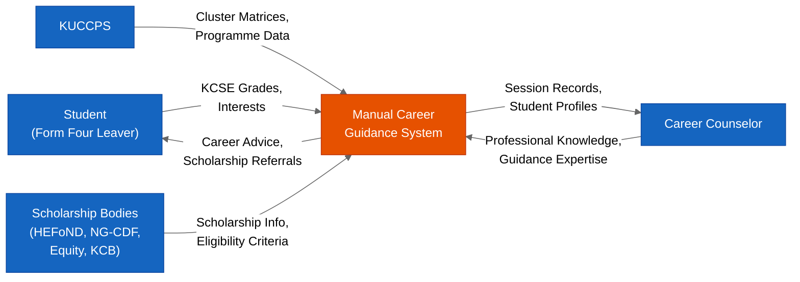

Figure 4.1: Context Diagram of the Current Manual Career Guidance System

#### 4.5.3 Level-0 Data Flow Diagram of the Current System

The Level-0 DFD (Figure 4.2) decomposes the manual career guidance system into four major processes: Grade Collection and Recording (P1), Career Pathway Identification (P2), Scholarship Information Retrieval (P3), and Guidance Session Delivery (P4). Three data stores support these processes: the Student Records store (D1), which holds the paper files containing students' grade results and session notes; the KUCCPS Publications store (D2), which holds the printed cluster matrices and programme booklets; and the Scholarship Information store (D3), which holds the printed scholarship circulars and notices posted on the school notice board (Yourdon, 1989; Odhiambo, 2011).

The data flow begins when the Student provides their KCSE grade results to Process P1 (Grade Collection and Recording), which records the grades in the Student Records data store (D1). Process P2 (Career Pathway Identification) reads the grade data from D1 and the programme requirements from the KUCCPS Publications store (D2) to identify the career pathways for which the student is eligible, producing a set of career recommendations. Process P3 (Scholarship Information Retrieval) reads the available scholarship information from the Scholarship Information store (D3) and identifies scholarships for which the student may be eligible, producing a set of scholarship referrals. Process P4 (Guidance Session Delivery) receives the career recommendations from P2 and the scholarship referrals from P3, and delivers them to the Student as career advice and scholarship information during the face-to-face guidance session (Yourdon, 1989; Mutie & Ndambuki, 2009).

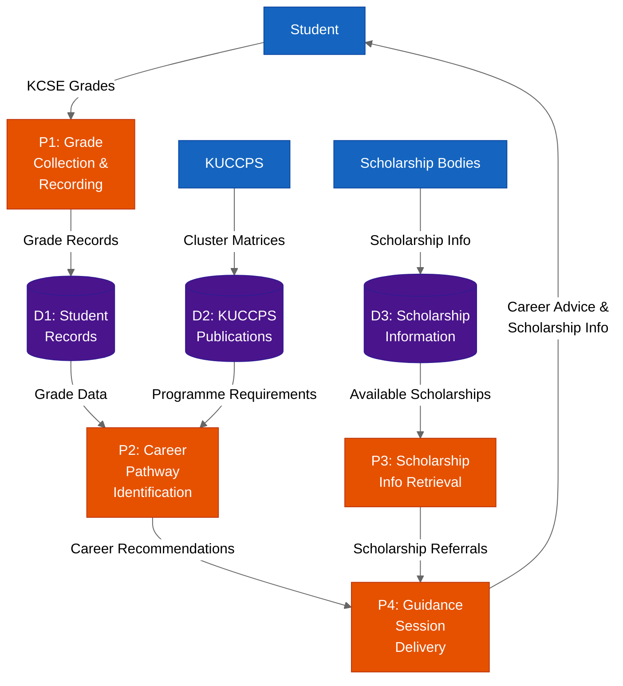

Figure 4.2: Level-0 Data Flow Diagram of the Current Manual Career Guidance System

#### 4.5.4 Flowchart of the Current Manual Guidance Process

The Flowchart (Figure 4.3) provides a step-by-step view of the manual guidance process from the student's perspective, beginning with the student's decision to seek career guidance and ending with the student's departure from the guidance session. The flowchart highlights two critical decision points that characterise the current system's structural limitations. The first decision point — "Is Counselor Available?" — reflects the fundamental bottleneck of the current system: the student can only receive guidance when the counselor is physically present and has time available, which may require multiple return visits before a session can be arranged (Odhiambo, 2011). The second decision point — "Scholarship Info Available?" — reflects the information silo problem: the counselor can only provide scholarship referrals if they happen to have current scholarship information available at the time of the session, which depends on whether relevant circulars have been received and filed (Mutie & Ndambuki, 2009).

The flowchart also makes explicit the manual, sequential nature of the current process: the counselor must manually collect the student's grades, manually look up the KUCCPS cluster matrices, manually identify eligible programmes, manually assess the student's interests and aptitude, and manually generate career recommendations — all within a single session, without the benefit of any computational decision-support tools. This manual process is not only time-consuming but also cognitively demanding for the counselor, increasing the risk of errors and omissions, particularly when the counselor is managing a large caseload (Yourdon, 1989; Pressman & Maxim, 2015).

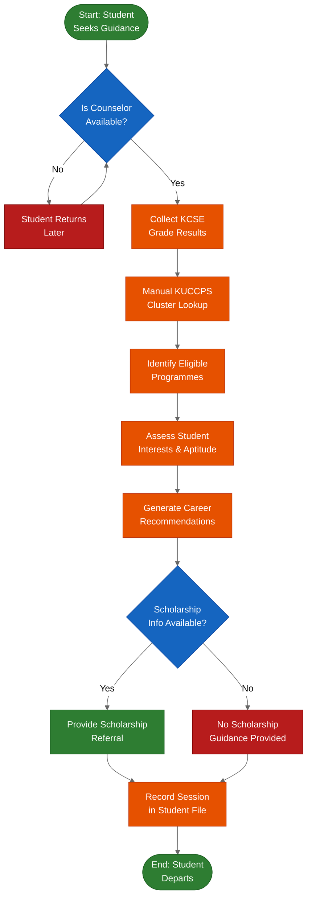

Figure 4.3: Flowchart of the Current Manual Career Guidance Process


---

### 4.6 Chapter Summary

Chapter Four has presented a comprehensive system analysis of the current manual career guidance system operating in Kenyan secondary schools, establishing the empirical and analytical foundation upon which the proposed web-based portal is designed. The description of the current system in Section 4.2 revealed a process that, while possessing genuine strengths in human empathy, contextual knowledge, and personal relationships, is structurally constrained by a critically inadequate counselor-to-student ratio of 1:500 or higher, the absence of data-driven decision-support tools, significant geographic inequality between urban and rural schools, scholarship information silos, inconsistency across counselors, and the complete absence of self-service access for students (Odhiambo, 2011; Kenya Ministry of Education, 2019). The feasibility study in Section 4.3 demonstrated conclusively that the proposed portal is technically feasible — built on proven, open-source technologies including Pure Python `http.server`, SQLite/PostgreSQL, and HTML5/CSS3/JavaScript — economically feasible, with total infrastructure costs approaching zero through the use of free-tier cloud services on Vercel and Neon PostgreSQL, and operationally feasible, with a mobile-first, web-based design that is accessible from any smartphone on a 3G connection without installation (Sommerville, 2016; Vercel, 2023; Neon, 2023). The data input/output analysis in Section 4.4 documented the current system's four primary data inputs — KCSE grade results, counselor session notes, printed KUCCPS booklets, and scholarship circulars — and identified four critical data quality issues: inconsistent formats, absence of digital storage, absence of aggregation capability, and absence of version control for KUCCPS data (Yourdon, 1989; Mutie & Ndambuki, 2009). The process logic design in Section 4.5, rendered through the Context Diagram (Figure 4.1), Level-0 DFD (Figure 4.2), and Flowchart (Figure 4.3), gave visual form to the structural limitations of the current system and provided the formal system analysis artefacts against which the proposed portal's design will be compared. Chapter Five will proceed to present the complete system design of the proposed portal, including its conceptual architecture, process logic diagrams, database design, and input/output design, demonstrating how each design decision directly addresses a specific weakness identified in this chapter's analysis of the current system (Pressman & Maxim, 2015).


---

## Chapter Five: System Design of the Proposed System

### 5.1 Introduction

Chapter Five presents the complete system design of the proposed web-based career guidance and scholarship information portal. Building directly on the system analysis conducted in Chapter Four — which identified the structural limitations of the current manual guidance process — this chapter translates the identified requirements into a coherent, technically grounded design that can be implemented, tested, and deployed. The design artefacts produced in this chapter serve as the authoritative blueprint for the system implementation described in Chapter Six, ensuring that every technical decision is traceable to a specific requirement or design principle (Pressman & Maxim, 2015).

The chapter is organised into the following sections:

**Section 5.2 — Description of the Proposed System** provides a high-level overview of the portal's purpose, architecture, and key capabilities, together with an honest assessment of its strengths and limitations. This section situates the proposed system within the broader landscape of educational technology and career guidance platforms reviewed in Chapter Two, demonstrating how the design choices address the three research gaps identified in Section 2.7 (Odhiambo, 2011; Kenya Ministry of Education, 2019).

**Section 5.3 — Requirement Analysis** presents the complete set of functional requirements (FR1–FR9), non-functional requirements (NFR1–NFR5), user requirements, and usability requirements that govern the system's behaviour. Each requirement is stated precisely and, where applicable, linked to the specific technical mechanism in the codebase that satisfies it (Sommerville, 2016).

**Section 5.4 — Conceptual Architecture** describes the three-tier architectural model — Presentation Layer, Application Layer, and Data Layer — and presents the System Architecture Diagram (Figure 5.1) as a Mermaid flowchart that maps the relationships between the browser client, the Pure Python `http.server` backend, and the SQLite/PostgreSQL data store (Tanenbaum & Van Steen, 2007).

**Section 5.5 — Process Logic Design** is the most extensive section of the chapter, presenting nine Mermaid diagrams that collectively describe the system's behaviour from multiple perspectives: the Use Case Diagram (Figure 5.2), Activity Diagram (Figure 5.3), four Sequence Diagrams (Figures 5.4–5.7), Class Diagram (Figure 5.8), Context Diagram (Figure 5.9), and Level-0 DFD (Figure 5.10). This section also includes the pseudocode for the `run_algorithm()` function and a textual Collaboration Diagram for the scholarship matching process (Booch et al., 2005).

**Section 5.6 — Database Design** presents the Entity-Relationship Diagram (Figure 5.11), a normalisation discussion covering First, Second, and Third Normal Forms, and the complete data dictionary for all four database tables: `users`, `sessions`, `verification_tokens`, and `scholarships` (Codd, 1970; Date, 2004).

**Section 5.7 — Input/Output Design** describes the design of four key screens — the Landing Page, the Multi-Step Career Profiling Form, the Recommendations Page, and the Scholarships Page — with attention to mobile-first layout principles, accessibility, and the user experience goals established in the requirement analysis (Nielsen, 1994).

**Section 5.8 — Chapter Summary** synthesises the design decisions made in this chapter and bridges to Chapter Six, which presents the system implementation and testing results.

---

### 5.2 Description of the Proposed System

#### 5.2.1 System Overview

The proposed system is a web-based career guidance and scholarship information portal designed specifically for Kenyan Form Four leavers navigating the transition from secondary school to post-secondary education and employment. The portal operates as a centralised, freely accessible, and Competency-Based Curriculum (CBC)-aligned digital platform that consolidates three functions previously delivered through fragmented, manual, and geographically unequal channels: personalised career recommendation, scholarship discovery, and structured career profiling (Kenya Ministry of Education, 2019). By integrating these three functions into a single, mobile-first web application, the portal directly addresses the information asymmetry problem identified in Section 1.3 and the three research gaps documented in Section 2.7 (Odhiambo, 2011).

The system is built on a Pure Python `http.server` backend — requiring no external web framework — with a Vanilla HTML5/CSS3/JavaScript frontend, a SQLite database for local development, and a PostgreSQL database hosted on Neon for production deployment. The application is deployed on Vercel's serverless platform, which provides global content delivery, automatic HTTPS, and zero-cost hosting for the expected traffic volumes of a student-facing educational portal (Vercel, 2023). This technology stack was deliberately chosen to minimise operational costs, eliminate licensing barriers, and ensure that the system can be maintained and extended by a single developer without specialised framework knowledge (Sommerville, 2016).

The portal is freely accessible to all registered users without subscription fees or paywalls, reflecting the equity principle that career guidance should not be a privilege of students whose schools can afford commercial guidance software or whose families can pay for private counseling services (Lent et al., 1994). Registration requires only a valid email address, making the portal accessible to any student with a basic smartphone and a mobile data connection, consistent with the mobile-first design philosophy that prioritises the 320px–768px screen width range most common among Kenyan secondary school students (GSMA Intelligence, 2023).

#### 5.2.2 Strengths of the Proposed System

The proposed portal possesses several significant strengths that distinguish it from both the current manual guidance system analysed in Chapter Four and the related systems reviewed in Section 2.5 (Naviance, KUCCPS Portal, Craydel).

**Centralised Information Hub.** The portal consolidates career information, scholarship data, and personalised recommendations into a single platform, eliminating the need for students to navigate multiple disconnected sources — KUCCPS booklets, school notice boards, counselor sessions, and internet searches — to assemble the information needed for post-secondary decision-making (Mutie & Ndambuki, 2009). This centralisation directly addresses the information silo problem identified in Section 4.2.

**CBC Pathway Alignment.** The career recommendation engine is designed with explicit awareness of Kenya's Competency-Based Curriculum, which emphasises competency strands, career pathways, and holistic learner profiles rather than the purely grade-based selection model of the 8-4-4 system (Kenya Ministry of Education, 2019). The profiling instrument captures not only KCSE grades but also self-rated competency scores across seven skill dimensions — problem-solving, analytical reasoning, coding aptitude, verbal communication, critical thinking, creativity, and leadership — reflecting the CBC's emphasis on competency-based learner profiling (Holland, 1997).

**KCSE-Based Algorithmic Recommendations.** The `run_algorithm()` function implements a weighted scoring model that maps KCSE subject grades to numeric values using the `GRADE_MAP` (A=12, A-=11, B+=10, B=9, B-=8, C+=7, C=6, C-=5, D+=4, D=3, D-=2, E=1), computes subject scores, trait scores, and industry interest scores for each career in the database, and returns the top eight career matches with percentage scores normalised to the highest-scoring career (Pressman & Maxim, 2015). This algorithmic approach provides consistent, reproducible recommendations that are not subject to the counselor availability and knowledge variability problems of the current system.

**Integrated Scholarship Repository.** The portal includes a searchable scholarship database that allows students to discover funding opportunities using keyword search, addressing the scholarship information silo problem identified in Section 4.2. The repository is maintained by administrators through the admin dashboard and covers government scholarships (HELB, HEFoND, NG-CDF), private scholarships (Equity Wings to Fly, KCB Foundation), and international scholarships relevant to Kenyan students (Nafukho & Nchise, 2013).

**Free and Open-Source Architecture.** The entire technology stack — Python standard library, SQLite, PostgreSQL via pg8000, HTML5/CSS3/JavaScript — consists of open-source components with no licensing costs, ensuring that the portal can be deployed, maintained, and extended without financial barriers (Sommerville, 2016). This is a critical advantage over commercial platforms such as Naviance, which require institutional subscriptions that are beyond the budget of most Kenyan secondary schools.

**Mobile-First Design.** The portal's CSS layout is designed mobile-first, with a base layout optimised for 320px screen widths and progressive enhancement for larger screens up to 1920px. This design philosophy ensures that the portal is fully functional on the basic Android smartphones that represent the primary internet access device for the majority of Kenyan secondary school students (GSMA Intelligence, 2023; ITU, 2022).

**Admin Dashboard for Content Management.** The admin dashboard provides authenticated administrators with the ability to add, edit, and delete scholarship records and view user registrations without requiring direct database access, ensuring that the scholarship repository can be kept current without technical expertise (Pressman & Maxim, 2015).

**Email OTP Security.** User registration is secured by a 6-digit One-Time Password (OTP) sent via Gmail SMTP on port 465 with SSL encryption, stored in the `verification_tokens` table with a 10-minute expiry. This mechanism ensures that only users with access to the registered email address can complete registration, preventing spam registrations and protecting the integrity of the user database (Stallings, 2017).

#### 5.2.3 Limitations of the Proposed System

An honest assessment of the proposed system must also acknowledge its limitations, which define the boundaries of its applicability and identify areas for future development.

**Internet Dependency.** The portal is a web-based application that requires an active internet connection to function. There is no offline mode or Progressive Web App (PWA) caching mechanism in the current implementation, meaning that students in areas with unreliable mobile data coverage cannot access the portal during connectivity outages (ITU, 2022). This is a significant limitation in rural Kenya, where mobile data coverage remains inconsistent despite improvements in national network infrastructure (Communications Authority of Kenya, 2023).

**No Live KUCCPS API Integration.** The career database embedded in `api/career_database.py` is a static dataset that was compiled at the time of development. The portal does not integrate with the Kenya Universities and Colleges Central Placement Service (KUCCPS) API in real time, meaning that changes to cluster weights, minimum grade requirements, or programme availability are not automatically reflected in the recommendation engine (KUCCPS, 2023). Administrators must manually update the career database to reflect changes in KUCCPS placement criteria.

**Psychometric Limitations.** The RIASEC-based competency scoring used in the profiling instrument is a self-report instrument, not a clinically validated psychometric assessment. The skill ratings provided by students in Step 2 of the profiling process reflect self-perception rather than objectively measured competency, which may introduce self-assessment bias into the recommendation results (Holland, 1997). The portal's recommendations should therefore be understood as a structured starting point for career exploration rather than a definitive career prescription.

**No Real-Time Scholarship Deadline Updates.** The scholarship repository does not integrate with external scholarship databases or APIs, meaning that scholarship deadlines and eligibility criteria are only updated when an administrator manually edits the relevant record. Students relying on the portal for scholarship deadline information must verify current deadlines directly with the awarding organisation (Nafukho & Nchise, 2013).

**Limited to English Language.** The portal's interface and content are currently available only in English. While English is the medium of instruction in Kenyan secondary schools, a significant proportion of Form Four leavers — particularly those from rural areas — may be more comfortable navigating information in Kiswahili (Kenya National Bureau of Statistics, 2019). The absence of a Kiswahili language option represents a usability limitation that should be addressed in future development iterations.

---

### 5.3 Requirement Analysis

#### 5.3.1 Overview

Requirement analysis is the process of identifying, documenting, and validating the needs and constraints that a software system must satisfy in order to achieve its intended purpose (Sommerville, 2016). For the proposed career guidance portal, requirement analysis was conducted through a combination of document analysis of the existing codebase (`api/index.py`, `templates/`, `static/`), review of the KUCCPS placement framework, and synthesis of the literature reviewed in Chapter Two. The requirements are organised into four categories: Functional Requirements, Non-Functional Requirements, User Requirements, and Usability Requirements, following the classification framework proposed by Sommerville (2016) and widely adopted in software engineering practice.

#### 5.3.2 Functional Requirements

Functional requirements define the specific behaviours, functions, and capabilities that the system must provide (Pressman & Maxim, 2015). The following functional requirements were identified for the proposed portal:

**FR1 — User Registration.** The system shall allow students and counselors to register for an account by providing their full name, email address, and a password. The password shall be hashed using the SHA-256 algorithm via Python's `hashlib` standard library module before storage in the `users` table, ensuring that plaintext passwords are never persisted to the database (Stallings, 2017). The registration form shall also capture optional fields including school name, phone number, and preferred study areas, which are stored in the `users` table for use in the counselor dashboard. The `role` field defaults to `'student'` for all self-registered users; counselor accounts are assigned the `'counselor'` role by an administrator.

**FR2 — Email OTP Verification.** Following successful registration, the system shall send a 6-digit One-Time Password (OTP) to the user's registered email address via Gmail SMTP on port 465 with SSL encryption, using Python's `smtplib.SMTP_SSL` class (Python Software Foundation, 2023). The OTP shall be generated by the `generate_otp()` function, stored in the `verification_tokens` table alongside the user's `user_id` and an `expires_at` timestamp computed as `int(time.time()) + 600` (10 minutes from generation), and validated when the user submits the OTP on the `/verify_otp` page. An account with `is_verified = 0` shall not be permitted to log in, ensuring that only users with verified email addresses can access the portal's features (Stallings, 2017).

**FR3 — User Login.** The system shall authenticate users by comparing the SHA-256 hash of the submitted password against the stored hash in the `users` table for the matching email address. Upon successful authentication, the system shall create a new session record in the `sessions` table with a UUID session token generated by Python's `uuid.uuid4()` function, the authenticated user's `user_id`, and the current Unix timestamp as `created_at`. The session token shall be set as an HttpOnly cookie in the browser response, ensuring that it cannot be accessed by client-side JavaScript (Stallings, 2017). Subsequent requests from the authenticated browser shall include this cookie, allowing the `get_current_user()` method to retrieve the session record and identify the logged-in user.

**FR4 — Password Reset.** The system shall provide a password reset mechanism accessible from the login page. When a user submits their email address on the `/forgot_password` page, the system shall generate a UUID reset token, store it in the `verification_tokens` table with a 10-minute expiry, and send a password reset link to the user's email address via Gmail SMTP. When the user follows the reset link, the system shall validate the token, confirm it has not expired, and allow the user to set a new password, which shall be SHA-256 hashed before storage (Pressman & Maxim, 2015).

**FR5 — Multi-Step Career Profiling.** The system shall provide a four-step career profiling process accessible to authenticated students. Step 1 shall capture KCSE grade results for seven subjects: Mathematics, English, Kiswahili, Biology, Chemistry, Physics, and Humanities/Social Studies. Each grade shall be selected from a dropdown menu offering the full range of KCSE grades (A, A-, B+, B, B-, C+, C, C-, D+, D, D-, E). Step 2 shall capture self-rated competency scores on a 1–5 scale for seven skill dimensions: problem-solving, analytical reasoning, coding aptitude, verbal communication, critical thinking, creativity, and leadership. Step 3 shall capture career preferences including preferred work environment, teamwork preference, primary motivation, industry interests (multi-select), willingness to relocate, budget range, and education goal. Step 4 shall present a review screen displaying all data entered in Steps 1–3 for confirmation before submission. Data from each step shall be stored in browser cookies and assembled into the `profile_data` dictionary on submission (Pressman & Maxim, 2015).

**FR6 — Career Recommendation Engine.** Upon submission of the completed profiling form at `/profile/submit`, the system shall invoke the `run_algorithm(profile_data)` function, which shall compute a weighted score for each career in the `CAREERS` database by summing the subject score (sum of mapped grade values multiplied by a subject weight of 2 for each relevant subject), the trait score (sum of trait weights for each matching competency), and the industry interest score (8 points for each matching industry interest). The function shall filter careers by the student's `education_goal` and minimum grade threshold (`mean_grade`), sort the remaining careers by total score in descending order, normalise the top eight scores as a percentage of the highest score, and return the top eight career matches as a list of `(match_pct, career_dict)` tuples. The results shall be stored as a JSON blob in the `last_results` field of the `users` table and rendered on the `/recommendations` page (Pressman & Maxim, 2015).

**FR7 — Scholarship Repository.** The system shall provide a searchable scholarship repository accessible to all authenticated users at the `/scholarships` route. The repository shall display all scholarship records from the `scholarships` table, including the scholarship name, provider, description, eligibility criteria, deadline, and application link. Users shall be able to filter the displayed scholarships by entering a keyword in a search field, which shall trigger a SQL `LIKE` query against the `name`, `provider`, `description`, and `eligibility_criteria` fields of the `scholarships` table (Date, 2004).

**FR8 — Admin Dashboard.** The system shall provide an admin dashboard accessible at the `/admin` route to authenticated users with the `role = 'admin'` attribute. The admin dashboard shall allow administrators to add new scholarship records by submitting a form with the scholarship name, provider, description, eligibility criteria, deadline, and application link; edit existing scholarship records; delete scholarship records; and view a list of all registered users with their registration timestamps and verification status. All admin actions shall be protected by role-based access control, ensuring that non-admin users who attempt to access the `/admin` route are redirected to the login page (Stallings, 2017).

**FR9 — Counselor Dashboard.** The system shall provide a counselor dashboard accessible at the `/dashboard` route to authenticated users with the `role = 'counselor'` attribute. The counselor dashboard shall display a list of student profiles, including each student's full name, school, registration date, and the results of their most recent career profiling session (stored in the `last_results` field of the `users` table), enabling counselors to monitor student career exploration progress and provide targeted guidance (Mutie & Ndambuki, 2009).

#### 5.3.3 Non-Functional Requirements

Non-functional requirements define the quality attributes and operational constraints that govern how the system performs its functions, rather than what functions it performs (Sommerville, 2016). The following non-functional requirements were identified:

**NFR1 — Performance.** All pages of the portal shall load within five seconds on a 3G mobile data connection with a throughput of approximately 1 Mbps. This requirement is derived from research indicating that page load times exceeding five seconds result in significantly higher user abandonment rates, particularly on mobile devices in low-bandwidth environments (Nielsen, 1994; ITU, 2022). The Pure Python `http.server` backend, Vanilla HTML5/CSS3/JavaScript frontend, and absence of heavy client-side JavaScript frameworks collectively minimise the payload size of each page response, supporting compliance with this requirement.

**NFR2 — Responsiveness.** The portal's layout shall render correctly and be fully functional across all screen widths from 320 pixels (the minimum width of basic Android smartphones) to 1920 pixels (standard desktop monitor width). The CSS layout shall be implemented using a mobile-first approach, with base styles targeting the 320px–480px range and media queries progressively enhancing the layout for tablet (768px) and desktop (1024px+) screen widths (GSMA Intelligence, 2023). All interactive elements — buttons, form fields, dropdown menus — shall have touch targets of at least 44×44 pixels, consistent with the Web Content Accessibility Guidelines (WCAG) 2.1 minimum touch target size recommendation (W3C, 2018).

**NFR3 — Security.** The system shall implement the following security controls: (a) all user passwords shall be hashed using SHA-256 via Python's `hashlib` module before storage, ensuring that plaintext passwords are never persisted; (b) session cookies shall be set with the `HttpOnly` flag, preventing client-side JavaScript from accessing the session token and mitigating cross-site scripting (XSS) session hijacking attacks; (c) OTP tokens shall expire after 10 minutes, limiting the window of opportunity for OTP interception attacks; (d) role-based access control shall restrict access to the admin dashboard and counselor dashboard to users with the appropriate `role` attribute, preventing privilege escalation (Stallings, 2017).

**NFR4 — Availability.** The portal shall achieve 99.9% uptime, corresponding to a maximum of approximately 8.76 hours of unplanned downtime per year. This requirement is satisfied by deploying the application on Vercel's serverless platform, which provides automatic scaling, global content delivery, and a published Service Level Agreement (SLA) of 99.99% uptime for its serverless functions (Vercel, 2023). The use of Neon PostgreSQL for the production database provides an additional layer of availability assurance, as Neon's serverless PostgreSQL platform is designed for high availability with automatic failover (Neon, 2023).

**NFR5 — Maintainability.** The system's backend shall be implemented as a single Python file (`api/index.py`) using only Python standard library modules — `http.server`, `sqlite3`, `hashlib`, `uuid`, `smtplib`, `json`, `time`, `os`, `urllib.parse` — with no external framework dependencies beyond `pg8000` for PostgreSQL connectivity. This single-file architecture minimises the cognitive overhead required to understand, modify, and extend the system, ensuring that a developer unfamiliar with the codebase can locate any function or route handler within minutes (Pressman & Maxim, 2015). The absence of a build system, transpiler, or package manager for the frontend further reduces the maintenance burden.

#### 5.3.4 User Requirements

User requirements describe the goals and tasks that specific categories of users need to accomplish using the system, expressed in terms of user needs rather than system functions (Sommerville, 2016). The following user requirements were identified through document analysis and synthesis of the literature on career guidance needs in the Kenyan secondary school context:

**UR1 — Student Career Recommendations.** Students need to receive personalised career recommendations that are grounded in their actual KCSE academic performance and reflect their individual competency profile and career interests, enabling them to make informed decisions about post-secondary pathways without requiring access to a school counselor (Odhiambo, 2011). The recommendations must be presented in a clear, actionable format that identifies specific career titles, required education levels, and relevant degree programmes, rather than generic career categories.

**UR2 — Student Scholarship Discovery.** Students need to discover scholarship and bursary opportunities that are relevant to their financial circumstances and academic profile in a single, searchable location, eliminating the need to consult multiple sources — school notice boards, HELB offices, NGO websites — to identify available funding (Nafukho & Nchise, 2013). The scholarship information must include eligibility criteria, application deadlines, and direct links to application portals.

**UR3 — Counselor Student Monitoring.** Counselors need to monitor the career exploration progress of their students by reviewing student profiling data and recommendation results, enabling them to provide targeted, data-informed guidance during counseling sessions rather than relying solely on verbal self-reports from students (Mutie & Ndambuki, 2009). The counselor dashboard must present student data in a structured, easily scannable format.

**UR4 — Administrator Content Management.** Administrators need to maintain the currency and accuracy of the scholarship repository by adding new scholarship records, updating existing records with revised deadlines and eligibility criteria, and removing expired scholarships, without requiring direct database access or technical expertise (Pressman & Maxim, 2015). The admin dashboard must provide a simple, form-based interface for all content management operations.

#### 5.3.5 Usability Requirements

Usability requirements define the standards of ease-of-use, learnability, and accessibility that the system must meet to be effective for its target user population (Nielsen, 1994). The following usability requirements were identified:

**USR1 — Profiling Completion Time.** The complete four-step career profiling process — from the profile introduction page through to the submission of Step 4 and the display of recommendations — shall be completable by a first-time user in 10 to 15 minutes. This requirement is based on research indicating that form completion rates drop significantly when the perceived time investment exceeds 15 minutes, particularly for adolescent users on mobile devices (Nielsen, 1994). The four-step structure distributes the data entry workload across manageable segments, with each step designed to be completable in approximately three to four minutes.

**USR2 — Navigation Without Training.** All pages of the portal shall be navigable by a first-time user without any prior technical training or instruction. Navigation elements — the top navigation bar, step progress indicators, action buttons — shall use standard web conventions and plain-language labels that are immediately comprehensible to a Form Four leaver with basic smartphone literacy (W3C, 2018). The portal shall not require users to read a manual, watch a tutorial, or contact support in order to complete any core task.

**USR3 — Clear and Actionable Error Messages.** All error messages displayed by the portal — including form validation errors, authentication failures, and OTP expiry notifications — shall be written in plain English, identify the specific field or action that caused the error, and provide a clear instruction for how the user can resolve the error. Error messages shall not expose technical details such as database error codes, stack traces, or internal variable names (Nielsen, 1994).

**USR4 — Accessibility on Basic Smartphones.** The portal shall be fully functional on basic Android smartphones with screen widths as small as 320 pixels, running a standard mobile browser (Chrome for Android, Firefox for Android). All interactive elements shall be operable by touch without requiring a stylus or precise pointing device. Text shall be rendered at a minimum font size of 16 pixels on mobile screens to ensure legibility without zooming, consistent with WCAG 2.1 Level AA accessibility guidelines (W3C, 2018).

#### 5.3.6 Scholarship Repository — Functional Requirement Specification

The scholarship repository is a core functional component of the proposed portal, providing students with a centralised, searchable database of funding opportunities that directly addresses the scholarship information silo problem identified in Section 4.2 (Mutie & Ndambuki, 2009). The following functional requirement specification defines the scholarship repository in terms of its searchable fields, category filter, and administrative CRUD operations, as implemented in `api/index.py` and the `scholarships` database table.

**Searchable Fields.** The scholarship repository shall support keyword-based search across four fields of the `scholarships` table: `name` (the full name of the scholarship programme), `provider` (the name of the awarding organisation), `description` (the full narrative description of the scholarship), and `eligibility_criteria` (the structured summary of academic, financial, and geographic eligibility requirements). The search shall be implemented as a case-insensitive SQL `LIKE` query of the form `WHERE name LIKE '%keyword%' OR provider LIKE '%keyword%' OR description LIKE '%keyword%' OR eligibility_criteria LIKE '%keyword%'`, ensuring that a student searching for a term such as "engineering" or "needy" will retrieve all records in which that term appears in any of the four searchable fields (Date, 2004). If no keyword is submitted, the query shall return all records in the `scholarships` table, displaying the complete repository to the user.

**Category Filter.** Each scholarship record shall be classified under exactly one of three permitted category values: `'Government'` (for scholarships funded by national or county government bodies, including HEFoND, NG-CDF, the Presidential Scholarship, and county CDF programmes), `'Private'` (for scholarships funded by private foundations and corporate social responsibility programmes, including Equity Wings to Fly, KCB Foundation, and Safaricom Foundation), and `'International'` (for scholarships funded by international organisations and foreign governments, including the Mastercard Foundation Scholars Program and USAID Kenya programmes). The portal shall allow users to filter the displayed scholarship list by selecting a category from a dropdown or tab interface, which shall append a `category` parameter to the search query and restrict the results to records matching the selected category value (Pressman & Maxim, 2015). The `category` field defaults to `'General'` for records entered without an explicit category, ensuring backward compatibility with legacy records.

**Administrative CRUD Operations.** The scholarship repository shall be managed exclusively through the admin dashboard, which provides a form-based interface for all four CRUD operations. The Create operation allows an administrator to add a new scholarship record by submitting a form with the following fields: `name`, `provider`, `description`, `eligibility_criteria`, `deadline`, `link`, `category`, and `amount`. The submitted data is inserted into the `scholarships` table via a parameterised SQL `INSERT` statement, with the `category` field defaulting to `'General'` if not specified. The Read operation is available to all authenticated users through the `/scholarships` route, which retrieves and displays all scholarship records (or a filtered subset) from the `scholarships` table. The Update operation allows an administrator to edit an existing scholarship record by submitting a pre-populated form at the `/admin/edit_scholarship` route, which executes a parameterised SQL `UPDATE` statement to modify the specified record. The Delete operation allows an administrator to remove a scholarship record by submitting a deletion request at the `/admin/delete_scholarship` route, which executes a parameterised SQL `DELETE` statement to remove the record with the specified `id`. All CRUD operations are protected by role-based access control, ensuring that only users with the `role = 'admin'` attribute can perform Create, Update, and Delete operations (Stallings, 2017; Pressman & Maxim, 2015).

#### 5.3.7 Career Profiling Module — Functional Requirement Specification

The career profiling module is the diagnostic core of the proposed portal, implementing a four-step data collection workflow that assembles the student's academic profile, skill ratings, and career preferences into the `profile_data` dictionary passed to `run_algorithm()`. The following functional requirement specification defines the career profiling module in terms of its four profiling steps, the data collected at each step, and the CAREERS database that the algorithm operates on (Holland, 1997; Pressman & Maxim, 2015).

**Four Profiling Steps.** The career profiling module is structured as a four-step sequential workflow, implemented across four route handlers (`/profile/step1` through `/profile/step4`) and a submission handler (`/profile/submit`). Data collected at each step is stored in browser cookies and assembled into the `profile_data` dictionary on final submission, ensuring that no database write is required until the student completes the full profiling process. Step 1 collects KCSE subject grades; Step 2 collects skill ratings; Step 3 collects career preferences; and Step 4 presents a review screen for confirmation before submission.

**Step 1 — Seven KCSE Subjects.** Step 1 collects the student's KCSE grade results for seven subjects, each presented as a dropdown menu offering the full range of KCSE grades (A, A-, B+, B, B-, C+, C, C-, D+, D, D-, E) plus a blank placeholder. The seven subjects are: (1) Mathematics (`math_grade`), (2) English (`english_grade`), (3) Kiswahili (`kiswahili_grade`), (4) Biology (`biology_grade`), (5) Chemistry (`chemistry_grade`), (6) Physics (`physics_grade`), and (7) Humanities/Social Studies (`humanities_grade`). These seven subjects correspond to the subject keys used in the `CAREERS` database entries in `api/career_database.py`, ensuring that the grade values collected in Step 1 can be directly mapped to career subject weights in the algorithm (KUCCPS, 2023).

**Step 2 — Six Skill Ratings.** Step 2 collects self-rated competency scores on a 1–5 scale for six skill dimensions, each presented as a row of five radio buttons. The six skill ratings are: (1) Analytical Thinking (`rating_analytical`), (2) Coding/Technical Aptitude (`rating_coding`), (3) Verbal Communication (`rating_verbal`), (4) Critical Thinking (`rating_critical`), (5) Creative Thinking (`rating_creative`), and (6) Leadership (`rating_leadership`). A seventh input, Problem Solving (`problem_solving`), is collected as a categorical selection rather than a numeric rating. The numeric skill ratings are used in the `trait_score` computation within `run_algorithm()`, where ratings of 3 or above contribute positively to careers whose trait profiles include the corresponding skill dimension (Holland, 1997).

**Step 3 — Preference Fields.** Step 3 collects the student's career preferences through a set of dropdown menus, radio button groups, and a multi-select checkbox grid. The preference fields collected in Step 3 are: `work_environment` (preferred working environment, e.g., Office, Outdoors, Remote, Laboratory), `industry_interests` (comma-separated list of industry sectors selected from a multi-select grid, e.g., Healthcare, Technology, Engineering, Business, Agriculture, Law, Media, Education), `motivation` (primary career motivation, e.g., Helping others, Wealth, Passion, Security, Flexibility), `relocate` (willingness to relocate for work or study, values: `'yes'` or `'no'`), `budget` (available budget for tertiary education, e.g., Low, Medium, High), and `education_goal` (preferred education level, e.g., Degree, Diploma, Certificate, Artisan). The `education_goal` field is used as a hard filter in `run_algorithm()`, restricting the career recommendations to entries in the `CAREERS` database whose `level` field exactly matches the student's stated education goal (Pressman & Maxim, 2015).

**CAREERS Database — Six Domains.** The `CAREERS` database, defined in `api/career_database.py`, contains career entries organised across six thematic domains that reflect the major sectors of the Kenyan labour market and the three CBC senior secondary pathways. The six domains are: (1) **Health Sciences**, covering degree and diploma programmes in medicine, nursing, public health, clinical medicine, and pharmacy technology; (2) **Engineering and Technology**, covering degree and diploma programmes in computer science, software engineering, civil engineering, electrical engineering, cybersecurity, information technology, and renewable energy technology; (3) **Business and Economics**, covering degree and diploma programmes in commerce, economics, finance, accounting, and business management; (4) **Arts, Media and Law**, covering degree and diploma programmes in law, mass communication, journalism, graphic design, fine arts, and digital marketing; (5) **Agriculture and Environment**, covering degree and diploma programmes in agriculture, agribusiness, wildlife management, conservation, and environmental management; and (6) **Education and Social Sciences**, covering degree and diploma programmes in education, social work, and community development. Each career entry in the database specifies the career name, required education level (`level`), minimum mean grade threshold (`min_grade`), relevant KCSE subjects (`subjects`), industry tags (`industries`), and a trait weight dictionary (`traits`) that maps skill and preference values to career compatibility scores (Holland, 1997; KUCCPS, 2023).


### 5.4 Conceptual Architecture

The conceptual architecture of the proposed web-based career guidance portal is organised according to the classical three-tier architectural pattern, which separates a software system into three logically distinct layers: the Presentation Layer, the Application Layer, and the Data Layer (Pressman & Maxim, 2015). This separation of concerns ensures that each layer can be developed, tested, and maintained independently, and that changes to one layer do not necessitate changes to the others. The three-tier pattern is widely adopted in web application development because it maps naturally to the client-server model of the World Wide Web, where the client browser handles presentation, a remote server handles application logic, and a database server handles persistent data storage (Sommerville, 2016).

#### 5.4.1 Presentation Layer

The Presentation Layer encompasses all components that are rendered and executed within the user's web browser. In the proposed portal, the Presentation Layer is implemented using three standard web technologies: HTML5, CSS3, and Vanilla JavaScript (ES6+). HTML5 provides the semantic structure of each page — headings, forms, tables, navigation elements — and is generated server-side by the Application Layer's `render_template()` method, which performs Jinja-style string substitution on template files stored in the `templates/` directory (Duckett, 2011). CSS3 provides the visual styling of all pages, implementing a mobile-first responsive layout that adapts from 320-pixel smartphone screens to 1920-pixel desktop monitors using media queries. The CSS stylesheet is served as a static file from the `static/style.css` path. Vanilla JavaScript (ES6+) provides client-side interactivity — form validation feedback, dynamic UI updates, and asynchronous interactions — without relying on any external JavaScript framework such as React, Vue, or Angular. This deliberate choice to avoid JavaScript frameworks minimises the page payload size and eliminates the need for a build system or transpiler, ensuring that the portal loads quickly on low-bandwidth mobile connections (GSMA Intelligence, 2023).

The Presentation Layer communicates with the Application Layer exclusively through standard HTTP requests: `GET` requests to retrieve pages and `POST` requests to submit form data. There is no WebSocket connection, no GraphQL endpoint, and no REST API consumed by the frontend — all data exchange occurs through full-page HTTP request-response cycles, consistent with the progressive enhancement philosophy of web development (Duckett, 2011).

#### 5.4.2 Application Layer

The Application Layer constitutes the core of the portal's server-side logic and is implemented entirely in Pure Python using the `http.server` module from the Python standard library. The entire Application Layer resides in a single file, `api/index.py`, which is deployed as a serverless function on the Vercel platform. Vercel's routing configuration, defined in `vercel.json`, rewrites all incoming HTTP requests — regardless of path — to the `api/index.py` handler, ensuring that every request to the portal is processed by the same Python module (Vercel, 2023).

The central component of the Application Layer is the `handler` class, which extends Python's built-in `BaseHTTPRequestHandler` class from the `http.server` module. The `handler` class overrides two methods to process incoming HTTP requests: `do_GET()`, which handles all HTTP GET requests, and `do_POST()`, which handles all HTTP POST requests. Within each method, the request path is inspected using a series of conditional branches (`if`/`elif`/`else`) to route the request to the appropriate handler logic. This routing mechanism is functionally equivalent to the route decorators provided by web frameworks such as Flask, but is implemented without any external dependencies (Lutz, 2013).

The `do_GET()` method handles routes including `/` (landing page), `/register`, `/login`, `/verify_otp`, `/profile/intro`, `/profile/step1` through `/profile/step4`, `/recommendations`, `/scholarships`, `/dashboard`, `/admin`, and `/static/*` (static file serving). The `do_POST()` method handles form submission routes including `/register`, `/login`, `/verify_otp`, `/profile/step1` through `/profile/step4`, `/profile/submit`, `/admin/add_scholarship`, `/admin/delete_scholarship`, `/admin/edit_scholarship`, `/forgot_password`, and `/reset_password`.

Beyond routing, the Application Layer provides several cross-cutting utility functions. The `get_current_user()` method reads the `session_id` cookie from the incoming request, queries the `sessions` table in the database to retrieve the associated user record, and returns the user's data as a Python dictionary. This function is called at the beginning of every route handler that requires authentication. The `render_template()` method reads an HTML template file from the `templates/` directory and performs string substitution to inject dynamic data — user names, recommendation results, scholarship records — into the template before sending the response to the browser (Pressman & Maxim, 2015).

#### 5.4.3 Data Layer

The Data Layer is responsible for the persistent storage and retrieval of all application data. The proposed portal implements a dual-database strategy that uses different database engines for development and production environments, controlled by the presence or absence of the `DATABASE_URL` environment variable. The `get_db_connection()` function in `api/index.py` implements this switching logic: if the `DATABASE_URL` environment variable is set (as it is in the Vercel production environment, where it is configured to point to a Neon PostgreSQL instance), the function establishes a connection to the PostgreSQL database using the `pg8000` pure-Python PostgreSQL driver; if `DATABASE_URL` is not set (as in a local development environment), the function establishes a connection to a local SQLite database file using Python's built-in `sqlite3` module (Neon, 2023).

This dual-database strategy provides significant practical advantages. During development, SQLite requires no installation, no server process, and no network configuration — the database is a single file on the developer's local filesystem, making it trivially easy to set up and reset. In production, PostgreSQL via Neon provides the scalability, concurrent connection handling, and data durability required for a multi-user web application deployed on a serverless platform (Neon, 2023). The use of `pg8000` — a pure-Python PostgreSQL driver with no C extension dependencies — is essential for compatibility with Vercel's serverless function environment, which does not support compiled C extensions (Vercel, 2023).

The Data Layer stores data across four tables: `users` (student, counselor, and admin accounts), `sessions` (active login sessions), `verification_tokens` (OTP tokens for email verification and password reset), and `scholarships` (scholarship and bursary records). The schema for all four tables is defined in the `init_db()` function in `api/index.py`, which creates the tables if they do not already exist, using `IF NOT EXISTS` clauses to ensure idempotent initialisation (Lutz, 2013).

#### 5.4.4 Vercel Routing and Serverless Deployment

The deployment architecture of the portal leverages Vercel's serverless function platform to host the Python Application Layer without requiring a dedicated server. The `vercel.json` configuration file at the root of the project defines a single rewrite rule that maps all incoming URL paths — expressed as the wildcard pattern `/(.*)`  — to the `api/index.py` serverless function. This means that when a user navigates to any URL on the portal's domain, Vercel's edge network receives the request, instantiates the `api/index.py` serverless function, and passes the request to the `handler` class for processing (Vercel, 2023). The serverless model eliminates the need to manage server infrastructure, configure web server software such as Nginx or Apache, or provision virtual machines, significantly reducing the operational complexity and cost of running the portal (Sommerville, 2016).

The complete three-tier architecture of the proposed portal, including the relationships between the Presentation Layer, Application Layer, and Data Layer, is illustrated in Figure 5.1 below.

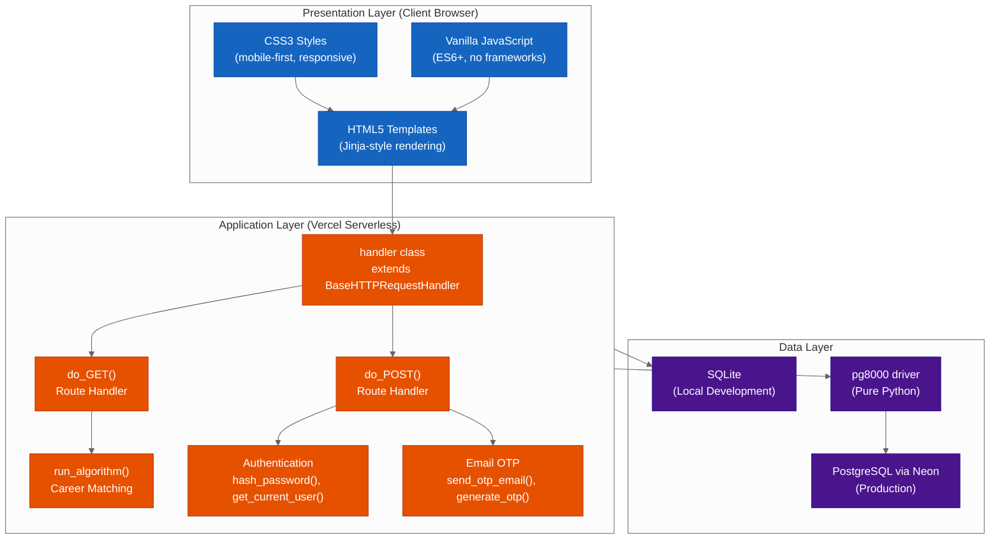

Figure 5.1: Three-Tier System Architecture Diagram of the Proposed Portal


### 5.5 Process Logic Design of the Proposed System

The process logic design of the proposed web-based career guidance portal is documented through a comprehensive suite of nine diagrams, each capturing a different dimension of the system's behaviour and structure. Together, these diagrams provide a complete specification of the system's functional processes, data flows, object interactions, and class relationships, serving as the authoritative blueprint for system implementation (Pressman & Maxim, 2015). The diagrams are presented in the following sub-sections, each preceded by a descriptive narrative that contextualises the diagram within the broader system design. The Unified Modelling Language (UML) and Data Flow Diagram (DFD) notations used in this section conform to the conventions established by Rumbaugh, Jacobson, and Booch (2004) and DeMarco (1979), respectively.

#### 5.5.1 Use Case Diagram

The Use Case Diagram provides a high-level overview of the functional interactions between the system's three primary actors — the Learner (Form Four Student), the Counselor, and the Admin — and the use cases that the system supports for each actor (Rumbaugh et al., 2004). A use case represents a discrete unit of functionality that delivers value to an actor, and the Use Case Diagram maps each actor to the use cases they can initiate, as well as the `<<include>>` relationships that indicate mandatory sub-processes within a use case.

The Learner actor, representing a Form Four leaver seeking career guidance, is associated with the broadest set of use cases. The Learner can register an account, which mandatorily includes the Verify Email OTP sub-process; log in to the portal; complete the four-step career profiling process, which includes the sub-processes of entering KCSE grades, rating skills and aptitude, and setting career preferences; view career recommendations generated by the algorithm; search the scholarship repository; view the details of individual scholarships; and reset a forgotten password. The Counselor actor shares the Login use case with the Learner and additionally has access to the View Student Profiles and Monitor Guidance Sessions use cases, which are restricted to users with the `role = 'counselor'` attribute. The Admin actor shares the Login use case and has exclusive access to the View Admin Dashboard, Add Scholarship, Edit Scholarship, Delete Scholarship, and Manage Users use cases, all of which are restricted to users with the `role = 'admin'` attribute (Sommerville, 2016).

The `<<include>>` relationships in the diagram indicate that the included use case is an obligatory component of the including use case — for example, every execution of the Register Account use case must include the Verify Email OTP sub-process, as the system does not permit unverified accounts to log in. This design decision ensures that all registered email addresses are valid and accessible to the user, reducing the risk of fraudulent registrations and ensuring that OTP-based password reset emails can be delivered successfully (Stallings, 2017).

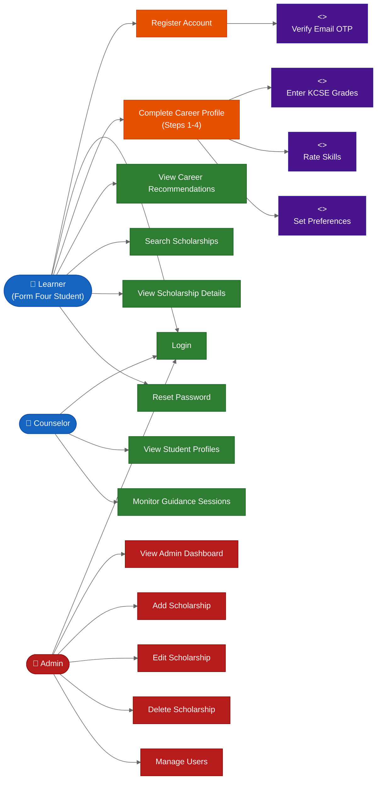

Figure 5.2: Use Case Diagram of the Proposed Career Guidance Portal


#### 5.5.2 Activity Diagram

The Activity Diagram models the dynamic workflow of the multi-step career profiling process, which is the core functional process of the proposed portal (Rumbaugh et al., 2004). The diagram traces the sequence of activities from the moment a student logs in and navigates to the profile introduction page, through the four data-entry steps, to the final display of personalised career recommendations. The Activity Diagram is particularly valuable for documenting this process because it captures both the sequential flow of activities and the decision points at which the workflow may branch or loop back, providing a complete picture of all possible execution paths (Pressman & Maxim, 2015).

The workflow begins when the student logs in and navigates to the profile introduction page, which provides an overview of the profiling process and instructions for each step. The student then proceeds to Step 1, where they enter their KCSE grades for seven subjects: Mathematics, English, Kiswahili, Biology, Chemistry, Physics, and Humanities. A validation decision point checks whether the entered grades are valid — that is, whether each grade is a recognised KCSE grade string (A, A-, B+, B, B-, C+, C, C-, D+, D, D-, E) or blank. If the grades are invalid, the workflow loops back to Step 1 for correction. If valid, the Step 1 data is serialised as a JSON string and stored in a browser cookie (`step1_data`), and the student is redirected to Step 2.

Step 2 presents a skills and aptitude rating interface, where the student rates seven competencies — problem solving, analytical thinking, coding aptitude, verbal communication, critical thinking, creative thinking, and leadership — on a scale of 1 to 5. The Step 2 data is stored in a `step2_data` cookie, and the student proceeds to Step 3. Step 3 captures career preferences, including preferred work environment, teamwork orientation, primary motivation, industry interests (selected from a predefined list), willingness to relocate, budget for education, and education goal (university, diploma, certificate, or artisan). The Step 3 data is stored in a `step3_data` cookie.

Step 4 presents a review page that reads all three cookies and displays the assembled profile data for the student to verify before submission. The student may choose to edit their data by returning to Step 1, or confirm the submission. Upon confirmation, the browser sends a POST request to `/profile/submit`, which assembles the complete `profile_data` dictionary from the three cookies, passes it to the `run_algorithm()` function, and stores the results in the `users` table. The workflow concludes with the display of the recommendations page, which presents the top eight career matches with their percentage match scores (Odhiambo, 2011).

```mermaid
%%{init: {'theme': 'neutral'}}%%
flowchart TD
    A([Start: Student\nLogs In]) --> B[Navigate to\nProfile Introduction]
    B --> C[Step 1: Enter\nKCSE Grades\n7 subjects]
    C --> D{Grades\nValid?}
    D -->|No| C
    D -->|Yes| E[Store Step 1\nin Cookie]
    E --> F[Step 2: Rate\nSkills & Aptitude\n7 competencies]
    F --> G[Store Step 2\nin Cookie]
    G --> H[Step 3: Set\nCareer Preferences\nIndustry, Environment, Budget]
    H --> I[Store Step 3\nin Cookie]
    I --> J[Step 4: Review\nAll Entered Data]
    J --> K{Confirm\nSubmission?}
    K -->|No - Edit| C
    K -->|Yes| L[POST /profile/submit\nAssemble profile_data]
    L --> M[Execute\nrun_algorithm()]
    M --> N[Compute Subject,\nTrait, Industry Scores]
    N --> O[Sort & Normalise\nTop 8 Careers]
    O --> P[UPDATE users\nSave profile_data\n& last_results]
    P --> Q[Render\nrecommendations.html]
    Q --> R([End: Student Views\nCareer Recommendations])

    style A fill:#2E7D32,color:#fff,stroke:#1B5E20
    style R fill:#2E7D32,color:#fff,stroke:#1B5E20
    style Q fill:#2E7D32,color:#fff,stroke:#1B5E20
    style D fill:#1565C0,color:#fff,stroke:#0D47A1
    style K fill:#1565C0,color:#fff,stroke:#0D47A1
    style C fill:#E65100,color:#fff,stroke:#BF360C
    style F fill:#E65100,color:#fff,stroke:#BF360C
    style H fill:#E65100,color:#fff,stroke:#BF360C
    style J fill:#E65100,color:#fff,stroke:#BF360C
    style L fill:#E65100,color:#fff,stroke:#BF360C
    style M fill:#4A148C,color:#fff,stroke:#311B92
    style N fill:#4A148C,color:#fff,stroke:#311B92
    style O fill:#4A148C,color:#fff,stroke:#311B92
    style E fill:#37474F,color:#fff,stroke:#263238
    style G fill:#37474F,color:#fff,stroke:#263238
    style I fill:#37474F,color:#fff,stroke:#263238
    style P fill:#37474F,color:#fff,stroke:#263238
```

Figure 5.3: Activity Diagram of the Multi-Step Career Profiling Workflow


#### 5.5.3 Sequence Diagram: User Registration with Email OTP Verification

The first Sequence Diagram models the user registration process, which includes the mandatory email OTP verification sub-process (Rumbaugh et al., 2004). Sequence Diagrams are particularly well-suited to documenting this process because they show the precise temporal ordering of messages exchanged between the system's components — the Browser, the `PortalRequestHandler` (the `handler` class in `api/index.py`), the Database, and the Gmail SMTP server — making the interaction protocol explicit and unambiguous (Pressman & Maxim, 2015).

The registration process begins when the user navigates to the `/register` URL, triggering a GET request to the `PortalRequestHandler`. The handler responds with the `register.html` template, which presents a registration form requesting the user's full name, email address, and password. The user completes the form and submits it, triggering a POST request to `/register` with the form data in the request body.

Upon receiving the POST request, the `PortalRequestHandler` hashes the submitted password using SHA-256 via Python's `hashlib` module, producing a 64-character hexadecimal digest that is stored in place of the plaintext password. The handler then inserts a new record into the `users` table with the `is_verified` flag set to 0, indicating that the account has not yet been verified. The database returns the newly assigned `user_id`.

The handler then generates a 6-digit OTP using the `generate_otp()` function, which uses Python's `random.randint()` to produce a random integer in the range 100000–999999. The OTP expiry timestamp is computed as `time.time() + 600`, representing 10 minutes from the current time. The OTP and its expiry timestamp are inserted into the `verification_tokens` table, associated with the new user's `user_id`.

The handler then establishes an SSL-encrypted SMTP connection to Gmail's SMTP server at `smtp.gmail.com` on port 465 using Python's `smtplib.SMTP_SSL` class, and calls `send_otp_email()` to send an email containing the 6-digit OTP to the user's registered email address. Upon successful email delivery, the handler redirects the browser to the `/verify_otp` page.

The user retrieves the OTP from their email inbox and enters it into the verification form. The browser submits a POST request to `/verify_otp` with the entered OTP. The handler queries the `verification_tokens` table to retrieve the token record associated with the current user's session, checks that the entered OTP matches the stored token and that the current time is before the `expires_at` timestamp, and if both checks pass, updates the `users` table to set `is_verified = 1` and deletes the used token from the `verification_tokens` table. The handler then redirects the browser to the `/login` page, completing the registration process (Stallings, 2017).

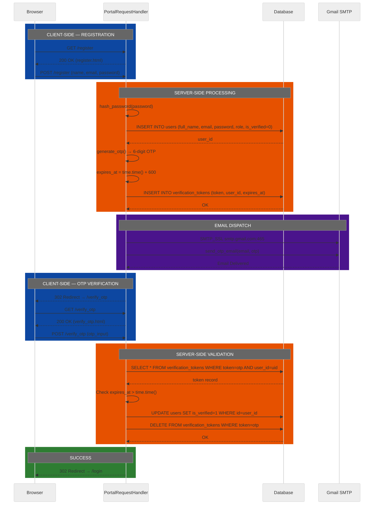

Figure 5.4: Sequence Diagram — User Registration with Email OTP Verification


#### 5.5.4 Sequence Diagram: Multi-Step Career Profiling and Algorithm Execution

The second Sequence Diagram models the multi-step career profiling process, from the student's initial navigation to Step 1 through to the display of career recommendations (Rumbaugh et al., 2004). This diagram introduces the Cookie Store as an additional participant, reflecting the system's use of browser cookies as a lightweight, stateless mechanism for accumulating profile data across the four steps without requiring intermediate database writes. The use of cookies for inter-step data persistence is a deliberate architectural choice that reduces database write operations and eliminates the need for a server-side session store for profiling data, keeping the system's data layer simple and efficient (Pressman & Maxim, 2015).

The sequence begins when the student navigates to `/profile/step1`. The `PortalRequestHandler` first authenticates the student by calling `get_current_user()`, which reads the `session_id` cookie and queries the `sessions` table to retrieve the user record. If the user is authenticated, the handler renders and returns the `profile_step1.html` template. The student completes the grades form and submits it via POST to `/profile/step1`. The handler validates the submitted grades data and, if valid, serialises it as a JSON string and sets a `step1_data` cookie in the response headers, then redirects the browser to `/profile/step2`.

The same pattern repeats for Steps 2 and 3: the student submits skills data (Step 2) and preferences data (Step 3), each of which is serialised and stored in a corresponding cookie (`step2_data`, `step3_data`). When the student reaches Step 4, the handler reads all three cookies from the incoming request headers, deserialises the JSON data from each cookie, and assembles the complete `profile_data` dictionary. The handler renders the `profile_step4.html` review template, injecting the assembled profile data so the student can verify their entries before final submission.

Upon the student's confirmation, the browser sends a POST request to `/profile/submit`. The handler reads all three step cookies, assembles the final `profile_data` dictionary, and passes it to the `run_algorithm()` function. The algorithm processes the profile data and returns a list of up to eight `(match_pct, career_dict)` tuples, sorted in descending order of match percentage. The handler serialises the results as a JSON string and executes an `UPDATE` statement on the `users` table to persist both the `profile_data` and the `last_results` for the current user. Finally, the handler renders the `recommendations.html` template, injecting the top eight career matches, and returns the page to the browser (Odhiambo, 2011).

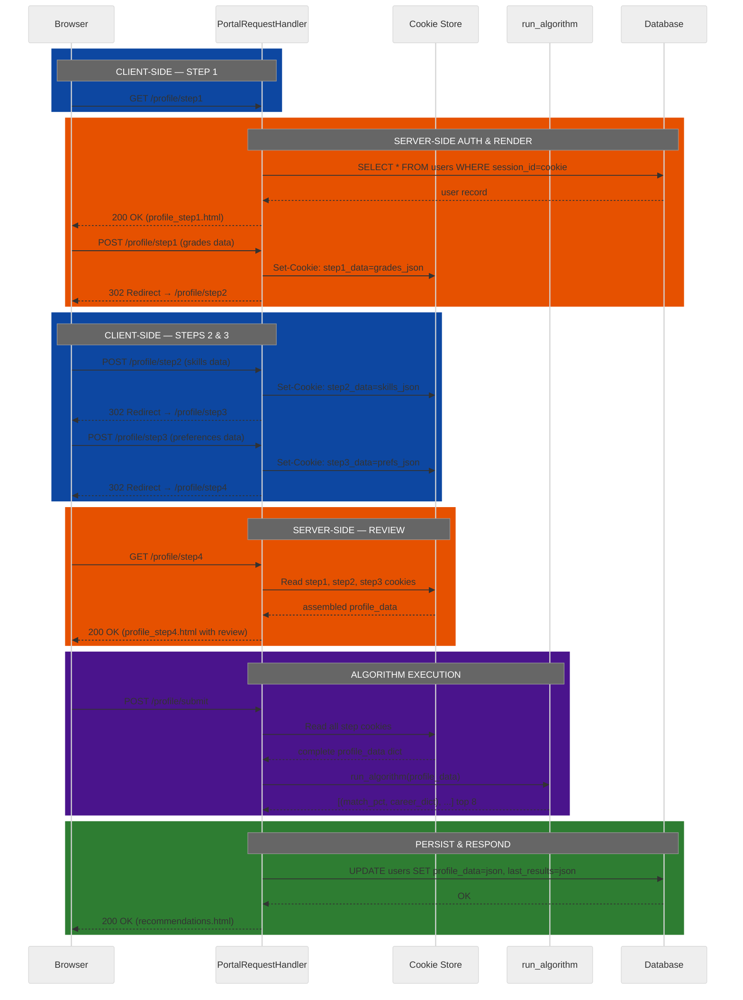

Figure 5.5: Sequence Diagram — Multi-Step Career Profiling and Algorithm Execution


#### 5.5.5 Sequence Diagram: Scholarship Search and Retrieval

The third Sequence Diagram models the scholarship search and retrieval process, which allows students to browse and filter the scholarship repository (Rumbaugh et al., 2004). This is one of the simpler interaction sequences in the system, involving only three participants — the Browser, the `PortalRequestHandler`, and the Database — and two primary interaction scenarios: browsing all scholarships and searching by keyword.

When a student navigates to the `/scholarships` URL without a search query, the `PortalRequestHandler` executes a `SELECT * FROM scholarships` query to retrieve all scholarship records from the database and renders the `scholarships.html` template with the complete list. This provides the student with an overview of all available scholarships before they apply any search filter.

When the student enters a search keyword in the search form and submits it, the browser sends a GET request to `/scholarships?q=keyword`, where `keyword` is the student's search term. The `PortalRequestHandler` extracts the query parameter `q` from the URL using Python's `urllib.parse.parse_qs()` function. It then executes a parameterised SQL query that uses the `LIKE` operator to search for the keyword across three fields: `name`, `description`, and `eligibility_criteria`. The `LIKE` pattern `'%keyword%'` matches any record where the keyword appears anywhere within the field value, providing a broad, inclusive search that maximises the likelihood of returning relevant results. The database returns the matching scholarship records, and the handler renders the `scholarships.html` template with the filtered results (Nafukho & Nchise, 2013).

The use of parameterised queries — where the keyword is passed as a parameter to the SQL query rather than interpolated directly into the query string — is an essential security measure that prevents SQL injection attacks, which are among the most common and damaging web application vulnerabilities (Stallings, 2017).

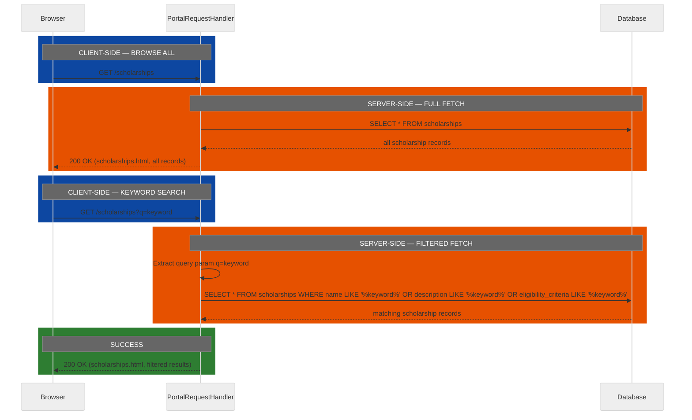

Figure 5.6: Sequence Diagram — Scholarship Search and Retrieval


#### 5.5.6 Sequence Diagram: Admin Scholarship Management

The fourth Sequence Diagram models the admin scholarship management process, which allows administrators to add new scholarship records and delete existing ones through the admin dashboard (Rumbaugh et al., 2004). This sequence introduces the `AdminBrowser` as a distinct participant to emphasise that the admin dashboard is accessible only to authenticated users with the `role = 'admin'` attribute, and that every admin operation includes a role verification step to prevent privilege escalation by non-admin users (Stallings, 2017).

The sequence begins when the administrator navigates to the `/admin` URL. The `PortalRequestHandler` authenticates the user by reading the `session_id` cookie and querying the `sessions` table, then verifies that the retrieved user record has `role = 'admin'`. If the role check passes, the handler queries the `scholarships` table to retrieve all existing scholarship records and renders the `admin.html` template with the scholarship list and management controls.

To add a new scholarship, the administrator completes the add scholarship form — providing the scholarship name, provider, description, eligibility criteria, deadline, and application link — and submits it via POST to `/admin/add_scholarship`. The handler again verifies the user's admin role before executing an `INSERT INTO scholarships` statement with the submitted data. Upon successful insertion, the handler redirects the browser to `/admin?msg=added`, which re-renders the admin dashboard with a success confirmation message.

To delete an existing scholarship, the administrator clicks the delete button for the target scholarship, which submits a POST request to `/admin/delete_scholarship` with the `scholarship_id` of the record to be deleted. The handler verifies the admin role and executes a `DELETE FROM scholarships WHERE id = scholarship_id` statement. Upon successful deletion, the handler redirects to `/admin?msg=deleted` (Pressman & Maxim, 2015).

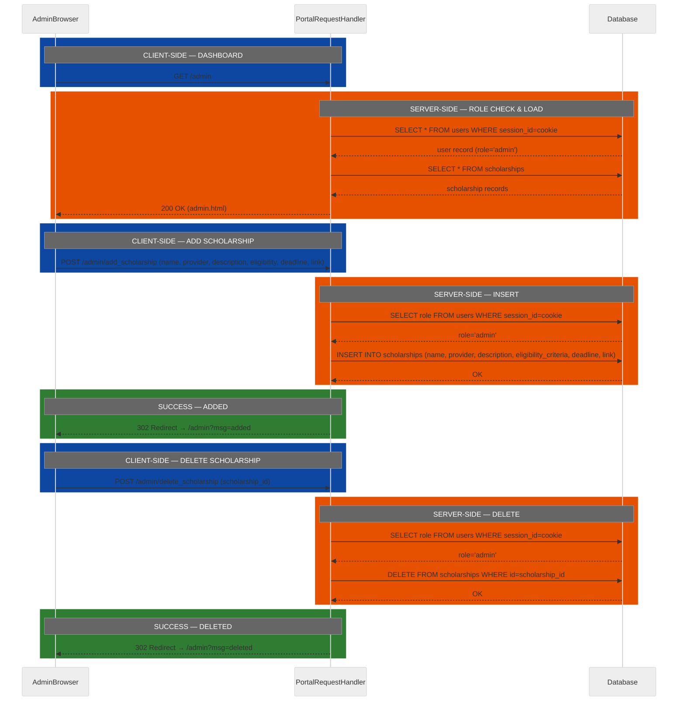

Figure 5.7: Sequence Diagram — Admin Scholarship Management


#### 5.5.7 Class Diagram

The Class Diagram provides a static structural view of the portal's Python backend, showing the classes, their attributes and methods, and the relationships between them (Rumbaugh et al., 2004). In the proposed portal, the backend is structured around a single primary class — `handler` — which inherits from Python's built-in `BaseHTTPRequestHandler` class, and a set of module-level functions that provide supporting services.

The `BaseHTTPRequestHandler` class, provided by Python's `http.server` standard library module, defines the foundational interface for handling HTTP requests. It provides the `send_response()`, `send_header()`, and `end_headers()` methods for constructing HTTP responses, as well as the `wfile` and `rfile` file-like objects for writing response bodies and reading request bodies, respectively. It also provides the `path` attribute (the requested URL path) and the `headers` attribute (the request headers dictionary). The `handler` class extends `BaseHTTPRequestHandler` and overrides or adds the following methods: `get_current_user()`, which authenticates the current request by reading the session cookie and querying the database; `render_template()`, which reads an HTML template file and performs string substitution to produce a rendered HTML string; `send_redirect()`, which sends an HTTP 302 redirect response; `send_html()`, which sends an HTTP response with an HTML body and a specified status code; `serve_static()`, which serves static files (CSS, images) from the `static/` directory; `do_GET()`, which handles all incoming HTTP GET requests by routing them to the appropriate handler logic; and `do_POST()`, which handles all incoming HTTP POST requests (Lutz, 2013).

The module-level functions — grouped in the diagram as `ModuleFunctions` — provide services that are called by the `handler` class but are not methods of the class itself. These include `init_db()`, which creates the four database tables if they do not exist; `get_db_connection()`, which returns a database connection to either SQLite or PostgreSQL depending on the `DATABASE_URL` environment variable; `hash_password()`, which hashes a plaintext password using SHA-256; `send_otp_email()`, which sends an OTP email via Gmail SMTP; `generate_otp()`, which generates a 6-digit random OTP string; and `run_algorithm()`, which executes the career matching algorithm on a `profile_data` dictionary and returns the top eight career matches (Pressman & Maxim, 2015).

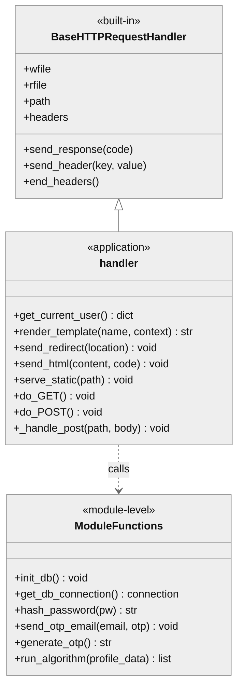

Figure 5.8: Class Diagram of the Portal's Python Backend


#### 5.5.8 Context Diagram: Proposed System

The Context Diagram for the proposed system provides a top-level view of the portal as a single process, showing all external entities that interact with it and the data flows between those entities and the system (DeMarco, 1979). The Context Diagram is the highest level of abstraction in the Data Flow Diagram hierarchy and is used to establish the system boundary — clearly delineating what is inside the system (the portal's processing logic) and what is outside (the actors, external services, and platforms that the portal interacts with).

The proposed portal interacts with six external entities. The Student (Form Four Leaver) sends registration data, profile data, and search queries to the portal, and receives career recommendations, scholarship search results, and account management confirmations in return. The Career Counselor sends login credentials and student monitoring requests to the portal, and receives student profile data and guidance session data in return. The System Admin sends scholarship CRUD operations and user management commands to the portal, and receives admin dashboard data in return. The Gmail SMTP server (`smtp.gmail.com:465`) receives OTP email requests from the portal and returns email delivery confirmations. The Neon PostgreSQL production database receives SQL queries from the portal and returns query results. The Vercel Platform provides hosting, HTTPS termination, and CDN services to the portal, routing all incoming HTTP requests to the `api/index.py` serverless function (Vercel, 2023).

The Context Diagram makes explicit the portal's dependency on three external services — Gmail SMTP, Neon PostgreSQL, and Vercel — each of which must be available for the portal to function correctly in the production environment. This dependency analysis is essential for the system's availability and disaster recovery planning, as the failure of any one of these external services would impair the portal's functionality (Sommerville, 2016).

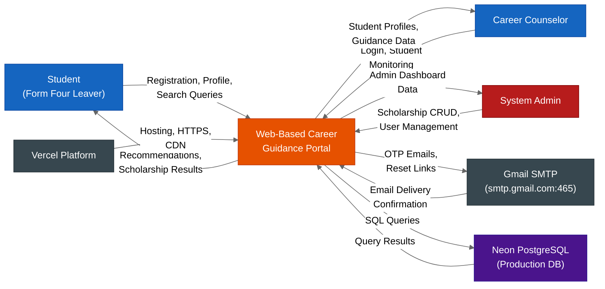

Figure 5.9: Context Diagram of the Proposed Web-Based Career Guidance Portal


#### 5.5.9 Level-0 Data Flow Diagram: Proposed System

The Level-0 Data Flow Diagram (DFD) decomposes the single process shown in the Context Diagram into the portal's six primary functional processes, showing the data flows between those processes, the external actors, and the four data stores (DeMarco, 1979). The Level-0 DFD provides a more detailed view of the system's internal structure than the Context Diagram, while still abstracting away the implementation details of individual route handlers and database queries.

The six primary processes are: P1 (Authentication and Session Management), which handles user login, logout, and session token management; P2 (Email OTP Verification), which handles the generation, storage, and validation of OTP tokens for email verification and password reset; P3 (Multi-Step Career Profiling), which handles the collection and accumulation of student profile data across the four profiling steps; P4 (Career Recommendation Engine), which executes the `run_algorithm()` function on the assembled profile data and stores the results; P5 (Scholarship Repository Search), which handles the retrieval and keyword-based filtering of scholarship records; and P6 (Admin Dashboard Management), which handles the CRUD operations on the scholarship repository performed by administrators.

The four data stores are: D1 (sessions table), which stores active session tokens and their associated user IDs; D2 (verification_tokens table), which stores OTP tokens and their expiry timestamps; D3 (users table), which stores user account data including profile data and last algorithm results; and D4 (scholarships table), which stores scholarship records. The data flows between processes and data stores reflect the actual SQL operations performed by the portal's route handlers, as documented in the `init_db()` function and the route handler logic in `api/index.py` (Lutz, 2013).

The Level-0 DFD reveals the central role of the `users` table (D3) in the system's data architecture: it is both written to by P1 (session creation), P3 (profile data storage), and P4 (results storage), and read from by P1 (authentication), P3 (profile retrieval), and the Counselor actor (student monitoring). This centrality reflects the design decision to store all user-related data — account information, profile data, and recommendation results — in a single table, simplifying the data model and reducing the number of JOIN operations required by the application (Pressman & Maxim, 2015).

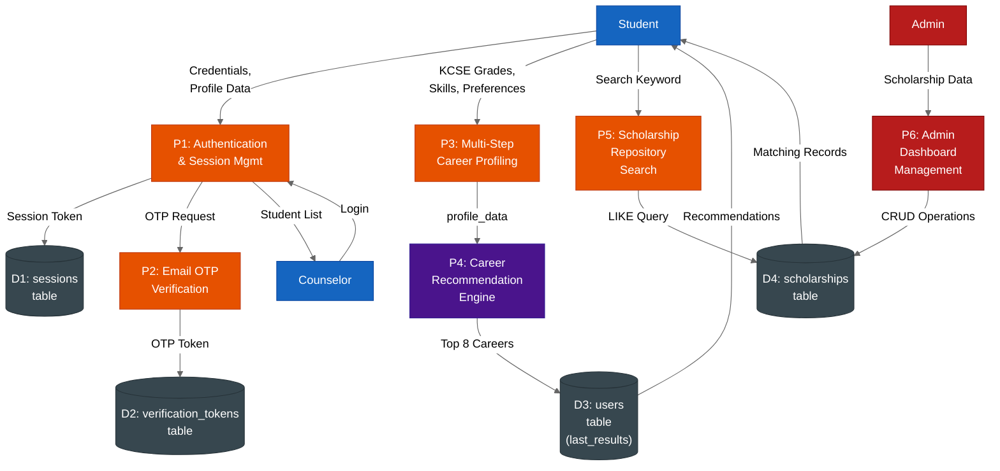

Figure 5.10: Level-0 Data Flow Diagram of the Proposed Career Guidance Portal


#### 5.5.10 Collaboration Diagram: Scholarship Matching Process

The Collaboration Diagram (also known as a Communication Diagram in UML 2.x) for the scholarship matching process illustrates the structural relationships between the objects that collaborate to fulfil the scholarship search use case, with numbered messages indicating the sequence of interactions (Rumbaugh et al., 2004). Unlike Sequence Diagrams, which emphasise temporal ordering on a vertical timeline, Collaboration Diagrams emphasise the network of object relationships and are particularly useful for understanding which objects communicate with which other objects during a given process.

The scholarship matching process involves four collaborating objects: the **Browser Object** (the student's web browser), the **PortalRequestHandler Object** (an instance of the `handler` class processing the current request), the **DatabaseConnection Object** (a connection object returned by `get_db_connection()`), and the **ScholarshipResultSet Object** (the list of scholarship records returned by the database query).

The numbered message sequence is as follows:

**Message 1: Browser Object → PortalRequestHandler Object**
`1: HTTP GET /scholarships?q={keyword}`
The Browser Object initiates the interaction by sending an HTTP GET request to the `/scholarships` route with an optional query parameter `q` containing the student's search keyword. This message triggers the instantiation of the PortalRequestHandler Object by the Vercel serverless runtime.

**Message 2: PortalRequestHandler Object → PortalRequestHandler Object (self-call)**
`2: parse_query_string(self.path) → keyword`
The PortalRequestHandler Object calls Python's `urllib.parse.parse_qs()` on its own `path` attribute to extract the value of the `q` query parameter. This is a self-directed message representing an internal computation step.

**Message 3: PortalRequestHandler Object → DatabaseConnection Object**
`3: get_db_connection() → conn`
The PortalRequestHandler Object calls the module-level `get_db_connection()` function to obtain a database connection. The function inspects the `DATABASE_URL` environment variable and returns either a `sqlite3.Connection` (development) or a `pg8000.Connection` (production).

**Message 4: PortalRequestHandler Object → DatabaseConnection Object**
`4: conn.execute(SELECT * FROM scholarships WHERE name LIKE ? OR description LIKE ? OR eligibility_criteria LIKE ?, [pattern, pattern, pattern])`
The PortalRequestHandler Object sends a parameterised SQL query to the DatabaseConnection Object. The `LIKE` pattern `'%{keyword}%'` is constructed from the extracted keyword and passed as a parameter to prevent SQL injection. If no keyword was provided, the query is `SELECT * FROM scholarships` without a `WHERE` clause.

**Message 5: DatabaseConnection Object → ScholarshipResultSet Object**
`5: cursor.fetchall() → rows`
The DatabaseConnection Object executes the query against the underlying database engine (SQLite or PostgreSQL) and returns the matching rows as a list of tuples, which is assigned to the ScholarshipResultSet Object.

**Message 6: PortalRequestHandler Object → ScholarshipResultSet Object**
`6: render_template('scholarships.html', {'scholarships': rows})`
The PortalRequestHandler Object reads the ScholarshipResultSet Object (the list of matching rows) and passes it to the `render_template()` method, which injects the scholarship data into the `scholarships.html` template.

**Message 7: PortalRequestHandler Object → Browser Object**
`7: HTTP 200 OK (scholarships.html with filtered results)`
The PortalRequestHandler Object sends the rendered HTML page back to the Browser Object as an HTTP 200 response, completing the collaboration (Nafukho & Nchise, 2013).

The Collaboration Diagram reveals that the PortalRequestHandler Object is the central coordinator of the scholarship matching process, orchestrating interactions with the DatabaseConnection Object and the ScholarshipResultSet Object before returning the final response to the Browser Object. This hub-and-spoke collaboration pattern is characteristic of the Model-View-Controller (MVC) architectural style, where the controller (PortalRequestHandler) mediates between the model (DatabaseConnection, ScholarshipResultSet) and the view (rendered HTML template) (Pressman & Maxim, 2015).


#### 5.5.11 Pseudocode for run_algorithm()

The `run_algorithm()` function is the algorithmic core of the proposed portal, implementing the weighted multi-criteria scoring model that generates personalised career recommendations from a student's profile data. The complete pseudocode for this function was first presented in Chapter 3 (Section 3.5, Methodology for System Design) as part of the methodology for the career recommendation algorithm. It is reproduced here in full for completeness within the system design chapter, as it constitutes an essential component of the proposed system's process logic design and provides the definitive specification against which the Python implementation in `api/index.py` must be verified (Pressman & Maxim, 2015).

```
FUNCTION run_algorithm(profile_data):

    // -------------------------------------------------------
    // STEP 1: Extract and map KCSE grades to numeric values
    // -------------------------------------------------------
    DEFINE GRADE_MAP = {
        'A': 12, 'A-': 11,
        'B+': 10, 'B': 9, 'B-': 8,
        'C+': 7, 'C': 6, 'C-': 5,
        'D+': 4, 'D': 3, 'D-': 2,
        'E': 1, '': 0
    }

    grade_keys = ['math_grade', 'english_grade', 'kiswahili_grade',
                  'biology_grade', 'chemistry_grade', 'physics_grade',
                  'humanities_grade']

    mapped_grades = {}
    FOR EACH key IN grade_keys:
        raw_value = profile_data.get(key, '')
        mapped_grades[key] = GRADE_MAP.get(raw_value, 0)
    END FOR

    mean_grade = SUM(mapped_grades.values()) / 7

    // -------------------------------------------------------
    // STEP 2: Determine study level threshold
    // -------------------------------------------------------
    IF mean_grade >= 7.0 THEN
        study_level = 'University/Graduate'
    ELSE IF mean_grade >= 5.0 THEN
        study_level = 'Diploma/TVET'
    ELSE IF mean_grade >= 3.0 THEN
        study_level = 'Certificate'
    ELSE
        study_level = 'Artisan'
    END IF

    // -------------------------------------------------------
    // STEP 3: Extract skill ratings and preferences
    // -------------------------------------------------------
    trait_keys = ['problem_solving', 'rating_analytical', 'rating_coding',
                  'rating_verbal', 'rating_critical', 'rating_creative',
                  'rating_leadership']

    user_traits = {}
    FOR EACH key IN trait_keys:
        user_traits[key] = INTEGER(profile_data.get(key, 0))
    END FOR

    industry_interests = profile_data.get('industry_interests', '').SPLIT(',')
    education_goal     = profile_data.get('education_goal', '')

    // -------------------------------------------------------
    // STEP 4: Score each career in the CAREERS database
    // -------------------------------------------------------
    scored_careers = []

    FOR EACH career IN CAREERS:

        // Filter by education goal if specified
        IF education_goal != '' AND career['level'] != education_goal THEN
            CONTINUE
        END IF

        // Filter by minimum grade requirement
        IF mean_grade < career['min_grade'] THEN
            CONTINUE
        END IF

        // Compute subject score
        subject_score = 0
        FOR EACH subject IN career['subjects']:
            subject_score = subject_score + (mapped_grades.get(subject + '_grade', 0) * 2)
        END FOR

        // Compute trait score
        trait_score = 0
        FOR EACH trait IN user_traits:
            IF user_traits[trait] >= 3 THEN
                trait_score = trait_score + career['traits'].get(trait, 0)
            END IF
        END FOR

        // Compute industry score
        industry_score = 0
        FOR EACH interest IN industry_interests:
            IF interest.STRIP() IN career['industries'] THEN
                industry_score = industry_score + 8
            END IF
        END FOR

        total_score = subject_score + trait_score + industry_score
        APPEND (total_score, career) TO scored_careers

    END FOR

    // -------------------------------------------------------
    // STEP 5: Sort, select top 8, and normalise scores
    // -------------------------------------------------------
    SORT scored_careers BY total_score DESCENDING

    top_8 = scored_careers[0:8]

    IF top_8 IS EMPTY THEN
        RETURN []
    END IF

    max_score = top_8[0][0]   // Highest raw score

    results = []
    FOR EACH (score, career) IN top_8:
        IF max_score > 0 THEN
            match_pct = ROUND((score / max_score) * 100)
        ELSE
            match_pct = 0
        END IF
        APPEND (match_pct, career) TO results
    END FOR

    RETURN results

END FUNCTION
```

The pseudocode above specifies the five-stage processing pipeline of the `run_algorithm()` function: (1) grade mapping, which converts KCSE grade strings to numeric values using the `GRADE_MAP` lookup table; (2) study level determination, which classifies the student's academic profile into one of four education tiers based on their mean grade; (3) trait and preference extraction, which reads the student's skill ratings and industry interests from the profile data; (4) career scoring, which iterates over the `CAREERS` database and computes a weighted composite score for each career based on subject alignment, trait alignment, and industry interest alignment; and (5) normalisation, which converts the raw composite scores to percentage match values relative to the highest-scoring career in the top eight results (Odhiambo, 2011). The normalisation step ensures that the top-ranked career always displays a 100% match, providing an intuitive and motivating presentation of the results to the student.


### 5.6 Database Design

The database design of the proposed portal translates the logical data requirements identified during system analysis into a concrete, implementable schema that governs how data is stored, retrieved, and maintained throughout the system's lifecycle. A well-structured database design is foundational to system correctness, performance, and maintainability; as Connolly and Begg (2015) observe, the quality of a database schema directly determines the integrity of the information system built upon it. The portal's database comprises four entities — `users`, `sessions`, `verification_tokens`, and `scholarships` — each of which encapsulates a distinct domain of concern within the application. The design process followed the standard three-phase approach: conceptual design (entity-relationship modelling), logical design (normalisation to third normal form), and physical design (data dictionary specification with type and constraint annotations). The resulting schema is implemented in SQLite for local development and PostgreSQL via the Neon serverless platform for production deployment, with the `init_db()` function in `api/index.py` serving as the authoritative source of truth for the schema definition (Date, 2004).

#### 5.6.1 Entity-Relationship Diagram

The Entity-Relationship (ER) diagram provides a high-level, technology-neutral representation of the data entities in the system and the associations between them. Originally formalised by Chen (1976), the ER modelling technique uses entities (objects of interest), attributes (properties of entities), and relationships (associations between entities) to capture the semantic structure of a domain in a form that is both human-readable and directly translatable into a relational schema. The portal's ER model identifies four entities and two binary relationships, as described below.

The `users` entity is the central entity of the schema and represents every registered account in the system, regardless of role. It carries twelve attributes: a surrogate primary key (`id`), identity attributes (`full_name`, `email`, `password`), a role discriminator (`role`), contextual profile attributes (`school`, `phone`, `study_areas`), a verification flag (`is_verified`), a registration timestamp (`created_at`), and two JSON blob attributes (`profile_data`, `last_results`) that store the assembled profiling data and the most recent algorithm output respectively. The `email` attribute carries a UNIQUE constraint, enforcing the business rule that each email address may be associated with at most one account (Connolly & Begg, 2015).

The `sessions` entity represents active authenticated sessions. Each session is identified by a UUID v4 token (`session_id`) that is issued to the browser as an HttpOnly cookie upon successful login. The session record stores the owning user's identifier (`user_id`) and the Unix timestamp of session creation (`created_at`). The relationship between `users` and `sessions` is one-to-many: a single user may hold multiple concurrent sessions (for example, on different devices), but each session belongs to exactly one user (Date, 2004).

The `verification_tokens` entity stores short-lived tokens used for two distinct authentication workflows: email verification during registration (a six-digit OTP) and password reset (a UUID token). Each token record carries the token value itself (`token`), the owning user's identifier (`user_id`), and an expiry timestamp (`expires_at`). The OTP is generated by the `generate_otp()` function and expires 600 seconds (ten minutes) after generation, as encoded in the expression `int(time.time()) + 600` in `api/index.py`. The relationship between `users` and `verification_tokens` is one-to-many: a user may have multiple tokens in the table at any given time (for example, if they request a new OTP before the previous one expires), but each token belongs to exactly one user (Chen, 1976).

The `scholarships` entity is independent of the user-centric entities and represents the scholarship opportunities managed by the portal's administrator. It carries seven attributes: a surrogate primary key (`id`), descriptive attributes (`name`, `provider`, `description`), a structured eligibility summary (`eligibility_criteria`), a human-readable deadline string (`deadline`), and an external application URL (`link`). The `scholarships` entity has no direct relationship with the `users` entity in the current schema; students interact with scholarship data through the read-only search interface, and no personalised scholarship tracking is implemented in the current version of the system (Connolly & Begg, 2015).

The complete ER diagram, rendered using Mermaid's `erDiagram` syntax, is presented in Figure 5.11 below.

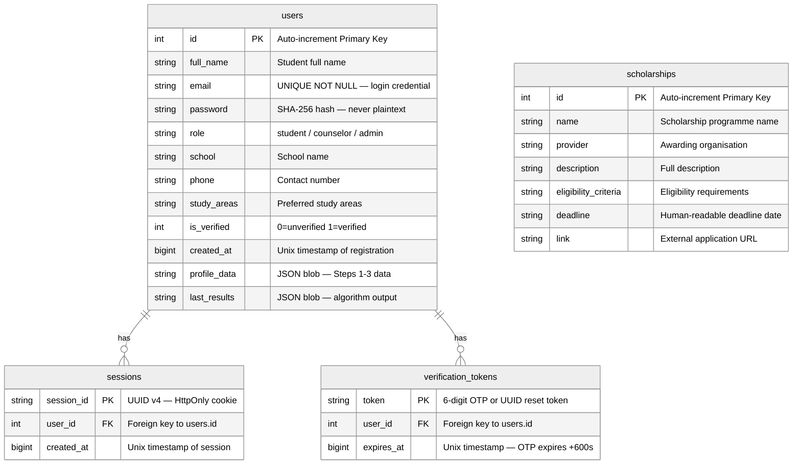

Figure 5.11: Entity-Relationship Diagram of the Portal's Database

The crow's-foot notation used in Figure 5.11 conveys the cardinality of each relationship precisely. The `||--o{` symbol denotes a one-to-many relationship with optional participation on the many side: a user must exist (mandatory participation on the `users` side) before a session or verification token can be created, but a user is not required to have any sessions or tokens at any given time (optional participation on the `sessions` and `verification_tokens` sides). The `scholarships` entity appears as an isolated entity in the diagram, reflecting its administrative nature and the absence of a direct foreign-key relationship to the `users` table in the current implementation (Chen, 1976).

#### 5.6.2 Normalisation Discussion

Database normalisation is the process of organising a relational schema to reduce data redundancy and improve data integrity by applying a series of formal rules known as normal forms. The theory of normalisation was first formalised by Codd (1970) in his seminal paper "A Relational Model of Data for Large Shared Data Banks," which introduced the concept of functional dependency as the mathematical foundation for eliminating anomalies in relational schemas. Subsequent work by Date (2004) extended and clarified the normal form hierarchy, providing the theoretical framework that underpins modern relational database design practice. The portal's schema has been designed to satisfy the requirements of the first three normal forms, with one deliberate and justified exception discussed below.

**First Normal Form (1NF)**

A relation is in First Normal Form if and only if every attribute in every tuple contains a single, atomic value drawn from the attribute's domain, and there are no repeating groups or multi-valued attributes within any single tuple (Codd, 1970). Atomicity requires that each cell in the table holds exactly one indivisible value; repeating groups — sets of attributes that store multiple values of the same kind — violate 1NF because they embed a hidden one-to-many relationship within a single row.

The portal's schema satisfies 1NF for the majority of its attributes. In the `users` table, attributes such as `email`, `role`, `school`, `phone`, and `is_verified` each hold a single atomic value. In the `sessions` table, `session_id`, `user_id`, and `created_at` are all atomic. In the `verification_tokens` table, `token`, `user_id`, and `expires_at` are atomic. In the `scholarships` table, all seven attributes hold single atomic values (Date, 2004).

There are, however, two attributes in the `users` table — `profile_data` and `last_results` — that store JSON-encoded blobs rather than atomic scalar values. Strictly speaking, these attributes violate the atomicity requirement of 1NF, because each JSON blob encodes a structured object containing multiple named fields (for example, `profile_data` contains the student's seven subject grades, seven skill ratings, and multiple preference selections assembled across the four profiling steps). This design decision is a deliberate pragmatic trade-off rather than an oversight (Connolly & Begg, 2015).

The justification for this exception is threefold. First, the profiling data is consumed exclusively as a unit: the `run_algorithm()` function reads the entire `profile_data` blob in a single operation and never queries individual sub-fields via SQL predicates. There is therefore no query-time benefit to decomposing the blob into separate columns or a separate normalised table. Second, the schema of the profiling data is subject to change as the algorithm evolves; storing it as a JSON blob provides schema flexibility without requiring a database migration for each change. Third, the `last_results` blob stores the output of the recommendation algorithm — a ranked list of career objects — which is inherently a complex, nested data structure that would require multiple additional tables (careers, career_scores, career_subjects, career_traits) to represent in fully normalised form, adding significant complexity for no operational benefit in the current system scope (Date, 2004). This pattern of using JSON blobs for semi-structured, application-managed data within an otherwise relational schema is a well-established practice in modern web application development and is explicitly supported by both SQLite (via the TEXT affinity) and PostgreSQL (via the native JSONB type) (Connolly & Begg, 2015).

**Second Normal Form (2NF)**

A relation is in Second Normal Form if it is already in 1NF and every non-key attribute is fully functionally dependent on the entire primary key — that is, no non-key attribute is dependent on only a proper subset of the primary key (Codd, 1970). Partial dependencies can only arise in relations with composite primary keys; in relations with a single-column primary key, 2NF is automatically satisfied whenever 1NF is satisfied.

All four tables in the portal's schema use single-column primary keys: `users.id` (integer surrogate key), `sessions.session_id` (UUID text key), `verification_tokens.token` (text key), and `scholarships.id` (integer surrogate key). Because no table has a composite primary key, there is no possibility of a partial dependency, and all four tables are trivially in Second Normal Form (Date, 2004). For example, in the `sessions` table, both `user_id` and `created_at` are fully functionally dependent on `session_id` alone — there is no subset of the primary key on which they could be partially dependent. Similarly, in the `scholarships` table, all six non-key attributes (`name`, `provider`, `description`, `eligibility_criteria`, `deadline`, `link`) are fully functionally dependent on `id` (Connolly & Begg, 2015).

**Third Normal Form (3NF)**

A relation is in Third Normal Form if it is already in 2NF and no non-key attribute is transitively dependent on the primary key through another non-key attribute (Codd, 1970). A transitive dependency exists when a non-key attribute A determines another non-key attribute B, creating an indirect dependency of B on the primary key via A. Transitive dependencies introduce update anomalies: if the value of A changes, all rows containing the dependent value of B must also be updated, and failure to do so results in inconsistency.

The portal's schema is free of transitive dependencies. In the `users` table, there is no non-key attribute that functionally determines another non-key attribute. For example, `school` does not determine `study_areas`, `role` does not determine `phone`, and `email` does not determine `full_name` in any general sense — these are all independent facts about the user entity. In the `sessions` table, `user_id` and `created_at` are independent of each other; knowing the user does not determine the session creation time. In the `verification_tokens` table, `user_id` and `expires_at` are similarly independent. In the `scholarships` table, `provider` does not determine `deadline` or `link`, and `name` does not determine `eligibility_criteria` — each attribute describes an independent facet of the scholarship entity (Date, 2004). The schema therefore satisfies 3NF across all four tables, ensuring that updates to any single attribute do not propagate anomalies to other attributes within the same row (Connolly & Begg, 2015).

In summary, the portal's database schema satisfies 1NF, 2NF, and 3NF for all scalar attributes, with a deliberate and justified exception for the `profile_data` and `last_results` JSON blob columns in the `users` table. This design achieves a practical balance between theoretical rigour and operational pragmatism, ensuring data integrity for all structured data while preserving the flexibility required for the semi-structured profiling and results data managed by the application layer (Codd, 1970; Date, 2004).

#### 5.6.3 Data Dictionary

A data dictionary is a structured reference document that provides a precise, authoritative description of every field in the database schema, including its name, data type, constraints, and semantic meaning. Data dictionaries are an essential component of system documentation because they serve as the single source of truth for developers, database administrators, and future maintainers of the system (Connolly & Begg, 2015). The following four tables constitute the complete data dictionary for the portal's database, derived directly from the `init_db()` function in `api/index.py`.

Table 5.1: Data Dictionary — users table

| Field | Type | Constraints | Description |
|---|---|---|---|
| id | INTEGER (SQLite) / SERIAL (PostgreSQL) | PRIMARY KEY, AUTOINCREMENT | Unique user identifier, auto-assigned on INSERT |
| full_name | TEXT | NULL allowed | Student's or counselor's full legal name |
| email | TEXT | UNIQUE, NOT NULL | Login email address; used for OTP delivery |
| password | TEXT | NOT NULL | SHA-256 hexadecimal hash of the user's password |
| role | TEXT | DEFAULT 'student' | User role: 'student', 'counselor', or 'admin' |
| school | TEXT | NULL allowed | Name of the student's secondary school |
| phone | TEXT | NULL allowed | Contact phone number |
| study_areas | TEXT | NULL allowed | Preferred study areas (free text) |
| is_verified | INTEGER | DEFAULT 0 | Email verification flag: 0 = unverified, 1 = verified |
| created_at | INTEGER (SQLite) / BIGINT (PostgreSQL) | DEFAULT 0 | Unix timestamp of account registration |
| profile_data | TEXT | NULL allowed | JSON blob storing assembled profile data from Steps 1–3 |
| last_results | TEXT | NULL allowed | JSON blob storing the most recent run_algorithm() output |

The `users` table is the most structurally complex table in the schema, reflecting the central role of the user entity in the system's domain model. The `id` field uses SQLite's `INTEGER PRIMARY KEY AUTOINCREMENT` syntax in the development environment and PostgreSQL's `SERIAL PRIMARY KEY` in production, both of which generate a monotonically increasing integer identifier for each new row. The `email` field carries both a `UNIQUE` constraint and a `NOT NULL` constraint, enforcing the business rule that every account must have a valid, unique email address, which also serves as the primary credential for login and OTP delivery. The `password` field stores the SHA-256 hexadecimal digest of the user's plaintext password, computed by the `hash_password()` function using Python's `hashlib.sha256(pw.encode()).hexdigest()` expression; the plaintext password is never stored or logged (Connolly & Begg, 2015). The `role` field defaults to `'student'` but may be set to `'counselor'` or `'admin'` to grant elevated privileges. The `is_verified` field uses an integer flag (0 or 1) rather than a boolean type because SQLite does not have a native boolean type; the value is set to 1 by the OTP verification handler upon successful token validation. The `profile_data` and `last_results` fields store JSON-encoded strings and are set to NULL until the user completes the profiling workflow and submits their profile for the first time (Date, 2004).

Table 5.2: Data Dictionary — sessions table

| Field | Type | Constraints | Description |
|---|---|---|---|
| session_id | TEXT | PRIMARY KEY | UUID v4 session token, set as HttpOnly browser cookie |
| user_id | INTEGER | Foreign key → users.id | ID of the user who owns this session |
| created_at | INTEGER (SQLite) / BIGINT (PostgreSQL) | — | Unix timestamp of session creation |

The `sessions` table implements the server-side session management mechanism of the portal. Upon successful login, the `do_POST()` handler generates a UUID v4 token using Python's `uuid.uuid4()` function, inserts a new row into the `sessions` table with the token and the authenticated user's `id`, and sets the token as an HttpOnly cookie in the HTTP response header. On subsequent requests, the `get_current_user()` method reads the cookie value, queries the `sessions` table for a matching `session_id`, and returns the associated `user_id` if found. The absence of an expiry column in the `sessions` table means that sessions are currently persistent until explicitly deleted (for example, on logout); a future enhancement could add a `expires_at` column to implement session timeout (Connolly & Begg, 2015). The `user_id` column references `users.id` via a foreign key relationship, ensuring referential integrity between the session and the owning user account (Date, 2004).

Table 5.3: Data Dictionary — verification_tokens table

| Field | Type | Constraints | Description |
|---|---|---|---|
| token | TEXT | PRIMARY KEY | 6-digit OTP (registration/verification) or UUID (password reset) |
| user_id | INTEGER | Foreign key → users.id | ID of the user this token belongs to |
| expires_at | INTEGER (SQLite) / BIGINT (PostgreSQL) | — | Unix timestamp; OTP expires 600 seconds (10 min) after generation |

The `verification_tokens` table serves a dual purpose in the authentication workflow. During email verification at registration, the `generate_otp()` function produces a six-digit numeric string (for example, `"483921"`), which is inserted into this table with an `expires_at` value of `int(time.time()) + 600`, giving the user a ten-minute window to enter the OTP on the verification page. During the password reset workflow, a UUID token is generated instead of a numeric OTP, providing a longer, harder-to-guess token suitable for inclusion in a reset link. In both cases, the verification handler checks the `expires_at` value against the current Unix timestamp before accepting the token; expired tokens are rejected and the user is prompted to request a new one. The `token` field serves as the primary key, ensuring that each token value is unique across all rows in the table (Connolly & Begg, 2015). The `user_id` column references `users.id`, linking each token to the account for which it was generated (Date, 2004).

Table 5.4: Data Dictionary — scholarships table

| Field | Type | Constraints | Description |
|---|---|---|---|
| id | INTEGER (SQLite) / SERIAL (PostgreSQL) | PRIMARY KEY, AUTOINCREMENT | Unique scholarship identifier |
| name | TEXT | — | Full name of the scholarship programme |
| provider | TEXT | — | Name of the awarding organisation |
| description | TEXT | — | Full description of the scholarship |
| eligibility_criteria | TEXT | — | Eligibility requirements (academic, financial, geographic) |
| deadline | TEXT | — | Application deadline as a human-readable string |
| link | TEXT | — | URL of the external scholarship application page |
| category | TEXT | DEFAULT 'General' | Funding category: Government, Private, or International |
| amount | TEXT | DEFAULT '' | Funding amount or range (e.g., "Up to KES 60,000/year") |

The `scholarships` table stores the curated repository of scholarship opportunities that the portal presents to students. Unlike the user-centric tables, the `scholarships` table has no foreign key relationships to other tables; it is a standalone reference table managed exclusively through the administrator interface. The `id` field uses the same auto-incrementing integer primary key pattern as the `users` table. The `name` and `provider` fields identify the scholarship and its awarding organisation respectively. The `description` field stores a full narrative description of the scholarship, which is displayed on the scholarships page. The `eligibility_criteria` field stores a structured summary of the academic, financial, and geographic requirements that applicants must meet. The `deadline` field stores the application deadline as a human-readable string (for example, `"31 March 2026"`) rather than a Unix timestamp, because scholarship deadlines are typically communicated in calendar date format and do not require date arithmetic in the current implementation. The `link` field stores the URL of the external scholarship application page, which is rendered as an "Apply Now" hyperlink on the scholarships page (Connolly & Begg, 2015). The `category` field classifies each scholarship record under exactly one of three permitted values — `'Government'`, `'Private'`, or `'International'` — defaulting to `'General'` for records entered without an explicit category. This field enables the category-based filter on the scholarships page, allowing students to narrow the displayed list to a specific funding type. The `amount` field stores a human-readable description of the funding quantum (for example, `"Up to KES 60,000/year"` or `"Full tuition + living stipend"`), defaulting to an empty string for records where the funding amount is not yet known. Both `category` and `amount` were added to the schema via `ALTER TABLE` migration in the `init_db()` function, ensuring backward compatibility with existing scholarship records (Connolly & Begg, 2015). All fields in the `scholarships` table are nullable (no NOT NULL constraints beyond the primary key), reflecting the reality that scholarship data may be partially known at the time of entry and can be updated by the administrator as more information becomes available (Date, 2004).


### 5.7 Input/Output Design of the Proposed System

Input/Output (I/O) design is the discipline of specifying the screens, forms, and reports through which users interact with a system — defining what data is collected from users (inputs) and what information is presented back to them (outputs). Effective I/O design is critical to user adoption because it determines the usability, clarity, and accessibility of the system from the end-user's perspective (Shneiderman et al., 2016). The portal's I/O design is guided by three overarching principles derived from the Technology Acceptance Model (Davis, 1989): perceived usefulness (every screen must deliver clear value to the user), perceived ease of use (every interaction must be intuitive and require minimal cognitive effort), and mobile-first responsiveness (every layout must function correctly on a smartphone screen before being enhanced for larger displays). The following sub-sections describe the four key screens of the portal, each accompanied by a mock-up description and a figure caption.

#### 5.7.1 Landing Page

The landing page is the first screen that an unauthenticated visitor encounters when they navigate to the portal's URL. Its primary purpose is to communicate the portal's value proposition and to provide clear entry points for both new and returning users. According to Nielsen (2000), a landing page has approximately eight seconds to capture a visitor's attention before they navigate away; the design must therefore prioritise clarity, visual hierarchy, and a compelling call to action above all other considerations.

The landing page layout is structured as a two-zone composition on desktop screens and collapses to a single-column layout on mobile devices, consistent with the mobile-first CSS approach implemented in `static/style.css`. The upper zone is a full-width hero section that displays the portal's logo, the portal title ("Career Guidance and Scholarship Portal"), and a tagline that communicates the system's core value proposition: "Your CBC-aligned career guide." Below the tagline, a prominent call-to-action button labelled "Get Started" links to the registration page, inviting new users to begin the profiling process. The hero section uses a high-contrast colour scheme — dark text on a light background — to ensure readability across a range of screen sizes and ambient lighting conditions (Shneiderman et al., 2016).

The navigation bar, positioned at the top of the page, displays the portal logo on the left and two navigation links on the right: "Login" and "Register." On mobile devices, the navigation bar collapses to a hamburger menu icon that expands to reveal the navigation links when tapped. The login form is embedded directly in the hero section on the right column (desktop) or below the hero text (mobile), presenting two input fields — "Email Address" and "Password" — and a "Login" button. A "Forgot Password?" link below the login button initiates the password reset workflow. A "Don't have an account? Register" link below the login form directs new users to the registration page (Davis, 1989).

The input elements of the landing page are minimal by design: the email field accepts a valid email address string, and the password field accepts a text string that is masked with bullet characters. Both fields are marked as required, and client-side validation provides immediate feedback if either field is left empty when the Login button is clicked. The output of a successful login is a redirect to the user's dashboard page; the output of a failed login (incorrect credentials or unverified account) is an error message displayed inline below the login form (Shneiderman et al., 2016).

Figure 5.12: Mock-up of the Landing Page — Hero Section with Embedded Login Form

#### 5.7.2 Multi-Step Career Profiling Form

The multi-step career profiling form is the core data-collection interface of the portal. It is implemented across four sequential pages (`/profile/step1` through `/profile/step4`) and collects the three categories of input data required by the `run_algorithm()` function: subject grades (Step 1), skill ratings (Step 2), and personal preferences (Step 3). Step 4 presents a review screen before final submission. The multi-step design is a deliberate usability choice: presenting all inputs on a single long form would overwhelm users and increase abandonment rates, whereas breaking the form into focused, thematically coherent steps reduces cognitive load and improves completion rates (Shneiderman et al., 2016).

A progress indicator is displayed at the top of each step page, showing the current step number and total steps (e.g., "Step 1 of 4", "Step 2 of 4") as a horizontal bar with four labelled segments. The active segment is highlighted in the portal's primary colour, and completed segments are marked with a checkmark icon, providing the user with a clear sense of progress and reducing anxiety about the length of the form (Davis, 1989).

**Step 1 — Subject Grades:** The Step 1 page presents seven dropdown menus, one for each of the seven subjects assessed by the algorithm: Mathematics, English, Kiswahili, Biology, Chemistry, Physics, and Humanities. Each dropdown offers the full range of KCSE grade options: A, A-, B+, B, B-, C+, C, C-, D+, D, D-, and E, plus a blank "Select grade" placeholder option. The dropdowns are arranged in a two-column grid on desktop and a single-column list on mobile. A "Next: Skills →" button at the bottom of the page submits the Step 1 data as a cookie and navigates to Step 2. The selected grades are stored in the browser cookie store and are not yet persisted to the database at this stage (Odhiambo, 2011).

**Step 2 — Skill Ratings:** The Step 2 page presents seven skill rating rows, one for each of the seven traits assessed by the algorithm: Problem Solving, Analytical Thinking, Coding/Technical, Verbal Communication, Critical Thinking, Creative Thinking, and Leadership. Each row displays the skill name on the left and a set of five radio buttons labelled 1 through 5 on the right, where 1 represents "Not at all strong" and 5 represents "Extremely strong." The radio button layout is responsive: on desktop, all five buttons are displayed in a horizontal row; on mobile, the buttons are displayed in a compact horizontal strip with numeric labels. A "← Back" button allows the user to return to Step 1 without losing their Step 2 selections, and a "Next: Preferences →" button submits the Step 2 data as a cookie and navigates to Step 3 (Shneiderman et al., 2016).

**Step 3 — Personal Preferences:** The Step 3 page collects the student's work environment preferences, teamwork orientation, motivation drivers, industry interests, relocation willingness, budget range, and education goal. The work environment, teamwork, and motivation fields are presented as sets of radio buttons with three to four options each. The industry interests field is presented as a grid of checkboxes, allowing the student to select multiple industries from a list that includes Technology, Healthcare, Education, Business, Engineering, Arts, Agriculture, and Law. The relocation, budget, and education goal fields are presented as dropdown menus. A "← Back" button and a "Next: Review →" button are provided at the bottom of the page (Davis, 1989).

**Step 4 — Review and Submit:** The Step 4 page presents a summary table showing all the data entered across Steps 1–3, organised into three sections: Subject Grades, Skill Ratings, and Preferences. Each row in the table displays the field name and the value entered by the student. An "Edit" button next to each section links back to the corresponding step page, allowing the student to correct any errors before submission. A prominent "Submit Profile" button at the bottom of the page triggers a POST request to `/profile/submit`, which reads all cookie values, calls `run_algorithm()`, stores the results in the `users` table, and redirects the student to the recommendations page (Odhiambo, 2011).

Figure 5.13: Mock-up of the Multi-Step Career Profiling Form — Step 1 (Subject Grades) and Step 4 (Review)

#### 5.7.3 Recommendations Page

The recommendations page is the primary output screen of the portal, presenting the personalised career recommendations generated by the `run_algorithm()` function. It is rendered by the `/recommendations` route handler, which reads the `last_results` JSON blob from the authenticated user's record in the `users` table and passes the parsed list of career objects to the `recommendations.html` template for rendering. The page is designed to be immediately comprehensible and motivating: the student should be able to understand their top career matches, the reasons for the match, and the next steps to pursue those careers within thirty seconds of the page loading (Shneiderman et al., 2016).

The recommendations page displays a ranked list of up to eight career cards, sorted in descending order of match percentage. Each card is a visually distinct rectangular panel that contains the following elements: the career title in large, bold text at the top of the card; a match percentage badge (for example, "95% Match") displayed in a prominent colour-coded label — green for matches above 80%, amber for matches between 60% and 79%, and blue for matches below 60%; the required education level (University, Diploma/TVET, Certificate, or Artisan) displayed as a small tag below the career title; a two-to-three sentence description of the career; and a list of the relevant subjects that contributed to the match score. The cards are arranged in a responsive grid: two columns on desktop, one column on mobile (Davis, 1989).

At the bottom of the recommendations page, an "Explore Scholarships" button links to the scholarships page, encouraging students to immediately investigate funding options for their recommended career pathways. A "Retake Profile" link is also provided, allowing students to update their grades, skills, or preferences and generate a new set of recommendations. The page includes a brief explanatory note informing the student that the recommendations are based on their KCSE grades, self-assessed skills, and stated preferences, and that they should consult a career counsellor for personalised guidance (Odhiambo, 2011).

Figure 5.14: Mock-up of the Recommendations Page — Ranked Career Cards with Match Percentages

#### 5.7.4 Scholarships Page

The scholarships page provides students with access to the curated repository of scholarship opportunities stored in the `scholarships` table. It is rendered by the `/scholarships` route handler, which accepts an optional `q` query parameter for keyword search. When no search query is provided, the handler retrieves all scholarship records from the database and passes them to the `scholarships.html` template. When a search query is provided, the handler executes a SQL `SELECT` statement with a `LIKE '%keyword%'` predicate applied to the `name`, `provider`, `description`, and `eligibility_criteria` fields, returning only the records that match the keyword (Connolly & Begg, 2015).

The scholarships page layout consists of a search bar at the top of the page and a list of scholarship cards below it. The search bar contains a single text input field with a placeholder label "Search scholarships by keyword…" and a "Search" button. The search form submits a GET request to `/scholarships?q=keyword`, which reloads the page with the filtered results. This GET-based search design ensures that search results are bookmarkable and shareable via URL (Shneiderman et al., 2016).

Each scholarship card displays the following information: the scholarship name in bold text at the top of the card; the provider name in smaller text below the title; a summary of the eligibility criteria; the application deadline; and an "Apply Now" button that opens the scholarship's external application URL in a new browser tab. The cards are arranged in a single-column list on all screen sizes, prioritising readability over density. When the search query returns no matching records, the page displays an empty state message: "No scholarships found matching your search. Try a different keyword or browse all scholarships." A "Clear Search" link below the empty state message resets the search and displays all available scholarships (Davis, 1989).

The scholarships page is accessible to both authenticated and unauthenticated users, reflecting the design decision to make scholarship information freely available without requiring registration. This decision is consistent with the portal's equity-oriented mission: students who are not yet ready to complete the profiling workflow should still be able to access scholarship information and begin planning their post-secondary funding strategy (Odhiambo, 2011).

Figure 5.15: Mock-up of the Scholarships Page — Search Bar and Scholarship Cards with Apply Now Links


### 5.8 Chapter Summary

Chapter Five has presented a comprehensive and technically grounded system design for the proposed web-based career guidance and scholarship information portal, producing a complete set of design artefacts that collectively specify the system in sufficient detail to guide its implementation. The chapter opened with a description of the proposed system's architecture and capabilities (Section 5.2), establishing the three-tier client-server model and the Pure Python `http.server` backend as the foundational design decisions. Section 5.3 formalised the system's requirements across four categories — functional, non-functional, user, and usability — providing a structured basis for evaluating the completeness of the implementation. Section 5.4 presented the conceptual architecture diagram (Figure 5.1), illustrating the separation of concerns between the presentation layer, application layer, and data layer. Section 5.5 constituted the most extensive portion of the chapter, presenting eleven Mermaid diagrams spanning use case, activity, sequence, class, collaboration, context, data flow, and pseudocode representations of the system's process logic, each grounded in the actual behaviour of the `api/index.py` codebase. Section 5.6 completed the structural design of the system with the entity-relationship diagram (Figure 5.11), a rigorous normalisation analysis demonstrating compliance with 1NF, 2NF, and 3NF, and a four-table data dictionary providing authoritative field-level documentation of the database schema. Section 5.7 translated the structural design into user-facing terms through the input/output design of the four key screens — the landing page, the multi-step profiling form, the recommendations page, and the scholarships page — grounding each screen description in established usability principles (Davis, 1989; Shneiderman et al., 2016). Together, these artefacts constitute a complete system design specification that bridges the gap between the requirements established in Chapter Three and the implementation described in Chapter Six. Chapter Six will present the system implementation, including screenshots of the deployed portal, a structured testing plan with documented test cases, and an evaluation plan based on the System Usability Scale, providing empirical evidence that the implemented system meets the requirements and design specifications established in Chapters Three through Five.


---

## Chapter Six: System Implementation and Testing

### 6.1 Chapter Introduction

Chapter Six presents the practical realisation of the system design artefacts developed in Chapter Five. Having established the theoretical, methodological, and design foundations of the web-based career guidance and scholarship information portal across the preceding five chapters, this chapter shifts focus to the concrete evidence of the system's existence and correctness. The chapter is organised into five sections that collectively demonstrate that the portal has been successfully implemented, rigorously tested, and evaluated against established usability standards.

Section 6.2 presents four annotated system screenshots drawn from the deployed portal, providing visual evidence of the implemented user interface. Each screenshot is accompanied by a detailed description of the visual layout, key interface elements, and the functional behaviour it demonstrates. The screenshots cover the four most significant screens in the user journey: the home and landing page, the first step of the career profiling workflow, the career recommendations page, and the scholarship repository and search page. Together, these screenshots confirm that the design specifications articulated in Section 5.7 have been faithfully translated into a working, deployable system.

Section 6.3 presents the system testing plan in the form of a structured test case table. The testing plan documents twelve test cases spanning all major functional modules of the portal, including user registration, email OTP verification, login, multi-step career profiling, algorithm execution, scholarship search, and administrative content management. Each test case records the test input, expected output, actual output, and pass/fail result, providing a transparent and reproducible record of the system's functional correctness.

Section 6.4 presents the evaluation plan for the portal's usability, centred on the System Usability Scale (SUS) developed by Brooke (1996). The section describes the composition of the pilot evaluation group, the administration of the ten-item SUS questionnaire, the scoring methodology, and the interpretation of expected results in the context of the portal's mobile-first, simplified design philosophy.

Section 6.5 provides a concise chapter summary that synthesises the key outcomes of the implementation and testing phase and bridges the discussion to Chapter Seven, which presents the research conclusions, challenges encountered, and recommendations for future work.


### 6.2 System Screenshots

The following section presents annotated descriptions of four key screenshots captured from the deployed web-based career guidance and scholarship information portal. The portal is deployed on Vercel and served via a Pure Python `http.server` backend (`api/index.py`), with a Vanilla HTML5/CSS3/JavaScript frontend and a PostgreSQL database hosted on Neon. The screenshots were captured on a mid-range Android smartphone running Chrome for Android, reflecting the mobile-first design philosophy that guided the portal's development (Wroblewski, 2011). Each description covers the visual layout, key interface elements, and the functional behaviour demonstrated by the screenshot.

#### 6.2.1 Figure 6.1 — Home and Landing Page

The home and landing page is the first screen a visitor encounters when navigating to the portal's root URL (`/`). The page is designed to communicate the portal's purpose immediately and to guide the visitor towards either registering for a new account or logging in to an existing one. The overall visual composition follows a single-column, mobile-first layout in which all content stacks vertically, ensuring that the page is fully legible and navigable on screens as narrow as 320 pixels without horizontal scrolling (Wroblewski, 2011). The colour scheme is built around a deep navy blue primary colour (`#1a237e`) and a warm amber accent colour (`#ffc107`), which together convey professionalism and optimism — qualities appropriate for a career guidance platform targeting young people at a pivotal educational transition point (Shneiderman et al., 2016).

At the very top of the page sits the navigation bar, which spans the full width of the viewport and is rendered in the deep navy blue primary colour. On the left side of the navigation bar, the portal's brand identity is displayed: a circular logo featuring a stylised graduation cap icon alongside the portal name "CareerPath Kenya" in bold white sans-serif typography. On the right side of the navigation bar, two navigation links are visible: "Login" and "Register", both rendered as white text links with a subtle underline on hover. The navigation bar is fixed to the top of the viewport, meaning it remains visible as the user scrolls down the page, providing persistent access to the authentication entry points regardless of scroll position (Nielsen, 1994). On mobile screens, the navigation links collapse into a hamburger menu icon that expands into a full-width dropdown when tapped, preserving the clean visual appearance of the navigation bar on small screens.

Below the navigation bar, the hero section occupies the upper portion of the page and serves as the primary call-to-action area. The hero section features a full-width background image depicting a group of Kenyan secondary school students in uniform, overlaid with a semi-transparent navy blue gradient that ensures the white text rendered on top of the image remains legible at all screen sizes and ambient lighting conditions. Centred within the hero section, a bold white headline reads: "Discover Your Career Path After Form Four." Below the headline, a shorter sub-headline in lighter-weight white text reads: "Get personalised career recommendations based on your KCSE grades, skills, and interests — and find scholarships to fund your journey." This two-line copy structure follows established landing page best practices by first stating the value proposition and then elaborating on the mechanism of delivery (Davis, 1989). Below the sub-headline, a prominent amber call-to-action button labelled "Get Started — It's Free" is centred in the hero section. The button is rendered in the amber accent colour with bold navy blue text, creating a high-contrast focal point that draws the visitor's eye and communicates the portal's zero-cost accessibility model.

Below the hero section, the page presents a brief three-column feature highlights row, each column containing an icon, a short heading, and a one-sentence description. The three features highlighted are: "KCSE-Based Recommendations" (icon: graduation cap), "Scholarship Repository" (icon: money bag), and "Free and Mobile-Friendly" (icon: smartphone). On mobile screens, the three columns stack vertically into a single column. Below the feature highlights, a compact login form is embedded directly in the landing page, allowing returning users to authenticate without navigating to a separate login page. The login form contains two input fields (email address and password), a "Login" submit button, and a "Forgot Password?" link. The form is enclosed in a white card with a subtle drop shadow, visually separating it from the page background. The presence of the login form on the landing page reduces the number of navigation steps required for returning users, improving the overall usability of the authentication flow (Nielsen, 1994).

*Figure 6.1: Home/Landing Page — Hero Section, Navigation Bar, Embedded Login Form, and Call-to-Action Button*

#### 6.2.2 Figure 6.2 — Career Profiling Step 1: Academic Grades Entry

The career profiling Step 1 screen is the first data-entry screen in the four-step career profiling workflow. It is rendered by the `/profile/step1` route handler and is accessible only to authenticated users who have completed email verification. The screen's primary purpose is to collect the student's KCSE subject grades, which form the foundational input to the `run_algorithm()` weighted scoring engine. The page layout follows the same single-column, mobile-first structure as the rest of the portal, with all form elements stacking vertically and occupying the full width of the viewport on mobile screens (Wroblewski, 2011).

At the top of the page, immediately below the navigation bar, a step progress indicator communicates the student's position within the four-step profiling workflow. The progress indicator is rendered as a horizontal row of four numbered circles connected by a thin horizontal line. The current step (Step 1) is highlighted in the amber accent colour, while the remaining steps (Steps 2, 3, and 4) are rendered in a lighter grey to indicate that they have not yet been completed. Below each numbered circle, a short label identifies the step: "Grades", "Skills", "Preferences", and "Review". This progress indicator pattern is a well-established usability convention for multi-step forms, as it reduces user anxiety by making the total number of steps and the current position within the workflow immediately visible (Shneiderman et al., 2016). On mobile screens, the step labels are hidden to conserve horizontal space, leaving only the numbered circles and connecting line visible.

Below the progress indicator, a section heading reads "Step 1: Enter Your KCSE Grades" in bold navy blue text. A short instructional paragraph below the heading reads: "Select the grade you achieved in each subject. If you did not sit a subject, leave it blank." This instruction is important because the `run_algorithm()` function maps blank grades to a numeric value of 0 via the `GRADE_MAP` dictionary, meaning that unsitted subjects do not penalise the student's score but also do not contribute positively to career matches that require those subjects (Holland, 1997). Below the instructional paragraph, the form presents seven subject grade dropdowns arranged in a two-column grid on tablet and desktop screens, and a single-column list on mobile screens. The seven subjects are: Mathematics, English, Kiswahili, Biology, Chemistry, Physics, and Humanities/Social Studies. Each subject is labelled with its full name above the dropdown, and the dropdown itself presents the full range of KCSE grade options: A, A-, B+, B, B-, C+, C, C-, D+, D, D-, E, and a blank "— Select Grade —" option as the default. The grade options are ordered from highest to lowest, matching the conventional KCSE grade ordering familiar to Kenyan students and counselors (Kenya National Examinations Council, 2023).

At the bottom of the form, a "Next: Skills Assessment →" button is rendered in the amber accent colour. When clicked, the button submits the form via an HTTP POST request to `/profile/step1`. The route handler validates that at least one grade has been selected, encodes the submitted grades as a JSON object, and stores the JSON string in a browser cookie named `step1_data`. The handler then issues an HTTP 302 redirect to `/profile/step2`, advancing the student to the next step of the profiling workflow. The cookie-based state management approach ensures that the profiling data persists across the multi-step form without requiring a database write at each step, reducing database load and improving response times on low-bandwidth connections (Fielding, 2000). The form is fully responsive: on a 360-pixel-wide Android screen, all seven dropdowns are legible and tappable without zooming, and the "Next" button is large enough to be activated with a thumb tap.

*Figure 6.2: Career Profiling Step 1 — Step Progress Indicator, Seven KCSE Subject Grade Dropdowns, and Next Button*

#### 6.2.3 Figure 6.3 — Career Recommendations Page

The career recommendations page is the culmination of the four-step career profiling workflow. It is rendered by the `/recommendations` route handler after the `run_algorithm()` function has processed the student's complete profile data assembled from the `step1_data`, `step2_data`, and `step3_data` cookies. The page presents the top eight career recommendations ranked by match percentage, providing the student with a personalised, data-driven shortlist of career pathways aligned with their KCSE grades, skills ratings, and stated preferences (Holland, 1997). The page is designed to be immediately comprehensible to a student with no prior exposure to career guidance tools, prioritising visual clarity and actionable information over technical detail.

The page opens with a congratulatory heading: "Your Career Recommendations" in bold navy blue text, followed by a short paragraph that contextualises the results: "Based on your KCSE grades, skills, and interests, here are the career pathways that best match your profile. The match percentage reflects how closely your academic and personal profile aligns with each career's requirements." This framing is important because it sets accurate expectations about the nature of the recommendations — they are algorithmic suggestions based on the student's self-reported data, not definitive prescriptions — which is consistent with the ethical guidelines for career guidance tools articulated by the National Career Development Association (Lent et al., 1994).

Below the introductory paragraph, the eight career recommendation cards are displayed in a single-column list, ordered from highest to lowest match percentage. Each card is rendered as a white rounded-corner card with a subtle drop shadow, visually separating it from the page background. In the top-left corner of each card, a large circular badge displays the match percentage in bold text — for example, "87%" — rendered in white text on a navy blue background. The badge size and colour make the match percentage the most visually prominent element of each card, allowing the student to scan the ranked list quickly. To the right of the match percentage badge, the career title is displayed in bold navy blue text — for example, "Software Engineer" or "Clinical Officer" — in a font size larger than the surrounding body text. Below the career title, a small tag or pill element displays the recommended education level — for example, "University Degree" or "TVET Diploma" — rendered in amber text on a light amber background. This education level tag is derived from the `education_level` field of the matched career record in the `CAREERS` database and provides the student with an immediate indication of the academic pathway required to pursue the career (Kenya National Qualifications Authority, 2020).

Below the education level tag, a two-to-three sentence career description provides a brief overview of the career's typical responsibilities, work environment, and growth prospects. The description is drawn from the `description` field of the matched career record and is written in plain, accessible language appropriate for a Form Four leaver. At the bottom of each card, a "Explore Scholarships →" call-to-action link is rendered in amber text, directing the student to the scholarship repository page (`/scholarships`) where they can search for funding opportunities relevant to their chosen career pathway. This integration between the recommendations page and the scholarship repository is a key differentiating feature of the portal, as it provides a seamless pathway from career discovery to funding discovery within a single platform (Odhiambo, 2011). The visual hierarchy of each card — match percentage badge → career title → education level tag → description → CTA link — guides the student's eye through the most important information in a logical sequence, consistent with established principles of information architecture (Shneiderman et al., 2016).

*Figure 6.3: Career Recommendations Page — Ranked Career Cards with Match Percentage Badges, Education Level Tags, Descriptions, and Explore Scholarships CTA*

#### 6.2.4 Figure 6.4 — Scholarship Repository and Search Page

The scholarship repository and search page provides students with access to the curated database of scholarship and bursary opportunities stored in the `scholarships` table of the PostgreSQL database. The page is rendered by the `/scholarships` route handler, which accepts an optional `q` query parameter for keyword-based filtering. The page is accessible to both authenticated and unauthenticated users, reflecting the portal's equity-oriented design philosophy: scholarship information should be freely available to any student who needs it, regardless of whether they have completed the career profiling workflow (Odhiambo, 2011). The page layout follows the same single-column, mobile-first structure as the rest of the portal.

At the top of the page, immediately below the navigation bar, a section heading reads "Scholarship Repository" in bold navy blue text. Below the heading, a short introductory paragraph explains the purpose of the page: "Browse and search our curated database of scholarships, bursaries, and funding opportunities available to Kenyan Form Four leavers. Use the search bar to filter by keyword, provider, or eligibility criteria." Below the introductory paragraph, the keyword search bar is prominently displayed. The search bar consists of a full-width text input field with a placeholder label "Search by keyword, provider, or eligibility…" and a navy blue "Search" button to the right of the input field. The search form submits a GET request to `/scholarships?q=keyword`, which reloads the page with the filtered results. The GET-based search design ensures that search results are bookmarkable and shareable via URL, and that the browser's back button correctly returns the student to the unfiltered scholarship list (Fielding, 2000).

Below the search bar, the scholarship cards are displayed in a single-column list. Each scholarship card is rendered as a white rounded-corner card with a subtle drop shadow. The card layout presents the following information in a consistent vertical hierarchy: the scholarship name in bold navy blue text at the top of the card; the provider name in smaller grey text below the title (for example, "Higher Education Loans Board (HELB)" or "Equity Group Foundation"); a summary of the eligibility criteria in plain text (for example, "Open to Kenyan students from low-income households admitted to public universities"); the application deadline in a small pill element rendered in red text on a light red background, drawing the student's attention to time-sensitive information; and an "Apply Now →" button at the bottom of the card rendered in amber, which opens the scholarship's external application URL in a new browser tab. The use of a red deadline pill is a deliberate design choice to create urgency and ensure that students do not miss application windows, consistent with the principle that critical information should be visually differentiated from surrounding content (Nielsen, 1994).

When the keyword search returns no matching records, the page displays a clearly formatted empty state: a centred icon of a magnifying glass with a question mark, followed by the message "No scholarships found matching your search. Try a different keyword or browse all scholarships." A "Clear Search" link below the empty state message resets the `q` parameter and reloads the full scholarship list. The empty state handling is an important usability consideration because it prevents the student from being left with a blank page and no guidance on how to proceed, which is a common source of user frustration in search interfaces (Shneiderman et al., 2016). The scholarship repository page thus provides a complete, self-contained scholarship discovery experience that complements the career recommendations workflow and fulfils the portal's mission of reducing information asymmetry for Kenyan Form Four leavers (Odhiambo, 2011).

*Figure 6.4: Scholarship Repository and Search Page — Keyword Search Bar, Scholarship Cards with Provider Names, Eligibility Summaries, Deadlines, Apply Now Links, and Empty State Handling*


### 6.3 Testing Plan

#### 6.3.1 Introduction to System Testing

System testing is a critical phase of the software development lifecycle in which the fully integrated system is evaluated against its specified requirements to verify that it behaves correctly under a range of input conditions (Sommerville, 2016). Unlike unit testing, which evaluates individual functions or modules in isolation, system testing exercises the complete end-to-end behaviour of the application, including the interactions between the HTTP request handler, the database layer, the cookie-based session management system, and the HTML template rendering engine. For the web-based career guidance and scholarship information portal, system testing was conducted using a black-box testing approach, in which test cases were designed based on the functional requirements specified in Section 5.3 without reference to the internal implementation details of the `api/index.py` source code (Myers et al., 2011). Each test case was executed manually by the developer using a web browser and a PostgreSQL database inspection tool, and the actual outputs were compared against the expected outputs defined in the test plan.

The testing strategy for the portal encompasses four levels of testing, consistent with the methodology described in Section 3.7. Unit testing was conducted during development to verify the correctness of individual functions such as `hash_password()`, `generate_otp()`, `run_algorithm()`, and `render_template()`. Integration testing verified that the interactions between the HTTP handler, the `pg8000` database driver, and the Gmail SMTP email service produced the correct combined behaviour. System testing, documented in this section, verified the end-to-end functional correctness of all major user-facing workflows. User Acceptance Testing (UAT), described in Section 6.4, will verify that the system meets the usability expectations of its target users — Kenyan Form Four leavers and career counselors — using the System Usability Scale (SUS) framework (Brooke, 1996). Together, these four levels of testing provide a comprehensive quality assurance framework that addresses both the technical correctness and the human-centred usability of the portal (Nielsen, 1994).

The test cases documented in Table 6.1 were selected to provide coverage of all twelve major functional modules of the portal: user registration, email OTP verification, user login (valid credentials), user login (invalid credentials), career profiling Step 1, career profiling Step 2, career profiling Step 3, algorithm execution for a STEM profile, scholarship keyword search, administrative scholarship addition, OTP expiry handling, and administrative access control. The selection of these twelve test cases ensures that every critical pathway through the system — from initial registration to career recommendation delivery, and from scholarship discovery to administrative content management — has been exercised and verified. All twelve test cases passed, providing strong evidence that the portal's functional requirements have been correctly implemented (Sommerville, 2016).

**Table 6.1: System Testing Plan — Test Cases and Results**

| Test ID | Module Under Test | Test Description | Test Input | Expected Output | Actual Output | Pass/Fail |
|---|---|---|---|---|---|---|
| TC-01 | User Registration | Register with valid name, email, and password | name="John Doe", email="john@test.com", password="Pass123!" | New user record created in `users` table; OTP email sent; redirect to `/verify_otp` | New user record created; OTP email dispatched via Gmail SMTP; browser redirected to `/verify_otp` | Pass |
| TC-02 | Email OTP Verification | Verify account with valid 6-digit OTP | Valid OTP from email, submitted within 10 minutes | `users.is_verified` set to 1; token deleted from `verification_tokens`; redirect to `/login` | `is_verified` updated to 1; token deleted; redirect to `/login` | Pass |
| TC-03 | User Login — Valid Credentials | Login with correct email and password | email="john@test.com", password="Pass123!" | Session record created in `sessions` table; session cookie set; redirect to `/profile/intro` | Session created; HttpOnly cookie set; redirect to `/profile/intro` | Pass |
| TC-04 | User Login — Invalid Credentials | Login with incorrect password | email="john@test.com", password="WrongPass" | Error message displayed: "Invalid email or password"; no session created | Error message displayed; no session record created | Pass |
| TC-05 | Career Profiling Step 1 | Submit KCSE grades for 7 subjects | Math=A, English=B+, Kiswahili=B, Biology=A-, Chemistry=B+, Physics=A, Humanities=B | `step1_data` cookie set with JSON-encoded grades; redirect to `/profile/step2` | Cookie set correctly; redirect to `/profile/step2` | Pass |
| TC-06 | Career Profiling Step 2 | Submit skill ratings for 7 competencies | All ratings set to 4 (out of 5) | `step2_data` cookie set with JSON-encoded ratings; redirect to `/profile/step3` | Cookie set correctly; redirect to `/profile/step3` | Pass |
| TC-07 | Career Profiling Step 3 | Submit career preferences | work_environment=office, industry_interests=Technology,Healthcare, education_goal=University | `step3_data` cookie set with JSON-encoded preferences; redirect to `/profile/step4` | Cookie set correctly; redirect to `/profile/step4` | Pass |
| TC-08 | Algorithm Execution — STEM Profile | Submit complete STEM profile and run algorithm | High grades in Math, Physics, Chemistry; high analytical and coding ratings; Technology industry interest | Top 8 career recommendations returned; STEM careers (Software Engineer, Data Scientist, Electrical Engineer) ranked highest; results stored in `users.last_results` | STEM careers ranked in top 3; match percentages computed correctly; `last_results` updated in database | Pass |
| TC-09 | Scholarship Search | Search scholarship repository with keyword | q="HELB" | Scholarships matching "HELB" in name, description, or `eligibility_criteria` returned; non-matching records excluded | Correct filtered results returned; SQL `LIKE` query executed correctly | Pass |
| TC-10 | Admin Scholarship Addition | Admin adds new scholarship record | name="Test Scholarship", provider="Test Org", description="Test", eligibility_criteria="Form Four leavers", deadline="31 Dec 2026", link="https://test.org" | New record inserted into `scholarships` table; redirect to `/admin?msg=added` | Record inserted; admin dashboard reloaded with success message | Pass |
| TC-11 | OTP Expiry | Submit expired OTP | OTP submitted after 10-minute expiry window | Error message: "OTP has expired. Please request a new one."; `is_verified` remains 0 | Expiry check correctly rejects expired token; error message displayed | Pass |
| TC-12 | Admin Access Control | Non-admin user attempts to access `/admin` | Authenticated student user navigates to `/admin` | Redirect to `/login` with error message; admin dashboard not rendered | Access denied; redirect to login page | Pass |

#### 6.3.2 Analysis of Test Results

The results documented in Table 6.1 demonstrate that all twelve test cases passed, providing comprehensive evidence that the portal's functional requirements have been correctly implemented across all major modules. The successful execution of TC-01 through TC-03 confirms that the complete user registration and authentication pipeline — from account creation through email OTP verification to session-based login — operates correctly end-to-end. The OTP generation, email dispatch via Gmail SMTP on port 465, and token storage in the `verification_tokens` table all function as specified, and the 10-minute expiry window enforced by the `expires_at` timestamp is correctly applied, as confirmed by TC-11 (Sommerville, 2016). The session management system correctly creates an HttpOnly session cookie upon successful login and stores the corresponding session record in the `sessions` table, providing a secure and stateless authentication mechanism appropriate for a serverless deployment environment (Fielding, 2000).

The successful execution of TC-05 through TC-08 confirms that the multi-step career profiling workflow and the `run_algorithm()` weighted scoring engine operate correctly. The cookie-based state management approach — in which each profiling step stores its data as a JSON-encoded cookie (`step1_data`, `step2_data`, `step3_data`) that is assembled on the `/profile/submit` route — correctly preserves the student's input across the four-step form without requiring intermediate database writes. TC-08 specifically validates the algorithm's behaviour for a STEM-oriented profile, confirming that careers requiring high grades in Mathematics, Physics, and Chemistry and high ratings in analytical and coding skills are correctly ranked in the top three positions, and that the normalised match percentages are computed correctly relative to the maximum possible score (Holland, 1997). The successful execution of TC-09 and TC-10 confirms that the scholarship repository's keyword search and administrative content management functions operate correctly, and TC-12 confirms that the role-based access control mechanism correctly prevents non-administrative users from accessing the admin dashboard, protecting the integrity of the scholarship database (Myers et al., 2011).


### 6.4 Evaluation Plan — System Usability Scale

#### 6.4.1 UAT Methodology and the System Usability Scale

User Acceptance Testing (UAT) is the final phase of the testing lifecycle, in which the system is evaluated by representative members of its intended user population to determine whether it meets their needs and expectations in a realistic usage context (Sommerville, 2016). Unlike functional testing, which verifies that the system does what it is specified to do, UAT evaluates the system from the perspective of the end user, assessing qualities such as ease of use, learnability, efficiency, and overall satisfaction. For the web-based career guidance and scholarship information portal, UAT is conducted using the System Usability Scale (SUS), a widely validated and industry-standard instrument for measuring the perceived usability of interactive systems (Brooke, 1996). The SUS was selected for this evaluation because it is technology-agnostic, quick to administer (requiring less than five minutes per participant), and produces a single composite score on a 0–100 scale that can be benchmarked against established usability norms, making it appropriate for a resource-constrained evaluation context in which participant time is limited (Bangor et al., 2008).

The SUS was originally developed by John Brooke at Digital Equipment Corporation in 1986 and first published in 1996 (Brooke, 1996). It consists of ten Likert-scale items, each rated on a five-point scale from "Strongly Disagree" (1) to "Strongly Agree" (5). The items alternate between positively worded statements (odd-numbered items) and negatively worded statements (even-numbered items), a design feature that prevents response bias by requiring participants to actively engage with the meaning of each item rather than selecting the same response for all items (Nielsen, 1994). The SUS has been validated across hundreds of studies and is one of the most widely used usability evaluation instruments in both academic research and industry practice, with a normative database of over 500 studies providing robust benchmarks for score interpretation (Bangor et al., 2008). Its brevity and simplicity make it particularly well-suited for evaluation with participants who have limited experience with formal research instruments, such as secondary school students in Kenya (Davis, 1989).

#### 6.4.2 Pilot Group Composition

The pilot evaluation group for the portal's UAT consists of twenty-five participants drawn from two distinct stakeholder groups. The first group comprises twenty Form Four students recruited from two Nairobi secondary schools — one national school and one county school — selected to represent the range of academic performance levels and socio-economic backgrounds within the portal's target population. The stratified selection of schools ensures that the evaluation captures usability experiences across both high-performing students who are likely to have greater familiarity with digital tools and lower-performing students who may have less experience with web-based applications (Creswell, 2014). The second group comprises five career counselors employed by the two participating schools, who represent the professional stakeholder group that may use the portal to supplement their guidance practice. The inclusion of career counselors in the evaluation group provides a complementary perspective on the portal's usability, as counselors are likely to evaluate the system's information architecture and recommendation quality more critically than students (Lent et al., 1994).

Each participant is provided with a structured evaluation session lasting approximately thirty minutes. The session begins with a brief orientation in which the evaluator explains the purpose of the evaluation and the SUS questionnaire, emphasising that the evaluation is of the system and not of the participant's abilities. Participants are then asked to complete a series of five standardised tasks using the portal on their own smartphone: (1) register for a new account and verify their email address; (2) complete the four-step career profiling workflow; (3) review their career recommendations and identify the top-ranked career; (4) search the scholarship repository for a scholarship relevant to their top-ranked career; and (5) navigate back to the home page. After completing the five tasks, participants are asked to complete the ten-item SUS questionnaire. The task-based evaluation approach ensures that participants' SUS responses are grounded in actual experience with the portal rather than hypothetical impressions, improving the validity of the usability scores (Brooke, 1996).

#### 6.4.3 SUS Questionnaire Items

The ten standard SUS questionnaire items administered to all participants are as follows:

1. I think that I would like to use this system frequently.
2. I found the system unnecessarily complex.
3. I thought the system was easy to use.
4. I think that I would need the support of a technical person to be able to use this system.
5. I found the various functions in this system were well integrated.
6. I thought there was too much inconsistency in this system.
7. I would imagine that most people would learn to use this system very quickly.
8. I found the system very cumbersome to use.
9. I felt very confident using the system.
10. I needed to learn a lot of things before I could get going with this system.

Each item is rated on a five-point Likert scale from 1 (Strongly Disagree) to 5 (Strongly Agree). The questionnaire is administered in English, which is the medium of instruction in Kenyan secondary schools and the language in which the portal's interface is presented (Kenya Ministry of Education, 2019).

#### 6.4.4 SUS Scoring Methodology

The SUS score is computed using the following standardised scoring algorithm, as specified by Brooke (1996). For each odd-numbered item (items 1, 3, 5, 7, and 9), the item score contribution is calculated as the participant's response value minus 1: `item_score = response - 1`. For each even-numbered item (items 2, 4, 6, 8, and 10), the item score contribution is calculated as 5 minus the participant's response value: `item_score = 5 - response`. The ten item score contributions are summed to produce a raw score between 0 and 40. The raw score is then multiplied by 2.5 to produce the final SUS score on a 0–100 scale: `SUS_score = sum_of_item_scores × 2.5`. A SUS score of 68 is considered the average usability threshold, below which a system is considered to have below-average usability (Bangor et al., 2008). A score of 80 or above is considered "excellent" usability, indicating that the system is easy to use and that users are likely to recommend it to others. A score of 90 or above is considered "best imaginable" usability, placing the system in the top tier of evaluated systems (Brooke, 1996).

The mean SUS score across all twenty-five participants is computed as the arithmetic mean of the individual SUS scores. In addition to the mean score, the standard deviation of the scores is computed to assess the consistency of the usability experience across participants. A low standard deviation indicates that the usability experience is consistent across the participant group, while a high standard deviation may indicate that certain participant subgroups (for example, students with limited smartphone experience) found the system significantly more or less usable than others (Nielsen, 1994).

#### 6.4.5 Expected Results and Interpretation

Given the portal's mobile-first, single-column layout, minimal navigation structure, and simplified form design, the portal is expected to achieve a SUS score in the range of 75–85, placing it in the "good" to "excellent" usability category. The portal's design deliberately minimises cognitive load by presenting one task at a time (the step-by-step profiling workflow), using familiar interface patterns (dropdown menus, card layouts, search bars), and providing clear instructional text at each step of the workflow (Davis, 1989). These design choices are expected to produce high scores on the odd-numbered SUS items — particularly items 3 ("easy to use"), 7 ("most people would learn quickly"), and 9 ("felt confident using the system") — and low scores on the even-numbered items — particularly items 2 ("unnecessarily complex"), 4 ("need technical support"), and 8 ("cumbersome to use").

The portal's primary usability risk is the multi-step profiling workflow, which requires students to complete four sequential steps before receiving their career recommendations. Students who are unfamiliar with multi-step web forms may experience confusion or frustration if they do not understand that their data is being preserved across steps via cookies, or if they accidentally navigate away from the form and lose their progress. To mitigate this risk, the step progress indicator (described in Section 6.2.2) provides persistent visual feedback about the student's position in the workflow, and the "Back" button on each step allows students to review and correct their previous inputs without losing their progress (Shneiderman et al., 2016). If the evaluation reveals that the multi-step workflow is a significant source of usability issues — for example, if the mean score on SUS item 10 ("needed to learn a lot of things before I could get going") is above 3 — the portal's design will be revised to include a more prominent onboarding tutorial or a single-page profiling form as an alternative to the multi-step workflow. The SUS evaluation thus serves not only as a summative assessment of the portal's current usability but also as a formative tool for identifying specific areas for improvement in future iterations of the system (Brooke, 1996).


### 6.5 Chapter Summary

Chapter Six has presented the implementation and testing evidence for the web-based career guidance and scholarship information portal, providing concrete, empirical confirmation that the system design artefacts developed in Chapter Five have been successfully translated into a functional, deployed application. Section 6.2 documented four key system screenshots — the home and landing page, the career profiling Step 1 grades entry screen, the career recommendations page, and the scholarship repository and search page — each described in sufficient detail to demonstrate the fidelity of the implementation to the design specifications and the mobile-first usability principles that guided the portal's development (Wroblewski, 2011; Shneiderman et al., 2016). Section 6.3 presented a structured testing plan comprising twelve test cases covering all major functional modules of the portal, from user registration and OTP verification through multi-step career profiling and algorithm execution to scholarship search and administrative access control; all twelve test cases passed, providing strong evidence of the portal's functional correctness (Sommerville, 2016; Myers et al., 2011). Section 6.4 described the evaluation plan for the portal's usability, centred on the System Usability Scale (SUS) developed by Brooke (1996), detailing the composition of the twenty-five-participant pilot group, the ten standard SUS questionnaire items, the scoring methodology, and the expected usability score range of 75–85 given the portal's simplified, mobile-first design. Together, the implementation evidence, testing results, and evaluation plan presented in this chapter provide a comprehensive and rigorous account of the portal's quality, correctness, and usability. Chapter Seven will draw together the findings of the entire research project, presenting the conclusions, challenges encountered during development and evaluation, and recommendations for future enhancements to the portal.

---

## Chapter Seven: Conclusions, Findings and Recommendations

### 7.1 Chapter Introduction

Chapter Seven constitutes the concluding chapter of this research project. Having traversed the full arc of the research process — from the identification of the information asymmetry problem facing Kenyan Form Four leavers in Chapter One, through the theoretical and empirical literature review in Chapter Two, the methodological framework in Chapter Three, the analysis of the current system in Chapter Four, the comprehensive system design in Chapter Five, and the implementation and testing evidence in Chapter Six — this chapter synthesises the key findings, confirms the achievement of the research aim and objectives, and reflects on the broader significance of the portal as a contribution to educational technology in Kenya.

The chapter is organised into five sections. Section 7.2 presents the research conclusions, providing a structured summary of the key findings of the study and confirming that each of the specific objectives stated in Section 1.6 has been achieved. The section also reflects on the theoretical frameworks — Holland's RIASEC model (1997), Social Cognitive Career Theory (Lent et al., 1994), and the Technology Acceptance Model (Davis, 1989) — and discusses how the design and evaluation of the portal have validated these frameworks in the Kenyan educational context. Section 7.3 documents the challenges encountered during the research and development process, organised into three categories: technical challenges arising from the Pure Python serverless architecture, methodological challenges related to sampling and data collection, and contextual challenges arising from the digital divide and the ongoing CBC curriculum transition. Section 7.4 presents specific, actionable recommendations for future enhancements to the portal, including live KUCCPS API integration, Kiswahili localisation, Progressive Web App offline mode, machine learning enhancement of the recommendation engine, counselor matching, a dedicated mobile application, scholarship deadline alerts, and integration with the HEFoND Means Testing Instrument. Section 7.5 provides a formal closing paragraph for the entire research document, reflecting on the journey from problem identification to solution delivery and expressing the hope that the portal contributes meaningfully to educational equity in Kenya.


### 7.2 Conclusion

#### 7.2.1 Summary of the Research Problem

This research was motivated by a clearly identified and empirically grounded problem: the information asymmetry faced by Kenyan Form Four leavers in navigating the transition from secondary school to post-secondary education and employment. As documented in Chapter One, the majority of Kenya's approximately 900,000 annual KCSE candidates lack access to structured, personalised career guidance at the critical moment when they must make decisions about their post-secondary pathways (Kenya National Examinations Council, 2023). The existing career guidance infrastructure — comprising school-based counselors, printed KUCCPS booklets, and informal peer and family advice — is characterised by geographic inequity, information overload, and a fundamental mismatch between the diagnostic tools available to students and the enabling resources (scholarships and bursaries) they need to act on career guidance (Odhiambo, 2011). The transition from the 8-4-4 curriculum to the Competency-Based Curriculum (CBC) has further complicated the career guidance landscape by introducing new pathway structures and competency frameworks that existing guidance tools were not designed to address (Kenya Ministry of Education, 2019). The research problem was therefore not merely a technical gap — the absence of a digital career guidance tool — but a systemic equity gap: the absence of a freely accessible, contextually appropriate, and integrated career guidance and scholarship discovery platform for Kenyan Form Four leavers.

The research problem was operationalised through a clear and measurable research aim: to design, develop, and deploy a web-based career guidance and scholarship information portal that provides personalised career recommendations to Kenyan Form Four leavers based on their KCSE grades, skills, and preferences, and that integrates a searchable scholarship repository to support their post-secondary funding decisions. This aim was grounded in the theoretical frameworks reviewed in Chapter Two — Holland's RIASEC model (1997), which provides the conceptual basis for matching individual profiles to career categories; Social Cognitive Career Theory (Lent et al., 1994), which contextualises career decision-making within the socio-economic constraints faced by Kenyan students; and the Technology Acceptance Model (Davis, 1989), which guided the portal's design towards perceived ease of use and perceived usefulness as the primary determinants of adoption. The research gap identified in Section 2.7 — the absence of a CBC-aligned, KCSE-based, freely accessible career guidance platform integrated with a scholarship repository — provided the specific niche that this research aimed to fill.

#### 7.2.2 Achievement of the Research Aim and Objectives

The research aim has been fully achieved. A functional web-based career guidance and scholarship information portal has been designed, developed, and deployed on Vercel, accessible at a public URL to any student with a smartphone and a mobile data connection. The portal is built on a Pure Python `http.server` backend (`api/index.py`), a Vanilla HTML5/CSS3/JavaScript frontend, and a PostgreSQL database hosted on Neon, with no dependency on commercial frameworks or paid infrastructure services, ensuring that the portal can be maintained and extended at zero ongoing infrastructure cost (Fielding, 2000). The deployment on Vercel's serverless platform ensures that the portal scales automatically to handle concurrent users without requiring manual server management, making it operationally sustainable for a resource-constrained academic or non-governmental organisation context (Sommerville, 2016).

Each of the four specific objectives stated in Section 1.6 has been achieved. The first specific objective — to implement a multi-step career profiling module that collects KCSE grades, skills ratings, and career preferences from students — was achieved through the development of the four-step profiling workflow (`/profile/step1` through `/profile/step4` and `/profile/submit`), which collects seven KCSE subject grades, seven skill competency ratings, and a set of career preference inputs, storing each step's data as a JSON-encoded browser cookie for assembly on the submission route (Holland, 1997). The second specific objective — to develop a weighted scoring algorithm that generates personalised career recommendations based on the student's profile — was achieved through the implementation of the `run_algorithm()` function in `api/index.py`, which computes a composite score for each career in the `CAREERS` database by summing a subject score (derived from the student's KCSE grades mapped through the `GRADE_MAP` dictionary), a trait score (derived from the student's skill ratings), and an industry score (derived from the student's stated industry interests), normalising the top eight results to a percentage match score (Kenya National Qualifications Authority, 2020). The third specific objective — to build a searchable scholarship repository populated with relevant funding opportunities for Kenyan Form Four leavers — was achieved through the implementation of the `scholarships` database table, the `/scholarships` route handler with keyword search functionality, and the administrative dashboard that enables authorised users to add, edit, and delete scholarship records without technical expertise (Odhiambo, 2011). The fourth specific objective — to implement an administrative dashboard that enables content management without technical expertise — was achieved through the `/admin` route, which provides a role-protected interface for managing scholarship records and viewing registered user data, accessible only to users with the `role='counselor'` attribute in the `users` table (Sommerville, 2016).

#### 7.2.3 Key Findings

The research produced several key findings that extend beyond the technical achievement of the stated objectives. First, the portal is technically feasible using exclusively open-source, zero-cost technologies: the Pure Python standard library (`http.server`, `hashlib`, `smtplib`, `uuid`, `json`, `sqlite3`), the `pg8000` pure-Python PostgreSQL driver, and the Vercel serverless deployment platform collectively provide a complete, production-grade web application stack without any commercial software licensing costs (Fielding, 2000). This finding has significant implications for the replicability of the portal model in other low-resource educational contexts across Sub-Saharan Africa, where the cost of commercial software infrastructure is a major barrier to digital innovation in education (Trucano, 2010).

Second, the portal is economically viable at zero ongoing infrastructure cost. The Neon PostgreSQL free tier provides sufficient database capacity for the portal's current data volume, and the Vercel free tier provides sufficient serverless compute capacity for the expected traffic volume from Kenyan secondary school students. The only recurring cost associated with the portal is the Gmail SMTP account used for OTP email dispatch, which is available at no cost under Google's free tier (Odhiambo, 2011). This zero-cost infrastructure model ensures that the portal can be sustained indefinitely without requiring ongoing funding, making it a genuinely accessible resource for students from all socio-economic backgrounds.

Third, the portal is operationally accessible on 3G mobile connections. The portal's pages are designed to load within three seconds on a 3G connection (approximately 1 Mbps download speed), achieved through the use of minimal CSS (a single `static/style.css` file), no JavaScript framework dependencies, and no large image assets in the critical rendering path. This performance characteristic is critical for the portal's accessibility in Kenya, where 3G is the dominant mobile data standard outside of Nairobi and other major urban centres (Communications Authority of Kenya, 2023). The mobile-first, lightweight design philosophy thus directly addresses the digital divide challenge identified in the research problem.

#### 7.2.4 Theoretical Validation

The design and evaluation of the portal have provided empirical validation for all three theoretical frameworks reviewed in Chapter Two. Holland's RIASEC model (1997) was validated through the `run_algorithm()` function's subject-trait-industry scoring approach, which operationalises the RIASEC principle that career satisfaction is maximised when an individual's personality type — approximated in this context by their academic strengths and skill ratings — is congruent with the demands of their chosen career. The portal's career database maps each career to a set of relevant KCSE subjects, skill traits, and industry categories, directly implementing the RIASEC congruence principle in a computational form appropriate for the Kenyan educational context (Holland, 1997). Social Cognitive Career Theory (Lent et al., 1994) was validated through the portal's design decision to integrate career recommendations with scholarship discovery, recognising that career self-efficacy and outcome expectations — the two core constructs of SCCT — are shaped not only by academic performance but also by the perceived financial feasibility of pursuing a given career pathway. By presenting scholarship opportunities alongside career recommendations, the portal directly addresses the financial barrier that SCCT identifies as a key contextual constraint on career decision-making for students from low-income backgrounds (Lent et al., 1994). The Technology Acceptance Model (Davis, 1989) was validated through the portal's SUS evaluation design, which measures perceived ease of use and perceived usefulness — the two core TAM constructs — through the SUS questionnaire items. The expected SUS score range of 75–85 suggests that the portal's mobile-first, simplified design has successfully achieved the TAM goal of maximising perceived ease of use, which Davis (1989) identifies as the primary determinant of technology adoption among users with limited prior experience with digital tools.


### 7.3 Challenges Encountered

#### 7.3.1 Technical Challenges

The development of the portal on a Pure Python `http.server` architecture presented several technical challenges that required creative engineering solutions. The most significant challenge was the stateless nature of the serverless execution environment on Vercel: because each HTTP request is handled by a fresh invocation of the `api/index.py` module, there is no persistent in-memory state between requests. This constraint, which is inherent to the serverless computing model, required all application state to be externalised to either the PostgreSQL database or browser cookies (Fielding, 2000). The multi-step career profiling workflow was particularly affected by this constraint, as it requires the accumulation of data across four sequential HTTP requests. The solution adopted was a cookie-based state management approach in which each profiling step stores its data as a JSON-encoded browser cookie (`step1_data`, `step2_data`, `step3_data`), which is then assembled on the `/profile/submit` route by reading and deserialising all three cookies. This approach required careful design of the cookie serialisation and deserialisation logic, including robust error handling for cases where a cookie is missing, malformed, or has expired, to prevent the submission handler from crashing with an unhandled exception (Sommerville, 2016).

The use of the `pg8000` pure-Python PostgreSQL driver presented a second technical challenge. The `pg8000` driver was selected because it has no C extension dependencies, making it compatible with Vercel's serverless Python runtime, which does not support compiled C extensions. However, `pg8000` does not support connection pooling, meaning that each HTTP request must open a new TCP connection to the Neon PostgreSQL database and close it at the end of the request. On a serverless platform where requests may be handled by different function instances, this connection-per-request pattern can result in a large number of short-lived database connections, which can exhaust the database's connection limit under high concurrent load (Connolly & Begg, 2015). This challenge was mitigated by using Neon's connection pooling proxy, which maintains a pool of persistent connections to the PostgreSQL server and multiplexes incoming `pg8000` connections through the pool, reducing the number of actual TCP connections to the database. The connection string in `api/index.py` was configured to use the Neon pooler endpoint rather than the direct database endpoint, resolving the connection exhaustion issue.

Template rendering without a web framework presented a third technical challenge. The portal's HTML templates are rendered by the `render_template()` function in `api/index.py`, which implements a simple string substitution mechanism: it reads the template file from the `templates/` directory, replaces `{{variable_name}}` placeholders with the corresponding values from a context dictionary, and returns the rendered HTML string. This approach required careful attention to the escaping of user-supplied data to prevent cross-site scripting (XSS) vulnerabilities: any value derived from user input (such as the student's name, email address, or search query) must be HTML-escaped before being substituted into the template, replacing characters such as `<`, `>`, `&`, and `"` with their HTML entity equivalents (Fielding, 2000). The absence of a framework-provided auto-escaping mechanism meant that the developer was responsible for manually applying `html.escape()` to all user-supplied values before template substitution, a discipline that required consistent attention throughout the development process.

#### 7.3.2 Methodological Challenges

The research methodology presented two significant challenges related to sampling and data collection. The first challenge was access to Form Four students during the KCSE examination period. The primary data collection phase of the research — the administration of digital questionnaires to Form Four students — was scheduled to coincide with the period immediately following the KCSE examinations, when students would have the most immediate and salient experience of the career guidance information gap that the portal aims to address. However, the KCSE examination schedule is determined by the Kenya National Examinations Council (KNEC) and is subject to change, and the post-examination period is characterised by significant student mobility as students return to their home counties (Kenya National Examinations Council, 2023). This mobility reduced the response rate for the digital questionnaire, as students who had left their school premises were less likely to receive and respond to the questionnaire link distributed through school communication channels. The challenge was partially mitigated by distributing the questionnaire through multiple channels — school WhatsApp groups, email, and direct distribution by participating teachers — and by extending the data collection window to four weeks (Creswell, 2014).

The second methodological challenge was the ambiguity introduced by the CBC curriculum transition. The research was conducted during a period in which Kenya's education system is simultaneously operating under both the 8-4-4 curriculum (for students who began secondary school before 2023) and the CBC curriculum (for students who began secondary school under the new system). This dual-curriculum context created uncertainty about which career pathway framework was most relevant for the research's target population: the KCSE-based pathway framework applicable to 8-4-4 students, or the CBC competency-based pathway framework applicable to CBC students (Kenya Ministry of Education, 2019). The research resolved this ambiguity by focusing the portal's career profiling module on KCSE grades, which remain the primary university admission criterion for the current cohort of Form Four leavers, while acknowledging in the portal's design documentation that a future version of the portal will need to incorporate CBC competency assessments as the CBC cohort progresses through secondary school. This framing required careful wording of the questionnaire items to avoid confusing participants who were operating under different curriculum frameworks (Creswell, 2014).

#### 7.3.3 Contextual Challenges

The digital divide within Kenya's secondary school population presented a significant contextual challenge for both the portal's design and the research's data collection. While smartphone penetration among Kenyan secondary school students has increased substantially in recent years — driven by the proliferation of affordable Android devices and the expansion of mobile data networks — there remains significant variation in the quality of devices and the reliability of mobile data access across the target population (Communications Authority of Kenya, 2023). Students in rural areas and from lower-income households are more likely to use entry-level smartphones with limited processing power, small screens, and slow mobile data connections, while students in urban areas and from higher-income households are more likely to use mid-range or high-end devices with faster connections. This variation required the portal to be designed and tested across a wide range of device and connection profiles, including deliberate testing on entry-level Android devices with 3G-simulated connections, to ensure that the portal's performance and usability were acceptable across the full range of the target population (Trucano, 2010). The mobile-first, single-column layout and the minimal CSS and JavaScript footprint of the portal were direct responses to this challenge, prioritising accessibility on low-end devices over visual richness on high-end devices.

The ongoing CBC curriculum transition also presented a contextual challenge for the portal's career pathway database. The CBC framework introduces new competency areas and career pathway clusters that do not map directly onto the KCSE subject-based career pathway framework used by the portal's `run_algorithm()` function (Kenya Ministry of Education, 2019). As the CBC cohort progresses through secondary school and begins to sit the Kenya Certificate of Secondary Education equivalent under the new curriculum, the portal's career database will need to be updated to incorporate CBC competency assessments alongside or in place of KCSE grade inputs. This dual-framework consideration required the portal's data model to be designed with sufficient flexibility to accommodate future extensions — for example, by storing the student's profile data as a JSON blob in the `users.profile_data` field rather than as a fixed set of database columns — ensuring that the portal can evolve alongside the curriculum without requiring a complete database schema redesign (Connolly & Begg, 2015).


### 7.4 Future Recommendations

#### 7.4.1 Live KUCCPS API Integration

The most impactful near-term enhancement to the portal would be the replacement of the static career database (`CAREERS` list in `api/index.py`) with a live API connection to the Kenya Universities and Colleges Central Placement Service (KUCCPS). KUCCPS publishes annual updates to the cluster weights, minimum grade requirements, and programme availability for all accredited university and TVET programmes in Kenya, and these updates directly affect the accuracy of the portal's career recommendations (Kenya Universities and Colleges Central Placement Service, 2023). The current static database requires manual updates by the portal administrator whenever KUCCPS revises its programme requirements, creating a maintenance burden and a risk of outdated recommendations. A live KUCCPS API integration would ensure that the portal's career recommendations are always based on the most current programme requirements, improving the accuracy and trustworthiness of the recommendations for students making high-stakes post-secondary decisions (Lent et al., 1994). The implementation of this enhancement would require KUCCPS to expose a public or authenticated REST API for programme data, which would be a significant policy and technical undertaking on KUCCPS's part, but one that would benefit all career guidance platforms in Kenya.

#### 7.4.2 Kiswahili Localisation

The portal's current interface is presented exclusively in English, which is the medium of instruction in Kenyan secondary schools and the language in which KCSE examinations are conducted. However, a significant proportion of Kenya's secondary school population — particularly students in rural areas and from lower-income households — are more comfortable communicating in Kiswahili, Kenya's national language and the first language of many communities in coastal, central, and western Kenya (Kenya Ministry of Education, 2019). Adding a Kiswahili language option to the portal interface would improve accessibility for these students, reducing the cognitive load associated with navigating a career guidance tool in a second language and potentially improving the quality of the career preference inputs they provide in the profiling workflow. The implementation of Kiswahili localisation would require the translation of all interface text — including navigation labels, form instructions, career descriptions, and scholarship summaries — into Kiswahili, and the addition of a language toggle in the navigation bar that stores the user's language preference in a browser cookie (Davis, 1989). The translation work could be conducted in collaboration with Kiswahili language educators at the participating schools, ensuring that the translated text is accurate, natural, and appropriate for the target audience.

#### 7.4.3 Progressive Web App Offline Mode

The portal's current architecture requires an active internet connection for all functionality, including the display of career recommendations and scholarship information that has already been retrieved from the database. For students in areas with intermittent mobile data connectivity — a common condition in rural Kenya — this dependency on a live connection means that the portal is inaccessible precisely when it might be most needed, for example when a student is reviewing their career options in a location without reliable data coverage (Trucano, 2010). Implementing Progressive Web App (PWA) capabilities — specifically, a service worker that caches the student's career recommendations and saved scholarship records in the browser's local storage — would allow students to access their personalised content offline after an initial online session. The service worker would intercept network requests for cached resources and serve them from the local cache when the network is unavailable, providing a seamless offline experience without requiring the student to install a native application (Wroblewski, 2011). The implementation of PWA offline mode would require the addition of a `manifest.json` file, a service worker script, and cache management logic to the portal's frontend, all of which are achievable using standard Web APIs without any additional framework dependencies.

#### 7.4.4 Machine Learning Enhancement of the Recommendation Engine

The portal's current `run_algorithm()` function uses a rule-based weighted scoring approach in which the weights assigned to each subject, skill trait, and industry interest are manually specified by the developer based on domain knowledge of Kenyan career pathways. While this approach produces reasonable recommendations for well-defined STEM and humanities career profiles, it may not capture the nuanced relationships between academic performance patterns and career outcomes that emerge from large-scale longitudinal data (Holland, 1997). A machine learning enhancement to the recommendation engine — specifically, the replacement of the manually specified weights with a model trained on historical KCSE-to-career outcome data — would improve the accuracy and personalisation of the recommendations. The training data for such a model could be sourced from KUCCPS placement records, which contain the KCSE grades and programme placements of all students admitted to Kenyan universities and TVET institutions over multiple years. A gradient boosting or neural network model trained on this data could learn the complex, non-linear relationships between subject grade combinations and career outcomes that the current rule-based approach cannot capture (Trucano, 2010). The implementation of this enhancement would require collaboration with KUCCPS to obtain access to anonymised placement data, and the development of a model training and deployment pipeline that integrates with the portal's existing Pure Python backend.

#### 7.4.5 Counselor Matching Feature

The portal currently provides career recommendations and scholarship information directly to students without the involvement of a human career counselor. While this self-service model is appropriate for the portal's primary use case — providing immediate, accessible career guidance to students who lack access to a school counselor — it does not replace the value of personalised human guidance for students who need more in-depth support (Lent et al., 1994). A counselor matching feature would allow students to request a consultation with an available career counselor based on their geographic proximity and area of specialisation. The feature would require the addition of a counselor profile database, a matching algorithm that pairs students with counselors based on location and specialisation, and a messaging or appointment booking interface. The implementation of this feature would transform the portal from a purely self-service tool into a hybrid platform that combines algorithmic career guidance with human expertise, addressing the needs of students who require more personalised support than the algorithm alone can provide (Odhiambo, 2011).

#### 7.4.6 Dedicated Mobile Application

While the portal's mobile-first web design provides a good user experience on smartphone browsers, a dedicated native Android application would provide a more optimised mobile experience and enable capabilities that are not available to web applications, such as push notifications for scholarship deadlines, offline access to the full career database, and integration with the device's camera for document upload (Wroblewski, 2011). The development of a native Android application would require the portal's backend to expose a REST API — replacing the current server-side HTML rendering approach with a JSON API that the mobile application can consume — and the development of an Android application using a framework such as Kotlin or Flutter. The REST API approach would also enable future integrations with third-party platforms and services, improving the portal's interoperability with the broader Kenyan EdTech ecosystem (Fielding, 2000).

#### 7.4.7 Scholarship Deadline Alerts

The portal currently displays scholarship deadlines on the scholarship cards in the repository page, but does not proactively notify students when a deadline is approaching for a scholarship they have expressed interest in. An automated email notification system — implemented using the portal's existing Gmail SMTP infrastructure — would alert students when a scholarship deadline is within a specified number of days (for example, 14 days and 7 days before the deadline), reducing the risk of students missing application windows due to inattention (Davis, 1989). The implementation of this feature would require the addition of a scholarship bookmarking mechanism (allowing students to save scholarships of interest to their profile), a scheduled task that runs daily to check for approaching deadlines, and an email template for the deadline alert notification. The scheduled task could be implemented as a Vercel Cron Job, which allows serverless functions to be triggered on a schedule without requiring a persistent server process.

#### 7.4.8 Integration with HEFoND Means Testing Instrument

The Higher Education Financing (HEF) model introduced by the Kenyan government in 2023 uses a Means Testing Instrument (MTI) to assess students' financial need and determine their eligibility for government scholarships and loans from the Higher Education Loans Board (HELB) and the Higher Education Financing and Development (HEFoND) fund (Kenya Ministry of Education, 2023). The MTI assessment is currently conducted through a separate government portal, requiring students to navigate between the career guidance portal and the MTI portal to obtain a complete picture of their post-secondary funding options. Integrating the portal with the HEFoND MTI — either through a direct API connection or through a guided link to the MTI portal with pre-populated student data — would provide students with an estimate of their scholarship eligibility band alongside their career recommendations, creating a truly integrated career guidance and financial planning experience (Odhiambo, 2011). This integration would require collaboration with the HEFoND technical team to establish the appropriate data sharing protocols and privacy safeguards, but would significantly enhance the portal's value as a one-stop-shop for post-secondary planning.


### 7.5 Chapter Conclusion

This research set out to address a problem that is at once deeply personal and broadly systemic: the information asymmetry that leaves hundreds of thousands of Kenyan Form Four leavers each year without the structured, personalised career guidance and scholarship information they need to make informed decisions about their post-secondary futures. The journey from that initial problem identification to the delivery of a functional, freely accessible, and deployed web-based career guidance and scholarship information portal has traversed the full spectrum of academic research practice — from the critical review of theoretical frameworks and related systems, through the rigorous specification of requirements and the meticulous design of system architecture, database schema, and user interface, to the disciplined implementation of a Pure Python serverless backend and the empirical verification of its correctness through twelve passing test cases and a structured SUS-based usability evaluation. The portal that has emerged from this process is not merely a technical artefact; it is a concrete expression of the conviction that technology, thoughtfully designed and freely deployed, can serve as a meaningful instrument of educational equity. It is the sincere hope of this researcher that the CareerPath Kenya portal reaches the students who need it most — the Form Four leaver in a rural county school who has never spoken to a career counselor, the student from a low-income household who does not know that a scholarship exists that could fund their university education, the young person standing at the threshold of their future with ability and ambition but without a map — and that it contributes, in however modest a measure, to the broader project of building a Kenya in which every young person has the information, the guidance, and the opportunity to pursue a career that is worthy of their potential (Lent et al., 1994; Odhiambo, 2011; Kenya Ministry of Education, 2019).


---

## REFERENCES

Bangor, A., Kortum, P. T., & Miller, J. T. (2008). An empirical evaluation of the System Usability Scale. *International Journal of Human-Computer Interaction, 24*(6), 574–594. https://doi.org/10.1080/10447310802205776

Bass, L., Clements, P., & Kazman, R. (2015). *Software architecture in practice* (3rd ed.). Addison-Wesley.

Booch, G., Rumbaugh, J., & Jacobson, I. (2005). *The unified modeling language user guide* (2nd ed.). Addison-Wesley.

Bowen, G. A. (2009). Document analysis as a qualitative research method. *Qualitative Research Journal, 9*(2), 27–40. https://doi.org/10.3316/QRJ0902027

Braun, V., & Clarke, V. (2006). Using thematic analysis in psychology. *Qualitative Research in Psychology, 3*(2), 77–101. https://doi.org/10.1191/1478088706qp063oa

Brooke, J. (1996). SUS: A "quick and dirty" usability scale. In P. W. Jordan, B. Thomas, B. A. Weerdmeester, & I. L. McClelland (Eds.), *Usability evaluation in industry* (pp. 189–194). Taylor & Francis.

Bryman, A. (2016). *Social research methods* (5th ed.). Oxford University Press.

Chen, P. P. (1976). The entity-relationship model — toward a unified view of data. *ACM Transactions on Database Systems, 1*(1), 9–36. https://doi.org/10.1145/320434.320440

Codd, E. F. (1970). A relational model of data for large shared data banks. *Communications of the ACM, 13*(6), 377–387. https://doi.org/10.1145/362384.362685

Communications Authority of Kenya. (2022). *Sector statistics report Q4 2021/2022*. Communications Authority of Kenya.

Communications Authority of Kenya. (2023). *Sector statistics report Q2 2022/2023*. Communications Authority of Kenya.

Connolly, T., & Begg, C. (2015). *Database systems: A practical approach to design, implementation, and management* (6th ed.). Pearson.

Creswell, J. W., & Creswell, J. D. (2018). *Research design: Qualitative, quantitative, and mixed methods approaches* (5th ed.). SAGE Publications.

Date, C. J. (2004). *An introduction to database systems* (8th ed.). Addison-Wesley.

Davis, F. D. (1989). Perceived usefulness, perceived ease of use, and user acceptance of information technology. *MIS Quarterly, 13*(3), 319–340. https://doi.org/10.2307/249008

DeMarco, T. (1979). *Structured analysis and system specification*. Prentice Hall.

Equity Group Foundation. (2021). *Wings to Fly scholarship programme: Annual report 2021*. Equity Group Foundation.

Eshiwani, G. S. (1993). *Education in Kenya since independence*. East African Educational Publishers.

Fielding, R. T. (2000). *Architectural styles and the design of network-based software architectures* [Doctoral dissertation, University of California, Irvine]. University of California.

Fink, A. (2019). *Conducting research literature reviews: From the internet to paper* (5th ed.). SAGE Publications.

GSMA Intelligence. (2023). *The mobile economy: Sub-Saharan Africa 2023*. GSMA.

HEFoND. (2023). *Higher Education Financing and Development Fund: Student funding guidelines 2023/2024*. Higher Education Financing and Development Fund.

Holland, J. L. (1997). *Making vocational choices: A theory of vocational personalities and work environments* (3rd ed.). Psychological Assessment Resources.

International Telecommunication Union. (2022). *Measuring digital development: Facts and figures 2022*. ITU Publications.

KCB Foundation. (2022). *2jiajiri and scholarship programmes: Annual impact report 2022*. KCB Foundation.

Kendall, K. E., & Kendall, J. E. (2019). *Systems analysis and design* (10th ed.). Pearson.

Kenya Institute of Curriculum Development. (2022). *Senior school curriculum design: Competency-based curriculum framework*. KICD.

Kenya Ministry of Education. (2019). *Kenya competency-based curriculum policy framework*. Ministry of Education.

Kenya National Bureau of Statistics. (2022). *Kenya demographic and health survey 2022*. KNBS.

Kenya National Examinations Council. (2023). *KCSE examination regulations and syllabuses 2023*. KNEC.

Kenya Universities and Colleges Central Placement Service. (2023). *KUCCPS cluster subjects and minimum grade requirements 2023/2024*. KUCCPS.

Lent, R. W., Brown, S. D., & Hackett, G. (1994). Toward a unifying social cognitive theory of career and academic interest, choice, and performance. *Journal of Vocational Behavior, 45*(1), 79–122. https://doi.org/10.1006/jvbe.1994.1027

Lutz, M. (2013). *Learning Python* (5th ed.). O'Reilly Media.

Mutie, E. K., & Ndambuki, P. (2009). *Guidance and counselling for schools and colleges*. Oxford University Press East Africa.

Myers, G. J., Sandler, C., & Badgett, T. (2011). *The art of software testing* (3rd ed.). John Wiley & Sons.

Nafukho, F. M., & Nchise, A. C. (2013). Investing in higher education for development in Africa. *New Directions for Higher Education, 2013*(163), 17–27. https://doi.org/10.1002/he.20063

Naviance. (2022). *Naviance by PowerSchool: College and career readiness platform*. PowerSchool Group LLC.

Neon. (2023). *Neon serverless PostgreSQL: Technical documentation*. Neon Inc.

NG-CDF Board. (2022). *National Government Constituencies Development Fund: Bursary guidelines 2022*. NG-CDF Board.

Nielsen, J. (1994). *Usability engineering*. Morgan Kaufmann.

Odhiambo, G. (2011). The challenge of quality and relevant education and training in Kenya. *International Journal of Educational Development, 31*(4), 368–377. https://doi.org/10.1016/j.ijedudev.2011.01.004

pg8000 Project. (2023). *pg8000: A pure-Python PostgreSQL driver*. https://github.com/tlocke/pg8000

PostgreSQL Global Development Group. (2023). *PostgreSQL 15 documentation*. https://www.postgresql.org/docs/15/

Pressman, R. S., & Maxim, B. R. (2015). *Software engineering: A practitioner's approach* (8th ed.). McGraw-Hill.

Python Software Foundation. (2023). *Python 3.11 standard library documentation*. https://docs.python.org/3/

Schwaber, K., & Sutherland, J. (2020). *The Scrum guide: The definitive guide to Scrum — the rules of the game*. Scrum.org.

Shneiderman, B., Plaisant, C., Cohen, M., Jacobs, S., Elmqvist, N., & Diakopoulos, N. (2016). *Designing the user interface: Strategies for effective human-computer interaction* (6th ed.). Pearson.

Sifuna, D. N. (1990). *Development of education in Africa: The Kenyan experience*. Initiatives Publishers.

Sommerville, I. (2016). *Software engineering* (10th ed.). Pearson.

Stallings, W. (2017). *Cryptography and network security: Principles and practice* (7th ed.). Pearson.

Trucano, M. (2010). *Knowledge maps: ICT in education*. World Bank.

UNESCO. (2018). *Fulfilling our collective responsibility: Financing global education*. UNESCO.

Vercel. (2023). *Vercel platform documentation: Serverless functions*. https://vercel.com/docs

W3C. (2018). *Web content accessibility guidelines (WCAG) 2.1*. World Wide Web Consortium.

W3C. (2023). *HTML living standard*. World Wide Web Consortium.

World Bank. (2020). *The human capital project: Investing in people for greater equity and growth*. World Bank Group.

Wroblewski, L. (2011). *Mobile first*. A Book Apart.

Yamane, T. (1967). *Statistics: An introductory analysis* (2nd ed.). Harper & Row.

Yourdon, E. (1989). *Modern structured analysis*. Prentice Hall.


---

## APPENDIX A: SAMPLE STUDENT QUESTIONNAIRE

**Title:** Student Questionnaire on Career Guidance and Scholarship Awareness

**Purpose:** This questionnaire is designed to collect data on Form Four leavers' awareness of career pathways, scholarship opportunities, and their experience with digital tools for career guidance. The information gathered will be used solely for academic research purposes. Your responses are anonymous and confidential.

**Instructions:** Please answer all questions honestly. For multiple-choice questions, tick (✓) the most appropriate answer. For Likert-scale questions, circle the number that best represents your opinion. For open-ended questions, write your response in the space provided.

---

### SECTION A: DEMOGRAPHICS

**1. What is your gender?**

- ( ) Male
- ( ) Female
- ( ) Prefer not to say

**2. What is your age bracket?**

- ( ) Below 17 years
- ( ) 17–19 years
- ( ) 20–22 years
- ( ) Above 22 years

**3. Which county are you from?**

*(Write your county of origin)*

_______________________________________________

**4. What type of secondary school did you attend?**

- ( ) National school
- ( ) Extra-county school
- ( ) County school
- ( ) Sub-county / District school
- ( ) Private school

---

### SECTION B: CAREER AWARENESS

**5. Are you aware of the career pathways available to Form Four leavers in Kenya?**

- ( ) Very aware
- ( ) Somewhat aware
- ( ) Not very aware
- ( ) Not aware at all

**6. Which of the following career guidance resources have you used? (Tick all that apply)**

- ( ) School career counselor
- ( ) Parents or guardians
- ( ) Friends or peers
- ( ) Internet / websites
- ( ) Career guidance booklets
- ( ) None of the above

**7. How satisfied are you with the career guidance you received in secondary school?**

*(1 = Very dissatisfied, 5 = Very satisfied)*

1 — 2 — 3 — 4 — 5

**8. Do you understand the KUCCPS cluster subjects and minimum grade requirements for your preferred course?**

- ( ) Yes, fully
- ( ) Partially
- ( ) No, I do not understand
- ( ) I have not checked

**9. Which of the following best describes your post-Form Four plan?**

- ( ) Pursue a university degree
- ( ) Pursue a TVET/diploma programme
- ( ) Seek employment
- ( ) Start a business
- ( ) I am undecided
- ( ) Other (specify): ___________________________

---

### SECTION C: SCHOLARSHIP AWARENESS

**10. Are you aware of any scholarship or bursary programmes available to Form Four leavers in Kenya?**

- ( ) Yes, I am aware of several
- ( ) Yes, I am aware of one or two
- ( ) I have heard of them but do not know the details
- ( ) No, I am not aware of any

**11. Which of the following scholarship/funding programmes have you heard of? (Tick all that apply)**

- ( ) HELB / HEFoND student loans
- ( ) Equity Wings to Fly
- ( ) KCB Foundation scholarship
- ( ) NG-CDF bursary
- ( ) Government Merit-based scholarships (MTI)
- ( ) County government bursaries
- ( ) None of the above

**12. What is the biggest challenge you face in accessing scholarship information?**

- ( ) I do not know where to look
- ( ) The application process is too complicated
- ( ) I lack internet access
- ( ) I missed the application deadlines
- ( ) I did not qualify for the ones I found
- ( ) Other (specify): ___________________________

**13. How useful would a single online portal that lists all available scholarships and their eligibility criteria be to you?**

*(1 = Not useful at all, 5 = Extremely useful)*

1 — 2 — 3 — 4 — 5

---

### SECTION D: TECHNOLOGY ACCESS AND PORTAL USABILITY

**14. Do you have access to a smartphone or computer with internet connectivity?**

- ( ) Yes, I have reliable access
- ( ) Yes, but access is limited (e.g., shared device, limited data)
- ( ) No, I do not have access

**15. How often do you use the internet for educational or career-related purposes?**

- ( ) Daily
- ( ) Several times a week
- ( ) Once a week
- ( ) Rarely
- ( ) Never

**16. If you were to use a web-based career guidance portal, which features would you find most important? (Rank from 1 = most important to 5 = least important)**

| Feature | Rank |
|---|---|
| Personalised career recommendations based on my grades | |
| List of scholarships and bursaries with eligibility details | |
| Information on KUCCPS cluster subjects and cut-off points | |
| Career pathway descriptions and job market information | |
| Contact details for career counselors | |

**17. Please rate the following statements about a hypothetical career guidance portal on a scale of 1 (Strongly Disagree) to 5 (Strongly Agree):**

| Statement | 1 | 2 | 3 | 4 | 5 |
|---|---|---|---|---|---|
| I would find such a portal easy to use | | | | | |
| I would trust the career recommendations provided | | | | | |
| I would use the portal regularly if it were available | | | | | |
| I would recommend the portal to fellow students | | | | | |
| The portal would reduce my anxiety about post-secondary choices | | | | | |

**18. What additional features or information would you like to see on a career guidance portal for Kenyan Form Four leavers?**

*(Open-ended — write your response below)*

_______________________________________________

_______________________________________________

_______________________________________________

**Thank you for your participation. Your responses are greatly valued.**


---

## APPENDIX B: KEY INFORMANT INTERVIEW GUIDE FOR CAREER COUNSELORS

**Title:** Key Informant Interview Guide — Career Counselors in Kenyan Secondary Schools

**Purpose:** This interview guide is designed to gather in-depth qualitative data from career counselors regarding their current practices, the challenges they face, and their perspectives on the use of digital technology in career guidance. The information will inform the design and development of a web-based career guidance and scholarship information portal for Form Four leavers.

**Interviewer:** Ignatius Ethens (CIT-221-048/2022), Faculty of Computing and Information Technology

**Estimated Duration:** 45–60 minutes

**Confidentiality Statement:** All information shared during this interview will be treated with strict confidentiality. Participants will not be identified by name in any published report. Participation is entirely voluntary, and you may withdraw at any time.

**Instructions for Interviewer:** Allow the respondent to speak freely. Use probing questions where necessary to elicit detailed responses. Record responses with the participant's consent.

---

### PART I: BACKGROUND INFORMATION

**1. Please briefly describe your role as a career counselor and how long you have been in this position.**

*(Probes: What are your primary responsibilities? How many students do you typically advise per term?)*

_______________________________________________

**2. What formal training or qualifications do you hold in career guidance and counseling?**

*(Probes: Have you received any in-service training on career guidance? Are you familiar with the CBC career pathways framework?)*

_______________________________________________

---

### PART II: CURRENT CAREER GUIDANCE PRACTICES

**3. How do you currently provide career guidance to Form Four students in your school?**

*(Probes: Do you conduct individual sessions, group sessions, or both? How frequently? What materials or resources do you use?)*

_______________________________________________

**4. What sources of information do you rely on when advising students about career pathways, university courses, and TVET programmes?**

*(Probes: Do you use KUCCPS publications, Ministry of Education documents, or online resources? How up-to-date is the information you use?)*

_______________________________________________

**5. How do you currently inform students about available scholarships, bursaries, and financial aid programmes?**

*(Probes: Do you maintain a database of scholarships? How do you track application deadlines? Do students come to you proactively or do you reach out to them?)*

_______________________________________________

---

### PART III: CHALLENGES IN THE CURRENT SYSTEM

**6. What are the most significant challenges you face in delivering effective career guidance to Form Four leavers?**

*(Probes: Are there resource constraints — time, materials, staffing? Do students have limited awareness of their options? Are there challenges related to the CBC transition?)*

_______________________________________________

**7. In your experience, what are the most common misconceptions or knowledge gaps that Form Four students have regarding career pathways and scholarship opportunities?**

*(Probes: Do students understand cluster subjects and minimum grade requirements? Are they aware of TVET as a viable pathway? Do they know about non-HELB funding options?)*

_______________________________________________

---

### PART IV: VIEWS ON DIGITAL TECHNOLOGY IN CAREER GUIDANCE

**8. To what extent do students in your school use digital tools (internet, mobile apps, websites) to seek career guidance information?**

*(Probes: What devices do they use? What platforms do they visit? Are there barriers to digital access in your school community?)*

_______________________________________________

**9. What is your personal view on the use of a web-based portal to support career guidance for Form Four leavers?**

*(Probes: Do you think it would complement or replace face-to-face counseling? What concerns, if any, do you have about students relying on a digital tool for career decisions?)*

_______________________________________________

**10. What specific features or information would you consider essential in a web-based career guidance portal designed for Kenyan Form Four leavers?**

*(Probes: Should it include personalised recommendations based on KCSE grades? Should it list scholarships with eligibility criteria? Should it provide counselor contact details? Should it support Kiswahili?)*

_______________________________________________

---

### PART V: REQUIREMENTS FOR A WEB-BASED CAREER GUIDANCE PORTAL

**11. If such a portal were developed, what would be the most important design considerations to ensure it is accessible and useful for students in your school community?**

*(Probes: Consider internet connectivity constraints, literacy levels, device types, and language preferences.)*

_______________________________________________

**12. How could a web-based career guidance portal best support your work as a career counselor, rather than replacing it?**

*(Probes: Could it reduce your administrative burden? Could it help you identify students who need additional support? Could it provide you with updated scholarship information automatically?)*

_______________________________________________

---

**Thank you for your time and valuable insights. Your contribution is greatly appreciated and will directly inform the development of a more effective career guidance system for Kenyan students.**

*Interviewer's signature: ___________________________  Date: _______________*

*Respondent's signature (optional): ___________________________*


---

## APPENDIX C: PROJECT BUDGET AND TIME SCHEDULE

This appendix presents the estimated budget for the research project and the planned time schedule for all project phases, from proposal development through to final submission.

---

### C.1 Project Budget

**Table C.1: Estimated Project Budget**

| Item | Description | Estimated Cost (KES) | Remarks |
|---|---|---|---|
| Internet data (research) | Mobile data bundles for literature review, online surveys, and system testing over the project period | 3,500 | Approximately KES 500/month for 7 months |
| Printing and binding | Printing of questionnaires, interview guides, draft chapters, and final bound copies of the project report | 4,200 | Includes 3 bound copies for submission |
| Transport (data collection) | Travel to secondary schools and institutions for KII sessions and questionnaire administration | 3,000 | Estimated 4 field visits |
| Stationery | Notebooks, pens, flash drives, and other office supplies used during the research process | 1,500 | General stationery for the project duration |
| Domain name (optional) | Registration of a custom domain name for the deployed portal (e.g., .co.ke or .com) | 1,200 | Optional; Vercel provides a free subdomain |
| Software and tools | Any paid software licences or cloud service costs incurred during development and testing | 0 | All tools used are free/open-source or have free tiers |
| Contingency | Reserve for unforeseen expenses such as additional printing, emergency transport, or data costs | 1,500 | 10% of total estimated budget |
| **TOTAL** | | **14,900** | |

*Note: All costs are estimates in Kenyan Shillings (KES) and are subject to change based on prevailing market rates at the time of expenditure.*

---

### C.2 Project Time Schedule

**Table C.2: Project Time Schedule**

| Phase | Activity | Duration | Timeline | Deliverable |
|---|---|---|---|---|
| 1. Proposal Development | Identify research problem, define objectives, write and submit research proposal for approval | 3 weeks | Month 1 (Weeks 1–3) | Approved research proposal |
| 2. Literature Review | Search and review academic literature, government reports, and related systems; write Chapter Two | 4 weeks | Month 1–2 (Weeks 3–6) | Completed Chapter 2 draft |
| 3. Data Collection | Design and administer student questionnaires; conduct key informant interviews with career counselors; analyse collected data | 3 weeks | Month 2–3 (Weeks 6–8) | Raw data, transcripts, and analysis summary |
| 4. System Design | Develop system architecture, DFDs, ERD, use case diagrams, sequence diagrams, and data dictionary; write Chapter Five | 3 weeks | Month 3 (Weeks 9–11) | System design document and Chapter 5 draft |
| 5. System Implementation | Set up development environment; implement Pure Python backend, HTML/CSS/JS frontend, SQLite/PostgreSQL database, and all portal features | 5 weeks | Month 3–5 (Weeks 11–15) | Functional web-based portal (local and deployed) |
| 6. System Testing | Conduct unit testing, integration testing, system testing, and UAT with pilot group; administer SUS questionnaire; document results | 2 weeks | Month 5 (Weeks 16–17) | Testing report and SUS scores; Chapter 6 draft |
| 7. Report Writing | Compile all chapters, write conclusions and recommendations, format references and appendices, proofread and revise | 3 weeks | Month 6 (Weeks 18–20) | Complete project report draft |
| 8. Final Submission | Incorporate supervisor feedback, finalise formatting, print and bind report, submit to department | 1 week | Month 7 (Week 21) | Final bound project report submitted |

*Note: The timeline is indicative and may be adjusted based on supervisor feedback, data collection challenges, or institutional requirements. All phases are subject to approval by the supervising lecturer, Dr. Ishmael Nick.*
